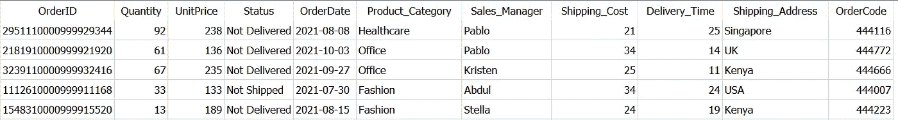
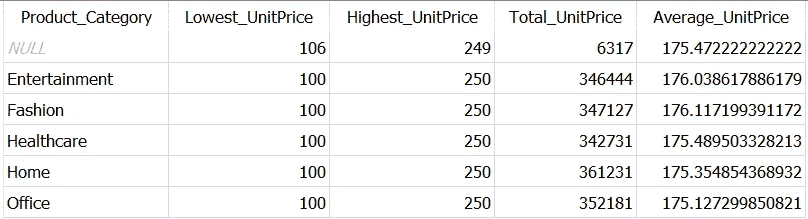
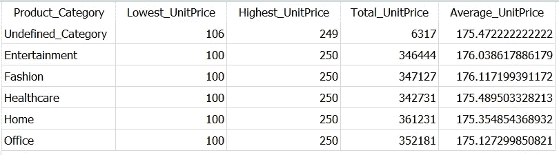
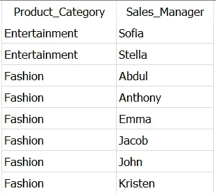
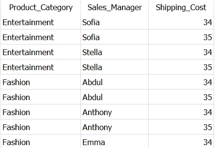
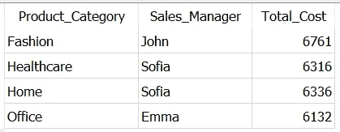
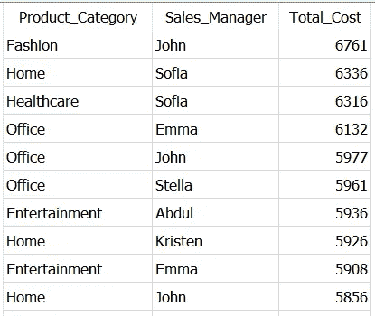
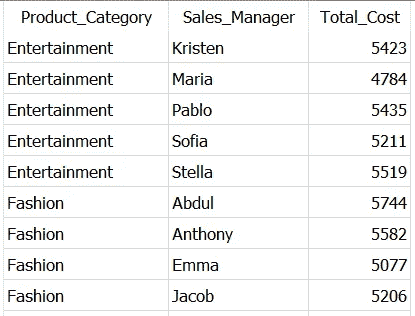
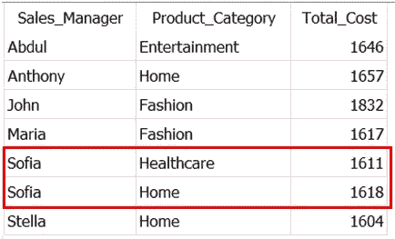

# 掌握 SQL 的 5 个实用 SQL 示例

> 原文：<https://towardsdatascience.com/5-practical-sql-examples-to-master-sql-group-by-7877ddf03ba8>

## 数据科学

## 在不到 10 分钟的时间内，通过使用案例轻松完成复杂的 SQL 分组


照片由 [Mariah Hewines](https://unsplash.com/@mariahhewines?utm_source=unsplash&utm_medium=referral&utm_content=creditCopyText) 在 [Unsplash](https://unsplash.com/?utm_source=unsplash&utm_medium=referral&utm_content=creditCopyText) 上拍摄

**SQL 中的 GROUP BY，解释**

SQL——结构化查询语言——是从关系数据库中提取数据并进行转换的广泛使用的工具。

没有数据聚合，数据转换是不完整的，数据聚合是 SQL 中的一个重要概念。如果没有 GROUP BY，数据聚合是不可能的！因此，掌握 GROUP BY 以轻松执行所有类型的数据转换和聚合非常重要。

在 SQL 中，GROUP BY 用于数据聚合，使用聚合函数。如`SUM()`、`MIN()`、`MAX()`、`AVG()`、`COUNT()`。

> **但是，为什么聚合函数与 GROUP BY 一起使用？**

在 SQL 中，GROUP BY 子句用于将行组合在一起。因此，当您在列上使用聚合函数时，结果描述了特定行组的数据。

在这篇文章中，我解释了在 SQL 查询中使用 GROUP BY 子句的 5 个例子，这将帮助你毫不费力地使用`**GROUP BY**`。

我把这篇文章写得很短，这样您就可以快速地完成它，并掌握 SQL 中的一个重要概念。

您可以使用此索引快速导航到您最喜欢的部分。

```
**·** [**GROUP BY with Aggregate Functions**](#4778) **·** [**GROUP BY without Aggregate Functions**](#23c7) **·** [**GROUP BY with HAVING**](#0ecc) **·** [**GROUP BY with ORDER BY**](#eeb2) **·** [**GROUP BY with WHERE, HAVING and ORDER BY**](#139a)
```

> *📍*注意:我正在使用 SQLite DB 浏览器和一个自己创建的[销售数据](https://github.com/17rsuraj/data-curious/blob/master/TowardsDataScience/Dummy_Sales_Data_v1.csv)使用 [**Faker**](/faker-an-amazing-and-insanely-useful-python-library-b313a60bdabf) 创建。可以在我的 [**Github**](https://github.com/17rsuraj/data-curious/blob/master/TowardsDataScience/Dummy_Sales_Data_v1.csv) repo 上 [**MIT License**](https://github.com/17rsuraj/data-curious/blob/master/LICENSE.md) 下免费获得！

这是一个简单的 9999 x 11 数据集，如下所示。



虚拟销售数据集|作者图片

好了，我们开始吧…

在继续之前，请记住下面的一条分组规则..

当您在 SQL 查询中使用`GROUP BY`时，那么`SELECT`语句中的每一列必须要么出现在`GROUP BY`子句中，要么作为参数出现在聚合函数中。

现在，让我们从最简单的用例开始。

# 使用聚合函数进行分组

这是最常用的场景，您可以在一个或多个列上应用聚合函数。如上所述，`GROUP BY`只是将在指定的列中具有相似值的行组合在一起。

举个例子，假设你想得到每个产品类别的单价的统计摘要。这个例子具体解释了如何使用所有的集合函数。

您可以使用以下查询获得这样的统计摘要—

```
SELECT Product_Category,
       MIN(UnitPrice) AS Lowest_UnitPrice,
       MAX(UnitPrice) AS Highest_UnitPrice,
       SUM(UnitPrice) AS Total_UnitPrice,
       AVG(UnitPrice) AS Average_UnitPrice
FROM Dummy_Sales_Data_v1
**GROUP BY Product_Category**
```



SQL | Image 中的数据聚合(按作者)

正如您在上面的查询中看到的，您使用了两列— *Product_Category* 和*unit price*——后者总是在聚合函数中使用。因此，`GROUP BY`子句只包含剩下的一列。

你可以注意到， *Product_Category* 中的第一条记录是`**NULL**`，这意味着`GROUP BY`将 *Product_Category* 中的所有`NULL`值合并到一个组中。这符合微软 指定的 SQL 标准

> 如果分组列包含空值，则所有空值都被视为相等，并将它们收集到一个组中

此外，默认情况下，结果表按照`GROUP BY`中列的升序排序，其中`NULL`(如果存在)位于顶部。如果您不想让 NULL 成为结果表的一部分，您可以随时使用`**COALESCE**`函数并给`NULL`一个有意义的名称，如下所示。

```
SELECT **COALESCE(Product_Category,'Undefined_Category') AS Product_Category**,
       MIN(UnitPrice) AS Lowest_UnitPrice,
       MAX(UnitPrice) AS Highest_UnitPrice,
       SUM(UnitPrice) AS Total_UnitPrice,
       AVG(UnitPrice) AS Average_UnitPrice
FROM Dummy_Sales_Data_v1
**GROUP BY Product_Category**
```



SQL GROUP BY | Image by Author 中的空值

🚩这里需要注意的重要一点是—

> 尽管`COALESCE`应用于 Product_Category 列，但您实际上并没有从该列中聚合值。所以，它一定是 GROUP BY 的一部分。

这样，您可以在`SELECT`语句中添加您需要的任意多的列，在一些或所有列上应用聚合函数，并在`GROUP BY`子句中提及剩余的列名，以获得想要的结果。

嗯，这是关于使用`GROUP BY`和聚合函数。但是，您也可以在没有聚合函数的情况下使用该子句，下面将进一步解释。

# 不带聚合函数的 GROUP BY

尽管大多数情况下`GROUP BY`与聚合函数一起使用，但它仍然可以在没有聚合函数的情况下使用——用**来查找唯一记录**。

例如，假设您想要检索 *Sales_Manager* 和 *Product_Category* 的所有唯一组合。使用 GROUP BY，这非常简单。您所需要做的就是，在`SELECT`中提及您在`GROUP BY`中提及的所有列名，如下所示。

```
**SELECT Product_Category,
       Sales_Manager**
FROM Dummy_Sales_Data_v1
**GROUP BY Product_Category,
         Sales_Manager**
```



不带聚合函数的 SQL GROUP BY 按作者排序的图像

在这一点上，有些人可能会说，在列名之前使用`**DISTINCT**`关键字可以获得相同的结果。

然而，这里有两个主要原因，为什么你应该选择`GROUP BY`而不是`DISTINCT`来获得唯一的记录。

1.  默认情况下，GROUP BY 子句获得的结果按升序排序。因此，您不需要单独对记录进行排序。
2.  当您处理具有数百万行的数据集并且您的 SQL 查询包含连接时，DISTINCT 的开销可能会很大

因此，使用 GROUP BY 可以有效地从数据库中获得唯一的记录，即使您在查询中使用多个连接。

你可以在我以前的一篇文章中读到另一个有趣的`GROUP BY`子句用例——

[](/3-ultimate-ways-to-find-unique-records-in-sql-6ddf8ae567b0)  

接下来，让我们进一步了解如何以有效的方式限制 GROUP BY 子句获得的输出。

# 用 HAVING 分组

在 SQL 中，`HAVING`的工作逻辑与`WHERE`子句相同，唯一的区别是它过滤一组记录，而不是每隔一条记录过滤一次。

例如，假设您想要获得具有*产品类别、销售经理* & *运输成本*的唯一记录，其中运输成本大于 *34* 。

这可以通过使用下面给出的`WHERE`和`HAVING`条款来实现。

```
***-- WHERE clause***SELECT Product_Category,
       Sales_Manager,
       Shipping_Cost
FROM Dummy_Sales_Data_v1
**WHERE** **Shipping_Cost >= 34**
**GROUP BY** Product_Category,
         Sales_Manager,
         Shipping_Cost***-- HAVING clause***SELECT Product_Category,
       Sales_Manager,
       Shipping_Cost
FROM Dummy_Sales_Data_v1
**GROUP BY** Product_Category,
         Sales_Manager,
         Shipping_Cost
**HAVING Shipping_Cost >= 34**
```



按 WHERE 和 HAVING in GROUP BY | Image by Author 输出相同

尽管上述两个查询生成相同的输出，但逻辑完全不同。`WHERE`子句在`GROUP BY`之前执行，所以本质上它扫描给定条件的整个数据集。

但是，`HAVING`是在`GROUP BY`之后执行的，所以它扫描的记录数量相对较少，因为行已经被分组在一起。所以`HAVING`是一个节省时间的地方。

好吧，假设你不太关心效率。但是，现在您想要总运费超过 6000 的所有*产品类别*和*销售经理*。而这正是`HAVING`派上用场的时候。

这里，要过滤这里的记录，您需要使用条件`SUM(Shipping_Cost) > 6000`，并且您不能在`WHERE`子句中使用任何聚合函数。

在这种情况下，你可以像下面这样使用`HAVING`

```
SELECT Product_Category,
       Sales_Manager,
       SUM(Shipping_Cost) AS Total_Cost
FROM Dummy_Sales_Data_v1
**GROUP BY** Product_Category,
         Sales_Manager
**HAVING SUM(Shipping_Cost) > 6000**
```



SQL GROUP BY have | Image BY Author

由于您在 *Shipping_Cost* 上使用了聚合，所以在`GROUP BY`中不需要提及。从逻辑上讲，所有的行根据产品类别和销售经理分组，然后`HAVING`在所有这些组中扫描给定的条件。

因此，`HAVING`与`GROUP BY`结合使用是一种**优化的**方式，用于根据条件过滤行。

> 🚩注意:由于 HAVING 在 SELECT 之前执行，因此不能在 HAVING 子句的条件中使用列别名。

此外，尽管`GROUP BY`按照升序或字母顺序排列记录，但有时您可能希望按照聚合列来排列记录。这时`ORDER BY`跳了进来。

# 分组依据和排序依据

在 SQL 中，`ORDER BY`用于对结果进行排序，默认情况下，它以升序对结果进行排序。然而，要以降序获得结果，只需在`ORDER BY`子句中的列名之后添加关键字`DESC`。

让我们继续上面的例子。你可以看到最后一个结果是按字母升序排列的，首先是列*产品类别*，然后是*销售经理*。但是，最后一列中的值 *Total_Cost* 没有排序。

如下所述，这可以通过使用`ORDER BY`子句来具体实现。

```
SELECT Product_Category,
       Sales_Manager,
       **SUM(Shipping_Cost) AS** **Total_Cost**
FROM Dummy_Sales_Data_v1
GROUP BY Product_Category,
         Sales_Manager
**ORDER BY Total_Cost DESC**
```



SQL 中的降序排序|按作者排序图像

显然，最后一列现在是按降序排列的。此外，您可以看到，现在前两列中的值没有特定的顺序。这是因为，你只把它们包含在`GROUP BY`中，而没有包含在`ORDER BY`子句中。

这个问题可以通过在`ORDER BY`条款中提及它们来解决，如下—

```
SELECT Product_Category,
       Sales_Manager,
       SUM(Shipping_Cost) AS Total_Cost
FROM Dummy_Sales_Data_v1
GROUP BY Product_Category,
         Sales_Manager
**ORDER BY Product_Category,
         Sales_Manager,
         Total_Cost DESC**
```



按 SQL 中的多列排序|按作者排序图像

现在，前两列按升序排列，只有最后一列— *Total_Cost* —按降序排列。这是因为关键字`DESC`只在这个列名之后使用。

> 🚩这给了你一个重要的学习收获—

您可以按不同顺序排列多列 SQL 结果数据集，即按升序排列一些列，其余按降序排列。但是，请注意列名在`ORDER BY`中的顺序，因为它会改变结果集。

在这种情况下，理解 GROUP BY 是如何工作的很重要。你有没有问自己一个问题—

> 为什么在降序 order❓中看不到`Total_Cost`列中的所有值

因为在`GROUP BY`中只提到了前两列。仅根据这两列中的值对所有记录进行分组，并通过合计 *Shipping_Cost* 列中的值来计算总成本。

因此，最终结果中的总成本值是基于这些组而不是整个表进行排列的。

接下来，让我们探索一个示例，它将进一步帮助您理解过滤记录之间的区别以及何时将`WHERE`和`HAVING`与`GROUP BY`结合使用。

# GROUP BY with WHERE，HAVING 和 ORDER BY

到目前为止，您已经阅读了本文中的所有概念，让我们直接从一个示例开始。

假设您想要获取所有未交付给客户的订单的销售经理和产品类别的列表。同时，您希望只显示那些在运输特定产品类别的产品上花费超过 1600 美元的销售经理。

现在，你可以通过以下三个步骤来解决这个问题

1.  使用条件`Status = ‘Not Delivered’`过滤所有记录。因为这是一个非聚合列，所以可以使用 WHERE。
2.  使用条件`SUM(Shipping_Cost) > 1600`根据总运费过滤记录。因为这是一个聚合列，所以应该使用 HAVING。
3.  为了计算总运费，您需要使用`GROUP BY`按照销售经理和产品类别对记录进行分组

如果您正在跟进，您的查询应该看起来像这样—

```
SELECT Sales_Manager,
       Product_Category,
       SUM(Shipping_Cost) AS Total_Cost
FROM Dummy_Sales_Data_v1
**WHERE Status = 'Not Delivered'**
GROUP BY Sales_Manager,
         Product_Category
**HAVING SUM(Shipping_Cost) > 1600**
```



SQL GROUP BY with WHERE and HAVING | Image BY Author

它给出了满足示例中提到的条件的销售经理和产品类别的所有唯一组合。

您可以注意到，前两列是按升序排列的。此外，用红色圈出的两行显示了同一销售经理的产品类别的升序。这是证据，默认情况下，`GROUP BY` 按升序排列记录。

这就是分组依据！

希望你很快看完这篇文章，觉得耳目一新，很有用。

在过去的 3 年里，我一直在使用 SQL，我发现这些替代方法非常省时，而且功能强大，尤其是在处理大型数据集时。在实际项目中，对这些概念的深刻理解是非常重要的。

> *有兴趣阅读更多介质上的故事？？*

💡考虑 [**成为媒体会员**](https://medium.com/@17.rsuraj/membership) 到**访问媒体上无限的**故事和每日有趣的媒体文摘。我会得到你的费用的一小部分，没有额外的费用给你。

💡不要忘记 [**注册我的电子邮件列表**](https://medium.com/subscribe/@17.rsuraj) 来接收我的文章的第一份副本。

**感谢您的阅读！**