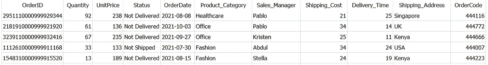
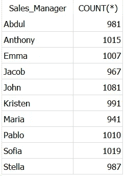
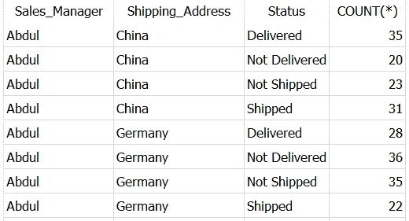
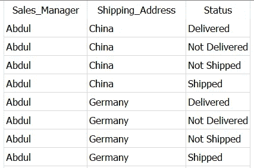
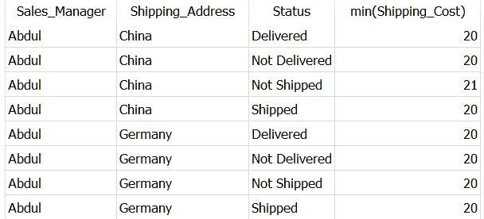
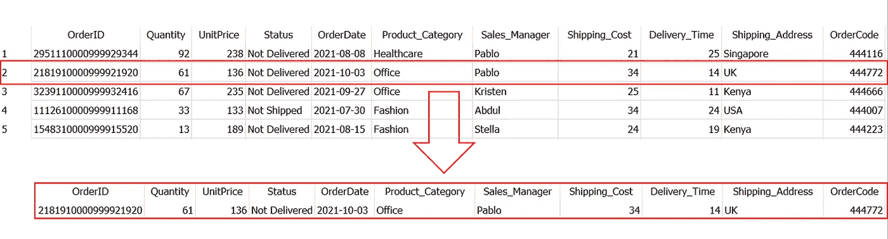
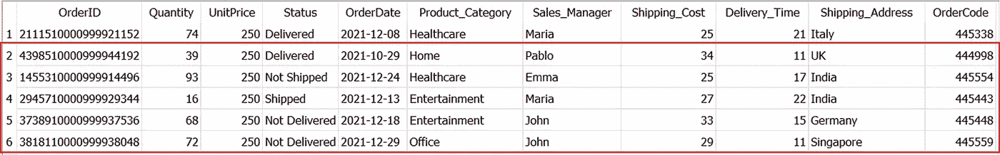
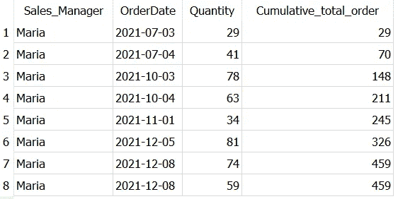
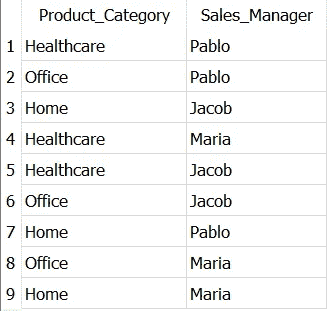

# 2022 年你应该知道的 5 个实用 SQL 查询

> 原文：<https://towardsdatascience.com/5-practical-sql-queries-you-should-know-in-2022-11b428560a30>

## 数据科学

## 快速掌握这些省时且强大的 SQL 查询


由[路易斯·科尔特斯](https://unsplash.com/@luiscortestamez?utm_source=unsplash&utm_medium=referral&utm_content=creditCopyText)在 [Unsplash](https://unsplash.com/s/photos/five?utm_source=unsplash&utm_medium=referral&utm_content=creditCopyText) 上拍摄

**SQL 无处不在！**💯

SQL 或结构化查询语言是任何数据专业人员的必备工具，如数据工程师、分析师或数据科学家或任何与数据打交道的人。

为了有效地获得干净和所需的数据，了解不同的 SQL 查询和操作符是绝对必要的。因此，我列出了 5 个 SQL 查询，并附有例子和解释，你应该在 2022 年知道。

我把这篇文章写得很短，这样您就可以快速地完成它，并掌握最有用、最省时的 SQL 技巧。🏆

您可以使用此索引快速导航到您最喜欢的部分。

```
**·** [**How to Find Duplicate Values in SQL**](#87df) **·** [**How to avoid duplicates and select unique rows**](#3b2c) **·** [**How to display Nth row in the data table**](#d55a) **·** [**How to compute the cumulative total**](#f65c) **·** [**How to select words where a specific letter is at specific position**](#4750)
```

> 📍注意:我使用的是 SQLite DB 浏览器和自己创建的 [Dummy_Sales_Data](https://github.com/17rsuraj/data-curious/blob/master/TowardsDataScience/Dummy_Sales_Data_v1.csv) ，你可以在我的 [**Github**](https://github.com/17rsuraj/data-curious/blob/master/TowardsDataScience/Dummy_Sales_Data_v1.csv) repo 上免费获得！

好了，我们开始吧…🚀

首先，让我向您展示数据是怎样的。



虚拟销售数据|作者图片

这是一个简单的 9999 x 11 数据集，是我在文章 [**Faker:一个令人惊叹且极其有用的 Python 库**](/faker-an-amazing-and-insanely-useful-python-library-b313a60bdabf) **中创建的。**📚

📚您可以使用这个 [**SQLite 数据库**](https://github.com/17rsuraj/data-curious/blob/master/TowardsDataScience/TDS.sqlite3) 来跟踪本文中的查询。

# 如何在 SQL 中查找重复值

在数据集中发现重复主要是关于质量检查和数据验证。

在处理数据处理任务时，您可能会在数据集中遇到重复的行。如果没有提前处理好，这些重复的值会打乱整个计算。

SQL 提供了一个简单的解决方案，使用`**GROUP BY**`和`**HAVING**`来识别和消除重复值。✅

在进入查询之前，非常重要的一步是定义重复项。

📌您需要定义哪些值/列的组合可以被认为是重复的。这完全取决于您的数据集和您正在执行的任务。

例如，在我们的数据集中查找单个列 *Sales_Manager* 中的重复值。

```
SELECT Sales_Manager, COUNT(*)
FROM Dummy_Sales_Data_v1
**GROUP BY** Sales_Manager
**HAVING COUNT(*)>1**
```



单列重复|按作者排序的图像

在上面代码的最后一行，`**HAVING COUNT(*)>1**` 我们指定了识别重复项的条件。这意味着，每当列中的特定值在数据集中出现不止一次时，它就是重复的。

让我们看另一个场景..

考虑到列 *Sales_Manager* 、 *Shipping_Address* 、Status 中的值组合重复，作为重复行。

这里应用了相同的逻辑，只是您需要在 SELECT 语句和 GROUP BY 子句中提到所有的列名。

```
SELECT **Sales_Manager,
       Shipping_Address,
       Status,**
       COUNT(*)
FROM Dummy_Sales_Data_v1
GROUP BY **Sales_Manager,
         Shipping_Address,
         Status**
HAVING COUNT(*)>1
```



使用 SQL | Image by Author 在数据集中查找重复的行

这里，生成最后一列— *COUNT(*)* 只是为了提供信息。即使不包括该列，查询仍然有效。

使用该查询可以回答的另一个有趣的问题是—特定记录在数据集中出现了多少次。

同时，这个查询也可以用来了解数据集中有多少以及哪些是不重复的记录。你所需要做的就是简单地让 having 子句中的`COUNT(*)`等于 1，作为`**HAVING COUNT(*)=1**` 。

在识别出重复行之后，您可能希望只保留重复行的一个外观。下一个查询解释了如何做到这一点。

# 如何避免重复并选择唯一的行

一旦确定了重复的行，并且希望每行只出现一次，就在 select 语句中使用`**DISTINCT**`,如下所示。

```
SELECT **DISTINCT** Sales_Manager,
                Shipping_Address,
                Status
FROM Dummy_Sales_Data_v1
GROUP BY Sales_Manager,
         Shipping_Address,
         Status
```



使用 DISTINCT | Image by Author 在数据集中选择唯一的行

由于`DISTINCT`使得查询只返回唯一的记录，所以它有时会被错误地用来隐藏错误查询(比如不正确的 SQL 连接)产生的重复记录。

> 📌最好的办法是在你使用`DISTINCT`的时候提一个评论，并在那里提到使用`DISTINCT`的原因。

实现这一点的另一种方法是定义一个或多个标准，这通常是计算的形式，例如包括某一列的最小值、最大值。

例如，只保留重复行的一个外观，其中 *Shipping_Cost* 最小。

```
SELECT Sales_Manager,
       Shipping_Address,
       Status,
       **min(Shipping_Cost)**
FROM Dummy_Sales_Data_v1
GROUP BY Sales_Manager,
         Shipping_Address,
         Status
```



按作者选择 SQL | Image 中的唯一行

`DISTINCT`的主要目的是返回唯一的记录。然而，几乎 90%的时候，我发现`GROUP BY`更方便，因为我总是想做一些其他的计算。

转到下一个有趣的问题..

# 如何显示数据表中的第 n 行

有时，您需要从数据集中选择特定行号的一条记录或从特定行号开始的多条记录。

在这个场景中，SQL 提供了一个非常有用的函数——`**OFFSET()**`——它在返回输出之前跳过指定的行数。

`OFFSET`可与`LIMIT`(返回指定的行数)一起使用，以返回第 n 行或从第 n 行开始的行数。

例如，让我们使用 OFFSET 和 LIMIT 从数据集中返回第 2 行。

```
SELECT *
FROM Dummy_Sales_Data_v1
**LIMIT 1
OFFSET 1**
```



使用偏移和限制|作者图像在 SQL 中选择第 n 行

因为我们想只提取第 2 行，即我们想跳过 1 行。这就是为什么`OFFSET 1`用于跳过 1 行，而`LIMIT 1`只返回 1 行作为输出。

❓:这也是一个常见的面试问题，要求候选人显示数据集中最高的 2 到 6 个价格，即不显示最高价格，而是从第二高的价格开始的 5 个最高价格。

让我向你展示如何使用`OFFSET` & `LIMIT`来实现这一点。

```
SELECT *
FROM Dummy_Sales_Data_v1
**ORDER BY UnitPrice DESC**
**LIMIT 5**
**OFFSET 1**
```



按作者显示数据集|图像中的第 n 个最高价格

查询只会返回上图中红色圈出的部分。

逻辑很简单→我们使用`ORDER BY`按降序排列价格，使用`OFFSET`跳过输出中的 1 行，使用`LIMIT`只返回 5 行。

✅用这种方法你可以保持你的代码整洁，易于解释和展示你有效地实现不同命令的能力。

接下来，让我们看一个有趣的工具来跟踪您的业务 KPI..

# 如何计算累计总数

累计总计(也称为运行总计)是指特定列中下一个单元格之前的一列的所有单元格中的值的总和。

简而言之，列的第 5 行中的累积总计是同一列的第 1 行到第 5 行中所有值的总和。

累积总计显示随着时间或其他序列增长的数据总和。

跟踪 KPI 的进度是非常流行和有用的，因为它可以用作跟踪 KPI 是否达标的指标。💯

因此，了解可以在这种情况下使用的 SQL 查询是非常重要的。在 SQL 中，可以使用窗口函数`**OVER()**`轻松计算累计总数，如下所示。

在我们的数据集中，让我们获得订单*交付*到*意大利*的*数量*的累计总数，其中*销售经理*是*玛利亚*。

```
SELECT Sales_Manager,
    OrderDate,
    Quantity,
    **SUM(Quantity)
    OVER (ORDER BY OrderDate) as Cumulative_total_order**
FROM Dummy_Sales_Data_v1
WHERE Sales_Manager = 'Maria'
AND Product_Category = 'Healthcare'
AND Status = 'Delivered'
AND Shipping_Address = 'Italy'
ORDER BY OrderDate
```



SQL | Image 中按作者的累计总数

如上图所示，第 2 行第 4 列的值`70`实际上是第 3 列前两行的`29`和`41`的相加。同样的逻辑一直延续到最后。

📌窗口函数`OVER()`创建一个由 *OrderDate* 排列的整个数据集的临时窗口，`SUM(Quantity)`仅应用于该临时窗口。

如上图所示，第 7 行第 4 列的值`459`是`326 + 74 + 59`的结果。这是因为，我们在订单日期上创建了一个临时窗口，对于第 7-8 行，订单日期是相同的。

这是最后一个非常有用的命令，可以有效地选择数据。

# 如何选择特定字母在特定位置的单词

有时，在提取数据时，您所知道的只是某一列中文本值的特定位置上的字符、字母或数字。您需要提取所有符合这个标准的行。

SQL 操作符`**LIKE**`在这种情况下非常方便。它在`**WHERE**`子句中用于搜索列中的指定模式。

只有两个通配符你应该记住。

1️⃣ `**%**`(百分号):表示零到多个字符

2️⃣ `**_**`(下划线符号):恰好表示一个字符

现在，让我们看看这是如何处理实际查询的。

假设，您希望获得数据集中产品类别和销售经理的唯一组合，其中 *Product_Category* 中值的最后一个字符是`**e**`，而 *Sales_Manager* 中值的第二个字符是`**a**`。

```
SELECT DISTINCT Product_Category,
                Sales_Manager
FROM Dummy_Sales_Data_v1
WHERE Product_Category **LIKE '%e'**
AND Sales_Manager **LIKE '_a%'**
```



SQL 中的通配符 LIKE 运算符|按作者排序的图像

以上结果正是你想要的。在上述 SQL 查询的倒数第二行中，`**LIKE ‘%e’**` 用于提取值中有多个字符但以 e 结尾的所有产品类别。

类似地，带有`**LIKE ‘_a%’**` 的 SQL 查询的最后一行用于获取销售经理列中的所有值，这些值从开始就只有一个字符(仅由一个下划线符号`**_**`表示)，然后是字符`**a**`，在`**a**`之后有零个或多个字符(由百分号`**%**`表示)。

实现这个查询无疑展示了您在 SQL 的`LIKE`操作符中使用通配符的熟练程度。

仅此而已！

希望你很快看完这篇文章，觉得耳目一新，很有用。

我在过去的 3 年里一直在使用 SQL，我发现这些技巧非常省时，而且在一段时间内非常有效。此外，我发现其中一些问题是很好的面试问题。

> 对阅读介质上的无限故事感兴趣？？

💡考虑 [**成为媒体会员**](https://medium.com/@17.rsuraj/membership)**访问媒体上无限的**故事和每日有趣的媒体文摘。我会得到你的费用的一小部分，没有额外的费用给你。

💡不要忘记 [**注册我的电子邮件列表**](https://medium.com/subscribe/@17.rsuraj) 来接收我文章的第一份拷贝。

**感谢您的阅读！**