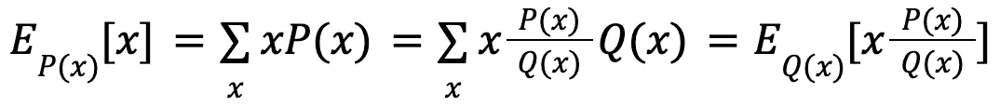

# 机器学习中的 5 种概率训练数据采样方法

> 原文：<https://towardsdatascience.com/5-probabilistic-training-data-sampling-methods-in-machine-learning-460f2d6ffd9>

## 合适的数据采样方法对于训练一个好的模型很重要

照片由 [Testalize.me](https://unsplash.com/@testalizeme?utm_source=medium&utm_medium=referral) 在 [Unsplash](https://unsplash.com?utm_source=medium&utm_medium=referral) 上拍摄

模型训练中的数据采样是机器学习中一个被忽视的领域。机器学习有两个方面:建模和数据。这两者同等重要，在现实生活的机器学习项目中应该仔细考虑。然而，许多教科书、论文、博客都谈到了建模方面，很少有人谈到数据方面。

我们在这里使用“数据”而不是“数据集”，因为它们的概念不同:“数据集”是有限的、固定的和静止的，而“数据”是无限的、不固定的和动态的。当我们训练一个模型的时候，我们没有办法接触到世界上所有相应的可能数据；要使用的数据是由一些抽样方法创建的子集。数据充满了潜在的偏差，这可能是由于收集、采样或标记数据过程中的一些人为因素造成的。由于偏差在基于此数据训练的模型中是永久存在的，因此对能够减少数据中偏差的适当子集进行采样是至关重要的。

因此，了解不同的抽样方法是很重要的，因为**首先，它帮助我们避免数据中的潜在偏差，其次，它帮助我们提高训练中的数据效率**。

**在数据采样期间，为了训练可靠的模型，采样的子集应该代表真实世界的数据，以减少选择偏差**【1】。幸运的是，概率数据采样方法可以帮助我们认识到这一点。在这里，我将介绍五种在模型训练中有代表性的概率数据采样方法。

## 简单随机抽样

Volodymyr Hryshchenko 在 [Unsplash](https://unsplash.com?utm_source=medium&utm_medium=referral) 上拍摄的照片

这是最简单的概率抽样形式。总体中所有样本被抽样的机会相同，因此它们的概率形成均匀分布。例如，如果您想从 10 个样本中抽取 5 个样本，那么每个元素被选中的概率是 0.5。

该方法简单明了，易于实现，但总体中的稀有类可能不会在选择中被采样。假设您想从数据中抽取 1%的样本，但是一个稀有类只出现在 0.01%的总体中:这个稀有类的样本可能不会被选择。**在这种情况下，用采样子集训练的模型可能不知道稀有类**的存在。

## 分层抽样

由 [KAZTO TAKAHASHI](https://unsplash.com/@kazto?utm_source=medium&utm_medium=referral) 在 [Unsplash](https://unsplash.com?utm_source=medium&utm_medium=referral) 上拍摄的照片

为了避免简单随机抽样的缺点，您可以**根据您的要求，例如标签，将人群分成几组，并从每组中单独抽样**。每一组被称为一个阶层，这种方法被称为分层抽样。

例如，要从具有 A 类和 B 类的总体中抽取 1%的样本，可以将总体分成两组，分别从这两组中抽取 1%的样本。这样，**无论 A 或 B 有多稀有，采样的子集都保证包含这两类**。

然而，分层抽样的一个缺点是总体并不总是可分的。例如，在每个样本具有多个标签的多标签学习任务中，根据不同的标签来划分群体是具有挑战性的。

## 加权抽样

[廷杰伤害律师事务所](https://unsplash.com/@tingeyinjurylawfirm?utm_source=medium&utm_medium=referral)在 [Unsplash](https://unsplash.com?utm_source=medium&utm_medium=referral) 上的照片

在加权抽样中，每个样本都被赋予一个权重，即被抽样的概率。例如，对于包含 A 类和 B 类的总体，如果将权重 0.8 分配给 A 类，0.2 分配给 B 类，则 A 类和 B 类被抽样的概率分别为 80%和 20%。

**权重抽样可以利用领域专业知识，这对减少抽样偏差很重要**。例如，在训练一些在线学习模型时，最近的数据比旧数据重要得多。通过为最近的数据分配较大的权重，为旧数据分配较小的权重，可以更可靠地训练模型。

## 储层取样

乔纳森·比恩在 [Unsplash](https://unsplash.com?utm_source=medium&utm_medium=referral) 上拍摄的照片

油藏采样是一种有趣而优雅的算法，用于处理在线学习模型中的流数据，在产品中相当流行。

假设数据是以顺序流的方式产生的，比如一个时间序列，你不可能把所有的数据都装进内存，也不知道以后会产生多少数据。**你需要用 *k 个*样本对一个子集进行采样来训练一个模型，但是你不知道选择哪个样本，因为很多样本还没有生成**。

储层采样可以处理这个问题，即 **1)所有样本以相等的概率被选择，以及 2)如果你在任何时候停止算法，样本总是以正确的概率被选择**。该算法包含 3 个步骤:

1.  将前 *k* 个样本放入一个容器中，这个容器可以是一个数组或一个列表
2.  当产生第 *n* 个样本时，在 *1* 到 *n* 的范围内随机选择一个数字 *m* 。如果选择的数字 *m* 在 *1* 到 *k* 的范围内，则用生成的第 *n* 个样本替换库内的第 *m* 个样本，否则不做任何操作。
3.  重复 2，直到算法停止。

**我们很容易证明，对于每一个新生成的样本，被选入储层的概率是 *k* / *n* 。我们还可以证明，对于每一个已经在油藏中的样本，不被替换的概率也是 *k* / *n*** 。因此，当算法停止时，以正确的概率选择储层中的所有样本。

## 重要性抽样

由[absolute vision](https://unsplash.com/@freegraphictoday?utm_source=medium&utm_medium=referral)在 [Unsplash](https://unsplash.com?utm_source=medium&utm_medium=referral) 上拍摄的照片

重要抽样是最重要的抽样方法之一。当我们只能访问另一个发行版时，它允许我们从一个发行版中取样。

例如，我们想要从分布 *P(x)* 中取样，但是不能访问它。然而，我们可以访问另一个分布 *Q(x)* 。**下面的等式表明，在期望中，从 *P(x)* 采样的 *x* 等于从 *Q(x)* 采样的 *x* 由 *P(x)/Q(x)*** 加权。

因此，**可以替代从 *P(x)* 采样，也可以从可访问的 *Q(x)* 采样，并用 *P(x)/Q(x)*** *对采样结果进行加权。*结果与我们直接从 *P(x)* 取样的结果相同。

## 结论

在这篇文章中，我介绍了 5 种用于模型训练的代表性概率数据采样方法。这些方法是任务不可知的，可以用于各种机器学习领域的所有任务:计算机视觉、NLP、强化学习和表格数据分析等。使用哪种采样方法取决于特定的任务、数据集、问题设置以及您希望从模型中得到什么。**我建议先用一个简单的方法，比如简单的随机抽样，随着你理解的深入再换成其他方法**。乍一看，您可能会发现这很难，但是随着模型训练和数据监控的进展，事情会变得清楚。

## 参考

[样本选择偏差作为规格错误，1979 年](https://www.jstor.org/stable/1912352)

[设计机器学习系统，2022](https://www.oreilly.com/library/view/designing-machine-learning/9781098107956/)

 [## 加入我的介绍链接-陈数杜媒体

### 阅读陈数·杜(以及媒体上成千上万的其他作家)的每一个故事。您的会员费直接支持…

dushuchen.medium.com](https://dushuchen.medium.com/membership)