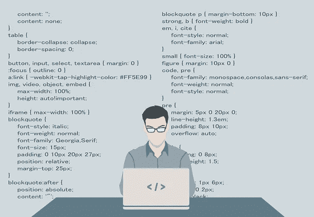
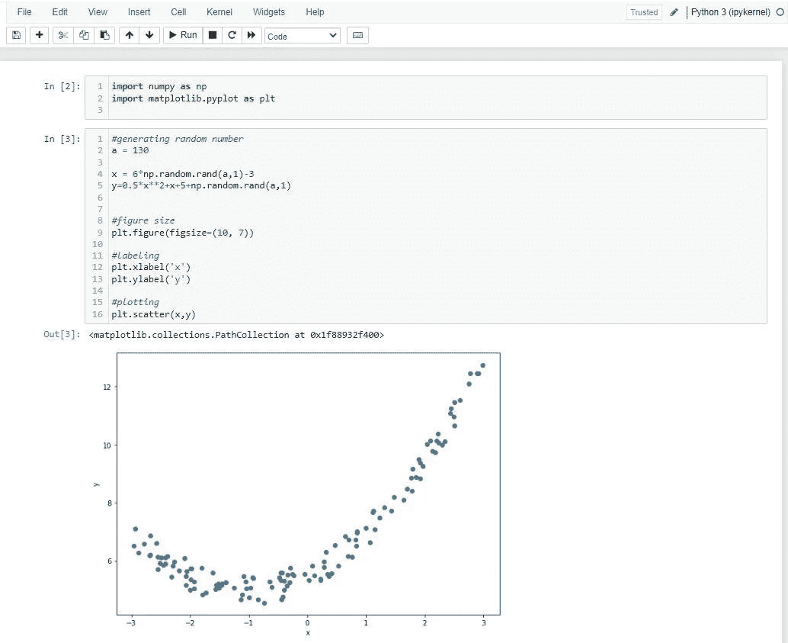
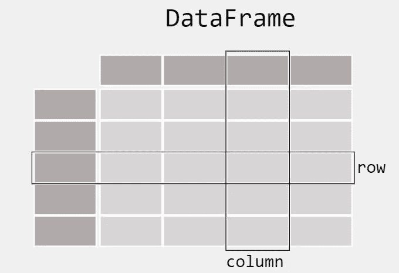
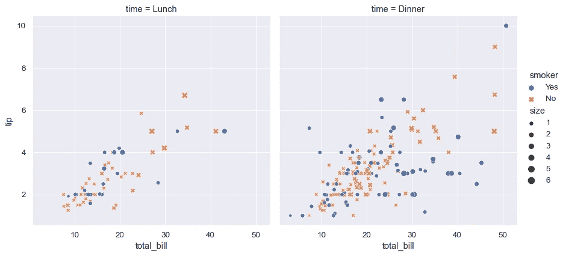

# 学习 5 个 Python 库，开始您的数据科学生涯

> 原文：<https://towardsdatascience.com/5-python-libraries-to-learn-to-start-your-data-science-career-2cd24a223431>

## 掌握这些图书馆，让你的职业道路更加顺畅



图像由 [200 度](https://pixabay.com/it/users/200degrees-2051452/?utm_source=link-attribution&utm_medium=referral&utm_campaign=image&utm_content=1653351)上的[像素显示](https://pixabay.com/it//?utm_source=link-attribution&utm_medium=referral&utm_campaign=image&utm_content=1653351)

如果你想[学习 Python 进行数据科学](/how-to-study-python-for-data-science-888a1ad649ae)开始一个新的职业生涯，我敢肯定你正在纠结这些东西要不要去了解和掌握。我知道你被所有这些新概念弄得不知所措，包括你应该知道的所有数学知识，你可能会觉得你永远也不会达到新工作的目标。

我知道:职位描述对此没有帮助。数据科学家似乎真的是外星人；有时甚至是大三学生。

在我看来，需要掌握的一个重要技能是[学会如何停止“我必须知道一切”的恐惧。相信我:尤其是在开始的时候，如果你在追求一个初级职位，你绝对没有必要什么都知道。嗯，说实话:即使是老年人也不是什么都知道。](https://medium.com/better-humans/how-i-stopped-the-fear-of-i-have-to-know-everything-24fe86a1c8f4)

因此，如果你想在数据科学领域开始职业生涯，在本文中，我向你展示了你绝对必须知道的五个 Python 库。

# 1.蟒蛇

正如我们在他们的[网站](https://www.anaconda.com/products/distribution)上看到的，Anaconda 是:

> 世界上最受欢迎的开源 Python 分发平台

Anaconda 是专门为数据科学创建的 Python 发行版；所以它不是一个严格意义上的库，但是我们可以把它当作一个库，因为在软件开发中，库是相关模块的集合；因此，既然 Anaconda 为数据科学家提供了所有必备的东西——包括最常用的包——我们可以将它作为一个库，也是您的必备之物。

Anaconda 提供的第一个重要的东西是 [Jupyter Notebook](https://jupyter.org/) ，它是:

> 用于创建和共享计算文档的原始 web 应用程序。它提供了一种简单、精简、以文档为中心的体验。



朱庇特笔记本。图片作者。

Jupyter Notebook 是一个在本地机器上运行的 web 应用程序，它是专门为数据科学家创建的。使它对数据科学家有吸引力(并且非常有用)的主要重要特征是，每个细胞都独立运行，这使我们有可能:

*   在独立单元格内做数学和编码实验，不影响整个代码。
*   如果需要，在每个单元格中写入文本；这使得 Jupyter 笔记本成为用您的代码展示科学作品的完美环境(因此，如果您愿意，您可以忘记 Latex 环境)。

要开始使用 Jupiter 笔记本，我建议你在这里阅读本指南[。](https://www.datacamp.com/tutorial/tutorial-jupyter-notebook)

然后，当你获得经验时，你可能需要一些捷径来加快你的经验。你可以在这里使用本指南[。](https://www.dataquest.io/blog/jupyter-notebook-tips-tricks-shortcuts/)

另外，如前所述，Anaconda 为我们提供了数据科学所需的所有包。这样我们就不用安装它们了。比如说你需要“熊猫”；如果没有 Anaconda，您需要在终端中键入`$ pip install pandas`来安装它。有了 Anaconda，你不必这样做，因为它为我们安装了熊猫。一个非常好的优势！

# 2.熊猫

Pandas 是一个库，可以让你导入、操作和分析数据。在他们的网站上，他们说

> pandas 是一个快速、强大、灵活且易于使用的开源数据分析和操作工具，建立在 Python 编程语言之上。

如果你想处理数据，你绝对需要精通熊猫，因为现在，它被数据科学家和分析师广泛使用。

Pandas 的强大之处在于这个库使我们能够处理表格数据。在统计学中，表格数据是指组织在具有行和列的表格中的数据。我们通常将表格数据称为数据框。

这很重要，因为我们在很多情况下都使用表格数据；例如:

*   用 excel 文件。
*   带 CSV 文件。
*   有了数据库。



数据框是表格数据的表示形式。图片来自熊猫网站:https://pandas.pydata.org/docs/getting_started/index.html

许多公司的现实是，不管你的角色是什么，你总是要以某种方式处理 excel/CSV 和/或数据库中的数据；这就是为什么熊猫是你需要掌握的基本资源。

此外，考虑到你甚至可以访问数据库中的数据，并将它们直接输入到你的 Jupyter 笔记本中，以便对熊猫进行进一步的分析。我们可以使用一个名为`PyOdbc`的库来实现。看看这里的。

# 3.Matplotlib

在对 Pandas 进行数据操作和分析后，您通常会想要绘制一些图。这可以通过 [matplotlib](https://matplotlib.org/) 完成，它是:

> 一个全面的库，用于在 Python 中创建静态、动画和交互式可视化

Matplotlib 是我建议您使用的第一个绘制图形的库，因为它被广泛使用，并且在我看来，它有助于您获得编码经验。

Matplotlib 帮助我们绘制我们可能需要的最重要的图:

*   直方图或条形图等统计图表。
*   散点图。
*   箱线图。

还有很多。你可以从 Matplotlib [这里](https://matplotlib.org/stable/plot_types/index.html)开始，使用他们的教程。

# 4.海生的

在某一点上，当你获得了分析数据的经验，你可能对 Matplotlib 不完全满意；主要是(根据我的经验)这可能是由于这样一个事实:为了执行高级的绘图，我们必须用 matplotlib 编写大量的代码。这就是为什么 Seaborn 可能会帮助你。 [Seaborn](https://seaborn.pydata.org/) ，其实:

> 是一个基于 [matplotlib](https://matplotlib.org/) 的 Python 数据可视化库。它提供了一个高层次的界面来绘制有吸引力的和信息丰富的统计图形。

但是 Seaborn 主要帮助我们高级剧情，让我们比 matplotlib 写的代码更少是什么意思呢？例如，假设你有一些关于人们给服务员小费的数据。我们希望绘制一个总账单和小费的图表，但我们甚至希望显示人们是否吸烟，以及人们是否在餐厅吃饭或吃饭。我们可以这样做:

```
# Import seaborn
import seaborn as sns

# Apply the default theme
sns.set_theme()

# Load the dataset
tips = sns.load_dataset("tips")

# Create the visualization
sns.relplot(
    data=tips,
    x="total_bill", y="tip", col="time",
    hue="smoker", style="smoker", size="size",
)
```

我们得到了:



上面编码的数据的可视化。图片摘自 Seaborn 网站上的一个教程:[https://seaborn.pydata.org/tutorial/introduction.html](https://seaborn.pydata.org/tutorial/introduction.html)

因此，正如我们所看到的，由于 Seaborn 的存在，我们只用很少的几行代码就可以获得很好的结果。

因此，可能会出现一个问题:“我应该使用 Matplotlib 还是 Seaborn？”

我的建议是从 Matplotlib 开始，然后当你获得一些经验时再转向 Seaborn，因为现实是，大多数时候，我们同时使用 Matplotlib 和 Seaborn(因为记住:Seaborn 是基于 Matplotlib 的)。

# 5.sci kit-学习

区分数据分析师和数据科学家的主要因素是使用机器学习(ML)的能力。机器学习是人工智能的一个分支，专注于使用数据和算法进行分类或预测。

在 Python 中，可以使用名为 [scikit-learn](https://scikit-learn.org/stable/) (有时称为 sk-learn)的库调用和训练 ML 模型，该库包含:

> 简单高效的预测数据分析工具。

作为一名数据科学家，所有与机器学习相关的工作都是在 sk-learn 中完成的，这就是为什么对于你来说至少掌握这个库的基础知识是非常重要的。

# 结论

我们介绍的库已经按照升序进行了编号，我给你的建议是按照这个顺序。因此，首先，使用 Jupiter 笔记本安装 Anaconda 来设置环境并获得 Python 经验。然后，开始用熊猫分析数据。然后先用 Matplotlib 可视化数据，再用 Seaborn。最后，使用 sk-learn 进行机器学习。

*考虑成为会员:你可以支持我，不需要额外的费用。点击* [*这里*](https://federicotrotta.medium.com/membership) *成为会员，每月不到 5 美元，你就可以解锁所有的故事，并支持我的写作。*