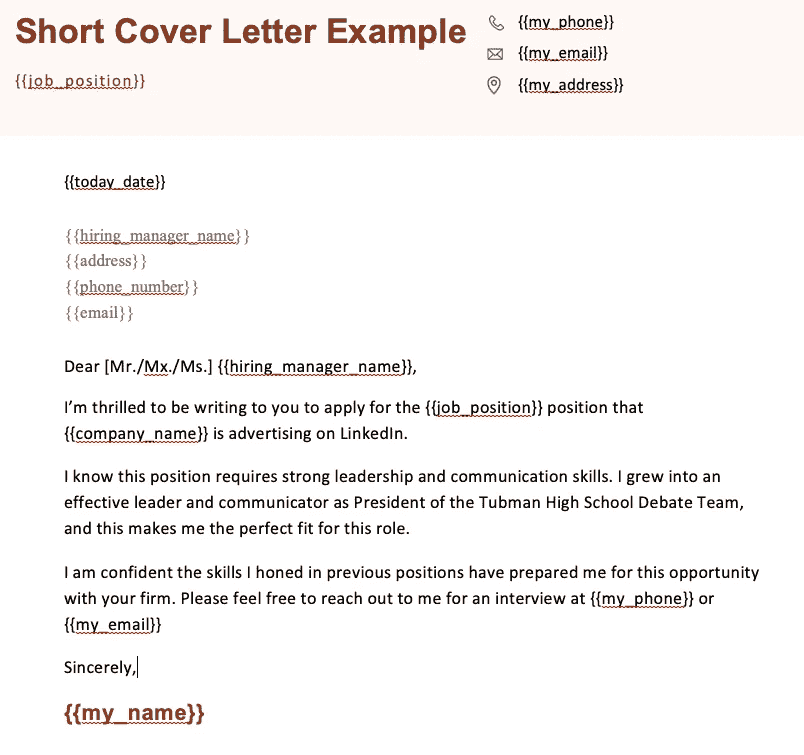

# 5 个 Python 项目让你的生活自动化:从初级到高级

> 原文：<https://towardsdatascience.com/5-python-projects-to-automate-your-life-from-beginner-to-advanced-90fe29a7d664>

## 你应该在 2022 年解决的全新自动化项目


图片来自 Shutterstock，授权给 Frank Andrade

如果你正在学习 Python，你应该尝试自动化你的日常任务。

你不仅可以通过实现你已经知道的东西来学习更多的 Python，而且最终，你可以看到你所有的努力是如何得到回报的。

最近，由于缺少时间，我经常自动完成任务。由于这个原因，我有了 5 个新项目，我把它们分为初级、中级和高级。

您将找到解决每个项目的完整脚本和教程的链接。另外，我会给他们每个人留一个挑战来测试你的 Python 技能。

## 1.自动化 Microsoft Word(初学者项目)

有多少次你不得不使用 Word 来创建求职信、合同协议、简历或报告？

如果你数不过来，这个项目就是给你的。

在这个项目中，我们将使用 Python 和一个名为`docxtpl`的库自动生成 Word 文档。为此，我们需要一个想要自动化的文档的模板。在模板内部，我们必须在每个想要替换的单词上引入占位符。我们使用`{{}}`符号作为占位符。

为了让事情更简单，我已经创建了一个求职信的模板。下面是我们将使用的模板的外观。



作者图片

为了使这个项目对初学者友好，我们只需使用 Python 和`docxtpl`替换元素{ {我的名字}}、{ {我的电话}}、{ {我的电子邮件}}、{ {我的地址}}和{ {今天日期}}。

在下面的视频中，您可以下载这个模板，获取脚本，并按照步骤解决这个项目。

**挑战**:如果你想让这个项目更上一层楼，试着从 Excel 文件中提取数据，引入 Word 模板中。

以上教程的第二部分有一个类似下表的 Excel 文件。

```
+-------+-----+------------+----------------+
| Name  | ... |  address   |      job       |
+-------+-----+------------+----------------+
| Frank | ... | 123 Avenue | Data Scientist |
| ...   | ... | ...        | ...            |
| John  | ... | XYZ Avenue | Web Developer  |
+-------+-----+------------+----------------+
```

您应该为表格的每一行生成一个新文档。

## 2.自动发送电子邮件(初学者项目)

我过去在工作中做过的最无聊的事情之一就是发电子邮件。

重要的邮件应该仔细阅读和回复，但是作为日常事务一部分的邮件应该自动化！这就是这个初学者项目的全部内容。我们将使用 Python 自动发送电子邮件。

如何自动化这项任务？我们只需要使用内置模块`smtplib`和`email`。我们需要`smtplib`使用简单邮件传输协议(SMTP)发送电子邮件，需要`email`包来读取、写入和发送更复杂的 MIME 消息。

下面是使用 Gmail 自动发送电子邮件的分步指南。以下是它涵盖的内容:

*   如何启用两步验证，以便在 Python 中使用 Gmail
*   如何用 Python 发送普通邮件
*   如何处理您可能遇到的 SSL 错误

**挑战**:如果你想让这个项目更有挑战性，试着在你的邮件里附上图片。为此，您需要使用`imghdr`库。

## 3.自动填写 Web 表单(中间项目)

互联网上最乏味的任务之一是填写网页表格。

我是认真的！一遍又一遍地填写你的姓名、电话号码、地址和更多信息是令人厌烦的。当你不得不拿出虚假数据来填写调查时，事情会变得更糟。

在这个中间项目中，我们将使用 Python 向 web 表单填充假数据。如何自动化这项任务？我们将使用一个 web 自动化库，它允许我们执行 web 操作，如访问网站、键入文本和点击按钮。

下面是如何用 Python 自动完成这项乏味任务的一步一步的教程。以下是它涵盖的内容:

*   如何在单个表单中填写数据
*   如何用 faker 库生成假数据
*   如何填写多个 web 表单

**挑战**:我们在本教程中填写的表格有简单的元素。如果你想让这个项目更有挑战性，可以在表单中添加一些高级元素，比如下拉菜单和选择题。然后尝试自动化这个高级表单。

## 4.自动化 Tinder(高级项目)

在约会应用上向右滑动是如此耗时，以至于一旦你得到了匹配，你就会在网上约会最重要的部分——将匹配转换成实际日期——变得懒惰！

这个先进的项目包括创建一个机器人，为你刷卡的权利，所以你可以稍后在你的搭讪线工作，并增加你的转换率。

是什么让这个项目先进？很多事情。仅举几个例子:

*   登录:无论你使用什么登录选项(谷歌、脸书)，Tinder 都会向你的手机号码发送一个代码。你需要用这个代码登录 Tinder。为了轻松处理这个问题，我们需要保持一个 Google Chrome 会话活动，然后用 Selenium 控制它。
*   棘手的按钮:如果使用`.click`方法点击 like 按钮，有时可能会出错。对于这个特殊的网站，我们需要使用一个替代方案。
*   弹出窗口:向右滑动时，你可能会遇到不同的弹出窗口。你必须摆脱他们。

下面有一个教程可以帮助你处理所有这些问题。

挑战:让你的机器人给你的对手发送随机的搭讪信息。

但仅仅是为了这个项目！如果你想得到更多的回复，不要自动发送信息。我试过了，它不如你自己发送高质量的消息有效。

## 5.在工作中自动完成自己的任务(超级高级项目)

毫无疑问，自动化你工作中的乏味任务是你能做的最具挑战性的事情。

为什么？很可能没有一步一步的教程来指导你，你必须考虑你需要使用什么库，以及自动化它的最佳方法。

要找出自动化的内容，问自己以下问题:

1.  我不断重复做的任务是什么？
2.  用 Python 可以自动化哪些具体部分？
3.  我应该使用什么 Python 库来自动化这个项目？

如果您知道问题#3 的答案，即使您没有找到关于如何自动化该特定任务的教程，您也可以查看文档或阅读指南来开始使用该库。

请在评论中告诉我你现在正在自动化什么任务！

使用 Python 自动化您的生活！ [**加入我的 20k+人电子邮件列表，获取我的免费自动化备忘单。**](https://frankandrade.ck.page/44559e1ae7)

如果你喜欢阅读这样的故事，并想支持我成为一名作家，可以考虑报名成为一名媒体成员。每月 5 美元，让您可以无限制地访问数以千计的 Python 指南和数据科学文章。如果你用[我的链接](https://frank-andrade.medium.com/membership)注册，我会赚一小笔佣金，不需要你额外付费。

[](https://frank-andrade.medium.com/membership) [## 通过我的推荐链接加入媒体——弗兰克·安德拉德

### 作为一个媒体会员，你的会员费的一部分会给你阅读的作家，你可以完全接触到每一个故事…

frank-andrade.medium.com](https://frank-andrade.medium.com/membership)