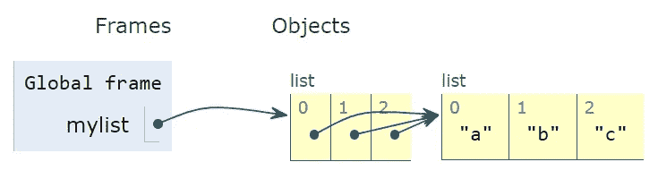
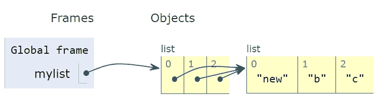

# 不容错过的 5 个 Python 技巧

> 原文：<https://towardsdatascience.com/5-python-tips-that-you-dont-want-to-miss-7696a9ec9df1>

## 充分利用 Python


照片由 [Unsplash](https://unsplash.com/s/photos/tips?utm_source=unsplash&utm_medium=referral&utm_content=creditCopyText) 上的[尼克·费因斯](https://unsplash.com/@jannerboy62?utm_source=unsplash&utm_medium=referral&utm_content=creditCopyText)拍摄

如果您正在使用 Python 进行数据科学，您可以通过使用第三方库(如 Pandas、Scikit-Learn 等)来完成大多数任务。基本的 Python 特性和功能对于各种任务也很方便。此外，第三方库在许多情况下利用了基本的 Python 特性。

在这篇文章中，我将分享我认为对任何使用 Python 的人来说都应该知道的 5 个技巧。

> 注:本帖原载于[datasciencehowto.com](https://datasciencehowto.com/2022/10/29/5-python-tips-that-you-dont-want-to-miss/)。

# 1.列表中缺少逗号

第一个技巧是关于列表的。list 是一种内置的 Python 数据类型，可用于在单个变量中存储多个项目。列表可以通过在方括号中写由逗号分隔的元素来构造。

```
mylist = ["John", "Jane", "Matt", "Ashley"]print(mylist)# output
['John', 'Jane', 'Matt', 'Ashley']
```

当创建包含多个字符串的列表时，我们需要小心。如果我们忘记在连续的条目之间加一个逗号，Python 仍然会创建列表而不会产生错误。但是，中间没有逗号的字符串会被连接起来。

```
mylist = ["John", "Jane", "Matt" "Ashley"]print(mylist)
['John', 'Jane', 'MattAshley']
```

因为没有关于丢失逗号的错误和警告，所以您可能会在脚本或分析中得到意想不到的结果。

# 2.具有多个条件的 If 语句

第二个技巧是关于 if 语句。考虑这样一种情况，您需要创建一个包含多个条件的 if 语句，并且您希望将条件写在单独的行中，以避免创建太长的行。

这里有一个例子:

```
variable_with_a_long_name = 50
another_variable_with_a_long_name = 10
another_variable_with_a_even_longer_name = 5if variable_with_a_long_name > 30 and
   another_variable_with_a_long_name > 8 and
   another_variable_with_a_even_longer_name > 4:
        print("Done!")# output
SyntaxError: invalid syntax
```

我们得到一个错误，因为 Python 认为表达式在行尾结束。我们可以通过将条件放在括号中来解决这个问题。

```
variable_with_a_long_name = 50
another_variable_with_a_long_name = 10
another_variable_with_a_even_longer_name = 5if (variable_with_a_long_name > 30 and
    another_variable_with_a_long_name > 8 and
    another_variable_with_a_even_longer_name > 4):
        print("Done!")# output
Done!
```

我们只要把条件写在括号里就可以了！

# 3.将列表乘以整数

Python 允许列表乘以整数。将一个列表乘以 3 意味着将同一个列表连接 3 次。这里有一个简单的例子来说明它是如何工作的。

```
mylist = [1, 2, 3] * 3print(mylist)# output
[1, 2, 3, 1, 2, 3, 1, 2, 3]
```

但是在包含列表的列表上做这个操作的时候需要小心。

```
mylist = [["a","b","c"]] * 3print(mylist)# output
[['a', 'b', 'c'], ['a', 'b', 'c'], ['a', 'b', 'c']]
```

变量`mylist`包含另一个列表的一个项目。因此，当它乘以 3 时，输出是包含 3 个相同列表的列表。这三个项目并不是不同的对象。它们可以被认为是指向内存中同一对象的不同指针。所以当我们修改这三个嵌套列表中的一个时，其他的也将被更新。

```
mylist = [["a","b","c"]] * 3# update the first item in the first list
mylist[0][0] = "new" print(mylist)# output
[['new', 'b', 'c'], ['new', 'b', 'c'], ['new', 'b', 'c']]
```

下面两个图显示了这里发生的情况:



(图片由作者在 [Python 导师](https://pythontutor.com/)上创作)



(图片由作者在 [Python Tutor](https://pythontutor.com/) 上创建)

正如我们在第一幅图中看到的，列表中的所有 3 项都指向内存中的同一个对象。因此，修改此对象会更新结果列表中的所有 3 个项目。

# 4.反复查阅字典

Dictionary 是另一种内置的 Python 数据结构。它由键值对组成。字典中的键必须是唯一的和可散列的。例如，我们不能在字典中使用列表作为键。

字典是可迭代的，所以我们可以迭代它们。默认情况下，迭代是在键上完成的。

```
mydict = {"John": 25, "Jane": 28, "Ashley": 22}for key in mydict:
    print(key)# output
John
Jane
Ashley
```

如果我们想要迭代这些值，我们需要使用`values`方法。

```
mydict = {"John": 25, "Jane": 28, "Ashley": 22}for value in mydict.values():
    print(value)# output
25
28
22
```

我们可以使用`items`方法迭代对。因为每个键-值对都是一个元组，所以我们可以很容易地将键和值分配给不同的变量。

```
mydict = {"John": 25, "Jane": 28, "Ashley": 22}for key, value in mydict.items():
    print(f"{key} is {value} years old.")# output
John is 25 years old.
Jane is 28 years old.
Ashley is 22 years old.
```

# 5.字母数字字符串

假设我们需要检查一串字符串或用户输入，以确保它们只包含字母数字字符(即字母或数字)。一个快速简单的选择是`isalnum`方法。

```
password = "Aaa123"password.isalnum()# output
True------------------password = "Aaa123?"password.isalnum()# output
False
```

如果字符串包含任何非字母数字字符，该方法将返回 false。

我们在本文中介绍的内容不是您经常会遇到的。然而，它们对于一些任务来说很方便，并且在需要的时候有所作为。

*你可以成为* [*媒介会员*](https://sonery.medium.com/membership) *解锁我的全部写作权限，外加其余媒介。如果您使用以下链接，我将收取您的一部分会员费，无需您支付额外费用。*

[](https://sonery.medium.com/membership)  

感谢您的阅读。如果您有任何反馈，请告诉我。