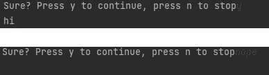

# 用于分析/调试代码的 5 个真正方便的 python 装饰器

> 原文：<https://towardsdatascience.com/5-real-handy-python-decorators-for-analyzing-debugging-your-code-c22067318d47>

## 将这些方便的、通用的装饰器直接应用到您的代码中


装饰精美(图片由[萨巴·萨阿德](https://unsplash.com/@sabasayad)在 [Unsplash](https://unsplash.com/photos/fnkoGdJEuiE) 上拍摄)

decorators 的美妙之处在于它们非常容易应用，但是为你的代码提供了很多额外的功能。在本文中，我们将介绍 5 个方便的装饰器，您可以轻松地将它们应用到调试代码时遇到的实际问题中。我们来看看能帮到你的装饰师:

1.  为你的功能计时
2.  性能检查
3.  中继器
4.  执行前询问您是否确定
5.  用 try-catch 包装您的函数

本文的目标是为您提供一些现成的装饰器，并启发您开发一些方便的、通用的装饰器。

***在我们开始之前:*** 你知道你还可以让装修工记录状态吗？示例:计算一个函数被调用的次数，这样你就可以对它进行速率限制。请务必阅读本文[](https://mikehuls.medium.com/six-levels-of-python-decorators-1f12c9067b23)**以了解装饰器是如何工作的，如何应用它们以及何时使用装饰器。在这篇文章中，我们用 6 个越来越复杂的步骤来探索装饰者。**

# **1.计时器**

**让我们从简单开始；我们将从一个装饰器开始，它打印出我们的函数运行所花费的时间。这是代码:**

**注意，我们的装饰器本身是用@ wrapps(func)包装的。这是为了确保我们传递了包装的函数。如果我们不这样做的话,`wrapper.__name__`只会打印出‘包装’,而不是我们实际正在装饰的功能。**

**我们将在一个计算素数的函数上使用这个装饰器:**

**现在我们检查调用`is_prime_number(number=155153)`时的输出:**

```
[isprime] took 5.601100000000005 ms
```

# **2.性能检查**

**计时我们的功能很好，但我们需要更多的信息。除了持续时间之外，下一个装饰器还提供了关于函数的信息，包括名称和文档字符串，以及性能信息，如内存使用情况:**

**它与前面的函数非常相似，只是我们打印出了更多的信息:**

**调用`is_prime_number(number=9843861881)`会打印出以下内容:**

```
Function:             is_prime_number ( Checks whether a number is a prime number )
Memory usage:         0.000432 MB
Peak memory usage:    0.000622 MB
Duration:             0.000015 sec
----------------------------------------
```

# **3.中继器**

**这个装饰器在被调用时重复某个函数。这对于测试性能(参见其他 decorators)或者压力测试来说是很方便的**

**它是这样使用的:**

**调用 sayhello()将产生以下输出:**

```
hello
hello
```

**例如，在测量其性能时，可以很好地使用这个装饰器执行几次。**

# **4.提示“您确定吗？”执行前**

**这个装饰器可以添加到需要很长时间才能完成或者有重大影响的函数中(比如删除数据)。一旦你调用了这个函数，装饰者会确保你在调用它之前确认你想要执行这个函数。否则它将返回并且*而不是*调用函数。**

**让我们再次修饰一下简单的 say_hi 函数:**

**如您所见，我们能够在装饰器上设置提示消息。当我们调用`say_hi()`时，您将会看到:**

```
Sure? Press y to continue, press n to stop
```

**如果你输入‘y’那么我们将执行`say_hi()`，任何其他输入(包括*没有*输入)将阻止`say_hi()`执行。**

****

# **5.试着找一个室内装潢师**

**这使用装饰器将您的函数包装在一个 try-except 块中。优势在于，只需一行 Python 代码，整个函数就不会出现异常。代码如下所示:**

**我们将在下面的函数中使用这个装饰器:**

**现在，当我们调用`trycatchExample(9, 3)`时，函数返回`3.0``。如果我们调用`trycatchExample(9, 0)``(除以 0 ),它会正确返回以下内容:**

```
Exception in trycatchExample: division by zero
```

**我建议只将这个装饰器用于调试目的，并更准确地捕捉函数中的错误。**

# **结论**

**通过这篇文章，我希望能够提供更多关于装饰者带来的好处的信息。如果我启发了你，分享一些你自己的便利的装饰！此外，你知道你甚至可以保持你的装饰状态吗？查看 [**这篇文章**](https://mikehuls.medium.com/six-levels-of-python-decorators-1f12c9067b23) 深入探究装修工是如何工作的。**

**如果你有建议/澄清，请评论，以便我可以改进这篇文章。与此同时，请查看我的关于各种编程相关主题的其他文章:**

*   **[Python 为什么慢，如何加速](https://mikehuls.medium.com/why-is-python-so-slow-and-how-to-speed-it-up-485b5a84154e)**
*   **[用 Python OpenCV 破坏猎鸭](https://mikehuls.medium.com/image-analysis-for-beginners-destroying-duck-hunt-with-opencv-e19a27fd8b6)**
*   **[使用 Python OpenCV 创建运动检测器](https://mikehuls.medium.com/image-analysis-for-beginners-creating-a-motion-detector-with-opencv-4ca6faba4b42)**
*   **[Python 中的高级多任务处理:应用线程池和进程池并进行基准测试](https://mikehuls.medium.com/advanced-multi-tasking-in-python-applying-and-benchmarking-threadpools-and-processpools-90452e0f7d40)**
*   **[编写自己的 C 扩展来加速 Python x100](https://mikehuls.medium.com/write-your-own-c-extension-to-speed-up-python-x100-626bb9d166e7)**
*   **[cyt hon 入门:如何用 Python 执行>每秒 17 亿次计算](https://mikehuls.medium.com/getting-started-with-cython-how-to-perform-1-7-billion-calculations-per-second-in-python-b83374cfcf77)**
*   **[用 FastAPI 用 5 行代码创建一个快速自动归档、可维护且易于使用的 Python API](https://mikehuls.medium.com/create-a-fast-auto-documented-maintainable-and-easy-to-use-python-api-in-5-lines-of-code-with-4e574c00f70e)**
*   **[创建并发布你自己的 Python 包](https://mikehuls.medium.com/create-and-publish-your-own-python-package-ea45bee41cdc)**
*   **[创建您的定制私有 Python 包，您可以从您的 Git 库 PIP 安装该包](https://mikehuls.medium.com/create-your-custom-python-package-that-you-can-pip-install-from-your-git-repository-f90465867893)**
*   **[面向绝对初学者的虚拟环境——什么是虚拟环境以及如何创建虚拟环境(+示例)](https://mikehuls.medium.com/virtual-environments-for-absolute-beginners-what-is-it-and-how-to-create-one-examples-a48da8982d4b)**
*   **[通过简单的升级大大提高您的数据库插入速度](https://mikehuls.medium.com/dramatically-improve-your-database-inserts-with-a-simple-upgrade-6dfa672f1424)**

**编码快乐！**

**—迈克**

**页（page 的缩写）学生:比如我正在做的事情？[跟着我！](https://mikehuls.medium.com/membership)**

**[](https://mikehuls.medium.com/membership) [## 通过我的推荐链接加入 Medium—Mike Huls

### 作为一个媒体会员，你的会员费的一部分会给你阅读的作家，你可以完全接触到每一个故事…

mikehuls.medium.com](https://mikehuls.medium.com/membership)**