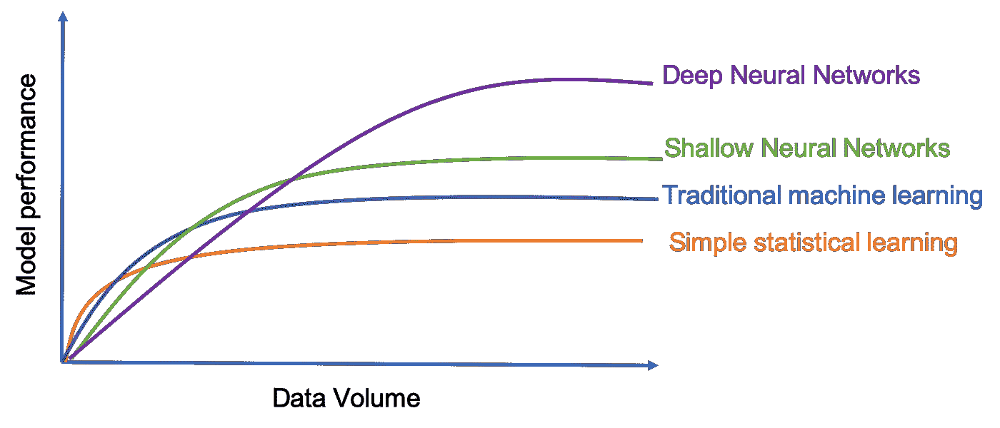

# 不在产品中使用深度学习的 5 个理由

> 原文：<https://towardsdatascience.com/5-reasons-for-not-using-deep-learning-in-your-product-4cae90de7d45>

深度学习是一种受人脑工作方式启发的机器学习方法，在我们没有深度领域专业知识但有大量数据的情况下特别受欢迎。但是，它是你正在构建的人工智能产品的最佳解决方案吗？

[附身摄影](https://unsplash.com/@possessedphotography?utm_source=unsplash&utm_medium=referral&utm_content=creditCopyText)在 [Unsplash](https://unsplash.com/s/photos/intelligence?utm_source=unsplash&utm_medium=referral&utm_content=creditCopyText) 上拍照

近年来，关于深度学习的研究论文数量激增。研究人员在几乎所有与机器学习相关的会议和期刊上展示他们如何改进深度学习模型，数据科学家展示他们的深度学习技能，以构建(或试图构建)基于深度学习的应用。但是在你的产品中使用深度学习模型总是明智的吗？

近年来，我一直在观察数据科学社区中的宣传，并看到了大量不正确的深度学习使用的例子，只是因为宣传。不要误解我，我认为自己是深度学习专家，我毫不怀疑，凭借大量的数据、高效的数据存储、GPU、TPU、各种云计算设施和令人兴奋的深度学习研究，数据科学家已经创造了许多奇迹。但这并不总是最好的解决方案。

在这篇文章中，我想提一下**而不是**在你的产品中使用深度学习的原因。所以，下次你想解决一个问题的时候，用这个作为备忘单来决定深度学习是否是你手头问题的正确解决方案。

# 1.您是否有所需基础设施成本的预算？

训练深度学习模型涉及处理大量数据。与小数据相比，大数据需要不同的工具和基础架构。你可能能够在你的 PC 机器上或带有 CPU 的单个服务器上构建你的模型，但当涉及到生产就绪的模型时，与传统的机器学习模型不同，你将需要 GPU、TPU 和数百万或数十亿条数据记录来并行处理。如果您没有合适的基础设施，您的模型训练和实验将会非常缓慢，并且/或者无法以最佳能力进行构建。

# 2.你有足够的数据吗？

训练深度学习需要海量的数据。如果你没有大量最好的**标记数据**，传统的机器学习算法将以更低的成本和更低的复杂性执行相同的任务(如果不是更好的话)。在下图中，您可以看到数据量如何影响整体模型性能。

金、、郭、清华、李、闵、杨、、徐、鞠可欣、、张、景宣、景苏、、徐、强、刘、于。(2020).深度学习在生态资源研究中的应用:理论、方法和挑战。科学中国地球科学。10.1007/s 11430–019–9584–9。

顺便说一下，迁移学习对减少对大量标记数据的需求有很大帮助。比如你看英勇！人们使用 BERT(或类似的)的故事，微调它，得到了很好的结果。然而，人们通常会分享他们的成功，而在失败的时候会保持沉默。我的经验表明，迁移学习伴随着一个巨大的责任，那就是确保你不会在你的模型中引入无意的偏见或盲点。我会写一篇关于如果你不知道自己在做什么，迁移学习是多么危险的文章！

# 3.你能接触到领域知识吗？

当你无法接触到领域知识或者标记数据的成本很高时，深度学习是最好的方法。深度学习受到传统 ML 算法的青睐，因为你可以更少地担心特征工程，并且在处理复杂问题时是最好的。

然而，有研究表明，使用传统 ML 算法的特征工程可以以更低的成本执行类似或更好的深度学习方法。所以，如果问题不是很复杂，可以用特征工程解决，不要觉得丢人，选择特征工程。有很多例子表明，传统机器学习模型的特征工程确实比最好的深度学习模型表现得更好。

我在这里想说的是，当问题可以通过设置一些 if-else 规则来解决的时候，你不应该使用机器学习。这同样适用于深度学习:降低特征工程+传统机器学习解决问题时的成本。

# 4.你需要透明吗

深度学习模型以黑盒著称。已经有了诸如[石灰](https://github.com/marcotcr/lime)、 [SHAP](https://github.com/slundberg/shap) 、[深度提升](https://github.com/kundajelab/deeplift)等研究，让它们更有解释力。但在我看来，目前还不足以在面向客户的产品中使用它们。

如果你想使用深度学习方法，请三思而行，特别是当产品需要透明度时，例如涉及标记人员(如欺诈检测)或匹配(如求职者匹配)的方法。在这种情况下，你需要设计一个机器学习算法，它可以显示为什么模型会做出这样的决定，深度学习在这里是臭名昭著的。

# 5.你需要模型的快速更新吗

训练深度学习模型需要时间。越深越复杂，训练阶段就会越慢。在大多数应用程序中，您可以离线训练模型，并在它变旧并需要新数据和新训练之前使用它很长时间。然而，如果您的模型需要更定期地训练，因为您的数据变化很快，例如推荐引擎很快就会过时(数据漂移)和不相关，深度学习不一定是您的最佳解决方案。

# 额外提示。你只想做酷的事情吗？

虽然深度学习解决了许多复杂的问题，但它也带来了大肆宣传。如果你想做很酷的事情，尽一切办法，尝试深度学习解决方案。但是不要因为它很酷，每个人都在谈论它，就把深度学习作为你产品的解决方案。

希望这篇文章能帮助你下次设计机器学习产品，如果你有其他理由不在产品中使用深度学习，请随时分享你的想法。

# 在你走之前

我写的是数据科学、人工智能和人工智能产品的大图景。如果你喜欢这篇文章，[关注我](https://medium.com/@baharsalehi)当我发表新文章时，你会得到通知。