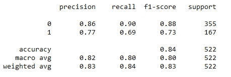
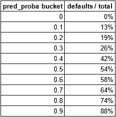
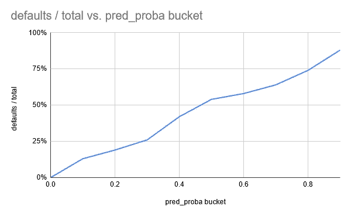

# 你的 ML 模型没有投入生产的 5 个原因

> 原文：<https://towardsdatascience.com/5-reasons-your-ml-model-isnt-making-it-to-production-f6965f4e01ec>

## 不理解精确度指标？尝试创建一个电梯图

在 [Unsplash](https://unsplash.com?utm_source=medium&utm_medium=referral) 上由 [Max Duzij](https://unsplash.com/es/@max_duz?utm_source=medium&utm_medium=referral) 拍照

好吧，那么你已经花了几个月的时间来建立你的机器学习模型。您已经分离了训练/测试集，确保没有任何数据泄漏，并调整了超参数，最终实现了 99%准确率的模型！现在你所要做的就是在生产中运行它，它将改善客户体验。

你拿着最终产品给产品经理看，强调模型的表现如何，剩下要做的就是把它放到合适的位置。几个月过去了，一年过去了，你的模型仍然没有在路线图中被优先考虑。怎么回事？

对于数据科学家的工作来说，这种情况并不少见，而且可能会让人失去动力。下面我们将讨论为什么即使在真正想利用你的模型的公司中，许多模型也不能投入生产的 5 个原因，以及我们可以做些什么来确保我们的大多数模型能够投入生产。

# 1.你把它作为笔记本留下了

Jupyter 笔记本对于大多数数据科学工作来说都是惊人的。它们非常适合探索性分析、原型开发、快速开发和快速脚本编写。然而，它们通常不适合编写生产级代码。无序运行单元格和访问笔记本中所有变量的能力可能会导致违背最佳实践的代码。将代码 pythonise 化和模块化成具有多种功能的脚本通常更好，这也能更顺利地与传统的单元测试和版本控制一起工作。

请注意，这并不总是问题，因为网飞在生产中直接使用笔记本电脑[https://netflixtechblog . com/notebook-innovation-591 ee 3221233？gi=a7ada81eb58c](https://netflixtechblog.com/notebook-innovation-591ee3221233?gi=a7ada81eb58c) 借助 [nbdev](https://nbdev.fast.ai/) 等工具。

# 2.没有人知道如何实际生产它

一个常见的问题是，在您摄取的数据集上运行模型的笔记本是完整的，但您需要模型在产品中实时运行。然而，主要的代码库也不是用 Python 编写的，所以您不能导入 pandas 或执行用于清理和处理数据的操作。团队中的软件工程师并不精通 Python，DevOps 的工程师忙于生产问题。听起来熟悉吗？

在这种情况下，您可能需要扩展到 MLOps 中，以确保模型实际进入生产环境(我们可以使用 flask 和 docker 将模型部署为 API，我将在后面的文章中介绍)。在数据科学功能不太成熟的小公司，这通常是阻力最小的途径。另一种方法是提出购买 MLOps 工具的商业案例，或者确保产品和业务利益相关方的大力支持，如下所示。

# 3.没有其他人投入其中

确保你的模型投入生产的最好和最直接的方法是让产品经理参与进来并投资。机器学习模型的目的是解决问题，因此通过开发模型来解决产品经理的关键问题，我们可以快速轻松地获得利益相关者的投资，同时知道我们的解决方案具有切实的影响。这有助于确保模型部署被添加到路线图中，并且您获得了宝贵的跨团队工程团队时间。

[Slidebean](https://unsplash.com/@slidebean?utm_source=medium&utm_medium=referral) 在 [Unsplash](https://unsplash.com?utm_source=medium&utm_medium=referral) 上拍照

需要注意的是，在模型的开发过程中，您需要致力于利益相关者的管理。对数据科学项目进行时间估计也可能特别困难，这是作为路线图的一部分所必需的。以这种方式实施监控或 CI/CD 可能也很困难。

# 4.其他人都不知道这是干什么用的

在本文中，总的来说，关键思想是确保最终的涉众将使用正在构建的模型。你需要和他们一起工作，了解他们将如何使用你的工作成果，无论是在产品内部还是其他方面。如果您的信用风险团队没有适当的规则来利用该输出，那么创建预测客户申请信贷的风险的 API 是没有意义的。

过去，我看到过一些令人惊叹的工作，它们解决了一个关键问题，甚至部署了未被使用的端到端，因为部署不在运营终端用户实际使用的工具内。这个解决方案实际上只是落满了灰尘。这本来可以通过与实际用户本身的讨论来避免——不要让这种情况发生在你的工作中！

# 5.没有人知道它的输出意味着什么(创建一个提升图)

这是一个经典的讨论，我相信你以前已经听过很多次了，但是即使我们的模型有 99%的准确性，这对其他数据科学家来说实际上意义不大，对业务利益相关者来说就更小了。这里，让我们回到我们的信用风险案例，我们可以通过将类别分为“违约”和“无违约”来预测违约的概率，从而产生一个分类问题。然后我们可以利用模型的`predict_proba`方法得到违约概率。信用风险是一个常见的不平衡数据集问题，因为没有违约的类将远远超过有违约的类(除非信用风险分析师做得很糟糕！).在这种情况下，我们的模型有可能通过预测整个人口的非违约达到 99%的准确性，这在度量方面表现很好，但实际上是一个非常糟糕的模型！

用于分类的更好的度量可能是分类报告，它给出了肯定和否定分类的精度和召回的混淆矩阵。这将标记一个坏模型的性能，该模型仅预测没有缺省值，至于缺省值(1)由于没有真阳性，它将具有 0.0 精度和召回率。

示例[sk learn . metrics . class ification _ report](https://scikit-learn.org/stable/modules/generated/sklearn.metrics.classification_report.html)。作者图片

为了更好地向业务涉众传达这一点的含义，我们需要将它转化为业务环境。大多数机器学习模型都有正面(拒绝正确的违约者)和负面(不正确地拒绝一个好的申请人)，那么对底线的实际影响会是什么？这里最重要的指标通常是收入和利润，所以让我们看看这个信用风险的例子。

首先，我们通过对每个数据点的概率进行分桶并检查实际分类行为是否反映了分桶的行为，来创建提升图。下面我们展示了一个理想化的情况，其中桶默认比例非常接近概率。可以根据数据集的大小调整存储桶的大小。

一个非常好的分类模型表。作者图片

图为一个非常好的分类模型。作者图片

现在我们有了提升图，我们可以交流使用我们的模型设置违约概率阈值的影响。例如，从上表中可以看出，如果我们以 0.9 的概率拒绝高于阈值的信贷申请，那么 88%的拒绝将是正确的，我们将因 12%的不正确拒绝而损失收入。现在，这可以很容易地转化为货币价值，并转化为与业务部门讨论如何继续发展，这取决于收入和盈利能力哪个更重要。

# 最后的想法

许多数据科学家在解决困难问题方面做了惊人的工作，但在将他们的解决方案应用到生产中时可能会遇到困难。我们讨论过，这种情况的一个常见结果是需要掌握 MLOps 类型的技能，但最重要的是与产品经理和最终用户利益相关者就您正在构建什么以及如何实际使用它进行协作。为了更好地帮助您决定如何使用模型，将准确性或 AUC 等常见指标转化为实际的业务影响是一条可行之路。

如果你喜欢这篇文章，你可以找到更多的文章，并在我的[个人资料](https://medium.com/@anthonyli358)上关注我！