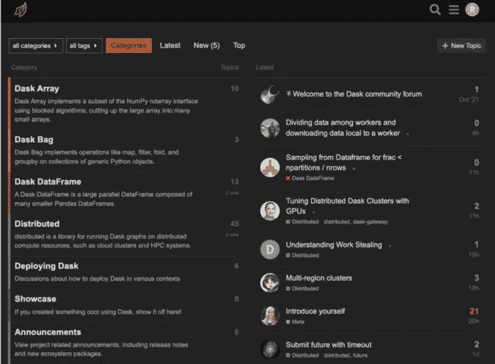

# 使用 Dask 时要避免的 5 个新手错误

> 原文：<https://towardsdatascience.com/5-rookie-mistakes-to-avoid-when-using-dask-592e4a909de6>

## Python 中成功的分布式计算策略


图片由 unsplash.com 的梅廷·奥泽尔拍摄

第一次使用 Dask 可能是一个陡峭的学习曲线。这篇文章介绍了人们在使用 Dask 时最常犯的 5 个错误，以及如何避免犯这些错误的策略。

让我们跳进来。

# 1.“Dask 基本就是熊猫吧？”

在开始用 Dask 构建东西之前，最重要的一件事是**花时间了解** [**分布式计算的基本原理**](/the-beginners-guide-to-distributed-computing-6d6833796318) **首先**。

Dask API 尽可能地遵循 pandas API，这意味着您可以很快开始使用 Dask。但是“尽可能”听起来似乎很简单。这没有告诉你的是，当你从熊猫转移到 Dask 时，你实际上进入了一个完全不同的宇宙——有不同的语言，不同的基本物理定律和不同的时间概念。

图片来自 gifbin.com

要想在 Dask 中取得成功，你需要知道一些事情，比如 Dask 为什么“懒惰”，哪些类型的问题是“令人尴尬的并行”，以及“将分区持久化到集群内存”意味着什么。如果这些对你来说听起来像是胡言乱语，请阅读这篇[基本分布式计算概念介绍](/the-beginners-guide-to-distributed-computing-6d6833796318)。如果这让你感到有些不知所措，也不要担心——深呼吸，记住几个月前我对这一切也几乎一无所知😉

好消息是，你不需要掌握任何这些新的语言或法律或概念——在大多数情况下，你可以通过对基本概念的基本理解来导航。这有点像去一个你不会说那种语言的地方度假。你不需要就当地错综复杂的政治体系进行完整的对话，就能玩得开心。但是如果你能要一部电话或者如果你需要的话问一下去你的酒店的方向，那会很有帮助。

# 2.“我就打电话。每当我想看到结果时，就使用 compute()。

pandas 和 Dask 之间最明显的区别之一是，当你调用 pandas 数据帧时，你得到的数据帧是:

```
import pandas as pd 
df = pd.DataFrame({ 
  "Name": ["Mercutio", "Tybalt", "Lady Montague"], 
  "Age": [3, 2, 4], 
  "Fur": ["Grey", "Grey", "White"] }
) df
```


..然而，当您调用 Dask 数据帧时，您得到的是塑料包装的等价物，而不是糖果:您将看到一些关于内部内容的描述性信息，而不是数据帧的实际内容:

```
import dask.dataframe as dd 
dask_df = dd.from_pandas(df) dask_df
```


你会很快发现这是因为 Dask 的“懒惰评估”,如果你把`.compute()`加到你的 df 调用中，你会得到你在熊猫身上习惯看到的结果。

但是你在这里要小心。达斯克懒洋洋地评价是有原因的。惰性评估允许 Dask 将如何得到结果的计算推迟到最后一刻——也就是说，当它拥有尽可能多的关于数据的知识以及你想从数据中得到什么的时候。然后它可以计算出最有效的方法来得到你的结果。调用`.compute()`太频繁或太早会中断这个优化过程。这有点像在烹饪过程中吃了所有半生不熟的食材——味道不会那么好，如果你还想要最终的结果，你就必须从头再来。

这里的经验法则是:少用`.compute()`。仅使用它来具体化您确信的结果:1)将适合您的本地内存，2)是“完全煮熟的”——换句话说，不要中途中断 Dask 的优化，以及 3)理想情况下将在以后重用。关于`compute`的更多细节见[本帖](https://coiled.io/blog/dask-compute/)。

# 3.“既然如此，咱们就。坚持()一切！”

发现`.compute()`后不久，你将了解`.persist()`。

起初可能很难理解这两个命令之间的区别:这两个命令都是通过触发 Dask 计算来实现结果的。这个定义将帮助你区分它们:`.persist()` **与** `**.compute()**` **基本相同——除了它将结果加载到集群内存而不是本地内存**。如果您需要复习一下本地内存和集群内存之间的区别，请查看本文的“集群”一节。

你可能会想——嗯，在这种情况下，我不应该什么都做吗？尤其是如果我在一个几乎无限内存的基于云的集群上工作，难道坚持不会让一切运行得更快吗？

是的…直到它不存在。就像`.compute()`一样，调用`.persist()`告诉 Dask 开始计算结果(烹饪食谱)。这意味着这些结果可以在您下次需要时直接使用。但是你只有两只手，有限的工具，而且是在赶时间。仅仅在你所有的盘子里装满你以后可能需要(或者可能不需要)的烹饪原料并不一定是在正确的时间把你所有准备好的菜送到所有用餐者面前的好策略。

当处理大量数据时，远程集群是一个很好的资源。但是即使是集群也有极限。尤其是当在生产环境中运行 Dask 时——集群不是免费的，而是受到严密的成本监控——您将开始更加关心如何尽可能有效地使用集群内存。

所以这里的建议和上面的相似:谨慎使用`.persist()`。仅使用它来具体化您确信的结果:1)将适合您的集群内存，2)是“完全成熟的”——换句话说，不要中途中断 Dask 的优化，以及 3)以后将被重用。将一个`.persist()`调用分配给一个新变量也是最佳实践，因为调用`.persist()`会返回新的 Dask 对象，由内存数据支持。

```
# assign persisted objects to a new variable 
df = dd.read_parquet("s3://bucket/file.parquet") df_p = df.persist()
```

更多关于`persist`的细节见[本帖](https://coiled.io/blog/dask-persist-dataframe/)。

# 4."让我们将所有数据转储到 CSV 文件中！"

我们都爱我们的 CSV 文件。在过去的几十年里，他们为我们提供了很好的服务，我们很感激他们的服务…但是现在是让他们走的时候了。

现在，您已经大胆地向分布式计算领域迈进，这意味着您可以获得全新的可能性，比如并行读取和写入文件。CSV 不适合这些高级处理功能，当使用 Dask 时，强烈建议使用 Apache Parquet 文件格式。它是一种具有高压缩选项的列格式，允许您执行诸如列修剪、谓词下推过滤等操作，并避免昂贵且容易出错的模式推断。

Dask 允许您使用以下工具轻松地将 CSV 文件转换为拼花文件:

```
# convert CSV file to Parquet using Dask 
df = dd.read_csv("file.csv") 
df.to_parquet("file.parquet")
```

阅读这篇关于针对 Dask 分析的 Parquet 的优势的博客。

# 5.“Dask 仪表板？那是什么？”

如果你来自熊猫，你可能习惯于在等待一个单元完成时，对正在运行的代码看得很少。耐心地观察你正在运行的 Jupyter 笔记本电池旁边的星号是你的一个日常习惯——也许辅以进度条或[通知铃声](https://calmcode.io/chime/introduction.html)。

Dask 在这里完全改变了游戏。Dask 为您提供了关于它为您运行的计算的强大而详细的可见性和诊断。您可以检查正在运行的任务的数量和类型、集群中工作器之间的数据传输、特定任务占用的内存量等等。

一旦您对 Dask 有了更多的了解，您将会经常使用仪表板来找出使您的代码运行得更快、更可靠的方法。例如，需要注意的一件事是出现的红色空间(数据传输)和白色空间(空闲时间)的数量——您需要最小化这两者。

您可以通过以下方式获得 Dask 仪表板的链接:

```
# launch a local Dask cluster using all available cores 
from dask.distributed import Client 
client = Client() 
client.dashboard_link>> 'http://127.0.0.1:8787/status'
```

或者使用 Dask Dashboard extension for JupyterLab，[，如本文](https://coiled.io/blog/dask-jupyterlab-workflow/)所述。

观看 Dask 的原作者 Matt Rocklin 的视频，了解如何更好地使用 Dask Dashboard。

# 6.“我不需要寻求帮助”

我知道我说的是 5…但是这里有一个“额外的错误”,这可能是成功学习如何使用 Dask 的最重要的关键之一。

想要自己先尝试一些事情是令人钦佩的(也是很好的实践)。但是当你需要帮助的时候，不要害怕伸出手去寻求帮助。无论何时，只要你想更详细地讨论任何事情，并从多年来一直在构建和维护 Dask 的工程师那里获得信息，Dask 话语就是你要去的地方。



# 下一步是什么？

现在，您已经很好地避免了人们在加入 Dask 时最常犯的错误。对于任何认真探索分布式计算可能性的人来说，公开的 [Dask 教程](https://github.com/coiled/dask-mini-tutorial)是一个很好的下一步。

一旦你掌握了基础知识，你可以在下面找到使用 Dask 完成更高级的 ETL、数据分析和机器学习任务的资源:

*   将 Dask 数据帧转换成 pandas 数据帧，或者反过来转换
*   [合并](https://coiled.io/blog/dask-dataframe-merge-join/) Dask 数据帧
*   [与 Dask 并行训练 XG boost](https://coiled.io/blog/dask-xgboost-python-example/)

祝你 Dask 之旅好运！

感谢您的阅读！[在 LinkedIn 上关注我](https://www.linkedin.com/in/richard-pelgrim/),了解定期的分布式计算更新和技巧。

请考虑成为支持写作社区的媒体成员:

[](https://richardpelgrim.medium.com/membership)  

*原载于 2022 年 2 月 10 日*[*https://coiled . io*](https://coiled.io/blog/common-dask-mistakes/)*。*