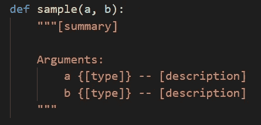
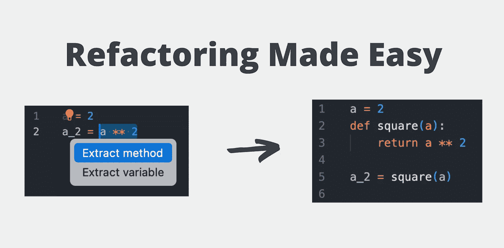
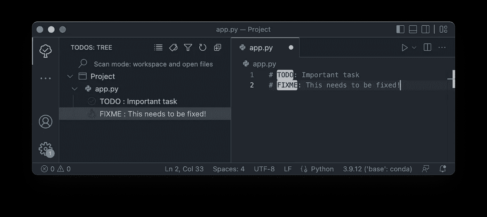

# VS 代码生产率的 5 个秘密

> 原文：<https://towardsdatascience.com/5-secrets-of-vs-code-productivity-8c5d446ae5a0>

## 让使用 VS 代码变得更加高效


克里斯托夫·高尔在 [Unsplash](https://unsplash.com?utm_source=medium&utm_medium=referral) 拍摄的照片

Visual Studio 代码是 Python(当然还有许多其他语言)最流行的代码编辑器之一！即使只有默认设置，该应用程序也能让您真正高效。

根据这五个秘密更进一步，你就可以更好地使用 VS 代码了！我们开始吧！

# 构建您自己的代码片段

VSCode 附带了大量有用的代码片段！不幸的是，Python 片段在最近的 VSCode 更新中被删除了。幸运的是，根据自己的喜好，很容易添加一些有用的。

您会遇到的一个常见片段是下面的语句:

```
if __name__ == '__main__':
   ...
```

有了代码片段中的两个 dunders，自动化这一点不是很好吗？VSCode 让一切变得简单！

您可以使用以下步骤添加自己的代码片段:

1.  访问命令调色板并进入“配置用户片段”菜单
2.  然后，选择 Python

这将打开一个新的 JSON 文件。您可以按照以下格式向文件中添加任意数量的代码片段:

`$1`表示光标应该放在哪里。如果您有多个占位符，这允许您按 tab 键在占位符之间移动。

同样，您可以多次添加同一个占位符！例如，这允许您使用以下代码片段修改 Pandas 中的列:

在上面的代码片段中，有以下占位符:

1.  数据帧名称
2.  列名
3.  该修改

这允许您输入一次数据帧名称，并且在两个`$1`位置输入。类似地，在两个`$2`位置输入列名。最后，最后一次按 tab 键可以让您轻松地修改列！

# 主键盘快捷键

有大量的键盘快捷键使得编写代码变得更加容易！了解这些可以让你轻松地编写创造性的程序。虽然这些快捷方式本身并不能节省大量的时间，但是它们的效率加起来会给你带来巨大的能量！

*   **CTRL/Command + Enter** :直接在下面插入新的一行，不管你在当前行的什么位置
*   **ALT/Option+Shift+Up/Down**:上下复制当前行
*   **ALT/Option + Up/Down** :上下移动当前行
*   **ALT/Option + Shift + Right** :点击两次选择当前括号内的所有内容(如果需要重新映射，该选项称为 *smartSelect.grow*
*   **CTRL/Command + /** :注释掉当前行
*   **CTRL/Command+【or】**:向内或向外缩进行

# 让编写文档字符串变得愉快

编写文档字符串是创建易于理解的代码的一个重要部分(无论是你自己还是他人！).不幸的是，编写它们可能有点痛苦，尤其是当您想要一致地格式化它们时。

谢天谢地， [autoDocstring 扩展](https://marketplace.visualstudio.com/items?itemName=njpwerner.autodocstring)使得这个过程*变得更加容易！通过写出一个函数(或类),扩展将自动地拉出片断并给出建议。*

例如在下图中，通过创建一个带有两个参数的函数，我们可以简单地编写`"""`并点击 Tab 来创建一个 docstring。docstring 将提供占位符，您可以通过 tab 键查看摘要和不同的参数。



让创建文档字符串变得有趣！资料来源:Nik Piepenbreier

类似地，如果您的函数返回值，docstring 也会包含该值！

# 更容易地重构代码

当你写代码的时候，你会意识到在你写了一些东西之后，你会想把它重构为，比如说，一个函数。这是 VSCode 简化的另一件事！

当您选择一段代码时，会弹出一个灯泡，询问您是否要从选择中提取一个方法。当你这样做的时候，一个函数被定义，返回一个值。



如何在 VS 代码中轻松重构？资料来源:Nik Piepenbreier

同样，原来的选择被替换为函数调用！

# 将待办事项整合到侧边栏

这篇文章的最后一个技巧是在你的侧边栏中包含待办事项或提醒来解决问题。这是通过使用[Todo 树扩展](https://marketplace.visualstudio.com/items?itemName=Gruntfuggly.todo-tree)来完成的，它允许你添加一个注释到你的代码中，将一些事情标记为待办或修复。

通过在关键字后添加描述，您可以定义项目的名称。然后，通过导航到侧边栏并选择 Todo Tree 特性，您将获得项目中不同文件的所有待办事项列表！



在 VS 代码中跟踪任务！资料来源:Nik Piepenbreier

这种扩展可以使维护不同的代码变得更加容易，而不需要使用像吉拉这样复杂的东西。

# 结论

在本教程中，我们探索了五种提高 VSCode 使用效率的好方法！VSCode 提供了如此多的潜力来定制您想要的工作方式。这只是五种方法，希望能让你的代码工作更有趣一点！