# 使用 GitHub 操作、MLflow 和 SageMaker 管道进行 MLOps 的 5 个简单步骤

> 原文：<https://towardsdatascience.com/5-simple-steps-to-mlops-with-github-actions-mlflow-and-sagemaker-pipelines-19abf951a70>

## 使用项目模板启动生产之路

今年早些时候，我发布了一个[分步指南](/mlops-with-mlflow-and-amazon-sagemaker-pipelines-33e13d43f238)，通过内置的 SageMaker MLOps 项目模板和 MLflow 实现端到端 ML 生命周期的自动化。它将工作流编排、模型注册和 CI/CD 整合在一起，减少了运行端到端 MLOps 项目的工作量。


由 [NASA](https://unsplash.com/@nasa?utm_source=unsplash&utm_medium=referral&utm_content=creditCopyText) 在 [Unsplash](https://unsplash.com/photos/dCgbRAQmTQA?utm_source=unsplash&utm_medium=referral&utm_content=creditCopyText) 上拍摄的照片

在这篇文章中，我们将更进一步，定义一个基于 GitHub、GitHub Actions、MLflow 和 SageMaker 管道的 MLOps 项目模板，您可以在多个项目中重用它来加速您的 ML 交付。

我们将采用随机森林在[加州房价](https://www.kaggle.com/datasets/camnugent/california-housing-prices)数据集上训练的示例模型，并自动化其端到端生命周期，直到部署到实时推理服务中。

# 演练概述

我们将分 4 步解决这个问题:

*   我们将首先使用 IDE、MLflow tracking server 设置一个开发环境，并将 GitHub 操作连接到您的 AWS 帐户。
*   其次，我将展示如何进行实验，以及如何与团队成员轻松协作。我们还将把代码打包到容器中，并在可伸缩的 SageMaker 作业中运行它们。
*   然后，我们将使用 SageMaker 管道自动化您的模型构建工作流，并安排它每周运行一次。
*   最后，我们将使用基于 GitHub Actions 的 CI/CD 管道在您的帐户中部署实时推理服务。

**注意:**除了部署推理服务(例如:数据标记、日期版本控制、模型监控)，MLOps 还可以有更多的功能，这个模板应该为您提供足够的结构来满足您的需求。

# 先决条件

要浏览此示例，请确保您具备以下条件:

1.  如果您对 SageMaker Pipelines 听起来不熟悉，请访问[介绍亚马逊 SageMaker Pipelines](https://www.youtube.com/watch?v=Hvz2GGU3Z8g) 。
2.  熟悉[使用 MLFlow 和 Amazon SageMaker 管道的 MLOps】。](/mlops-with-mlflow-and-amazon-sagemaker-pipelines-33e13d43f238)
3.  熟悉 GitHub 动作。[Github Actions——如果对你来说听起来很新鲜，那么开始使用 Github Actions](/github-actions-everything-you-need-to-know-to-get-started-537f1dffa0ed)所需要知道的一切都是一个好的开始。
4.  这个 [GitHub 库](https://github.com/sofianhamiti/amazon-sagemaker-github-actions-mlflow)克隆到您的环境中。

# 步骤 1:设置项目环境

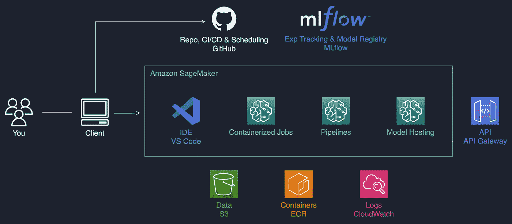

作者图片:项目架构概述。

我们将在项目中使用以下组件:

*   **SageMaker** 负责基于容器的工作、模型托管和 ML 管道
*   **MLflow** 用于实验跟踪和模型注册。
*   **API 网关**用于暴露 API 背后的推理端点。
*   **GitHub** 作为 repo、CI/CD 和 ML 管道调度程序，具有 **GitHub 动作**。

如果您在企业中工作，此设置可能由 IT 管理员为您完成。

## 在您最喜欢的 IDE 中工作

为了提高工作效率，请确保您在自己熟悉的 IDE 中工作。在这里，我在 SageMaker 笔记本实例上托管 VS 代码，还将使用 SageMaker Studio 来可视化 ML 管道。

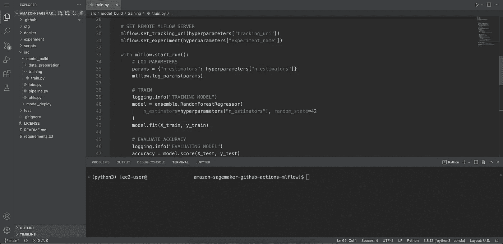

作者图片

参见亚马逊 SageMaker 上的[主机代码-服务器获取安装说明。](https://aws.amazon.com/blogs/machine-learning/host-code-server-on-amazon-sagemaker/)

## 设置中央 MLflow 跟踪服务器

我们需要一个中央 MLflow 跟踪服务器来合作进行实验和注册模型。如果没有，可以[按照说明](https://github.com/aws-samples/amazon-sagemaker-mlflow-fargate)和[博文](https://aws.amazon.com/blogs/machine-learning/managing-your-machine-learning-lifecycle-with-mlflow-and-amazon-sagemaker/)在 AWS Fargate 上部署 MLflow 的开源版本。

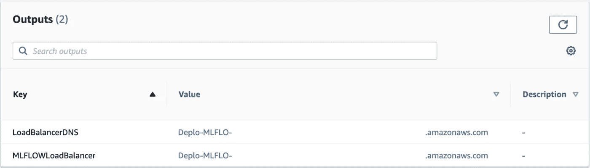

图片由作者提供:一旦部署，确保你把负载平衡器 URI 放在某个地方。我们将在我们的项目中使用它，以便代码、作业和管道可以与 MLflow 对话。

您还可以将 MLflow 替换为本地 SageMaker 选项、权重和偏差或您选择的任何其他工具。

## 将 GitHub 操作连接到您的 AWS 帐户

接下来，我们将使用 OpenID Connect (OIDC)来允许 GitHub Actions 工作流访问您帐户中的资源，而无需将 AWS 凭据存储为长期 GitHub 机密。参见[在亚马逊网络服务](https://docs.github.com/en/actions/deployment/security-hardening-your-deployments/configuring-openid-connect-in-amazon-web-services)中配置 OpenID Connect 获取说明。

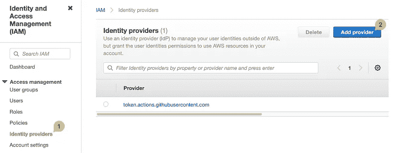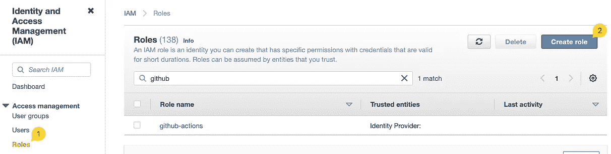

作者图片:我们将 GitHub OIDC 身份提供者添加到 IAM 中，并配置一个信任它的 IAM 角色。

您可以设置一个具有以下信任关系的`github-actions`角色:

我们添加 SageMaker 作为主体，这样我们就可以直接从 GitHub 工作流中运行作业和管道。对于 Lambda 和 API Gateway 也是如此。

为了便于说明，我将`AdministratorAccess`托管策略附加到角色上。确保在您的环境中加强权限。

## 为项目设置 GitHub 回购机密

最后，我们将`AWS account ID`、`region name`和`github-actions role ARN`作为秘密存储在 GitHub repo 中。它们可能是敏感信息，将被您的 GitHub 工作流安全地使用。详见[加密秘密](https://docs.github.com/en/actions/security-guides/encrypted-secrets)。

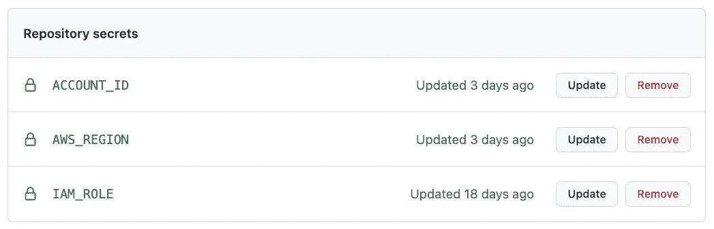

图片作者:确保机密名称映射到您的工作流程中使用的名称。

我们现在准备好出发了！

# 步骤 2:在你的项目中进行实验和协作

你可以在带有示例笔记本和脚本的 repo 中找到[实验文件夹](https://github.com/sofianhamiti/amazon-sagemaker-github-actions-mlflow/tree/master/experiment)。它通常是你开始项目并试图找出解决你的 ML 问题的方法的地方。

下面是主笔记本，显示如何在[加州房价](https://www.kaggle.com/datasets/camnugent/california-housing-prices)数据集上训练一个随机森林模型，并进行基本预测:

在我们的端到端项目中，这是一个简单的例子，您可以运行`pip install -r requirements.txt`与您的团队成员使用相同的依赖项。

ML 项目的这个实验阶段可能是相当松散的，你可以和你的团队一起决定如何组织子文件夹。此外，您是否应该使用笔记本或 python 脚本完全取决于您。

您可以将本地数据和文件保存在`data`和`model`文件夹中。我已经把它们添加到了`.gitignore`中，这样你就不会把大文件推给 GitHub 了。

## 构建您的回购以实现轻松协作

你可以随心所欲地构建你的回购协议。请记住，易用性和可重复性是项目生产率的关键。所以在这里，我将整个项目放在一个回购中，并试图在 [python 项目惯例](https://docs.python-guide.org/writing/structure/)和 MLOps 需求之间找到平衡。

您可以在下面的文件夹结构中找到描述:

## 使用 MLflow 进行跟踪实验

无论是在 IDE 中还是在 SageMaker 作业中运行代码，都可以使用 MLflow 跟踪实验运行。在这里，我记录了在`housing`实验下运行的日志。

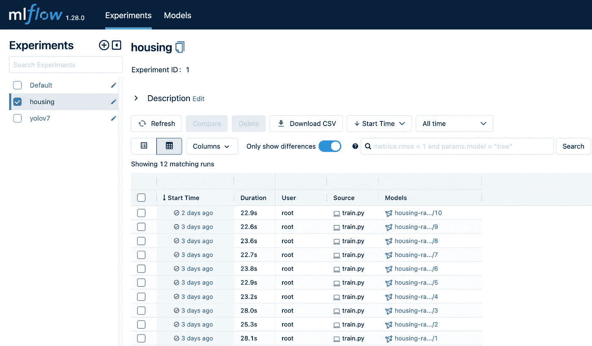

作者图片

您也可以在[本回购](https://github.com/aws-samples/amazon-sagemaker-mlflow-fargate/tree/main/lab)中找到示例实验室以供参考。

# 步骤 3:在 SageMaker 中从本地计算转移到基于容器的作业

在本地运行代码可以在项目早期发挥作用。但是，在某些时候，您会希望将依赖项打包到可复制的 Docker 映像中，并使用 SageMaker 来运行可伸缩的、基于容器的作业。我推荐阅读[亚马逊 SageMaker](https://medium.com/towards-aws/a-lift-and-shift-approach-for-getting-started-with-amazon-sagemaker-b18109ce1b44) 入门的提升和转移方法，如果这对你来说听起来很新鲜的话。

## 将工作流分解为作业

您可以将项目工作流分解为多个步骤。我们将我们的工作分成两部分:我们在 SageMaker 处理作业中运行数据处理，在 SageMaker 培训作业中运行模型培训。

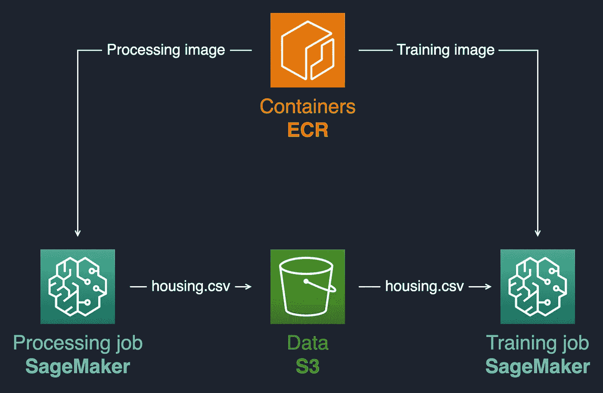

作者图片:处理作业将运行并输出一个 CSV 文件到 S3。然后在启动培训作业时使用文件 S3 位置。

## **构建集装箱并将其推送到 ECR**

我们作业的 docker 文件在 [docker 文件夹](https://github.com/sofianhamiti/amazon-sagemaker-github-actions-mlflow/tree/master/docker)中，您可以运行下面的 shell 命令将图像推送到 ECR。

```
sh scripts/build_and_push.sh <ecr-repo-name> <dockerfile-folder>
```

## **在项目中使用配置文件**

为了防止硬编码，我们需要一个存放作业参数的地方。这些参数可以包括容器映像 URIs、MLflow 跟踪服务器 URI、入口点脚本位置、实例类型、在 SageMaker 作业中运行的代码中使用的超参数。

为此，我们将使用 [model_build.yaml](https://github.com/sofianhamiti/amazon-sagemaker-github-actions-mlflow/blob/master/cfg/model_build.yaml) 。它的 YAML 结构使其易于扩展和维护。确保在运行作业之前将 MLflow 服务器 URI 和新推送的容器映像 URIs 添加到配置中。

## **在 SageMaker 运行集装箱作业**

您现在已经准备好执行 [run_job.py](https://github.com/sofianhamiti/amazon-sagemaker-github-actions-mlflow/blob/master/scripts/run_jobs.py) 并在 SageMaker jobs 中运行您的代码。它将从 [src/model_build](https://github.com/sofianhamiti/amazon-sagemaker-github-actions-mlflow/tree/master/src/model_build) 中读取配置并使用代码来启动处理和训练任务。

SageMaker 会在运行时将 [prepare.py](https://github.com/sofianhamiti/amazon-sagemaker-github-actions-mlflow/blob/master/src/model_build/data_preparation/prepare.py) 和 [train.py](https://github.com/sofianhamiti/amazon-sagemaker-github-actions-mlflow/blob/master/src/model_build/training/train.py) 注入到各自的容器中，并将它们作为入口点。

# 步骤 4:自动化您的模型构建

因此，您已经成功地在本地进行了试验，并在 SageMaker 中将工作流步骤作为基于容器的作业运行。现在您可以自动化这个过程。让我们称之为`model_build`过程，因为它与模型版本注册到 MLflow 之前发生的所有事情相关。

我们希望自动化容器映像构建，将 ML 工作流步骤绑定到管道中，并将管道创建自动化到 SageMaker 中。我们还将安排管道执行。

## 使用 GitHub 工作流自动构建容器图像

在上一步中，我们用脚本[将容器映像推送到 ECR，并在 SageMaker 作业中运行它们。转向自动化，我们使用这个](https://github.com/sofianhamiti/amazon-sagemaker-github-actions-mlflow/blob/master/scripts/build_and_push.sh) [GitHub 工作流](https://github.com/sofianhamiti/amazon-sagemaker-github-actions-mlflow/blob/master/.github/workflows/build-images.yaml)来为我们处理流程。

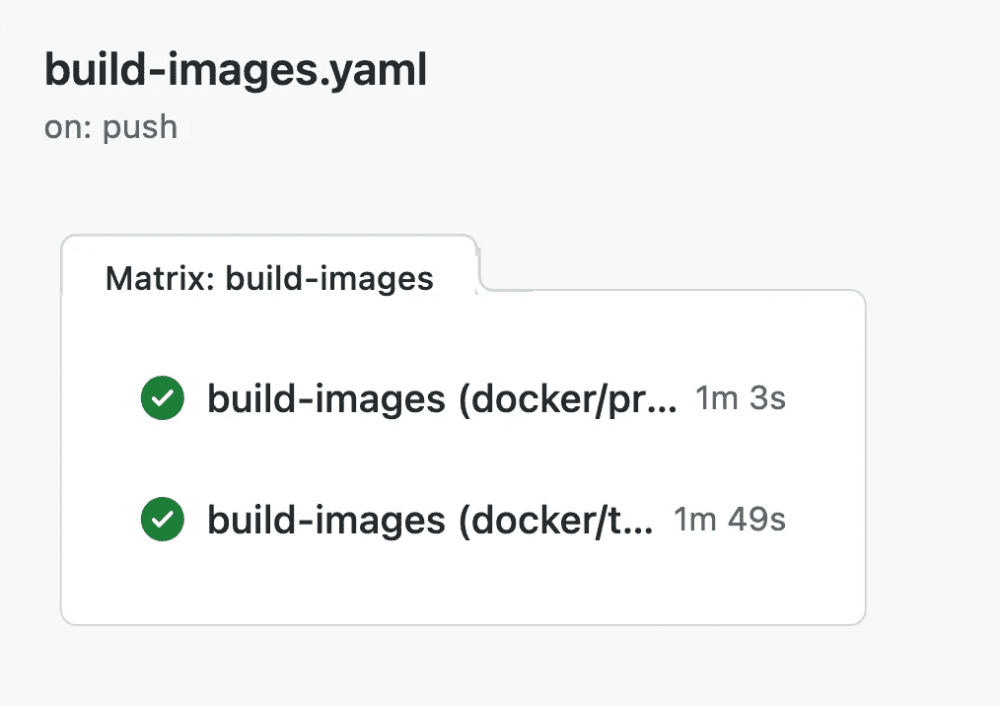

作者图片

工作流查看 [docker 文件夹](https://github.com/sofianhamiti/amazon-sagemaker-github-actions-mlflow/tree/master/docker)中的 Dockerfiles，并在 repo `main`分支中发生更改时触发。它使用了一个[复合 GitHub 动作](https://github.com/sofianhamiti/composite-action-push-image-ecr)，负责登录 ECR、构建和推送图像。

该工作流还基于 GitHub commit 标记容器图像，以确保 ML 工作流步骤的可追溯性和可再现性。

## 在 SageMaker 中将 ML 工作流步骤绑定到管道中

接下来，我们在 SageMaker 中定义一个管道来运行我们的工作流步骤。你可以在 [src/model_build](https://github.com/sofianhamiti/amazon-sagemaker-github-actions-mlflow/tree/master/src/model_build) 文件夹中找到我们的管道。它基本上运行处理步骤，获取其输出数据位置，并触发训练步骤。与作业一样，管道执行使用我们的 [model_build.yaml](https://github.com/sofianhamiti/amazon-sagemaker-github-actions-mlflow/blob/master/cfg/model_build.yaml) 中定义的参数。

我在 repo 中添加了[scripts/submit _ pipeline . py](https://github.com/sofianhamiti/amazon-sagemaker-github-actions-mlflow/blob/master/scripts/submit_pipeline.py)来帮助您按需在 SageMaker 中创建/更新管道。它可以在需要时帮助调试和运行 SageMaker 中的管道。

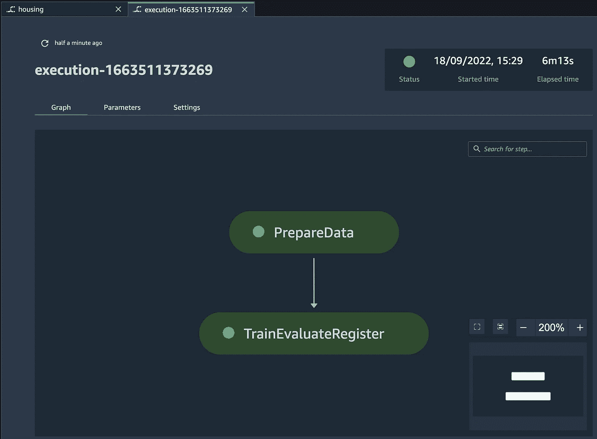

作者图片:你可以在 SageMaker Studio 中看到你更新的管道，并且可以用`**submit_pipeline.py --execute** command.`运行执行

一旦对管道满意，我们就使用[更新管道](https://github.com/sofianhamiti/amazon-sagemaker-github-actions-mlflow/blob/master/.github/workflows/update-pipeline.yaml) GitHub 工作流来自动化其管理。它在`main`分支中寻找管道变更，并运行 [submit_pipeline](https://github.com/sofianhamiti/amazon-sagemaker-github-actions-mlflow/blob/master/scripts/submit_pipeline.py) 来创建/更新。

## 用 GitHub 动作调度我们的 SageMaker 管道

我们可以对管道应用不同的触发器，这里我们将使用[schedule-pipeline](https://github.com/sofianhamiti/amazon-sagemaker-github-actions-mlflow/blob/master/.github/workflows/schedule-pipeline.yaml)GitHub 工作流来调度它的执行。它使用 cron 表达式在星期五的 12:00 运行管道。

这个基本的调度示例可以为您的一些用例工作，并在您认为合适的时候随意调整管道触发器。您可能还希望将 model_build 配置指向新数据进入的位置。

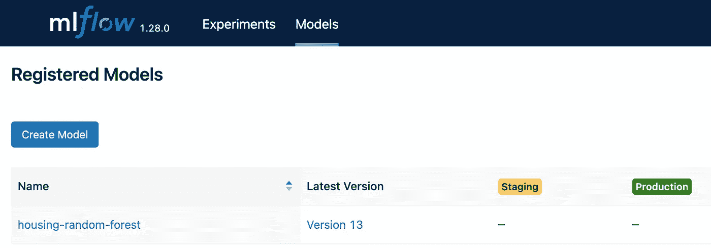

作者图片

每次执行管道后，您将看到 MLflow 中出现一个新的模型版本。这些是我们想要部署到生产中的模型版本。

# 步骤 5:将推理服务部署到生产环境中

既然我们已经有了定期进入模型注册中心的模型版本，我们就可以将它们部署到产品中了。这就是`model_deploy`过程。

## 我们的实时推理服务

我们将为我们的项目构建一个实时推理服务。为此，我们希望从模型注册中心获得模型工件，构建一个 MLflow [推理容器](https://www.mlflow.org/docs/latest/models.html#deploy-a-python-function-model-on-amazon-sagemaker)，并将它们部署到 SageMaker 端点中。我们将通过 Lambda 函数和 API 公开我们的端点，客户端可以调用这些函数和 API 进行预测。

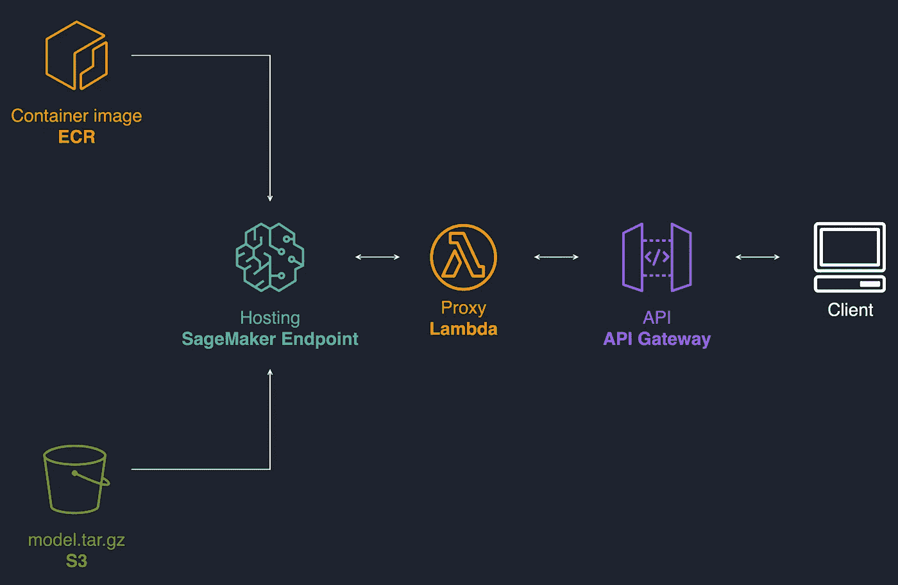

作者图片

如果您需要批量运行预测，您可以使用我们为`model_build`采用的相同方法构建一个 ML 推理管道。

## 将推理容器映像推送到 ECR

除了 ML 模型，我们还需要一个容器映像来处理 SageMaker 端点中的推理。让我们把 MLflow 提供的推送到 ECR。

我已经添加了[build-ml flow-image](https://github.com/sofianhamiti/amazon-sagemaker-github-actions-mlflow/blob/master/.github/workflows/build-mlflow-image.yaml)Github 工作流来自动完成这个任务，它将运行`[mlflow sagemaker build-and-push-container](https://github.com/sofianhamiti/amazon-sagemaker-github-actions-mlflow/blob/master/docker/mlflow_endpoint/mlflow_pyfunc.sh)`命令来完成这个任务。

## 用 CDK 定义我们的 API 栈

我们使用 CDK 来部署我们的推理基础设施，并在 [model_deploy](https://github.com/sofianhamiti/amazon-sagemaker-github-actions-mlflow/tree/master/src/model_deploy) 文件夹中定义我们的堆栈。app.py 是我们的主堆栈文件。您将看到它读取了 [model_deploy](https://github.com/sofianhamiti/amazon-sagemaker-github-actions-mlflow/blob/master/cfg/model_deploy.yaml) 配置，并创建了 SageMaker 端点、作为请求代理的 Lambda 函数以及使用 API gateway 的 API。

在部署之前，确保使用容器映像和 MLflow tracking server URIs 更新您的 [model_deploy](https://github.com/sofianhamiti/amazon-sagemaker-github-actions-mlflow/blob/master/cfg/model_deploy.yaml) 配置。

## 通过多级 CI/CD 管道部署到生产环境中

我们使用基于[主干的方法](https://www.toptal.com/software/trunk-based-development-git-flow)将我们的推理 API 部署到生产中。本质上，我们使用一个与 repo `main`分支挂钩的多阶段 GitHub 工作流来构建、测试和部署我们的推理服务。

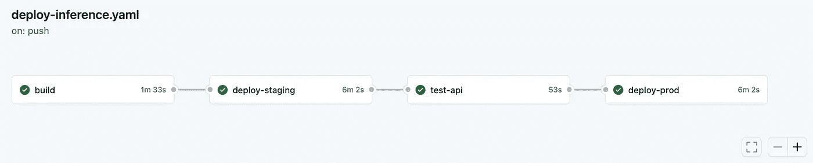

作者图片

CI/CD 工作流程在[部署-推理](https://github.com/sofianhamiti/amazon-sagemaker-github-actions-mlflow/blob/master/.github/workflows/deploy-inference.yaml)中定义，有 4 个步骤:

*   **build** 从 MLflow(在配置中定义)中读取选择的模型版本二进制文件，并将其 model.tar.gz 上传到 S3。这是由 [mlflow_handler](https://github.com/sofianhamiti/amazon-sagemaker-github-actions-mlflow/blob/master/src/model_deploy/utils.py) 完成的，它还将模型 S3 位置保存在 AWS SSM 中，供以后的 CI/CD 阶段使用。MLflow 处理程序还将模型转换为模型注册表中的 Staging。
*   **部署-试运行**将 CDK 堆栈部署到试运行中，这样我们就可以在投入生产之前对 API 进行测试。这项工作使用了我为将 CDK 模板部署到 AWS 中而构建的复合 GitHub 动作。
*   **test-api** 在准备阶段对推理服务进行基本测试。它向 API 发送一个示例有效负载，并检查响应状态是否正常。如果确定，MLflow 处理程序将在模型注册表中将模型转换为生产。如果您认为合适，可以随意添加更多的测试。
*   **部署-生产**将 CDK 堆栈部署到生产环境中。

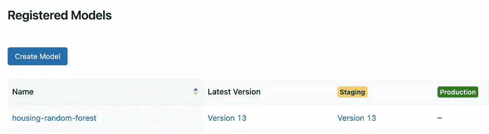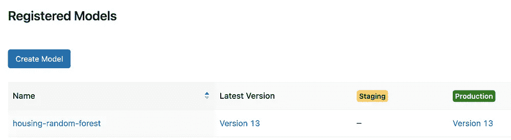

作者提供的图片:模型阶段将在 MLflow 中转换，因为它在管道中前进，并在新版本出现时存档。

## 使用您的推理服务

当您的服务成功部署到产品中时，您可以导航到 AWS CloudFormation 控制台，查看堆栈`Outputs`，并复制您的 API URL。

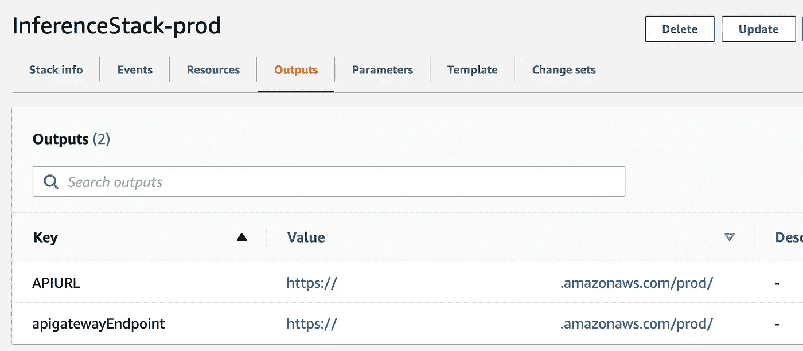

作者图片

现在，您已经准备好调用您的推理 API，并且可以在请求正文中使用以下示例数据点:

你可以使用像 [Postman](https://www.postman.com/) 这样的工具从你的电脑上测试推理 API:

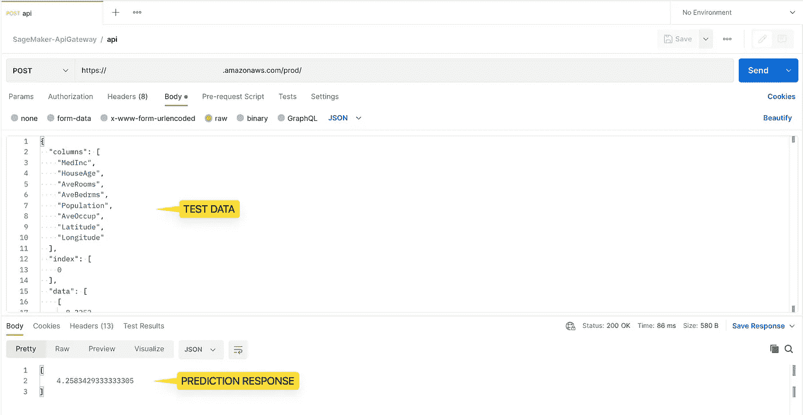

图片作者:API 将在几毫秒内返回预测的房价值。

# 结论

在这篇文章中，我与你分享了一个 MLOps 项目模板，它将实验跟踪、工作流程编排、模型注册和 CI/CD 放在一个伞下。它的主要目标是减少运行端到端 MLOps 项目的工作量，并加快您的交付。

它使用 GitHub、GitHub Actions、MLflow 和 SageMaker 管道，您可以在多个项目中重用它。

为了进一步学习，您可以访问 [Awesome SageMaker](https://github.com/aws-samples/awesome-sagemaker) ，在一个地方找到与 SageMaker 合作所需的所有相关和最新资源。