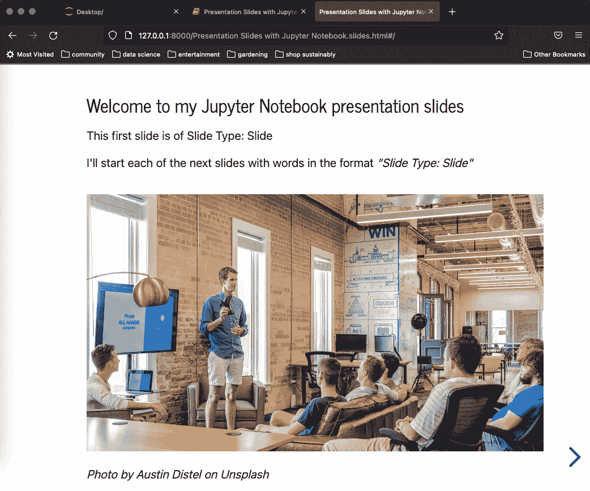
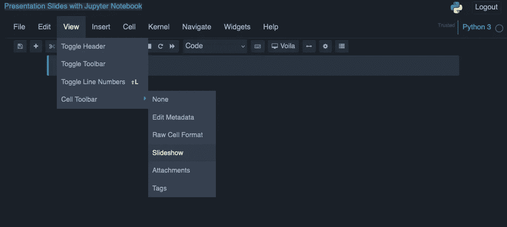
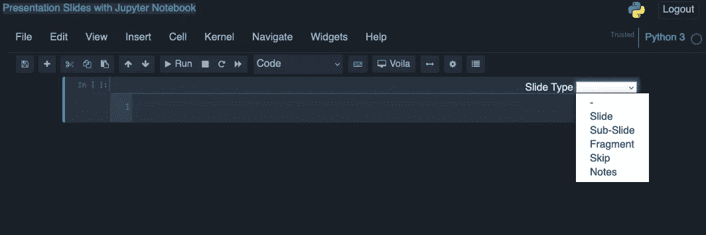
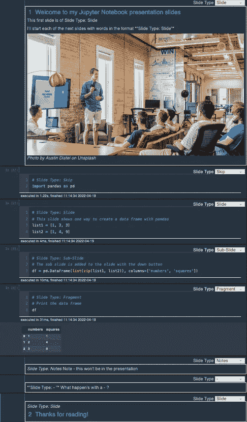
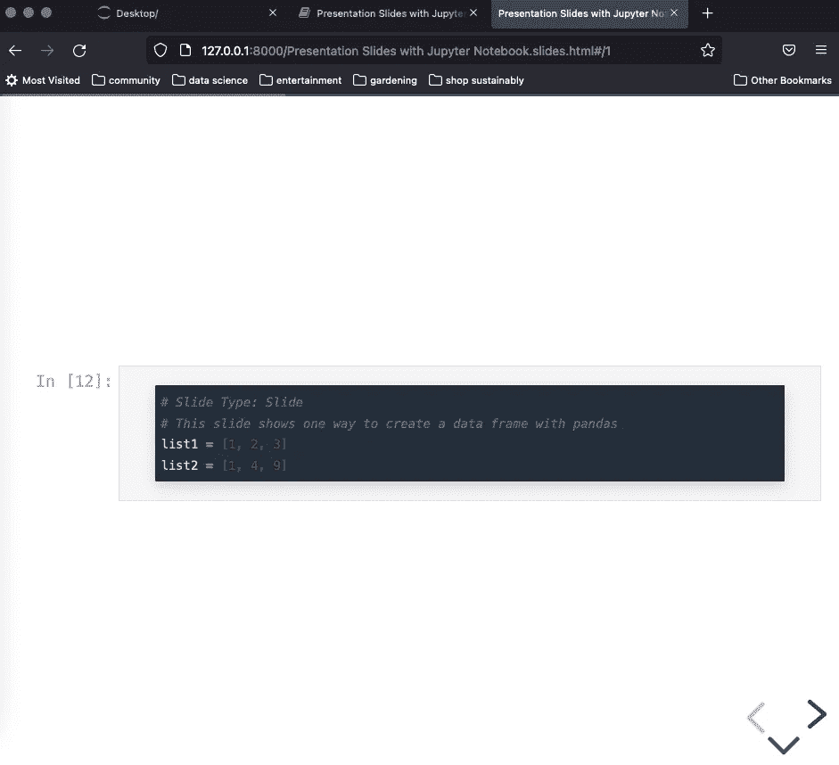
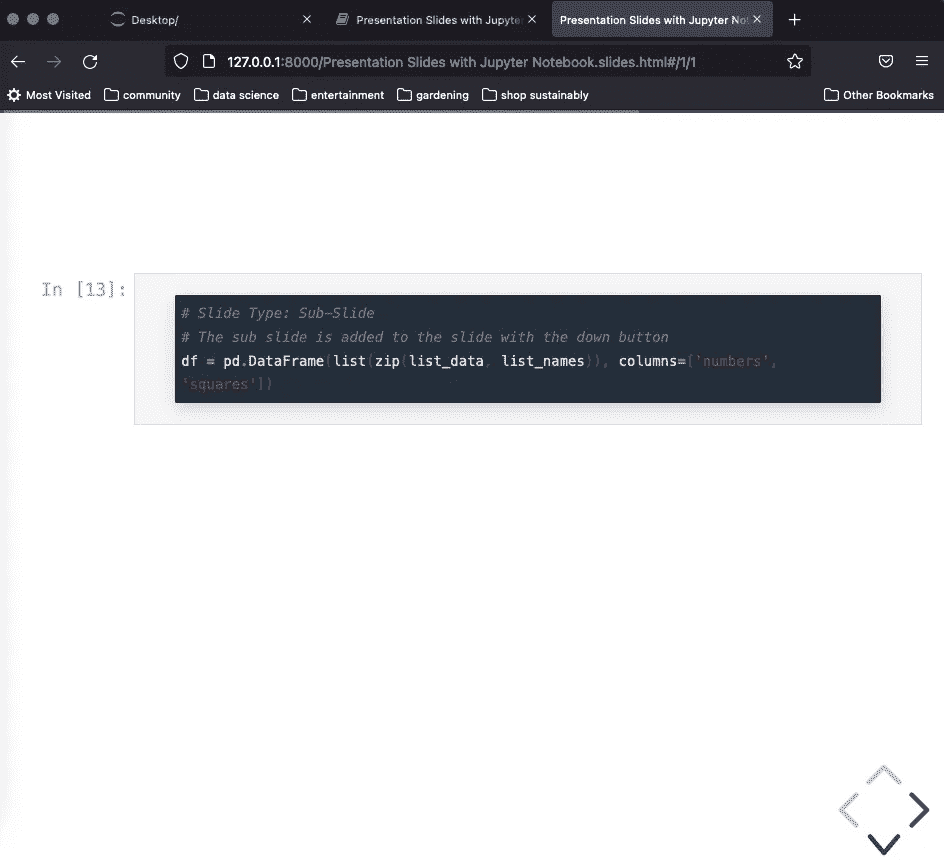
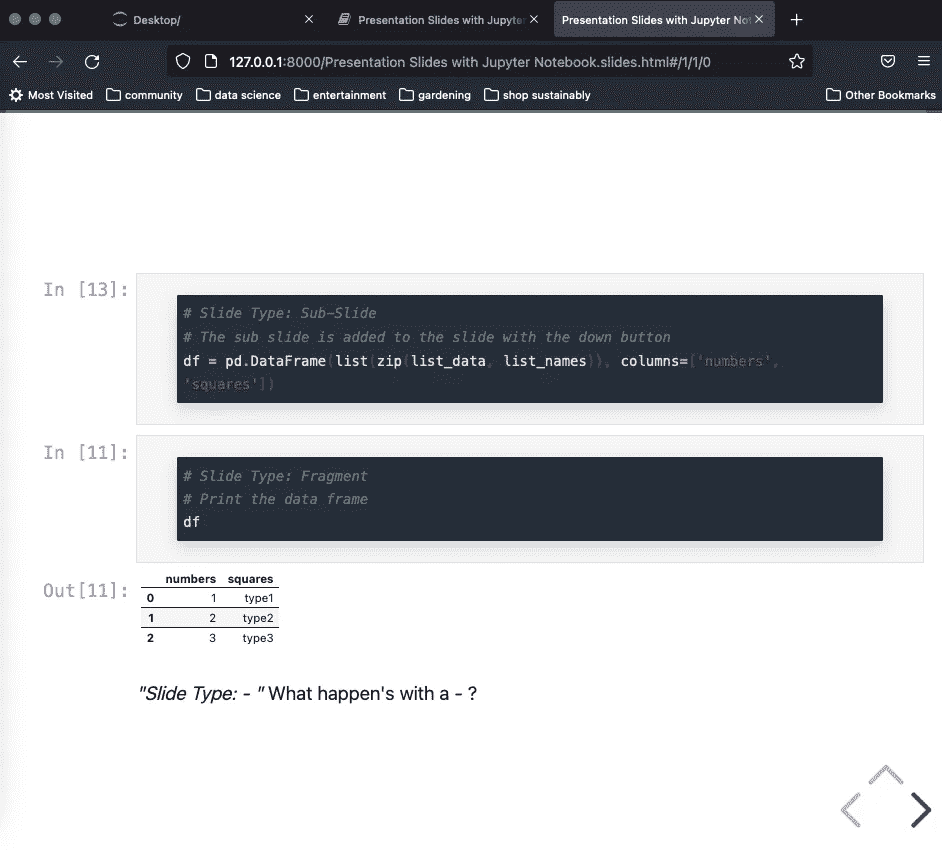
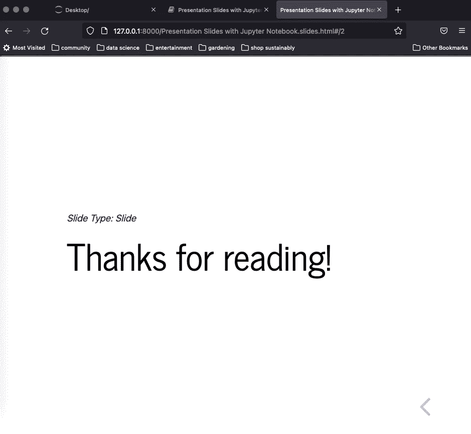

# 5 张幻灯片，介绍 Jupyter 笔记本的演示模式

> 原文：<https://towardsdatascience.com/5-slides-for-tips-on-presentation-mode-in-jupyter-notebook-f858b15fff4f>

## 使用 Jupyter Notebook 创建 HTML 幻灯片的教程



Austin Distel 在 Unsplash 上嵌入的照片

# 让我们开始吧

你在这里，你正在阅读这篇文章，你已经安装了 jupyter 笔记本并准备就绪。

jupyter 笔记本的演示幻灯片选项不言自明。这是将屏幕截图复制粘贴到其他演示软件的一种替代方法。

第一步是在**视图>单元格工具栏**选项中启用**幻灯片显示**选项。只需点击**幻灯片**选项，继续阅读。



启用幻灯片

Jupyter 笔记本中的每个单元格在右上角都有一个**幻灯片类型**选项。



幻灯片放映现已启用

# 带幻灯片演示的笔记本示例

这是我们接下来要看的 Jupyter 笔记本的完整图像。如果你愿意跟随，这款笔记本也可以在 GitHub 上找到。

接下来的步骤将包含演示结果的幻灯片输出，尽管会参考本笔记本。



作者图片

# 幻灯片

一旦您有了想要发送到 HTML 幻灯片演示文稿的笔记本，请从终端运行以下一行命令。因为您可能已经在现有的终端窗口上运行了 Jupyter Notebook，所以您可以打开另一个终端窗口来运行该命令行命令。

```
jupyter nbconvert 'Presentation Slides with Jupyter Notebook.ipynb' --to slides --post serve
```

该命令在运行 Jupyter Notebook 的浏览器中生成并打开了一个名为“用 Jupyter Notebook.slides.html 演示幻灯片”的文件。

# 第一张幻灯片

第一张幻灯片的类型为“幻灯片”,右下角有一个箭头，可移动到下一张幻灯片。


第一张幻灯片

# 第二张幻灯片

第二张幻灯片也是“幻灯片”类型，但在右下角有三个选项。

*   您可以通过单击向左箭头返回到第一张幻灯片
*   您可以通过单击右箭头前进到下一组主幻灯片，但这会跳过一些内容，因为您有一个可用的向下箭头
*   让我们单击向下箭头，看看接下来会发生什么



第二张幻灯片

# 第三张*幻灯片(或者第三张图片，如果你喜欢的话)*

单击上面的向下箭头后，我们现在在第三个图像上，它的类型是“子幻灯片”此选项启用了不同的幻灯片分组。但剩下的还不止这些。还有另一个向下箭头选项，让我们再次单击它。



第三张幻灯片

# **第四张幻灯片(或者第四张图片，如果你喜欢)**

当这次点击向下按钮时，子幻灯片保留在屏幕上，而下一个幻灯片类型“片段”出现。

此外，幻灯片类型“-”出现在底部，因为“-”将在该幻灯片或子幻灯片的最后一次执行后出现。



第四张幻灯片

# 第五张幻灯片

然后，当您按下右箭头时，会出现最后一张幻灯片。也就是说跳过了“笔记”的幻灯片类型，类似于笔记本开头跳过“跳过”的幻灯片类型。没错——我们已经在开头使用了“跳过”幻灯片类型，用于导入熊猫的陈述。



最后一张幻灯片

# 重述幻灯片类型

概括地说，Jupyter 笔记本幻灯片有几种幻灯片类型。

*   **滑动**:用右箭头导航
*   **子滑块**:用向下箭头导航
*   **片段:**将在下一个箭头上被添加到当前幻灯片或子幻灯片中
*   **备注，跳过**:不会成为幻灯片的一部分
*   **-、<空白>** :将出现在幻灯片或子幻灯片的底部，作为幻灯片或子幻灯片最后一次执行的一部分

# 其他提示和思考

为了给幻灯片添加页眉或页脚，请使用 Jupyter 笔记本的降价选项。

如果幻灯片上的内容太多，一些内容将不会出现在底部，并会从幻灯片中剪下。

Jupyter 笔记本幻灯片对于某些演示非常有用，因为无需将 Jupyter 笔记本信息传输到演示软件就可以构建幻灯片。但是其他软件的存在是有充分理由的，在某些情况下可能是更好的选择。

如果你喜欢这篇文章，并想阅读(和写)更多这样的文章，请考虑点击我的个人资料图片旁边的*关注*按钮和/或使用我的推荐链接[https://sabolch-horvat.medium.com/membership](https://sabolch-horvat.medium.com/membership)订阅中级会员