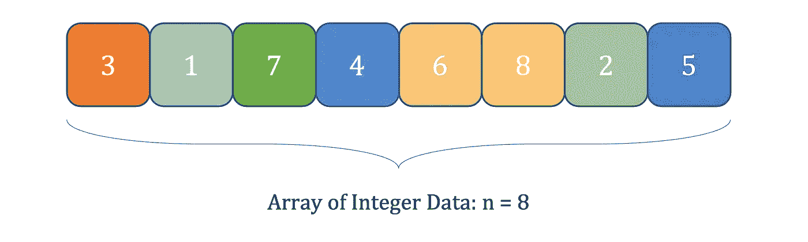
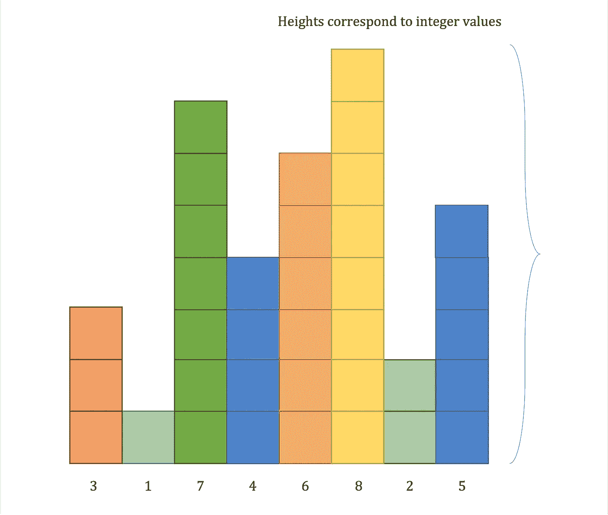
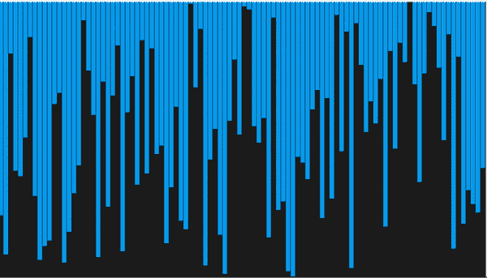
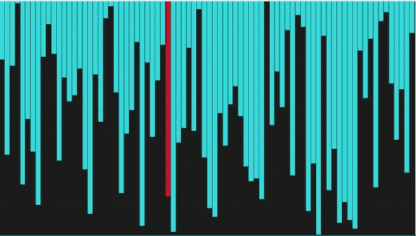
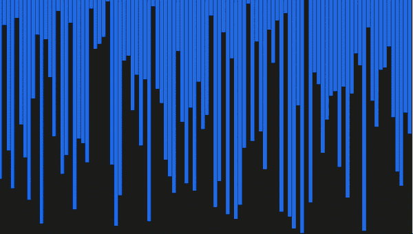
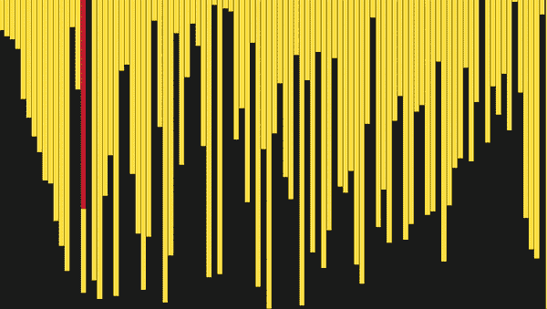
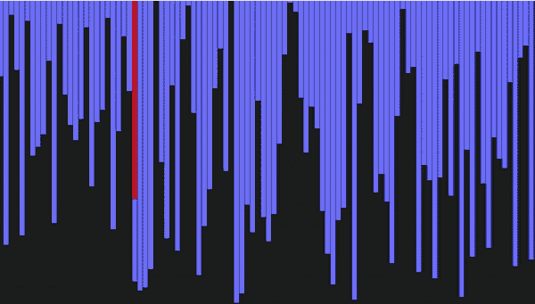

# Python 中的 5 种排序算法可视化

> 原文：<https://towardsdatascience.com/5-sorting-algorithms-in-python-c7ece9df5dd6>

## 使用 Python 实现选择、冒泡、插入、合并和快速排序算法

## 介绍

**排序**数组在编程中很常见，以帮助*理解*数据并执行*查找*。因此，与分类大量信息相关的速度对于功能设计和**优化运行时间**至关重要。存在许多算法来完成排序对象的任务。

这篇文章展示了五种流行的排序算法的实现和可视化。代码用 *Python，*图形界面用 *Tkinter* 构建。

> 这个项目的灵感来自于提莫·宾曼在 T21 的视频。

乔恩·泰森在 [Unsplash](https://unsplash.com/s/photos/pattern?utm_source=unsplash&utm_medium=referral&utm_content=creditCopyText) 上的照片

涵盖的算法包括:

*   *选择*排序
*   *冒泡*排序
*   *插入*排序
*   *合并*排序
*   *快速排序*

## 阵列可视化

图 1 是*无序整数数据*的示例数组。

图 1 —无序的整数数据(作者图片)

一旦一个类提供了一些**重载**的*比较* *运算符*的实现，那么**就是可排序的**。在 Python 中，它们是:

*   `__lt__`:小于
*   `__gt__`:大于
*   `__eq__`:等于

例如，Gist 1 中的代码显示了一个*重载的小于*的方法。

要点 1 —重载小于运算符

可以使用**条**来表示数字数据。 *iᵗʰ条的**高度**等于 iᵗʰ数组元素*的值。每个杆都有一个*等宽*。因此，图 2 给出了将图 1 中的**数值列表**描绘为一组*条*。

图 2 —以列高表示的整数数据值(图片由作者提供)

按***或* **升序***排序*数值数据*需要相应地重新排列数值。因此，要实现操纵数据的每个算法的动画，需要在交换单个元素后刷新条形图。***

***Gist 2 展示了 Python 代码来交换列表*中*的两个元素。***

***要点 2 —交换列表中的元素***

****渲染需要两个类*，一个是`Canvas`，另一个是`Bar`。查看带有**注释代码**的 [GitHub 库](https://github.com/ad-1/SortingVisualisation)以获得完整的*用户界面*。***

***Gist 3 为`Canvas`类中的**渲染更新**提供了必要的代码。当`bar` `index`改变时，如上所述，`setter`触发主画布上的`update_bar`功能。一旦更新被触发，数组项交换位置。***

***要点 3 —当条索引改变时，触发主画布上的渲染更新***

# ***算法***

## ***选择排序***

***选择排序是一种**就地**排序算法，意味着*排序后的* *项*使用与*原始元素*相同的*存储*。***

***要点 4 展示了选择排序 Python 实现，详细的**注释**一步步解释了技术*。****

***外部循环遍历未排序数组的长度，而内部循环在数据集的剩余部分中搜索最小值。然后发生一次交换，用`min_index`项替换 *iᵗʰ* 元素。***

***要点 Python 中的选择排序算法***

****选择*排序方法一般有以下几种:***

*   ****时间复杂度* = **O(n )** 。从两个嵌套的 for 循环中可以明显看出 n 次迭代。***
*   ****空间复杂度* = **O(1)** 。如上所述，排序就地进行；因此，内存使用不依赖于处理数据。***

***图 3 显示了运行中的算法。***

******

***图 3 —选择排序(按作者排序的图片)***

## ***冒泡排序***

****冒泡*或下沉排序反复遍历列表，*比较相邻元素*。根据分拣条件，物品被**交换**。***

***Gist 4 展示了选择排序 Python 实现，详细的**注释**一步步解释了技术*。****

****gist 4—Python 中的冒泡排序算法****

****冒泡排序有一个*最坏情况*和*平均值*:****

*   *****时间复杂度* = **O(n )** 。****内*循环*至少运行 *n 次*。因此，整个操作至少需要 n 次。********
*   *********空间复杂度* = **O(1)** 。N *没有额外的内存*被利用，因为项目的交换发生在原始数组上。********

******当程序执行时，较大的值*冒泡*到列表的顶部，如图 4 所示。******

************

******图 4 —冒泡排序(作者图片)******

## ******插入排序******

*******插入*排序构建最终数组*一次一项*。使用 Gist 5 中提供的代码对未排序的对象数组执行该方法。******

******在外循环上遇到的每个*对象**被放在当前最接近的***最小*和*最大*元素之间。*********

********要点 Python 中的插入排序********

********插入排序有一个最坏的情况:********

*   *********时间复杂度* = **O(n )** 。循环的外*运行大约 *n* 次，而*循环的内*运行大约相同的次数。*********
*   ******空间复杂度* = **O(1)** 。操作发生在原始数组上。因此，不需要额外的内存需求。*****

*****图 5 展示了插入排序的实际应用。*****

**********

*****图 5 —插入排序(按作者排序的图片)*****

## *****合并排序*****

*****合并排序是一种**分治**排序算法。因此，问题*将*分解成更小的类似*子问题*，直到一个*基础案例*被解决。*****

*****拆分未排序的数组，直到获得单个元素的基本情况。然后，在**临时** **数组**之间进行比较，沿着*递归堆栈*向上移动。*****

*****要点 Python 中的合并排序*****

*****合并排序有一个:*****

*   *****时间复杂度= **O(n*log(n))** 。分治排序算法具有这种时间复杂度。⁴这种复杂性是最坏的情况。*****
*   *****空间复杂度= **O(n)** ，表明内存分配的增长不会快于一个*常数* *乘以*数据集*的大小，即 k*N******

**********

*****图 6 —合并排序(按作者排序的图片)*****

## *****快速排序*****

*****Quicksort 比它的主要竞争对手 merge sort 和 heapsort 快两到三倍。它通常是递归实现的，如 Gist 6 所示。*****

*******Pivot** 值是快速排序算法的核心。本质上，枢轴是在排序数组中它们的*正确索引*处的值。定位枢轴意味着左边的对象总是较少，而右边的项目比枢轴多。*****

*****要点 Python 中的快速排序*****

******递归地* **划分**数组，选择中枢点并将它们分配到正确的位置给出最终排序的数组。*****

*****快速排序有一个*平均值*:*****

*   ******时间复杂度* = **O(n*log(n))** 。像归并排序一样，这种表示法是由分而治之或快速排序决定的。一个*最坏的情况*是 O( **n** )。但是，这仅在数组元素正确升序或降序时发生。*****

*****图 7 显示了快速排序动画。*****

**********

*****图 7 —快速排序(作者图片)*****

## *****结论*****

*****优化排序在软件开发中至关重要。**具体算法的时间复杂度**会根据项目的*初始* *顺序*而*不同*。然而，*假设*最坏的情况**是最合适的。*******

*****还有许多其他技术没有涉及。一些这样的例子包括*堆*、*基数*和心爱的 *bogo* 排序。*****

*****本文介绍了五种标准排序算法的 Python 代码和**可视化。理解这些机制对于计算机科学的学生来说是很有价值的，因为其中一些程序经常出现在**的编码面试中。*********

***如果你对 Python、工程学和数据科学感兴趣，可以看看我的其他文章。***

***    

## 参考

[1] [原地排序](https://xlinux.nist.gov/dads/HTML/inplacesort.html#:~:text=Definition%3A%20A%20sort%20algorithm%20in,known%20as%20sort%20in%20place.) —美国国家标准技术研究院
【2】[快速排序时间复杂度](https://www.javatpoint.com/quick-sort#:~:text=The%20best%2Dcase%20time%20complexity,O(n*logn).)—Java point
【3】[空间复杂度是什么意思？](https://stackoverflow.com/questions/27663624/what-exactly-does-on-space-complexity-mean-and-how-inefficient-is-it#:~:text=Space%20complexity%20of%20O(n)%20means%20that%20for%20each%20input,than%20linearly%20at%20k*N.)—stack overflow
【4】[了解你的复杂性！](https://www.bigocheatsheet.com/) —大 O-备忘单***