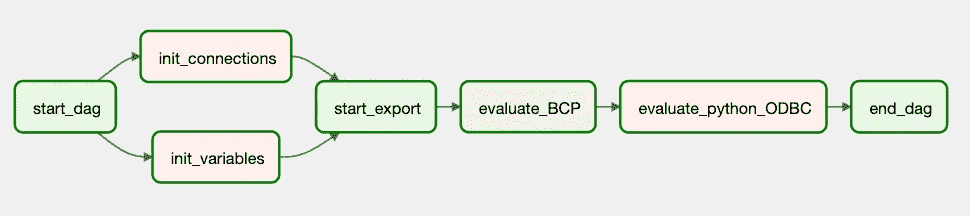
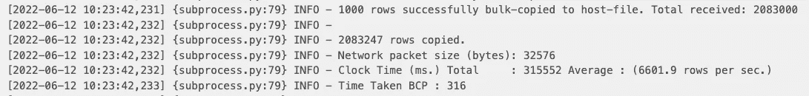
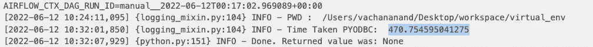
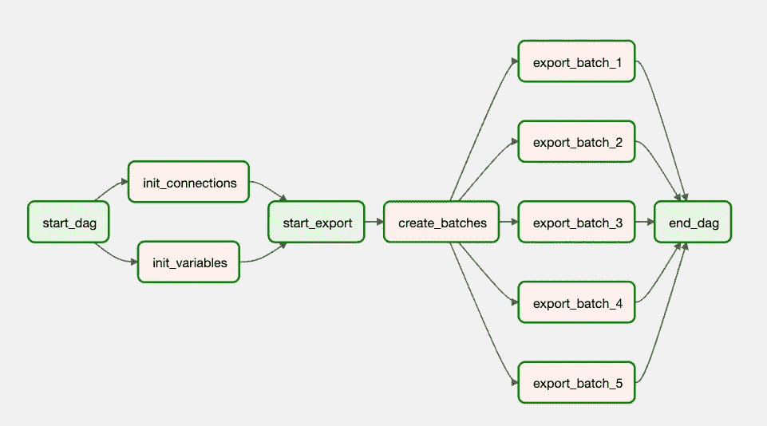

# 使用 Apache Airflow 构建高效数据管道的 5 个步骤

> 原文：<https://towardsdatascience.com/5-steps-to-build-efficient-data-pipelines-with-apache-airflow-d0b42576b530>

## 发现优化大数据管道的最佳实践

由[陈乐德](https://unsplash.com/@mero_dnt?utm_source=medium&utm_medium=referral)在 [Unsplash](https://unsplash.com?utm_source=medium&utm_medium=referral) 上拍摄的照片

# 阿帕奇气流

Airflow 是一个开源的工作流程编排工具。尽管广泛用于构建数据管道，但 airflow 可用于管理各种工作流。

简单地说，如果我们要构建一个可伸缩的系统，以有序的方式执行一组需要与不同组件交互的任务，我们就可以用气流来管理这样的工作流。我们使用 Dag(有向无环图)来执行这样的操作/任务。

在这篇博客中，我们将揭示一些有效构建工作流的实践。

# **开发经济高效的数据管道**

作为一名数据工程师，在处理项目时主要关心的问题之一是处理万亿字节数据所需的数据管道的效率。尽管解决方案通常很简单，但可能会出现管道架构、基础设施或底层数据模型阻碍管道高效运行的情况，从而导致解决方案过时。

让我们来看看一些策略，我们可以使用这些策略来处理海量数据的问题，而不会影响管道的有效性。

# 1.数据建模

照片由 [Unsplash](https://unsplash.com?utm_source=medium&utm_medium=referral) 上的 [Shubham Dhage](https://unsplash.com/@theshubhamdhage?utm_source=medium&utm_medium=referral) 拍摄

构建数据湖或数据平台并不等同于将数据转储到现代堆栈中。相反，它通常要求工程师识别支持有效使用数据的模型。建模通常包括数据的标准化和规范化，以消除重复，执行数据标准，并通过根据业务领域对数据进行分组来建立新的实体。合适的数据模型有三个好处:

*   它通过减少基础设施上不必要的负载来增加数据平台的能力。
*   它简化了组织的数据资产管理，支持高效的数据分析和其他前端应用程序。
*   数据通常基于业务领域进行分组，因此它有助于数据治理和编目。

虽然数据建模不是 Apache Airflow 独有的，但它在构建有效的数据管道中起着至关重要的作用。

# 2.选择最佳操作员

类似于许多领域，有几种方法可以解决数据工程中的任何问题。气流通过提供一系列操作员提供了类似的灵活性。选择正确的运营商可以提高管道性能，并大大减少开发时间。

操作符的选择会因用例而异。

选择合适的运营商通常取决于以下因素:

*   **数据源和目的地**
*   **操作员灵活性**
*   **操作员效率**
*   **成本费用**

## a.数据源和目标

在开发数据管道时，数据通常要经过几个阶段。在数据湖的情况下，数据可能必须经过着陆区和转换区，然后才能进入管理区。

因此，可能会出现这样的情况:气流操作员需要将数据从 SQL 数据库导出到我们数据湖中的 s3 存储桶，或者从 S3 存储桶中读取文件，并将它们加载到数据库或基于我们数据平台架构的另一个 S3 存储桶中。

每个运营商的来源和目的地可以缩小搜索空间。例如，如果操作符将数据从 SQL 服务器导出到 S3 存储桶，尽管可以使用 PythonOperator 或 BashOperator 来完成，但由于其简单性和性能， **SqlToS3Operator** 将是一个不错的选择。

此外，如果 Airflow 集群位于 AWS 云上，并且源是一个 RDS 实例，我们可以使用上述操作符获得更好的性能，因为数据不会离开 AWS 环境，而是以闪电般的速度在 AWS 基础架构上通过服务流动。

## b.操作员灵活性

尽管 Airflow 的优点是有几个提供商支持的钩子和操作符，但是由于任务的复杂性，使用提供商的现成操作符是不可行的。在这种情况下，我们可以使用 **PythonOperator** 或 **BashOperator** ，这给了我们足够的灵活性来产生想要的结果。

PythonOperator 和 BashOperator 都有各自的优点和缺点。一方面，PythonOperator 易于理解和实现，使得开发过程变得简单，从而减少了开发时的开销。另一方面，尽管 BashOperator 因不够直观而臭名昭著，但它通过更好的性能弥补了这一点。

## **c .操作员效率**

尽管有几个操作员可以完成期望的 ETL/ELT 工作，但并不是所有的都是最佳的。一些运营商比其他运营商表现更好。为了补充上一点 PythonOperator vs BashOperator，我们将在本节看到每个运算符的性能差异。
我们创建以下管道来评估完成一个简单导出任务所需的时间。

作者图片

我们可以从下面的代码块中看到，上面 DAG 中的操作符执行相同的任务，也就是说，它们都将 RDS (MS SQL Server)中超过 200 万条记录的表导出到 CSV 文件中。

BashOperator 使用的 bash 脚本如下:

运营商的评价如下:

*   我们可以观察到， **BashOperator** 用了将近 **316 秒**来导出 200 万条记录。

*   相反， **PythonOperator** 用了几乎 **470 秒**来执行同样的导出。

*   **PythonOperator** 对于使用**相同基础设施**的**相同导出**，运行时几乎增加了 **50%。**

话虽如此，PythonOperators 也有它的好处。Python 易于学习和编码，并且在为机器学习用例开发管道时具有方便的大量库的优势。
因此，我的原则是，如果我们必须导出/导入小块数据，或者需要支持开发和灵活性的公共可用库，PythonOperator 是最佳选择。但是，如果我们需要通过综合转换进行批量装载，BashOperator 可以很好地满足我们的需求，因为它的性能很快。

## **d .成本费用**

最后，我们需要考虑与使用操作符相关的额外成本(如果有的话)。例如，AWS 提供其[数据库迁移服务运营商](https://airflow.apache.org/docs/apache-airflow-providers-amazon/stable/operators/dms.html)将数据从数据库或外部来源迁移到云平台。DMS 提供持续复制、最少的停机时间和其他功能，使数据迁移变得容易。然而，它的便利是有代价的。因此，如果价格不是问题，并且数据平台在 AWS 中，那么 DMS 就成为运营商选择的合适候选。

# 3.定量

在上一节中，我们研究了用于将数据加载到我们的数据平台中的几个操作符。尽管我们设法选择了有效执行任务的操作符，但是每个操作符所能达到的性能都是有限的。
在构建数据管道时，有时可以观察到，即使有最好的运营商，管道仍然相对较慢。通常情况下，管道性能不佳是因为它没有利用底层基础设施的全部潜力。此外，有时管道处理数据的时间至关重要，足以决定项目的命运。

在这种情况下，我们可以通过设计一个高效的管道来解决这个问题。

> 分而治之！

举例来说，如果手头的任务是导出/导入一个具有万亿字节数据的巨大数据库，而不是像前面几节中描述的那样导出整个表，那么我们可以基于批处理来导出/导入数据。

作者图片

设计批处理管道时，需要注意以下几点:

*   管道应该保持**数据的完整性**。应注意确保批处理逻辑不会造成重复或数据丢失。
*   尽管并行性是好的，但它只应在不中断共享同一基础设施的其他应用程序的情况下使用。可以根据 CPU 利用率、内存使用量等指标来调整并行度。
*   **应该构建高效的查询**来从源系统中检索批处理，因为它们会显著影响管道的性能。

# 4.高效的查询和脚本

数据管道的性能不仅取决于架构，即选择的操作符或任务中的并行度，还取决于适当的转换逻辑。低效的查询会增加管道的处理时间，并给底层基础设施增加不必要的负载。

当设计具有批处理的管道时，这个问题变得特别严重。本节探讨两种批量导出数据的方法，并比较它们的性能。

*   在第一种方法中，我们使用-F(第一行)和-L(最后一行)标志批量导出数据。

上述脚本的性能如下:

*   其次，我们看一种使用最优 SQL 查询执行相同任务的**更有效的方式**。

上述脚本的性能如下:

**注意:**虽然我们创建了一个单独的脚本来测试批处理性能，但是每次迭代都是独立于之前的迭代的，因此如果操作是并行的，就可以给出准确的性能估计。这两个任务都使用 BCP 和相同的基础设施，不同之处仅在于批处理逻辑。

尽管这两种方法看起来相似，但我们可以从运行时观察到，后者比前者快得多。对于包含数亿条记录的大型数据集，随着第一种方法的导出时间呈指数级增长，更好的性能变得更加明显。
首先描述的方法中时间的增加是因为如果我们有 100 个批次，每个批次有 100 万条记录，那么要通过第一种方法导出第 100 个批次，BCP 必须读取 9900 万条记录，然后才能开始导出数据。这意味着随着批次数量的增加，导出数据所需的时间也会增加。
但是，使用后一种方法，查询被优化以从 1 亿条记录中获得所需的 ID，然后读取导出所需的记录，使每次导出保持一致。

# **5。选择合适的基础设施**

由 [Unsplash](https://unsplash.com?utm_source=medium&utm_medium=referral) 上的 [drmakete 实验室](https://unsplash.com/@drmakete?utm_source=medium&utm_medium=referral)拍摄的照片

数据管道的性能取决于支持它们的底层基础设施。一个设计良好的数据管道，如果基础设施不完善，结果会很糟糕，反之亦然。因此，了解并使基础设施能够构建高效的管道至关重要。

有许多方法可以实现足够的基础设施。例如，气流与 Kubernetes 等技术很好地集成在一起。由 AWS、GCP 或 Azure 等云平台支持的 Kubernetes 可以帮助充分发挥数据管道的潜力。云平台在与 Airflow 集成时变得非常强大，因为它们提供了一些功能，如根据 CPU 利用率、内存等指标自动扩展或缩减基础架构。

上述方法有助于创建强健的基础架构，原因如下:

*   Kubernetes 可以帮助在硬件上扩大或缩小 pod(我们数据管道中的每个任务)。
*   此外，云平台可以通过向 Kubernetes 集群添加或删除硬件资源来扩大或缩小规模，这可能会随着数据管道中负载的增加而增加。
*   此外，这两种技术相互作用，使基础设施更加可靠。

# 结论

构建数据管道是多个组件的混合。这篇博客探讨了设计良好的基础设施、架构和数据建模对于构建高效管道的重要性。

# 参考

 [## 主页

### 没有更多的命令行或 XML 魔术！使用标准 Python 功能创建工作流，包括日期时间…

airflow.apache.org](https://airflow.apache.org/)  [## 阿帕奇-气流-供应商-亚马逊-阿帕奇-气流-供应商-亚马逊文档

### 这是提供者的提供者套件。此提供程序包的所有类都在 airflow.providers.amazon python 中…

airflow.apache.org](https://airflow.apache.org/docs/apache-airflow-providers-amazon/stable/index.html) 

# 阅读其他数据博客

 [## 索引—链接到我的所有博客

### 这篇文章只是为了方便访问我过去写的博客。不同领域的博客会…

vachan15.medium.com](https://vachan15.medium.com/index-link-to-all-my-blogs-98efca323fa8) 

# 在 Linkedin 上连接:

 [## Vachan Anand -顾问- Servian | LinkedIn

### 一家非盈利机构的创始人，具有金融服务行业的工作经历。熟练 HTML…

www.linkedin.com](https://www.linkedin.com/in/vachan-anand-26bb76b7/)