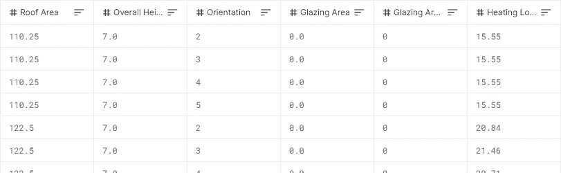
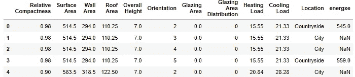
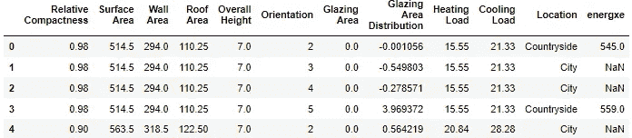
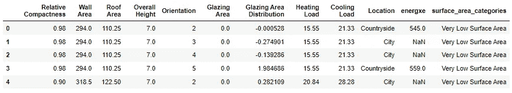
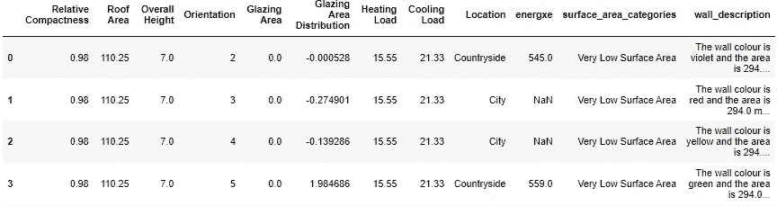
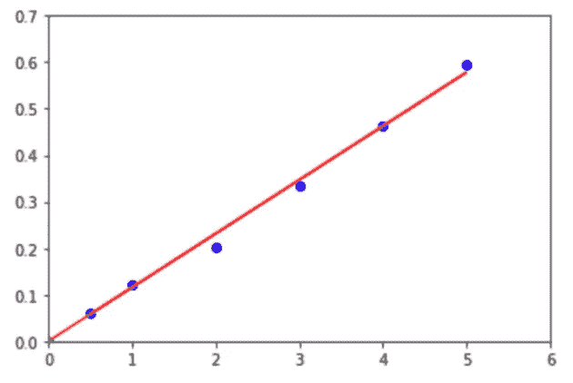
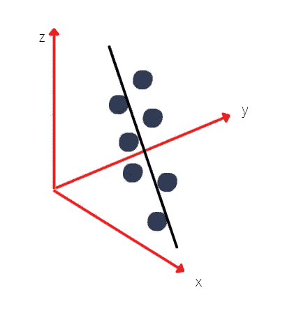
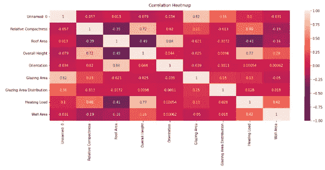
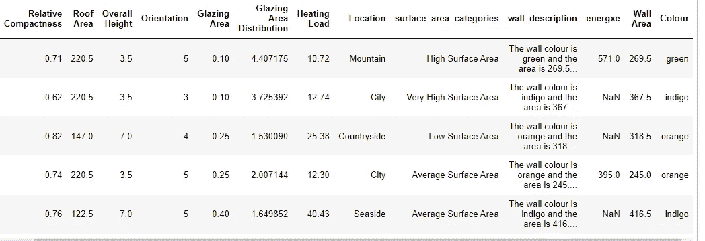

# 创建数据科学黑客马拉松笔记本的 5 个步骤

> 原文：<https://towardsdatascience.com/5-steps-to-creating-a-data-science-hackathon-notebook-1f86190a72ec>

## 黑客马拉松

## 向同事/朋友介绍 Python 和数据科学的世界


作者创建的图片|使用了来自[canva.com](http://canva.com)的免费内容许可元素

有很多黑客马拉松，也有很多关于如何“通过”黑客马拉松的文章。但是做一个呢？如果您想让您的员工、朋友或同事掌握数据科学/数据处理领域的技能，该怎么办？通过可操作的手段教 python？遵循以下 5 个步骤，你可以很容易地创建一个原创的黑客马拉松。

> 请注意，我们正在 Jupyter 笔记本上为**初学者**创建一个机器学习黑客马拉松。

本文将带您一步步了解如何将一个基本数据集转化为机器学习的学习体验。我们的主要目标是教授其他人清理数据的基础知识，并介绍数据科学。本文涵盖:

1.  选择数据集
2.  使数据集变得混乱
3.  使用机器学习创建解决方案笔记本
4.  为参与者创建一个框架笔记本
5.  评估的可能方法
6.  以上五个步骤的总结

我们在整篇文章中提到的与**案例研究**相关的文件都可以在这里找到:

[](https://github.com/Causb1A/cyf-edf-hackathon) [## GitHub-caus B1 a/cyf-EDF-hackathon

github.com](https://github.com/Causb1A/cyf-edf-hackathon) 

> 注意:在整篇文章中，我们遵循我和 Marcell Orban 为慈善黑客马拉松“Code Your Future”组织创建的上述端到端黑客马拉松案例研究。我们选择了能量这个主题。这些都是开源的，所以你可以在自己的黑客马拉松中随意使用这些文件。

# 选择数据集

我们需要做的第一件事是为我们的黑客马拉松选择一个数据集。这一点非常重要。

## 你能在哪里找到这些数据？

你可以在 Kaggle 上找到它。有大量的数据集供你在你的黑客马拉松中使用，不需要做所有的手动创建或者考虑你可以从你的工作中使用什么数据。

例如，你可以在这里找到一些好的数据集:[https://www.kaggle.com/ahmettezcantekin/beginner-datasets](https://www.kaggle.com/ahmettezcantekin/beginner-datasets)

> 我要提醒的是，在使用任何数据集之前，您应该验证所使用的数据是按照与所讨论的项目一致的条款许可/发布的；对于大多数黑客马拉松来说，这不是问题！

在我们的案例研究的特定例子中，我们使用上面初学者数据集文件中名为 *energy.csv* [1]的文件。这是一个清晰的数据集，有着清晰的关系，并且符合我们的能源主题。您也可以在本文引用的存储库中找到这些数据:[https://github.com/Causb1A/cyf-edf-hackathon](https://github.com/Causb1A/cyf-edf-hackathon)

## 选择什么数据的原则

选择数据集时，需要遵循一些原则:

*   数据必须非常清晰，具有清晰的逻辑关系和明确的目标变量(这一点非常重要，将在下面详述)。
*   确保至少有两种数据类型:整数(或浮点)和分类数据。如果没有分类数据，这没问题；但是，您必须能够将列转换为分类数据。
*   确保至少有 5 列 500 行数据。
*   确保数据有一个相对众所周知的上下文(也在下面的部分展开)。

这个黑客马拉松是人为的，不建议使用真实数据，因为真实数据是杂乱的，有时可能没有关系。一点也不适合初学者。我们希望激励新的数据科学家，激励人们从这个领域开始，而不是向他们展示死胡同。

下面是遵循上述原则的一个例子。

## 案例研究 Energy.csv:

让我们来评估我从 Kaggle 文件夹中选择的数据集:energy.csv [1]，这是一个包含房屋/物业及其热负荷的不同测量值的数据集。这符合我们的能源主题。在这个 CSV 中，我选择了“热负荷”——下图中的最后一列——作为预测的目标变量。



来自 energy.csv |公共领域数据的几篇专栏文章—知识共享许可可在[https://www.kaggle.com/ahmettezcantekin/beginner-datasets](https://www.kaggle.com/ahmettezcantekin/beginner-datasets)获得

对于那些不知道的人来说，热负荷是将温度保持在可接受的范围内所需的热能的*量*。

让我们看看这个数据是否符合我提到的原则中的标准:

*   有明确的逻辑关系吗？可以说，所有或至少大部分专栏都是如此。玻璃面积，表面积，屋顶面积，这肯定会影响热负荷吧？表面积越大可能意味着热负荷越低。
*   它有多少种数据类型？它有整数和浮点数。它没有类别或布尔值，但您可以创建一个。有屋顶面积或表面面积，为什么不把它分成“非常低的表面面积”、“高的表面面积”等。那么就会存在一个分类列。
*   它的数据是否超过 5 列和 500 多行？是的，确实如此。
*   是一个比较知名的概念吗？热负荷和表面积是一个广义的概念，大多数人都知道。

这是一个合适的数据集。

# 使数据变得混乱

初学者数据集开始时太干净了，如果我们用这些数据开始黑客马拉松，即使对初学者来说也太容易了。我们也在尝试教别人如何处理杂乱的数据。因此，我们必须做到以下几点:

*   添加完全没有意义的额外列
*   给数据添加随机噪声，这样就不那么干净了
*   如果分类列不存在，则创建分类列
*   创建混乱的文本数据(例如在段落中嵌入一个数字来提取)
*   创建缺失值
*   随机添加一些异常
*   分割数据，为自己保留一个看不见的数据集

下面，我们评估了上述案例研究，供您作为范例遵循。有许多方法可以做到这一点，然而，在这里我们遵循这个例子。

## 案例研究:energy.csv

同样，下面我们来探讨案例研究。完整的 Jupyter 笔记本，在这个回购里:[https://github.com/Causb1A/cyf-edf-hackathon](https://github.com/Causb1A/cyf-edf-hackathon)而我参考的笔记本叫:*make _ data _ noise . ipynb*

> R *记住，我们要预测的目标变量是供热负荷*

在执行任何步骤之前，我们首先执行导入，并将数据定义为 df:

```
import numpy as np
import pandas as pd
import matplotlib
import matplotlib.pyplot as plt
import random
import sklearndf = pd.read_csv(“energy.csv”)
```

## 添加完全没有意义的额外列

我们首先添加与数据不相关的额外列。

下面我创建了两个随机列，一个数字列和一个分类列。



展示新的两个专栏的表格——energy . CSV |公共领域数据——知识共享许可可在[https://www.kaggle.com/ahmettezcantekin/beginner-datasets](https://www.kaggle.com/ahmettezcantekin/beginner-datasets)获得

正如您在上面看到的，右边的两个新列显示了两个无用的数据列。一个有很多空值的。让我们看看初学者如何认识到这些是无用的专栏！

## 给数据添加随机噪声，这样就不那么干净了

我只对一个列这样做，但你可以对任何列这样做，只要对你产生的随机噪声的规模有逻辑，否则它可能是你使这个列对 ML 模型无用。下面我添加了随机数，让“上光面积分布”这一栏看起来很乱。



展示玻璃区域额外噪音的表格——energy . CSV |公共领域数据——知识共享许可可在[https://www.kaggle.com/ahmettezcantekin/beginner-datasets](https://www.kaggle.com/ahmettezcantekin/beginner-datasets)获得

## 如果分类列不存在，则创建分类列

我们希望参与者体验处理分类列及其效果。所以让我们创建一个。我快速检查了“表面积”一栏，注意到最大值约为 800，最小值约为 500。所以我在此基础上创建了一些类别。



包含新类别的输出示例(如最右边一栏所示)— energy.csv |公共领域数据—知识共享许可可在[https://www.kaggle.com/ahmettezcantekin/beginner-datasets](https://www.kaggle.com/ahmettezcantekin/beginner-datasets)获得

正如你在上面看到的，有一个新的类别列叫做“表面 _ 面积 _ 类别”。也许参与者会将其视为分类列，但作为额外的一步，您可以教他们一些具有清晰层次结构的类别，您可以将其转换为整数。例如，低表面积与高表面积具有不同的重量。但不管怎样，这取决于你和你教的东西！

## 创建混乱的文本数据(例如在段落中嵌入一个数字来提取)

有时在现实世界中，我们会处理杂乱的文本数据，作为数据科学家需要用 NLP(自然语言处理)来解密东西。我们可以通过创建有意义的文本数据让参与者体验一下。

下面我做两件事:

1.  从列表中随机选择一种颜色，放入一些文本数据中来完成一个句子。
2.  从“墙区域”列中取出浮动，并将其嵌入到文本中。



带有新的杂乱文本数据的输出示例(最右栏)— energy.csv |公共领域数据—知识共享许可可在[https://www.kaggle.com/ahmettezcantekin/beginner-datasets](https://www.kaggle.com/ahmettezcantekin/beginner-datasets)获得

正如你在上面看到的，一个新的有墙的区域嵌入了文字和颜色。希望参与者可以尝试从文本中提取这个数字，努力清理数据，探索颜色是否是一个有用的变量。

## 创建缺失值

创造缺失的价值很重要，这样参与者就知道如何处理缺失的价值。因此，我建议手动放置缺失值，或者编写一个函数来创建随机的空值。在本例中，我写了几行代码，在几列中随机生成空值。

## 随机添加一些异常

你想教参与者的另一件事是如何处理数据集中的异常。在能源案例研究中，我知道数据，所以我只是手动输入一些异常。如果您想更聪明一点，编写一个函数来创建值必须是平均值的 5 倍的异常，这也是一个可行的解决方案。

## 分割数据，为自己保留一个看不见的数据集

在继续之前，创建数据集之后，请确保拆分数据。我们这样做的原因是，我们想看看参与者创建模型的效果如何。所以你可以用完全看不见的数据运行他们的模型，看看它的表现如何。我这样做是因为:

从上面来看，“energy _ noisy _ train.csv”将用于给参与者，而“energy _ noisy _ test.csv”将用于我测试他们的能力。

# 使用机器学习创建解决方案笔记本

您现在必须有两个杂乱的数据集:

1.  一份给参与者，让他们尝试创造清洁和预测
2.  另一个供您自己使用，以测试他们的笔记本电脑和型号的性能

此时，你必须考虑你想教给你的同事/参与者什么。现在你有了一个很好的数据集，有了基本的问题作为初学者的起点，有了各种要处理的元素，比如异常、空值等等。

现在，我们必须创建一个解决方案笔记本，向参与者展示如何解决这个问题的示例。在教其他人做什么之前，自己先在数据集上试一试，看看你对数据集的清理和预测有多好，同时记住你想教他们什么。首先定义你的目标变量(即你希望参与者预测的列)和问题陈述。然后继续探索和撤销你所做的所有工作，首先创建混乱的数据集。

## 清理您的人工数据

从以下框架开始:

1.  为参与者定义一个问题陈述(即参与者必须预测什么)
2.  从典型的探索性数据分析元素开始:df.shape、df.columns、df.dtypes 等。
3.  进行一些可视化 EDA 探索，确保在你的可视化中探索异常、空值、类别和相关性。
4.  幸运的是，既然你从干净的数据集开始，并自己把它弄得乱七八糟，你就知道如何清理这个人为的乱七八糟的数据集，因此，通过撤销你所做的一切来清理它。丢弃/估算空值，消除异常，从文本数据中提取数字等。

> 你在创建解决方案笔记本时采取的每一步都要记住，其他人也会经历这一步，所以要写得非常清楚，并在减价文本中解释需要解释的内容。

## 选择您的 ML 算法

您现在必须有一个解决方案笔记本，它已经将数据清理回其原始数据集。拼图的最后一块是实现一个 ML 模型。你可以选择任何你认为合适的模型，但是我推荐使用线性回归和岭回归。为什么？因为线性回归是最基本类型的预测模型。

有时候 ML 的概念对初学者来说有点难。在让他们尝试笔记本电脑之前，我可以说的一个技巧是做以下事情。首先教导参与者，当你有两个变量，x 和 y，并且它们有某种线性关系时，你可以画一条最佳拟合线并预测如下值:



线性回归图片示例|图片由作者生成

但是当你引入第三个变量 z 时呢？然后你可以向参与者展示一个 3D 图表。



作者创建的图片|使用了来自[canva.com](http://canva.com)的免费内容许可元素

然后告诉参与者想象 4 维、5 维等等。但是解释一下，我们可能不能把它画出来，但是机器可以理解。这是向任何人介绍 ML 最容易理解的方式。

但是为什么还要引入岭回归呢？因为岭回归本质上是增加了一个参数的线性回归。参数在 ML 模型中非常重要，因此引入一个可以防止过度拟合的参数的基本概念是至关重要的。

## 案例研究:energy.csv

回到 energy.csv [1]的案例研究，在解决方案笔记本中展示和解释每一步都太多了。因此，我挑选了一些框架的例子。要访问完整的解决方案笔记本并查看我进行预测的每一步，请访问:

[https://github.com/Causb1A/cyf-edf-hackathon](https://github.com/Causb1A/cyf-edf-hackathon)

这个笔记本叫做*CYF-解决方案-笔记本. ipynb* 。

**EDA 示例:探索视觉效果的相关性**

了解数据自身的关联程度非常重要，因此我创建了一个函数和关联视觉效果:



**清理示例:撤销杂乱的文本数据**

在前面的部分中，我们创建了一个名为 wall_description 的列，并在文本文件中嵌入了一个数字。下面我创建一个函数来提取数字和颜色。

产出:



文本摘录示例— energy.csv |公共领域数据—知识共享许可可在[https://www.kaggle.com/ahmettezcantekin/beginner-datasets](https://www.kaggle.com/ahmettezcantekin/beginner-datasets)获得

正如你在上面最右边的两列中看到的，我已经撤销了对名为“wall_description”的文本列所做的操作。我已经提取了颜色和墙壁面积。

**ML 示例:引入线性回归**

在所有的清理之后，我在下面的步骤中引入线性回归:

1.  创建虚拟变量
2.  训练模型
3.  输出 rScores

如果你对上述内容不熟悉，我基本上还列出了 depVars，即参与者可以选择纳入模型培训的变量，这是另一个教学点。

# 为参与者创建一个框架笔记本

我们现在有了端到端解决方案笔记本。我对完全初学者的建议是，不要让他们一无所有，而是创建一个框架笔记本。框架笔记本是给参与者的笔记本，指导他们如何进行端到端项目，无论是以降价文本还是书面代码的形式。这是参与者将要制作的笔记本。内容很大程度上取决于你想向参与者透露多少，或者你想教多少。

在框架笔记本中，您需要做的第一件事是定义问题陈述(您应该已经完成了),导入正确的包，并读入数据。

你需要做的第二件事是从你的解决方案笔记本中取出每一个单元格，并将其粘贴到你的框架笔记本中，然后:

1.  从上到下，删除你认为参与者需要自己做的内容，但保留你认为对初学者来说太难的内容。
2.  尽可能记录下来，以帮助引导参与者。
3.  当你去掉足够的元素后，留下盒子让参与者自己探索和清理。

这里的想法是从解决方案笔记本开始，并将其精简到参与者可以继续工作的点。根据你的观众水平，你可以决定去掉多少，保留多少，但是，我建议你保留整个 ML 位。特别是作为初学者入门，理解 ML 特别吃力。此时，数据清理/争论是最重要的技能，因为数据的质量在很大程度上影响了模型的质量。不要让参与者编写他们自己的 ML 部分，告诉他们如果你改变变量或包含杂乱的数据，模型会变得更好或更差。在前一节的案例研究中，我在一个列表中列出了 depVars。这是让参与者自己添加或删除变量，看看它如何影响 r 分数。但是，这完全取决于你。

## 案例研究:energy.csv skeleton 笔记本

[https://github.com/Causb1A/cyf-edf-hackathon](https://github.com/Causb1A/cyf-edf-hackathon)

骷髅笔记本命名:*CYF-骷髅-笔记本. ipynb*

还是那句话，这个笔记本太长了，每一步都写不完。简而言之，我去掉了所有的基本元素，但是留下了一些定义好的函数和更难的元素。例如，从列中提取数字的函数。我还写了一份问题陈述，并给参与者留出了完成工作的空间。最后，我离开 ML 模型是为了教导您可以将许多输入变化到模型中。

# 评估的可能方法

有几种可能的方法来评估参与者的工作。这里我们将介绍一些这样做的例子:

*   如果只有几个参与者，你可以在 hackathon 后自己运行他们的笔记本，加载从“使数据混乱”部分分离的测试数据，并通过他们的管道传递该数据，评估 rscores。
*   您可以创建一个管道，参与者以. py 格式提交他们的笔记本，您的管道将系统地通过看不见的数据集来对他们的分数进行排名。
*   您不需要评估，但最后展示解决方案笔记本，并让他们提问。

# 所有 5 个步骤的总结

让我们总结一下我们讨论过的所有内容:

## **选择数据集**

我们可以根据以下标准从 Kaggle 中选择一个干净的数据集。

*   数据必须非常干净，有清晰的逻辑关系和明确的目标变量。
*   确保至少有两种数据类型:整数(或浮点)和分类数据。如果没有分类数据，只有当您可以将列转换为分类数据时，这才是好的。
*   确保有 5 列数据和至少 500 行。
*   确保数据具有相对众所周知的上下文。

## **使数据集变得混乱**

*   添加完全没有意义的额外列
*   给数据添加随机噪声，这样就不那么干净了
*   如果分类列不存在，则创建分类列
*   创建混乱的文本数据(例如在段落中嵌入一个数字来提取)
*   创建缺失值
*   随机添加一些异常
*   分割数据，为自己保留一个看不见的数据集

## 使用机器学习创建解决方案笔记本

创建一个端到端解决方案笔记本，用于清理数据和预测目标变量

*   为自己和参与者创建一个问题陈述。
*   从典型的探索性数据分析元素开始:df.shape、df.columns、df.dtypes 等。
*   进行一些可视化 EDA 探索，确保在你的 EDA 可视化中识别出哪里有异常、空值、类别、相关性。
*   通过撤销你所做的一切来清理数据。丢弃/估算空值，消除异常，从文本数据中提取数字等。
*   使用简单的 ML 模型进行预测(例如线性回归)
*   添加一个需要一个参数的简单 ML 模型(如岭回归)

## 为参与者创建一个框架笔记本

创建一个供参与者使用的笔记本框架。

*   创建问题陈述和目标变量。
*   使用解决方案笔记本作为模板。从上到下，删除你认为参与者需要自己做的内容，但保留你认为对初学者来说太难的内容。
*   尽可能记录下来，以帮助引导参与者。
*   当你去掉足够的元素后，留下盒子让参与者自己探索和清理。

## 评估的可能方法

*   使用你看不见的数据，通过他们的笔记本，看到 r 分数。
*   创建一个自动排列代码的在线管道。
*   您不需要评估，但最后展示解决方案笔记本，并让他们提问。

# 结论

我们刚刚为初学者创建了一个端到端的数据科学笔记本。现在，你应该准备好帮助从未接触过 python 或数据科学的同事或朋友提高技能。这将引入数据争论/清理、数据操作和 ML 预测的概念。我们跟踪的案例研究是与一个名为 Code Your Future 的团体合作举办的一个成功的慈善日。您可以随意使用 Github 上的代码来举办自己的黑客马拉松。

> 如果你喜欢这篇文章，请留下掌声和关注支持！

或者，如果您有兴趣加入 Medium 社区，这里有一个推荐链接:

[](https://medium.com/@adrian.causby15/membership) [## 通过我的推荐链接加入 Medium-Adrian caus by

medium.com](https://medium.com/@adrian.causby15/membership) 

*这要归功于 Marcell Orban，他也和我一起写了黑客马拉松笔记本。*

## 参考

[1] P *ycaret Data，n.d. |知识共享许可|公共领域|[在线]可在:<https://www.kaggle.com/ahmettezcantekin/beginner-datasets>[2022 年 3 月 7 日访问]。*