# 5 简化组件以构建更好的应用

> 原文：<https://towardsdatascience.com/5-streamlit-components-to-build-better-applications-71e0195c82d4>

# 5 简化组件以构建更好的应用

## 2 号是我的最爱


罗宾·格劳泽在 [Unsplash](https://unsplash.com?utm_source=medium&utm_medium=referral) 上的照片

Streamlit 是一个**惊人的** Python 库。

我每天使用它来构建和共享解决各种任务的交互式 web 应用程序:与用户输入交互并理解机器学习模型的预测，提供可视化和探索数据的界面，共享自动化报告，等等。

让 Streamlit 更加强大的是开源社区开发和维护的大量插件(也称为 Streamlit [组件](https://streamlit.io/components))。

> 在这篇文章中，我将回顾 5 个我经常用来扩展 Streamlit 原生功能的 Streamlit 组件。我们将了解这些库的确切用途以及何时应该使用它们。

如果你是一个 Streamlit 用户，你一定要看看这篇文章。

事不宜迟，让我们来看看👀

[](https://medium.com/membership/@ahmedbesbes) [## 加入我的介绍链接媒体-艾哈迈德贝斯

### 阅读 Ahmed Besbes 的每一个故事(以及媒体上成千上万的其他作家)。您的会员费直接支持…

medium.com](https://medium.com/membership/@ahmedbesbes) 

# 简化组件—它们是什么？

Streamlit 组件是安装在 Streamlit 之上以提供附加功能的外部 Python 库——您可以简单地将它们视为插件。

你可以去这个[链接](https://streamlit.io/components)查看社区开源的最流行的组件。

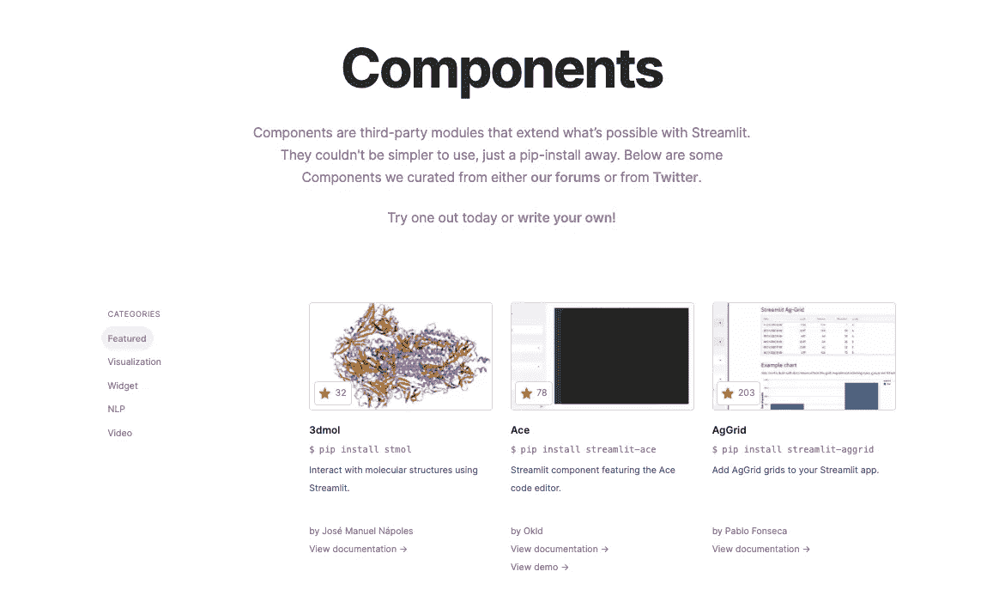

作者截图

➡️:这超出了本文的范围，但是如果你对构建自己的定制 Streamlit 组件感兴趣，你可以观看这两个视频教程，它们很好地解释了这个过程。

**第一部**

**第二部分**

现在让我们浏览一下列表。其中一些组件没有出现在官方文档中，但是您仍然可以尝试一下😉。

# 👉1-streamlit _ tags

> **Streamlit 的自定义标签/关键字组件**

*   **GitHub:**[https://github.com/gagan3012/streamlit-tags/](https://github.com/gagan3012/streamlit-tags/)

```
**pip install streamlit-tags**
```

Streamlit 本身不允许您输入单词列表，并在后端以 python 列表的形式检索这些数据。然而，有一个常见的解决方法:通过`st.text_input`或`st.text_area`获取用户输入，然后根据给定的分隔符解析它并获得一个列表。

但这似乎是不必要的工作。

**streamit_tags** 允许您直接从界面获取关键字，如下例所示。

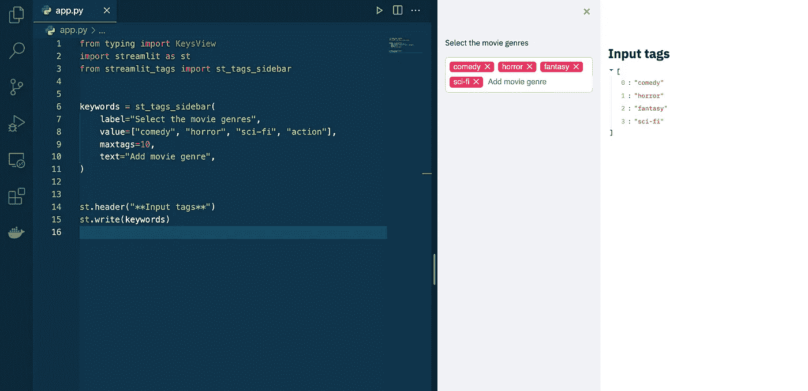

作者图片

## 什么时候需要使用 streamlit-tags？

每当您希望输入一列单词，并且不想执行不必要的容易出错的字符串解析时。

# 👉2 — **streamlit_aggrid**

> **Ag-Grid JS 库周围的 Streamlit 包装器**

GitHub:[https://github.com/PablocFonseca/streamlit-aggrid](https://github.com/PablocFonseca/streamlit-aggrid)

```
**pip install streamlit-aggrid**
```

**streamlit_aggrid** 是一个构建在[**AG Grid**](https://www.ag-grid.com/)**(一个高度可定制的 JavaScript 数据网格)之上的组件，它旨在**提高 streamlit 在显示数据帧和与它们交互方面的能力。****

**使用 streamlit_aggrid 非常简单，只需导入 aggrid 函数并将 dataframe 传递给它即可:**

```
**from st_aggrid import AgGrid****AgGrid(df)**
```

**以下是 AgGrid 的一些特性:**

*   ****可以对列进行排序、过滤和搜索:****

**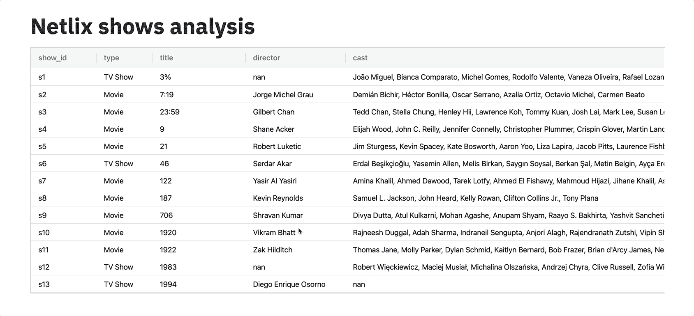**

**作者 GIF**

*   **你可以拖动列并改变它们的顺序:这在分析数据时很有用**

**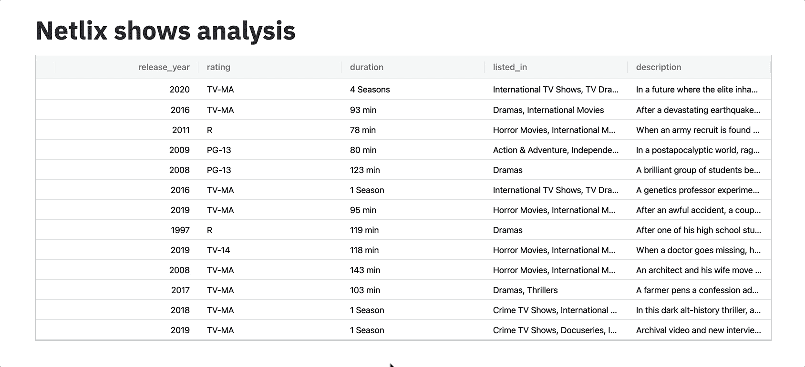**

**作者 GIF**

*   ****大型数据帧可以分页****

**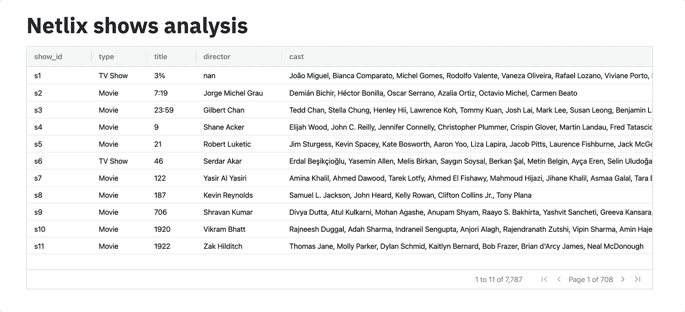**

**作者 GIF**

*   ****您可以直接从浏览器锁定列、对列进行分组并计算聚合****

**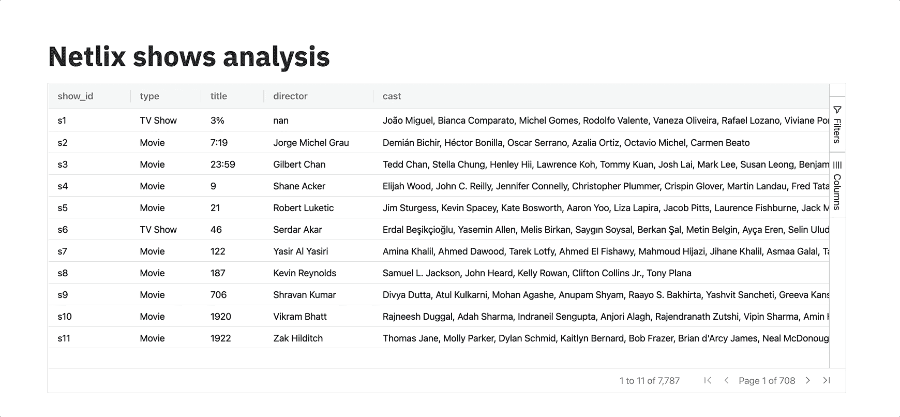**

**作者 GIF**

*   ****您可以让您的数据框架与其余的 Streamlit 小部件交互(例如通过选择一行)****

**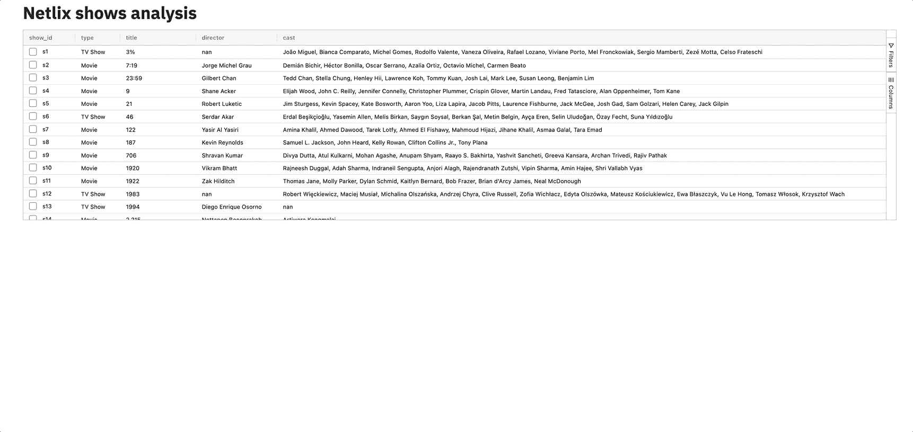**

**作者 GIF**

**这些 gif 是从我以前的一篇文章中截取的。如果你有兴趣了解更多关于 streamit_aggrid 的内容，可以去看看。**

**[](/7-reasons-why-you-should-use-the-streamlit-aggrid-component-2d9a2b6e32f0) [## 您应该使用 Streamlit AgGrid 组件的 7 个原因

### 用最好的 JavaScript 数据网格改进数据帧的显示

towardsdatascience.com](/7-reasons-why-you-should-use-the-streamlit-aggrid-component-2d9a2b6e32f0) 

## 什么时候需要使用 streamlit-aggrid？

除了样式和布局，我认为 streamlit_aggrid 最有趣的特性是使 dataframes 与 streamlit 应用程序的其他组件交互的能力。

# 👉3 — streamlit-echarts

> **用于渲染 ECharts 图的 Streamlit 组件。**

**Github:**https://github.com/andfanilo/streamlit-echarts

```
**pip install streamlit-echarts**
```

当您必须在 Streamlit 中进行数据可视化时，您可能使用过 Matplotlib、Bokeh 或 Plotly:这些是最受欢迎的选择。

我最近遇到的另一个选择是 [Echarts](https://echarts.apache.org/en/index.html) :一个令人惊叹的交互式图表和数据可视化库。它是用 JavaScript 编写的，由 Apache 基金会维护。

Echarts 提供强大的可视化功能和无限的定制。您可以使用它来绘制线条、条形图、饼图、散点图、地理热图、雷达图、有向图、树状图、桑基图、仪表图、平行图和许多其他疯狂的事情。

语法也很容易理解和适应。

如果你好奇，你可以在这里查看你能用电子海图做些什么。

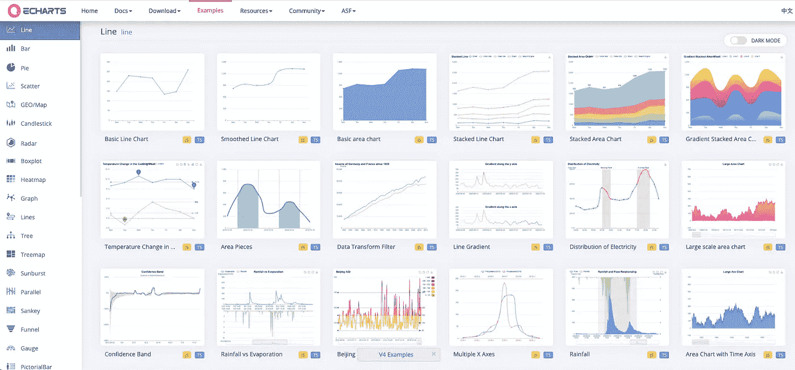

作者截图

**streamlit-echarts** 是将 echarts 图集成到 streamlit 应用程序中所需的组件。

我玩过这个组件，我必须说它很容易使用。让我给你看一个例子。

假设您想要嵌入一个标尺，如下所示(代码可用[此处](https://echarts.apache.org/examples/en/editor.html?c=gauge-simple)来自官方示例)

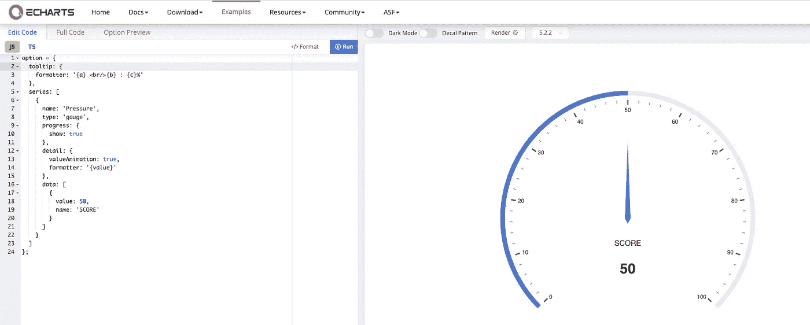

作者截图

您所要做的就是转换下面的 JSON 对象(从左窗格中):

JS 对象

到 Python 字典:

Python 字典

然后，你得把这本字典传给`st_echarts`

```
**from streamlit_echarts import st_echarts
st_echarts(options=options, width="100%", key=0)**
```

在 Streamlit 上的结果看起来相当不错。

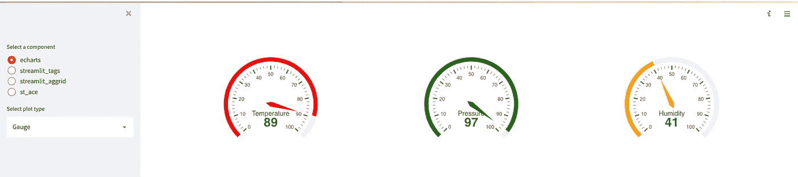

作者截图

## **您何时需要使用 streamlit-echarts？**

*   这是 Plotly 的一个非常好的替代方案——我个人更喜欢 Echarts 布局
*   如果你有一些 JS 知识，你可以建立非常复杂的情节和定制的布局

# 👉4 —简化熊猫档案

> **熊猫——在您的 Streamlit 应用程序中进行剖析——只需一行代码**

*   Github:[https://github.com/okld/streamlit-pandas-profiling](https://github.com/okld/streamlit-pandas-profiling)s

```
**pip install streamlit-pandas-profiling**
```

熊猫档案已经存在好几年了。这是一个 Python 库，允许你从你的 Pandas Dataframes 对象构建 HTML 报告。它非常有用，因为它自动化了我们重复执行的许多任务，以分析数据、计算统计指标、创建图表、发现相关性、异常或缺失数据。

在 Streamlit 中集成 pandas-profiling 实际上并不是一个坏主意。我发现自己多次在 Streamlit 中从头开始创建探索性数据分析(EDA)仪表板，这个组件可以节省大量时间。

这两个库之间的集成非常顺利，如下面的动画 GIF 所示:

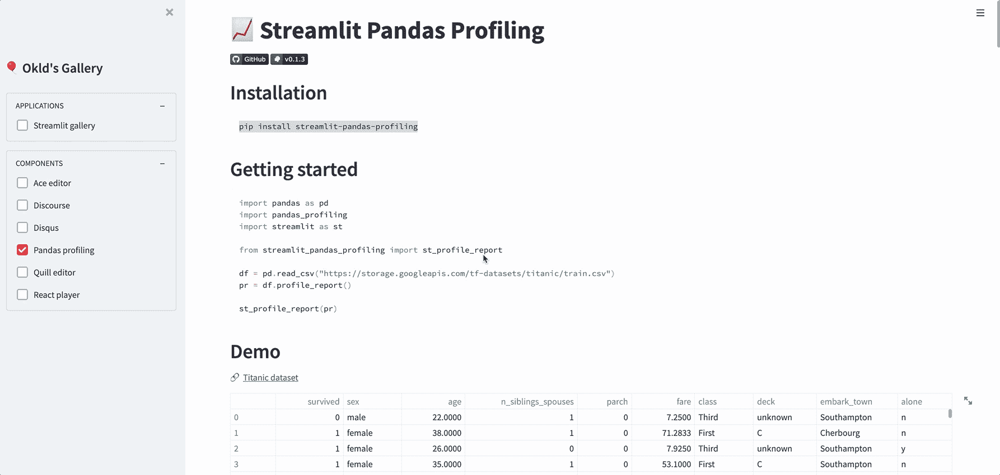

作者 GIF

## 什么时候需要使用**streamlit-pandas-profiling**？

如果你正在构建一个执行探索性数据分析的 Streamlit 应用程序，**Streamlit-pandas-profiling**是一个可以自动完成这项任务的组件，或者至少可以大大加快它的速度。

# 👉5-ST-注释文本

> **显示注释文本的 Streamlit 组件**

*   **Github:**https://github.com/tvst/st-annotated-text

```
**pip install st-annotated-text**
```

st-annotated-text 是一个有趣的组件，它允许您突出显示文本的特定部分，并为其添加标签和颜色。如果您从事自然语言处理任务，如命名实体识别(NER)或词性标注，这个包就派上用场了。

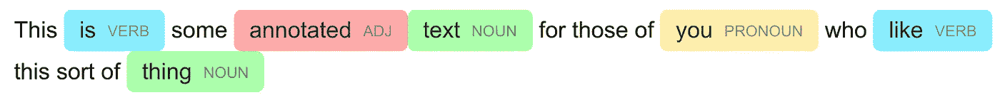

作者截图

## 什么时候需要使用 st 注释文本？

让我用一个例子来回答这个问题:下面是我过去制作的一个用于匿名个人数据的 Streamlit 应用程序的截图。当用户输入一些文本时，NER 模型会识别命名实体，如人员和位置。然后用特定的颜色和标签对这些实体进行注释，最后进行哈希处理以生成匿名文本。

**st-annotated-text** 通过注释每个实体提供了有用的视觉信息。

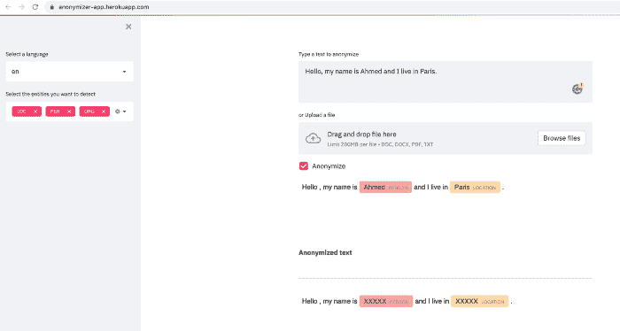

作者截图

如果你有兴趣了解这个应用程序的更多信息，你可以查看我的帖子:

[](/how-to-build-and-deploy-a-text-anonymizer-with-spacy-and-streamlit-70ed9607823) [## 如何使用 SpaCy 和 Streamlit 构建和部署文本匿名器

### NLP 使你符合 GDPR 的一个可能的方法

towardsdatascience.com](/how-to-build-and-deploy-a-text-anonymizer-with-spacy-and-streamlit-70ed9607823) 

# 资源

一如既往，这里有一个资源列表，您可以进一步了解有关 Streamlit 和 Streamlit 组件的更多信息。

*   官方文件:【https://streamlit.io/components 
*   [https://medium . com/ssense-tech/streamlit-tips-tricks-and-hacks-for-data-scientists-d 928414 e0c 16](https://medium.com/ssense-tech/streamlit-tips-tricks-and-hacks-for-data-scientists-d928414e0c16)
*   [https://towards data science . com/7-reasons-why-you-should-use-the-streamlit-aggrid-component-2d 9 a2 b 6 e 32 f 0](/7-reasons-why-you-should-use-the-streamlit-aggrid-component-2d9a2b6e32f0)
*   [https://towards data science . com/how-to-build-and-deploy-a-text-anonymizer-with-spacy-and-streamlit-70ed 9607823](/how-to-build-and-deploy-a-text-anonymizer-with-spacy-and-streamlit-70ed9607823)
*   [https://www.youtube.com/watch?v=BuD3gILJW-Q&ab _ channel = Streamli](https://www.youtube.com/watch?v=BuD3gILJW-Q&ab_channel=Streamlit)
*   [https://www.youtube.com/watch?v=QjccJl_7Jco&ab _ channel = Streamlit](https://www.youtube.com/watch?v=QjccJl_7Jco&ab_channel=Streamlit)

# 感谢阅读🙏

同样，如果您已经做到了这一步，我要感谢您的时间，并希望您发现这些 Streamlit 组件中至少有一个有用。

这就是我今天的全部内容。下次见！👋

# 新到中？您可以每月订阅 5 美元，并解锁无限的文章— [单击此处。](https://ahmedbesbes.medium.com/membership)


由 [Karsten Winegeart](https://unsplash.com/@karsten116?utm_source=medium&utm_medium=referral) 在 [Unsplash](https://unsplash.com?utm_source=medium&utm_medium=referral) 上拍摄**