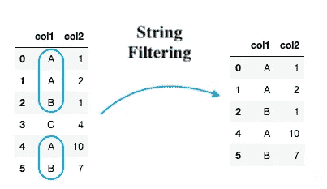
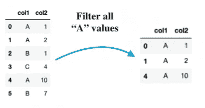

# 每个熊猫用户都应该知道的 5 种基于字符串的过滤方法

> 原文：<https://towardsdatascience.com/5-string-based-filtering-methods-every-pandas-user-should-know-48021938412e>

## 字符串列过滤指南。


安德烈亚斯·帕尔默在 [Unsplash](https://unsplash.com?utm_source=medium&utm_medium=referral) 上拍摄的照片

Pandas 中的过滤操作指的是选择某个特定列中的值符合特定条件的行的子集。

例如，考虑下图左侧的虚拟数据帧。如果您想选择`col1`中的值为`A`或`B`的所有行，过滤操作应该产生右侧的数据帧。



过滤 col1 上的数据帧(图片由作者提供)。

上述类型的过滤特指 Pandas 中的**基于字符串的过滤**。

在这篇文章中，我将分享一些作为 Pandas 用户应该知道的在字符串列上过滤数据帧的最流行的方法。文章的亮点如下:

[**如何识别一个字符串列？**](#671b)[**基于字符串的过滤方法:**](#0da8) **→**[**# 1 基于单个类别值的过滤**](#df99) **→**[**# 2 基于多个类别值的过滤**](#2b1b) **→**[**# 3 基于字符串长度的过滤【长度】**](#5999)

我们开始吧🚀！

# 如何识别字符串列？

在我继续使用 Pandas 中流行的方法来过滤字符串值数据之前，让我们先了解一下如何识别具有字符串数据类型的列。

在 Pandas 中，字符串列的数据类型表示为`object`。要确定数据类型，可以使用序列的`dtype`属性，如下所示:

这里，您应该注意，即使一个序列中的单个值是一个字符串，整个列也会被解释为字符串类型的列。例如，让我们将`col2`中的第一个值从`1`改为`“1"`。

这一次，`col2`的数据类型是`object`，而不是`int64`——描述的是字符串数据类型。

# 基于字符串的过滤方法

接下来，让我们继续理解可以用来在具有`object`数据类型的列上过滤数据帧的方法。

## 基于单个分类值的#1 过滤器

首先，假设您想要过滤字符串列中的值属于该列中的一个**单个**分类值的所有行。下图展示了这一点:



上述过滤在下面实现:

上面的方法过滤了所有`col1`中的值为`“A”`的行。

这也可以使用如下所示的`query()`方法实现:

**注意:**在字符串列上使用`query()`方法进行过滤时，应该用单引号将过滤值括起来，如上所示。

## 基于多个分类值的#2 过滤器

与上面的过滤类似，如果您想一次过滤多个值，可以通过三种方式。

*   使用逻辑运算符:

上述条件说明`col1`中的值应该是`“A”` **或** `“B”`。

*   第二种方法是使用`[isin()](https://pandas.pydata.org/docs/reference/api/pandas.DataFrame.isin.html)`方法，如下所示:

上面使用的`isin()`方法接受要过滤的值列表。

*   最后，我们可以使用如下所示的`query()`方法:

上面使用的`[isin()](https://pandas.pydata.org/docs/reference/api/pandas.DataFrame.isin.html)`方法接受一个过滤器值列表。另一方面，`[query()](https://pandas.pydata.org/docs/reference/api/pandas.DataFrame.query.html)`方法计算一个字符串表达式来过滤数据帧中的行。

## #3 基于字符串长度的过滤器

在这里，假设您想要从数据帧中过滤掉一列中字符串长度大于/小于阈值的所有行。

在一个序列上调用`[len()](https://pandas.pydata.org/docs/dev/reference/api/pandas.Series.str.len.html)`方法可以让您计算单个条目的长度，然后可以使用它根据一个阈值过滤行。

下面，我们从 col1 中过滤掉所有长度大于`4`的字符串。

在对`object`列执行一个方法之前，应该使用`str`属性将值作为字符串类型进行检索，这样就可以运行 python 中的一系列字符串方法，比如`strip()`、`isupper()`、`upper()`、`len()`等。

## #4 根据子字符串的存在进行过滤

接下来，假设您想要提取字符串列中的值包含特定子字符串的行。

有三种广泛使用的方法。

*   **匹配字符串的开头**

顾名思义，只有当子字符串匹配字符串值列的开头时，该方法才会返回一行。

假设您想要查找以子字符串“ *Jo* ”开头的所有字符串。我们将使用下面演示的`[startswith()](https://pandas.pydata.org/docs/dev/reference/api/pandas.Series.str.startswith.html)`方法。同样，回想一下前面的过滤方法(#3)，我们应该首先使用`str`属性将 object 列转换成一个字符串。

如果您的列有 NaN 值，您应该在`startswith()`方法中指定`nan=False`，否则，它将引发一个错误

错误块如下所示:

指定`nan=False`会忽略 NaN 值:

*   **匹配字符串的末尾**

字符串末尾匹配的语法类似于`startswith()`。这里，我们使用如下所示的`[endswith()](https://pandas.pydata.org/docs/dev/reference/api/pandas.Series.str.endswith.html)`方法:

> 注意:`startswith()`和`endswith()`都是区分大小写的方法。

*   **匹配字符串中的任意位置**

与分别只匹配字符串开头和结尾的子字符串的`startswith()`和`endswith()`方法相比，`[contains()](https://pandas.pydata.org/docs/dev/reference/api/pandas.Series.str.contains.html)`方法可以在字符串值列中的任何地方找到潜在的匹配。

默认情况下，contains()方法执行区分大小写的匹配。但是，它也可以通过传递如下所示的`case=False`参数来执行不区分大小写的匹配:

## #5 基于字符串中字符类型的过滤器

这种类型的过滤基于字符串中存在的字符类型，例如:

```
- Filter if all characters are upper-case   : [**isupper()**](https://pandas.pydata.org/docs/dev/reference/api/pandas.Series.str.isupper.html#pandas.Series.str.isupper)
- Filter if all characters are lower-case   : [**islower()**](https://pandas.pydata.org/docs/dev/reference/api/pandas.Series.str.islower.html#pandas.Series.str.islower)
- Filter if all characters are alphabetic   : [**isalpha()**](https://pandas.pydata.org/docs/dev/reference/api/pandas.Series.str.isalpha.html#pandas.Series.str.isalpha)
- Filter if all characters are numeric      : [**isnumeric()**](https://pandas.pydata.org/docs/dev/reference/api/pandas.Series.str.isnumeric.html#pandas.Series.str.isnumeric)
- Filter if all characters are digits       : [**isdigit()**](https://pandas.pydata.org/docs/dev/reference/api/pandas.Series.str.isdigit.html#pandas.Series.str.isdigit)
- Filter if all characters are decimal      : [**isdecimal()**](https://pandas.pydata.org/docs/dev/reference/api/pandas.Series.str.isdecimal.html#pandas.Series.str.isdecimal)
- Filter if all characters are whitespace   : [**isspace()**](https://pandas.pydata.org/docs/dev/reference/api/pandas.Series.str.isspace.html#pandas.Series.str.isspace)
- Filter if all characters are titlecase    : [**istitle()**](https://pandas.pydata.org/docs/dev/reference/api/pandas.Series.str.istitle.html#pandas.Series.str.istitle) **-** Filter if all characters are alphanumeric :[**isalnum()**](https://pandas.pydata.org/docs/dev/reference/api/pandas.Series.str.isalnum.html)
```

我在下面演示了其中的一些方法。

*   从数据帧中过滤字母数字字符串:

*   从数据帧中过滤数字字符串:

这就把我们带到了这篇文章的结尾。

总之，在这篇文章中，我们讨论了一些在熊猫中使用最广泛和必须知道的基于字符串的过滤方法。

基于字符串的过滤也可以使用 python 中的正则表达式(RegEx)来执行。由于时间关系，我没有在这篇文章中讨论它们，我将很快发布另一篇博客！

> *有兴趣在媒体上阅读更多这样的故事吗？？*

✉️ [**注册我的电子邮件列表**](https://medium.com/subscribe/@avi_chawla) 不要错过另一篇关于数据科学指南、技巧和提示、机器学习、SQL、Python 等的文章。Medium 会将我的下一篇文章直接发送到你的收件箱。

**感谢阅读！**