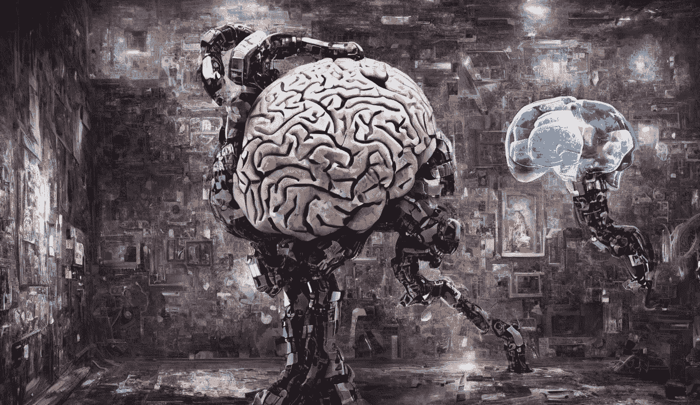
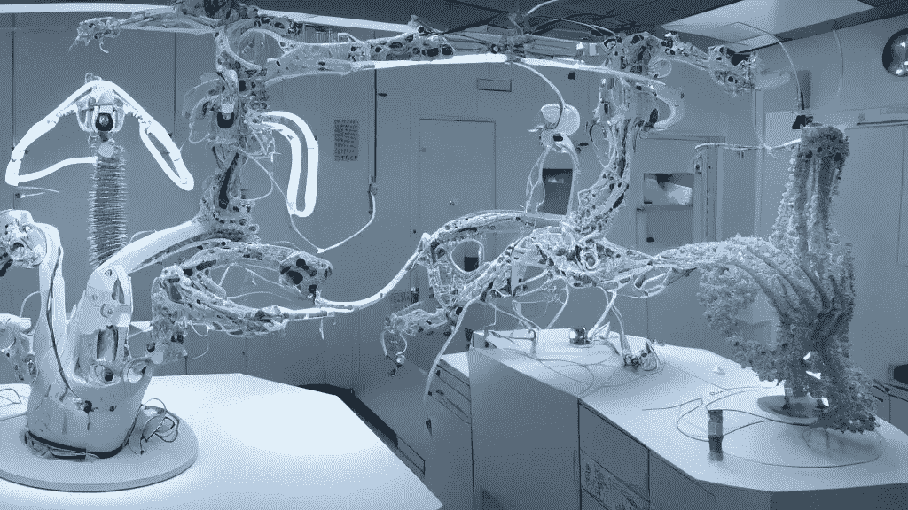

# 机器学习改变世界的 5 种令人惊讶的方式

> 原文：<https://towardsdatascience.com/5-surprising-ways-machine-learning-is-revolutionizing-the-world-d1a0b94b3736>

## 探索人工智能的前沿技术和应用，以及它们在改革行业和改善我们日常生活方面的潜力

稳定扩散生成的图像。

2022 年下半年充满了关于人工智能、机器学习和深度学习的惊喜和激动人心的时刻。像[稳定扩散](https://stability.ai/blog/stable-diffusion-public-release)和 [ChatGPT](https://stability.ai/blog/stable-diffusion-public-release) 这样的应用已经风靡全球，这是有充分理由的。它们是令人敬畏的科技产品。然而，在这个故事中，我们将获得该领域及其用例的更广阔的视角。

机器学习(ML)是一种人工智能，允许软件应用程序在没有专门编程的情况下提供答案。基本思想是，这些程序可以从数据中学习，识别模式，并在最少的人工干预下做出决定。这与传统编程形成对比，在传统编程中，程序员必须明确指定程序要遵循的所有规则。

深度学习是一种 ML，它使用具有多层处理单元的神经网络从大量数据中学习。它被称为“深度”学习，因为神经网络有许多层的处理单元，这与浅线性或非线性模型相反。深度学习已被证明对广泛的任务非常有效，如图像和语音识别、自然语言处理和机器翻译。它还被用于开发虚拟助手和其他应用程序，这些应用程序与用户的交互更加自然和直观。

机器学习起源于上世纪 50 年代。然而，直到 20 世纪 80 年代末和 90 年代初，这个领域才开始产生有希望的结果。另一方面，深度学习是机器学习中相对较新的领域。它产生于对人工神经网络的研究，该研究受到人类大脑结构和功能的启发。第一个成功的深度学习模型是在 20 世纪 80 年代开发的。尽管如此，直到 2010 年代初，该领域才开始获得牵引力，这主要是由于计算能力的进步和海量数据的可用性。

现在，我们已经了解了术语和历史，让我们看看正在改变世界的一些用例。

> [Learning Rate](https://www.dimpo.me/newsletter?utm_source=medium&utm_medium=article&utm_campaign=ml-revolution) 是为那些对 AI 和 MLOps 的世界感到好奇的人准备的时事通讯。你会在每个月的第一个星期六收到我关于最新人工智能新闻和文章的更新和想法。订阅[这里](https://www.dimpo.me/newsletter?utm_source=medium&utm_medium=article&utm_campaign=ml-revolution)！

## 卫生保健

机器学习正被用于开发新的疾病治疗方法，并提高诊断的准确性。例如，机器学习算法可以分析大量的医疗数据，以识别模式，并对不同治疗的有效性进行预测。

稳定扩散生成的图像

像 [AlphaFold](https://www.deepmind.com/research/highlighted-research/alphafold) 这样的应用程序可以准确预测蛋白质结构的 3D 模型，并加快生物学和药物发现几乎每个领域的研究。

此外，由 MosaicML 和斯坦福基础模型研究中心(CRFM)构建的大型语言模型 PubMed GPT 在[美国医学许可考试(USMLE)](https://www.usmle.org/) 的医学问答测试中取得了最先进的结果。这种特定领域的语言模型可以在不久的将来支持生物医学研究。

## 农业

机器学习正在通过提高作物产量和农业运营效率来改变我们生产食物的方式。例如，机器学习算法可以分析农场设备上传感器的数据，以优化灌溉和施肥。

根据 Markets&Markets 的数据，未来几年，农业人工智能等高端技术解决方案的支出将继续增长，并将在 2026 年达到 40 亿美元的历史新高。

一个具体的现实世界的用途是使用机器学习通过分析植物的图像来识别作物中的病虫害。这可以帮助农民及时采取措施防止作物损失。联合国与普华永道合作正是为了做到这一点，评估亚洲的椰枣果园潜在的虫害(更多细节见[此处](https://www.fao.org/3/I8494EN/i8494en.pdf))。

另一方面，你现在可以结合机器学习技术来训练模型，以分析 3D 地图，社会状况数据和基于无人机的土壤颜色数据。在我们开始播种之前，这些模型可以给你某块田的潜在产出率。你可以在这里找到更多关于这个项目的细节。

## 零售

推荐系统在零售和娱乐领域无处不在。他们的目标是改善和个性化客户体验，增加销售额。这可以通过向用户呈现更可能与他们的兴趣相关的项目来帮助提高用户参与度和满意度。

推荐系统被用于各种领域，但是最常见的是作为视频和音乐服务的播放列表生成器、在线商店的产品推荐器或者社交媒体平台的内容推荐器。

零售业中最突出的例子是亚马逊在线商店中部署的推荐系统。亚马逊可以使用算法来分析你的购物行为，并推荐符合你需求的产品。

人工智能在零售业的另一种应用方式是提高库存管理的准确性。零售商现在可以应对客户需求和季节性，而不必订购超过他们需求的商品。

## 运输

机器学习正被用于提高运输系统的安全性和效率。例如，机器学习算法可以分析自动驾驶汽车的数据，使其更加安全可靠。无人驾驶汽车还没有出现，但它们一定会在未来几年彻底改变交通领域。

稳定扩散生成的图像

此外，像优步和 Lyft 这样的公司使用机器学习算法来预测特定时间特定区域的乘车需求，并更有效地将乘客与可用司机进行匹配。他们还通过考虑交通、天气和需求等因素，使用机器学习来提高定价算法的准确性。

## 金融

ML 在金融中最突出的应用是欺诈检测。例如，机器学习算法可以分析交易数据，以识别可疑活动，并实时防止欺诈。这可以帮助金融机构防止财务损失并保护其客户的账户。每个银行或金融机构都在生产这样的系统。您可能在上次出国旅行中遇到过他们，当时您的付款没有得到处理。

ML 在金融中的另一个应用是信用风险评估。ML 模型可用于根据信用评分、收入和债务收入比等因素预测借款人拖欠贷款的可能性。这可以帮助贷方做出更明智的贷款决策，更好地管理风险。像这样的模式已经在影响我们的生活，其中一些模式并没有以最不偏不倚的方式进行。

# 结论

机器学习是一种人工智能，允许软件应用程序从数据中学习并提高性能，而无需专门编程。它被广泛用于各种行业，包括金融、医疗保健和交通运输。

机器学习的使用正在彻底改变这些行业，使它们能够更有效地运营，并为客户提供更好的服务。

# 关于作者

我叫[迪米特里斯·波罗普洛斯](https://www.dimpo.me/?utm_source=medium&utm_medium=article&utm_campaign=ml-revolution)，我是一名为[阿里克托](https://www.arrikto.com/)工作的机器学习工程师。我曾为欧洲委员会、欧盟统计局、国际货币基金组织、欧洲央行、经合组织和宜家等主要客户设计和实施过人工智能和软件解决方案。

如果你有兴趣阅读更多关于机器学习、深度学习、数据科学和数据运算的帖子，请关注我的 [Medium](https://towardsdatascience.com/medium.com/@dpoulopoulos/follow) 、 [LinkedIn](https://www.linkedin.com/in/dpoulopoulos/) 或 Twitter 上的 [@james2pl](https://twitter.com/james2pl) 。

所表达的观点仅代表我个人，并不代表我的雇主的观点或意见。