# Python 中星号的 5 个语法应用，最后一个令人惊讶

> 原文：<https://towardsdatascience.com/5-syntactic-applications-of-asterisks-in-python-the-last-one-is-surprising-41cbd9957216>


形象由 [pasja1000](https://pixabay.com/users/pasja1000-6355831/?utm_source=link-attribution&utm_medium=referral&utm_campaign=image&utm_content=2951136) 来自[皮克斯拜](https://pixabay.com/?utm_source=link-attribution&utm_medium=referral&utm_campaign=image&utm_content=2951136)

## 星号*为 Python 贡献了大量的语法糖

许多编程语言在许多场景中使用星号“*”，Python 也是如此。例如，在其他编程语言中，星号最常见的用途之一可能是内存指针。这个概念存在于许多流行的语言中，比如 C++和 Objective-C。

不过，Python 并不使用内存指针。相反，有更多的情况下，让我们做更多的技巧使用星号。这可以在可靠性方面改进我们的代码，甚至带来一些新的特性。这就是所谓的“语法糖”。在本文中，我将列出 5 个强调技巧。希望他们能帮上忙。

# 1.经营者


形象由 [NOST](https://pixabay.com/users/nost-3003393/?utm_source=link-attribution&utm_medium=referral&utm_campaign=image&utm_content=1555218) 从[皮克斯拜](https://pixabay.com/?utm_source=link-attribution&utm_medium=referral&utm_campaign=image&utm_content=1555218)

嗯，我打赌每个人都知道这一点。然而，为了确保关于 Python 中星号的这一总结的完整性，请允许我在这里介绍它。

将星号用作乘运算符可能存在于所有编程语言中。

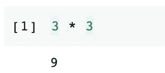

除此之外，Python 还引入了另一个操作符，即电力操作符。`a ** b`将计算数字 a 的 b 的幂。在其他一些编程语言中，它可能是`a ^ b`。

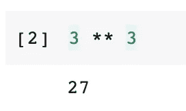

# 2.传递可变长度参数


图像由 [995645](https://pixabay.com/users/995645-995645/?utm_source=link-attribution&utm_medium=referral&utm_campaign=image&utm_content=3859795) 来自 [Pixabay](https://pixabay.com/?utm_source=link-attribution&utm_medium=referral&utm_campaign=image&utm_content=3859795)

这可能是星号最“皮托尼”的用法。在 Python 中，我们可以编写一个允许可变长度参数的函数。

例如，我们可以编写这样一个函数，将传入的所有数字相加。为了允许参数可变长度，我们需要在参数名称前添加一个星号。

```
def sum_all(*numbers):
    print('numbers:', numbers)
    return sum(numbers)sum_all(1, 2, 3, 4, 5)
```

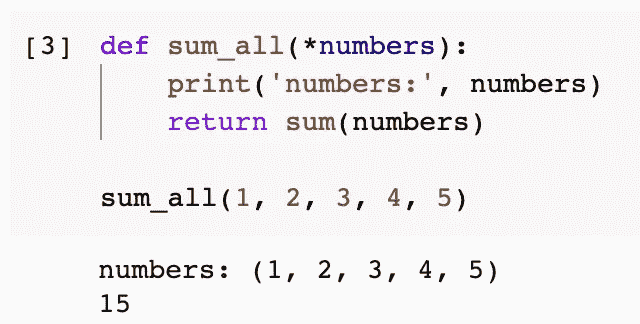

请注意，如果参数是数字，我没有检查它们的类型。该函数仅用于演示目的。

Python 还允许传递可变长度的键值对作为参数。我们只需要在参数名前面加上两个星号，如下所示。

```
def give_me_dict(**my_dict):
    return my_dictgive_me_dict(name='Chris', age=33, gender='Male')
```

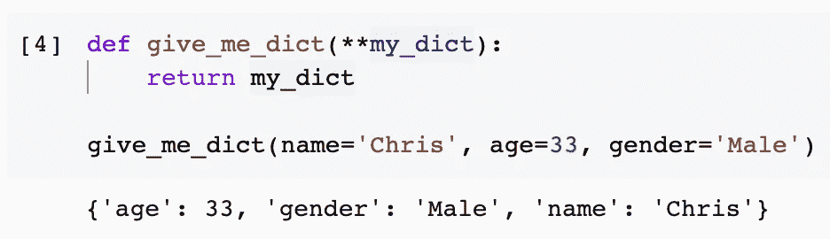

这两个特性为开发人员在编程过程中提供了很大的灵活性。如果您想了解更多关于 Python 中变长参数的知识，我为这个主题写了另一篇文章供您查阅。

</four-types-of-parameters-and-two-types-of-arguments-in-python-357ccfdea3db>  

# 3.拆箱清单和字典


图片来自[皮克斯拜](https://pixabay.com/?utm_source=link-attribution&utm_medium=referral&utm_campaign=image&utm_content=1931180)

当我们想对一个列表或一个字典的所有条目做一些事情时，我们通常需要使用 for 循环来迭代它们。但是，在某些情况下，我们可能不必这样做。

## 3.1 开箱清单

假设我们有一个如下的名字列表。现在我们要打印所有的名字。

```
student_list = ['Alice', 'Bob', 'Chris']
```

我们可以使用订阅来逐个获取它们，或者更聪明一点，使用 for 循环。

```
print(student_list[0], student_list[1], student_list[2])# Orfor name in student_list:
    print(name)
```

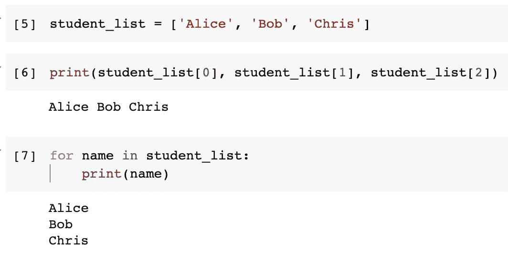

还有一种更聪明的方法，那就是使用星号来解包列表。

```
print(*student_list)
```

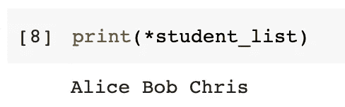

我们甚至可以一次打开多个列表。

```
print(*['Alice', 'Bob'], *['Chris'], 'David')
```

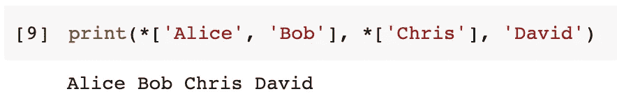

为了将多个列表与一些松散的项目组合在一起，我们还可以使用星号来解包列表。

```
[*['Alice', 'Bob'], *['Chris'], 'David']
```

当我们想要将多个列表放入一个元组或集合中时，也可以使用这个技巧。

```
(*['Alice', 'Bob'], *['Chris'], 'David')
{*['Alice', 'Bob', 'Chris'], *['Chris'], 'David', 'Chris'}
```

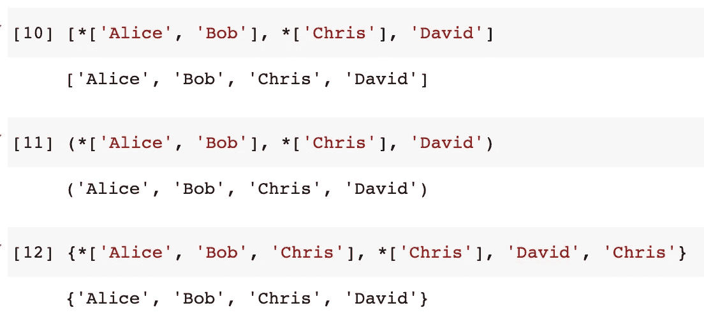

现在，让我们考虑一个更高级的用例。我们得到了一个如下的二维列表。每个子列表有两个项目，一个名字和一个年龄。它不容易使用，所以我们想转置二维列表，这样一个列表有所有的名字，另一个有所有的年龄。

```
my_list = [
    ['Alice', 31],
    ['Bob', 32],
    ['Chris', 33]
]
```

最简单的方法是在一个`zip()`函数中解包列表。

```
for i in zip(*my_list):
    print(list(i))
```


这相当于这样做。

```
for i in zip(['Alice', 31], ['Bob', 32], ['Chris', 33]):
    print(i)
```

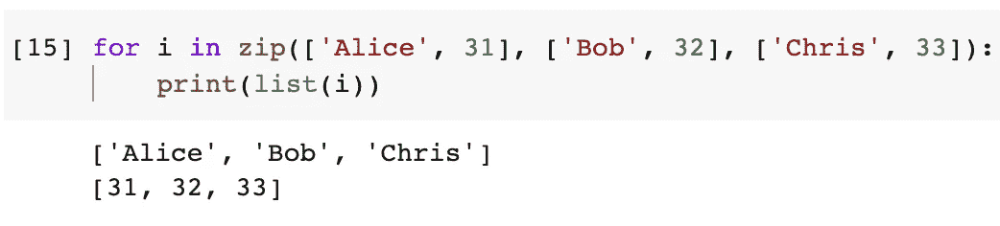

如果我们仍然想要一个二维列表，我们可以使用列表理解将两个子列表放入一个父列表中。

```
[list(i) for i in zip(*my_list)]
```

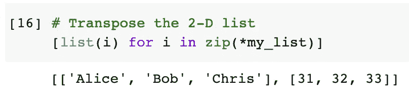

如果您不太熟悉`zip()`函数，请查看我以前的一篇深入研究这个函数的文章。

</fasten-python-objects-using-zip-88a1e7a68c7>  

## 3.2 打开字典包装

从 Python 3.5 开始，星号也可以解包字典，但是我们需要在字典变量前面加两个星号来解包它。

最常见的用法之一是将多个字典组合在一起。假设我们有如下两个字典要合并，我们可以把它们拆开，放入另一个空字典中。

```
my_dict1 = {
    'name': 'Chris',
    'age': 33
}my_dict2 = {
    'skill': 'Python'
}my_dict = {**my_dict1, **my_dict2}
```


另一个示例使用模式是格式字符串。虽然我喜欢 Python 中的 f-string 语法，但是格式字符串还是有一些优势的。例如，它允许带参数名的参数化字符串。

```
"My name is {name}. I'm {age} years old and I can use {skill}".format(
    name='Chris',
    age=33,
    skill='Python'
)
```

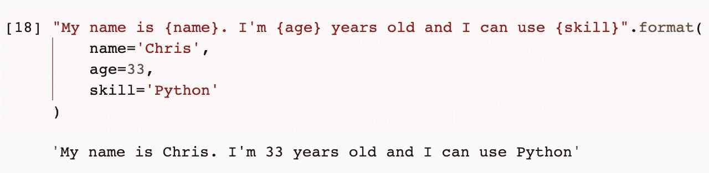

在这种情况下，我们可以解包前面的字典，并将其放入格式字符串中以传递参数。

```
"My name is {name}. I'm {age} years old and I can use {skill}".format(**my_dict)
```

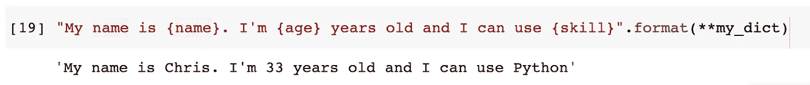

这非常整洁干净。此外，我们甚至可以将多本字典解包到其中。

```
"My name is {name}. I'm {age} years old and I can use {skill}".format(**my_dict1, **my_dict2)
```

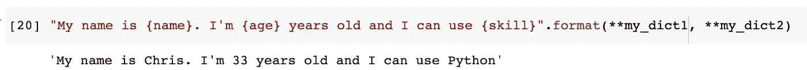

## 3.3 拆包范围

使用星号进行解包的一个不太常见的用法是用于 Python 范围。我们通常使用`range()`来告诉一个 for 循环需要循环多少次。我们还可以用它来生成一系列序列号，如下所示。

```
list(range(10))
```

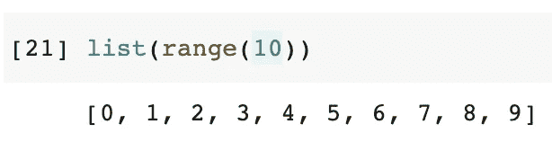

从语法上来说，我们也可以使用星号来解包 range 对象，尽管我认为在这种情况下没有任何好处。

```
[*range(10)]
```

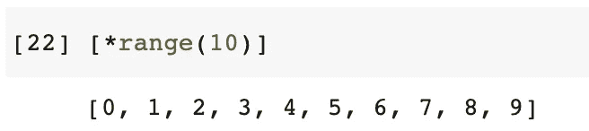

# 4.打包清单


图片由[克斯丁·里默尔](https://pixabay.com/users/kriemer-932379/?utm_source=link-attribution&utm_medium=referral&utm_campaign=image&utm_content=1619751)从[皮克斯拜](https://pixabay.com/?utm_source=link-attribution&utm_medium=referral&utm_campaign=image&utm_content=1619751)拍摄

是的，我们不仅可以用星号打开列表，还可以在某些情况下打包项目。例如，我们可以使用下面的语法来使用 3 个变量分别从一个列表中获取 3 个项目。

```
students = ['Alice', 'Bob', 'Chris']my_classmate1, my_classmate2, me = students
```

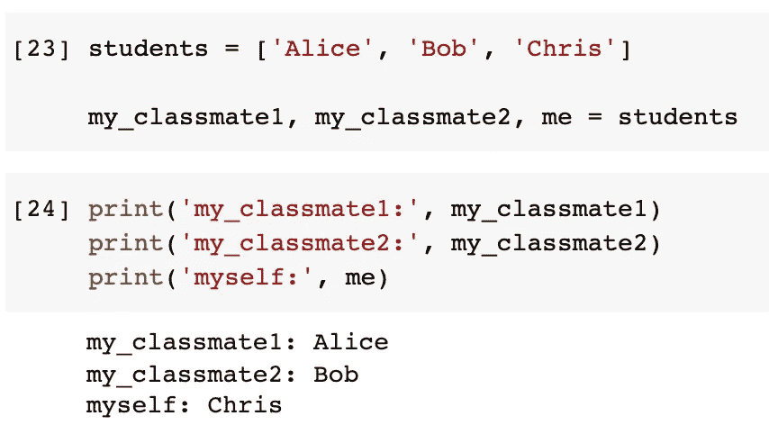

假设在上面的例子中，谁是我的同学并不重要，我们只希望我的名字在最后，所有其他的名字应该留在一个列表中。在这种情况下，我们可以使用星号将所有其他项目打包。

```
students = ['Alice', 'Bob', 'Chris']
*other_students, me = students
```

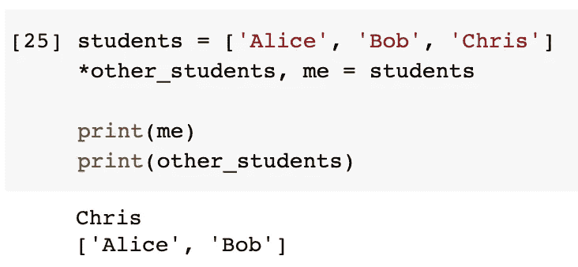

您可能知道该语法也适用于元组。但是，需要注意的是，使用星号来打包项目总是会返回一个列表。换句话说，尽管原始对象是一个元组，但它不能足够智能地返回一个元组

```
students = ('Alice', 'Bob', 'Chris')
*other_students, me = studentsprint(me)
print(other_students)
```

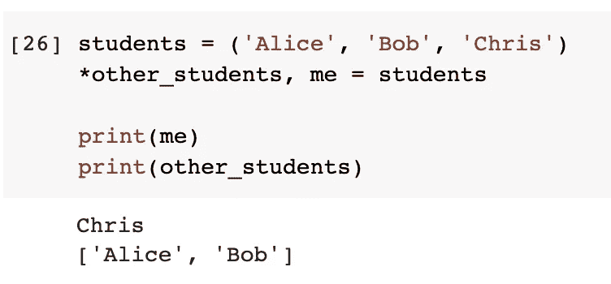

使用这个技巧，我们也可以把一个字符串当作一个字符列表，并把一些特殊的字符和其他字符打包在一起。

```
product_code = 'A320'
class_indicator, *model = product_codeprint('Class indicator: ', class_indicator)
print('Model:', ''.join(model))
```

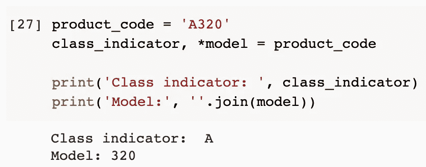

这也是为了演示的目的，因为我确信使用切片更容易，可读性更好。

```
print('Class indicator: ', product_code[0])
print('Model:', product_code[1:])
```

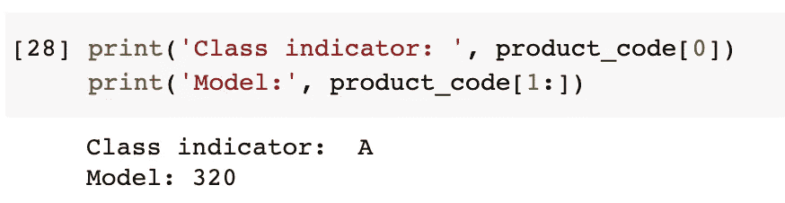

# 5.强制关键字参数


图片来自 [Pixabay](https://pixabay.com/?utm_source=link-attribution&utm_medium=referral&utm_campaign=image&utm_content=2041816) 的 [Wokandapix](https://pixabay.com/users/wokandapix-614097/?utm_source=link-attribution&utm_medium=referral&utm_campaign=image&utm_content=2041816)

我不会相信这是一个频繁的用法，因为这个需求并不常见。不过，知道 Python 有这样一个特性还是不错的。也就是说，我们可以在函数的参数列表中放一个星号，强制右边的所有参数都必须用显式关键字传入。

例如，我们可以如下定义一个函数。

```
def my_func(arg1, *, arg2):
    print(arg1)
    print(arg2)
```

现在，如果我们试图传递两个参数，将会抛出错误。

```
my_func('a', 'b')
```

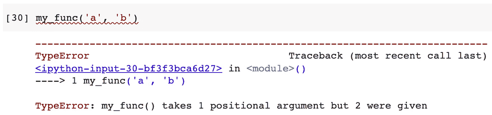

要使用这个函数，我们必须显式地指定参数`arg2`的键，因为它在星号的右边。

```
my_func('a', arg2='b')
```

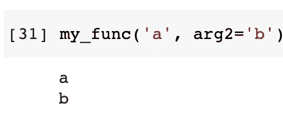

# 摘要


图片由 [jplenio](https://pixabay.com/users/jplenio-7645255/?utm_source=link-attribution&utm_medium=referral&utm_campaign=image&utm_content=3605547) 来自 [Pixabay](https://pixabay.com/?utm_source=link-attribution&utm_medium=referral&utm_campaign=image&utm_content=3605547)

在本文中，我总结了 Python 中星号的所有 5 种不同的使用模式。它可以是用于传递可变长度参数的运算符或指示符。它还可以打开列表、字典或范围对象，以及将它们打包。

<https://medium.com/@qiuyujx/membership>  

如果你觉得我的文章有帮助，请考虑加入 Medium 会员来支持我和其他成千上万的作者！(点击上面的链接)