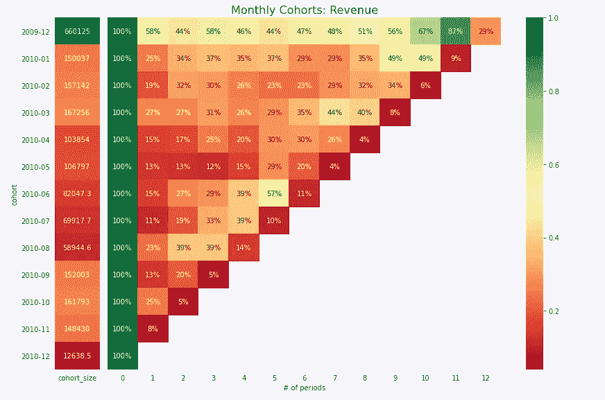

# 2021 年，作为一名数据科学家，我实际做了 5 件事

> 原文：<https://towardsdatascience.com/5-things-that-i-actually-did-at-work-as-a-data-scientist-in-2021-e46d3a0d6dab>

## 对数据科学家实际工作的一瞥

约书亚·厄尔在 [Unsplash](https://unsplash.com/s/photos/thinking?utm_source=unsplash&utm_medium=referral&utm_content=creditCopyText) 上的照片

# 介绍

我经常被问到的一个问题是“你在工作中到底做些什么？”这是一个很好的问题。你在网上看到的数据科学项目和 Kaggle 笔记本代表了与数据科学家在工作中所做的(或我在工作中所做的大部分)不同的现实。

所以，我想和你们分享 2021 年我在工作中做的 5 件事。让我们开始吧！

> **请务必点击** [**订阅此处**](https://terenceshin.medium.com/membership) **千万不要错过另一篇关于数据科学指南、技巧和提示、生活经验等的文章！**

# 1)群组分析

作者创建的图像

## 什么是队列分析？

群组分析**包括构建群组图表，如上图所示。**队列图**是行为分析中常用的数据可视化的数据。**

群组图表的结构通常如下:

*   每一行代表不同的群组或不同的用户群。在上图中，您可以想象每一行都代表按首次注册日期划分的用户。
*   列表示周期，无论是日、月还是年。
*   这些值表示感兴趣的指标如何随着时间的推移而发展。

## 它在商业环境中有什么用？

当您想要了解一个指标如何随着时间的推移而发展时，群组分析非常有用，换句话说，如果一个指标需要时间来成熟，那么它应该在业务功能中进行考察。

让我举一个例子来说明这在什么时候有用。考虑指标**每个客户的平均订单数(AOPC)。**直觉上，老顾客的 AOPC 会比新顾客高，因为他们会有更多的时间来下更多的订单。这就很难比较新客户和老客户的 AOPC。

但是，通过进行群组分析，您可以了解 AOPC 在一段时间内的演变情况，从而可以比较新老客户在给定时间内的 AOPC。

*要了解如何用 SQL 或 Python 构建群组图表，请查看我的指南:*

</a-complete-guide-to-revenue-cohort-analysis-in-sql-and-python-9eeecd4c731a>  

> **请务必点击** [**订阅此处**](https://terenceshin.medium.com/membership) **千万不要错过另一篇关于数据科学指南、技巧和提示、生活经验等的文章！**

# 2)数据管道开发

## 什么是数据管道开发？

数据管道开发包括设计和构建系统(管道),该系统将原始数据输入清理并转换为所需的输出。

有很多方法可以做到这一点，也有很多技术可以使用，但是在我的例子中，这涉及到编写和调度关于 Airflow 的高效查询，并将输出推送到几个 BigQuery 表。

## 它在商业环境中有什么用？

大多数时候，公司原始数据的格式对于分析或建模来说并不理想。例如，您可能有一个包含所有用户进行的每一笔交易的表，或者一个包含每个用户在您的应用程序中进行的每一次接触的表。这是一个巨大的数据量，需要整合到全面的聚合中。

总体而言，强劲的渠道发展带来了:

1.  更快的临时分析周转
2.  进行更复杂分析和构建更强大模型的能力
3.  最后(也是最重要的)，为技术含量较低的用户实现数据民主化。

# 3)倾向建模

由作者创建

## 什么是倾向建模？

倾向建模回答了“某人基于 x、y 和 z 做某事的可能性有多大？”在我的案例中，我建立了一个倾向模型来回答这个问题，“每个用户根据他们的注册信息和营销接触点成为活跃用户的可能性有多大？”

## 它在商业环境中有什么用？

倾向建模是有用的，因为它允许你分配一个概率，用户将在未来做某事，无论是采用一个新产品，订阅一个新的订阅，等等。

通过准确地给用户分配分数，您可以做两件事:

1.  你可以预测用户未来可能会做什么，并制定独特的定位策略。
2.  您还可以了解促使用户更愿意(或更不愿意)做某事的特征和变量。

总的来说，在我看来，倾向建模是机器学习非常有效的最适用的商业案例之一。

# 4)解释性建模

## 什么是解释性建模？

解释性建模包括对特征变量和目标变量进行建模，目的是更好地理解变量之间的关系。这可以通过使用 f 检验和 t 检验的线性回归方法来完成，或者通过对 ML 模型使用 SHAP 技术来完成

## 它在商业环境中有什么用？

虽然解释性建模没有解释因果关系，但它是更好地理解不同变量之间关联的一种非常有效的方式。例如，通过解释性建模，我能够推断出应用程序活动是倾向建模的最强预测因素之一。

同样，在你想要比关联更强的理解的情况下，解释性建模的结果可以激发实验的想法，关联是特定变量之间的**因果关系**。

> **请务必点击** [**订阅此处**](https://terenceshin.medium.com/membership) **千万不要错过另一篇关于数据科学指南、技巧和提示、生活经验等的文章！**

# 5)终身价值(LTV)建模

## 什么是 LTV 建模？

LTV，或终身价值，代表了从客户第一次成为客户到客户流失期间，你期望从客户那里获得的总净利润。这是客户的 ARPU、任期和流失的结合。

## 它在商业环境中有什么用？

作为一家更加关注盈利能力的公司，LTV 至关重要。有了 LTV 模型，你可以从价值(利润)的角度进行分析。这意味着您可以查看具有较高 LTV 的产品或细分市场。您甚至可以进行解释性建模，以识别指示高利润用户的变量/特征/属性。

# 感谢阅读！

> ***一定要*** [***订阅此处***](https://terenceshin.medium.com/membership) ***千万不要错过另一篇关于数据科学的指南、诀窍和技巧、生活经验等文章！***

不确定接下来要读什么？我为你选了另一篇文章:

</all-machine-learning-algorithms-you-should-know-in-2022-db5b4ccdf32f>  

**还有一个:**

</the-10-best-data-visualizations-of-2021-fec4c5cf6cdb>  

# -特伦斯·申

*   ***如果你喜欢这个，*** [***订阅我的媒介***](https://terenceshin.medium.com/membership) ***获取独家内容！***
*   ***同样，你也可以*** [***关注我上媒***](https://medium.com/@terenceshin)
*   [***报名我的个人简讯***](https://terenceshin.substack.com/embed)
*   ***跟我上***[***LinkedIn***](https://www.linkedin.com/in/terenceshin/)***其他内容***