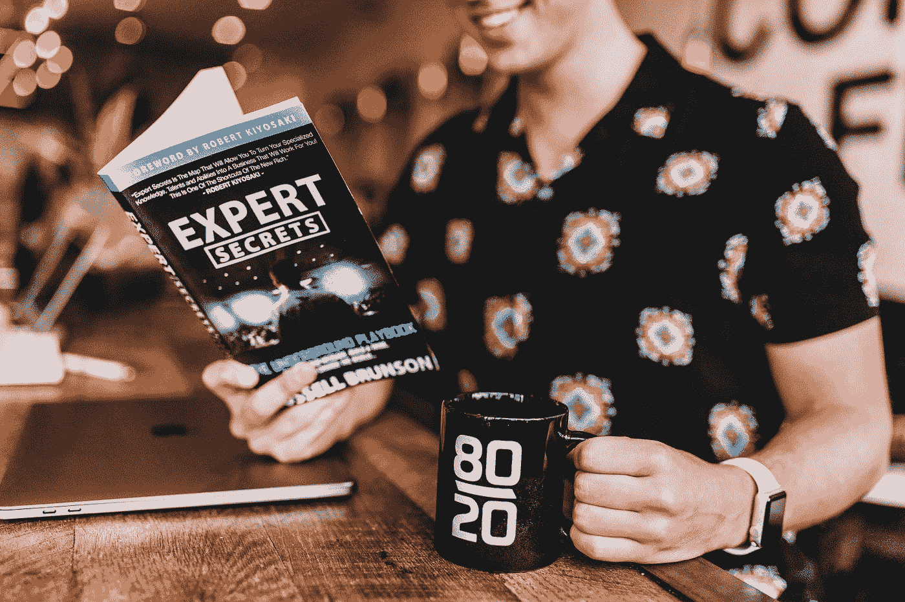
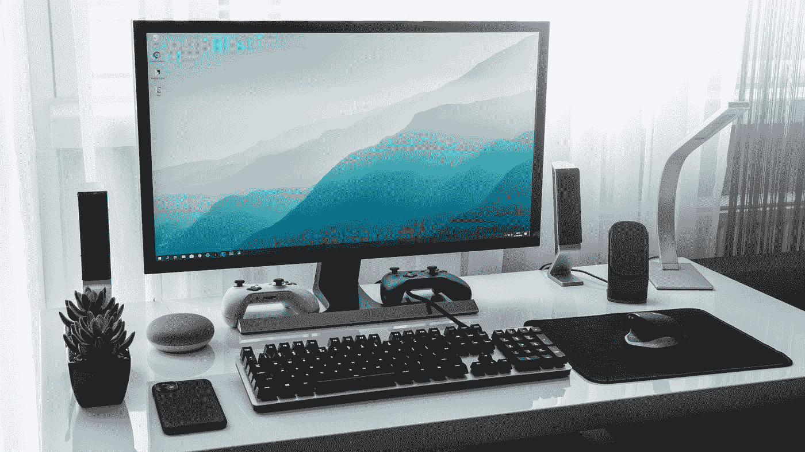

# 在参加数据科学训练营之前，你应该知道的 5 件事

> 原文：<https://towardsdatascience.com/5-things-you-should-know-before-you-embark-on-a-data-science-bootcamp-74d08a614904>

# 在参加数据科学训练营之前，你应该知道的 5 件事

## 适用于任何试图学习数据科学的人或任何人的见解

格伦·卡斯滕斯-彼得斯在 [Unsplash](https://unsplash.com?utm_source=medium&utm_medium=referral) 上拍摄的照片

去年，我有幸在新加坡校区完成了大会的数据科学沉浸式课程。作为我职业转型的一部分(从城市农业开始)，我从今年的第一周开始学习 Python，并以数据科学沉浸式毕业结束了这一年。我从来没有想到，一个朋友提出的简单建议“学习 Python”并看看接下来会发生什么会发展成为一项成熟的努力，但事实确实如此。在本文中，我将概述我认为对我的数据科学之旅至关重要的关键原则。

# **1。找出你的误差范围**

[阿莱士·麦卡锡](https://unsplash.com/@4lexmccarthy?utm_source=medium&utm_medium=referral)在 [Unsplash](https://unsplash.com?utm_source=medium&utm_medium=referral) 上拍照

乍一看，这似乎有点奇怪。误差幅度？嗯，我具体指的是你说你能实现的和你实际能实现的之间的差距。有时候，我们高估了它，有时候，我们恰恰相反。以数据为中心，我们应该依靠实际的可验证的观察。你能帮助自己的一件事是:

> 压力测试。

为了检查我是否真的对主题材料感兴趣，而不仅仅是对它的想法感兴趣，我参加了几个关于数据科学的 Udemy 课程，同时试图按照类似于训练营期间经历的日常时间表。我记录了时间的使用情况以及我是如何遵循(或不遵循时间表)的。最终，我学到了足够多的东西，能够用 Python 制作我的第一个迷你数据科学项目，这告诉了我足够多的东西。随后，我也能够用完整的 Python 代码完成训练营的招生面试任务。

在整个课程中，我经常能够测试我对各种任务的时间估计，其中值得注意的是主要的双周项目。

> 每次项目演示前一天晚上你上床睡觉的时间可能是最能说明问题的指标之一。

请注意，如果你从未亲自尝试过做一件特定的任务，不要以为有充足的时间。拥有特定代码集的文档并不表示该代码实际上能够在您的机器上运行。甚至像数据争论这样表面上“简单”的任务也可能成为主要的障碍。

你与自己设定的契约可能是你所拥有的最强大的力量。找出你的误差范围会让你更加信任自己，而这种信任是最重要的。退休的美国将军兼国防部长詹姆斯·马蒂斯在他的回忆录*中写道:*

> **行动以信任的速度发生。**

就他而言，他谈论的是部门间的合作。然而在我看来，这也适用于自信。如果没有执行任务的信心，一个人很可能会受到阻碍。具有讽刺意味的是，你需要知道你的误差幅度才能执行得好，**但是**你需要首先执行才能知道你的误差幅度。因此，关键是要有最初的执行勇气，避免任何分析麻痹或完美主义。引用另一位美国将军乔治·S·巴顿的话:

> **现在猛烈执行的好计划胜过下周执行的完美计划。**

那么，现在哪里有信心执行这个计划呢？正如拉尔夫·沃尔多·爱默生所说:

> **做这件事，你就会拥有力量**。

上面的整个演讲不是关于做出鲁莽的决定，而是看:我从象棋中学到的一个教训是 ***你看不到某些东西，除非你做出某些动作*** 。这里的关键是，你要做出明智的、有计划的举动，让你能够学习(而不是在这个过程中被彻底消灭)。

响应式执行还有其他好处。例如，我没有陷入普遍的心理陷阱，决定课后彻底研究主题材料(以弥补注意力的任何下降)，而是尽最大努力在课堂上集中注意力，直接吸收材料。的确，课后大部分时间都被项目和其他冲突占据了。我在大会上的教练曾经引用迈克·泰森的话:“每个人都有一个计划，直到他们被打脸。”

如果你喜欢军事题材，你也可以选择**‘没有计划能在与敌人的第一次接触中存活下来。’**这要归功于普鲁士陆军元帅赫尔穆特·冯·毛奇。一个人可以在训练营中经历一些事情，比如亲戚住院，或者分手(这些都是真实的故事)。面对所有这些事件，当你达到极限时，知道自己的误差会给你信心。经历这些事件会给你更多的信息来计算你未来的误差幅度。如果你积极地观察和学习，这将是一个净正循环。

# 2.一次做一件事

照片由 [Devin Avery](https://unsplash.com/@devintavery?utm_source=medium&utm_medium=referral) 在 [Unsplash](https://unsplash.com?utm_source=medium&utm_medium=referral) 上拍摄

你不可能一下子学会所有的东西。

那里。我说了。

你会陷入极度恐慌。你会双手抱头，怀疑自己。你将走向数据科学/KDNuggets，被大量文章轰炸，想要阅读**一切**。也许，你可能会在文章中找到学习数据科学的路线图，并意识到你有多少不知道的。否则，你会在 LinkedIn 上，被从#datascience 标签中涌出的大量资源淹没。你会看着 Coursera/Udemy 上的所有课程，告诉自己你必须完成吴恩达的机器学习课程，以及 Git 上的另一门课程，也许还有整个 Python 之类的东西…

这样的例子不胜枚举。

你不可能一下子学会所有的东西。然而，你可以一次学会一件事。

先找到一件你想学的东西**。把它学得相当好。重复一遍。**

**如果你一周接一周地吸收训练营**每周带给你的信息**，，到训练营结束时，你会积累相当多的信息。**

**如果你一下子看到了所有这些信息，我告诉你，在课程结束时，你会积累所有这些信息，你会告诉我，我疯了。**

**深呼吸，喝杯咖啡，通过小赢来征服物质。对任何事情都要有逻辑的方法。确保首先掌握必要的技能和基础知识(我的意思是:你知道如何让你的日期时间数据正确地显示在你的图中吗？)**

**想想什么水平的期望可以被认为是不合理的。我强烈推荐这篇文章的精华:[你需要停止阅读关于成为数据科学家的耸人听闻的文章](/you-need-to-stop-reading-sensationalist-articles-about-becoming-a-data-scientist-ee3cb392833f)，作者在其中写道:**

> ****在不到一年的时间里学会成为一名数据科学家应该被认为是一个奇迹。****

**为期 3 个月的训练营是一项艰巨的任务，但你可以做到。与他人相比，不要对自己的进步过于自责。我经常说每个人都有一个关于他们目前所处位置的背景故事。例如，我完成了训练营，但我也在课程开始前几个月开始准备。请记住，你的旅程在训练营开始之前就已经开始了，而且在训练营结束之后还会持续很长时间。**

**我正在读加里·凯勒和杰伊·帕帕桑的书《唯一的事情:非凡结果背后惊人简单的真相》，这本书很大程度上基于一次全力以赴做一件事的力量。我也喜欢思考[帕累托法则](https://www.investopedia.com/terms/p/paretoprinciple.asp)，或者 [80/20 法则](https://www.investopedia.com/terms/1/80-20-rule.asp)，它本质上表明，通常情况下，**一小部分努力或投入要对大部分结果负责**。你的目标是找出这个高价值的小众。例如，如果掌握数据科学课程中某个 20%的主题会给你带来 80%的可能回报，那会怎么样？**

**最后，一次做一件事也意味着要为训练营留出充足的时间。没有其他沉重的承诺，如果你能帮助它。记住，**能出错的就会出错**。空闲时间可能只是想象出来的。**

# **3.找到你的位置**

****

**由 [Austin Distel](https://unsplash.com/@austindistel?utm_source=medium&utm_medium=referral) 在 [Unsplash](https://unsplash.com?utm_source=medium&utm_medium=referral) 上拍摄的照片**

**我们说过一次做一件事。嗯，非常擅长(至少)一件事也很重要。**

> **没有什么比意识到你已经学到了足够多的知识，可以就各种各样的数据科学话题进行对话，但你无法在其中任何一个话题上可靠地执行一个项目——一个你会感到自豪的项目——更令人失望的了。**

**你的定位是什么？如果你只能选择一个数据科学领域来研究未来，你会选择什么？否则，如果你是一名数据科学通才，你会选择哪个行业或事业来应用你的技能？如果不是，是否有什么特别的东西让你与众不同(拥有其他人也拥有的数据科学技能)？当考虑你的利基时，这些都是值得考虑的问题。理想情况下，**你应该能够做好某件事**，如果可能的话，比别人做得更好。在训练营之前、之中甚至之后，你都有时间去思考。有时候，你对它的想法可能会改变，这是正常的。**

**在训练营中，你需要完成一个最终的顶点项目，同时也要展示出自己的个人品牌，告诉别人你的独特之处。两者都是探索你的利基的好机会。**

# **4.不要忽视人的因素**

****

**[阿克尔](https://unsplash.com/@aaker?utm_source=medium&utm_medium=referral)在 [Unsplash](https://unsplash.com?utm_source=medium&utm_medium=referral) 上的照片**

**我设定了一个个人目标，要在课程结束时和所有同学交谈。我做了，但是我必须平衡这个和我的顶点项目的义务才能到达那里。然而，正是这些互动让我的顶点工程成为可能。我们也建立了友谊。**

**时间可能成为一种奢侈品，决定把自己藏起来完成项目是很简单的。然而，为人际交往腾出时间是有道理的。通过与他人交谈，你可能会获得一些洞见，这些洞见可能会解开你在真空中永远看不到的东西。你也可以从阅读中获得有价值的见解，但交谈是一种双向交流，因此有其独特之处。在我们顶石项目的过程中，我们经常与我们的导师交谈，并获得了继续前进的清晰思路。我还记得有几次同学告诉我，我发给他们的文章给了他们项目的灵感。**

**与他人交谈时，你可能会获得帮助或情感支持，但更重要的是，给予帮助或情感支持。**两者也可能同时发生。例如，教一个同学一个概念会在你的头脑中巩固它。讨论一个同学的顶点项目进展也给了你自己的见解。****

****即使是消极的互动也有可能产生积极的结果。****

**你会学到东西。**

**无论是亲身经历还是观察到的，与数据科学专业同学基于团队项目的冲突使我能够看到交流中可能出现的潜在热点。与课外朋友的交谈让我感受到外行人是如何看待数据科学的。在有阻力的地方，它让我看到未来的利益相关者可能会对通常被炒作的概念(如机器学习模型)做出什么反应。**

**如果你需要更有说服力的关于人的因素的力量:**

> **我在[的第一个个人数据科学项目](https://github.com/eric-ljk/cyco_race_analysis)是一位数据科学家朋友让我尝试清理他的试跑结果数据，因为他没有时间这么做。**

**我看到了机会，我接受了挑战。我不想只是清理它；我也想分析它，我也这样做了。这个项目是催化剂，让我有信心申请沉浸式数据科学。**

# **5.正确选择您的设置**

****

**塞巴斯蒂安·贝德纳雷克在 [Unsplash](https://unsplash.com?utm_source=medium&utm_medium=referral) 上的照片**

**在我报名参加沉浸式数据科学课程之前，我从来不知道一个操作系统会有什么不同。**

**Macbook 长期以来一直是程序员和其他人的首选，但显然最新的 M1 芯片 Macbook 太超前了——许多更先进的机器学习库都与它不兼容。这在未来可能会改变，但那是当时发生的事情。**

**幸运的是，我用的是 Windows 机器。**

**总会有一场关于哪个是最好的操作系统的争论，但是我所能说的就是**仔细选择你的操作系统**。总会有利弊，对每个系统的某些怪癖有个人偏好。**

**如果你对它感兴趣，你还可以**设置快捷方式和自动化一些过程**。对于训练营，我们需要每天从 Git 存储库中获取课程材料。我配置了一个 shell 脚本来运行 Git pull 所需的命令，并设置 Windows 任务计划程序每小时在整点运行该脚本。我还配置了 Windows 终端来启动 Anaconda 提示符。这允许我使用右键菜单来启动一个提示，在那里我可以直接在我想要的文件夹中启动一个 Jupyter 笔记本。**

**正如 StatQuest 的[乔希·斯塔默](https://www.youtube.com/c/joshstarmer)所说，砰。**

**说到文件夹，**妥善整理你的文件夹并做好备份**。你以后会感谢自己的。**

**在选择合适的设置时，我也指的是物理方面，比如得到一把合适的支撑椅，或许还有第二台显示器。编码不仅要付出精神上的代价，还要付出身体上的代价。如果笔记本电脑键盘不好用，全键盘是个不错的选择。因为这是远程学习的时代，所以也应该考虑缩放会议的麦克风和网络摄像头功能。**

**学习数据科学不是一项简单的努力，在一切之前，了解自己以及为什么对它感兴趣是基石(因为我一直提到 capstones)。顶点工程绝对不是最后一战。学习永无止境。一个人总可以在项目上追加，会有后续的项目在规模上超过它。**

**什么样的规模？这是留给后代的问题。正如我的训练营教练曾经说过的，“你的未来会是怎样的？”**