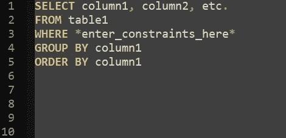
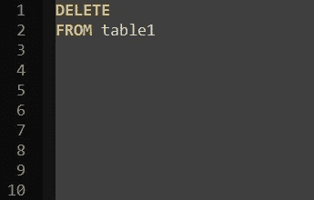
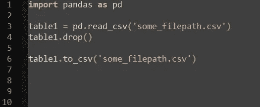
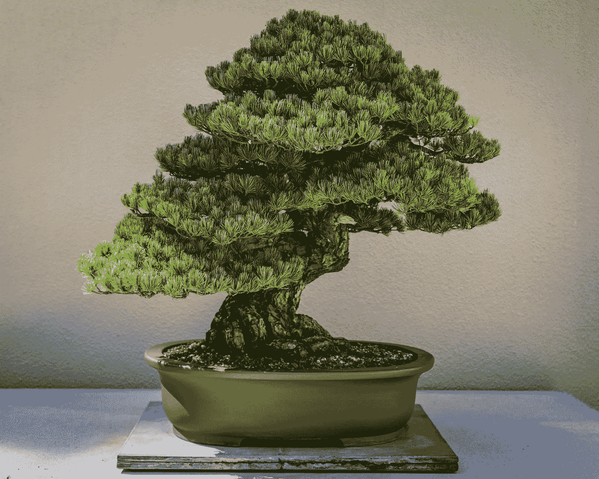

# 2022 年学习 SQL 的 5 个小技巧

> 原文：<https://towardsdatascience.com/5-tips-for-learning-sql-in-2022-573822fe3f92>

## 数据科学/数据分析/数据库

# 2022 年学习 SQL 的 5 个小技巧

## 基于个人经验的 SQL 学习建议

格伦·卡斯滕斯-彼得斯在 [Unsplash](https://unsplash.com/s/photos/data-science?utm_source=unsplash&utm_medium=referral&utm_content=creditCopyText) 上拍摄的照片

如果你想进入任何类型的数据行业，SQL 是一项必须学习的技能。

大家好，我叫 Brenden，是达拉斯的一名数据专业人员，两年前，我决定进入令人难以置信的数据世界。这是我做过的最好的决定之一，从那以后我再也没有回头。两年前，当我第一次开始这个旅程时，我觉得我需要掌握多种先进的技术和统计概念，以便有机会获得任何数据角色。作为一个几乎没有接受过技术和数学教育就开始这段旅程的人，我做了大多数开始数据之旅的人所做的事情，我试图从头开始学习编程、人工智能和高级统计模型，并试图在 30 天内完成所有这些。嗯，在没有一次记住所有这些概念之后，我很快意识到我需要改变我的方法。在我考虑处理其他事情之前，我花了几个月的时间专注于学习 SQL。我使用 SQL 已经快两年了，可以肯定地说，在日常生活中，我使用 SQL 的次数比任何其他工具或技能都多。

那么为什么这个故事很重要呢？回顾这段经历，我意识到我并没有完全理解什么是数据，数据是如何表现的。随着越来越多的低代码环境被创建并用于数据领域，从整体上理解数据变得越来越重要。

> 随着越来越多的低代码环境被创建并用于数据领域，从整体上理解数据变得越来越重要

## 所以我为什么要学 SQL？

SQL 有用的原因有很多，关于这个主题有大量的资源。一旦我觉得我的 SQL 技能很扎实，并转移到其他数据概念，我就能够更好地理解我所学的内容，因为我能够以某种方式将每个概念引用回 SQL。例如，使用`SELECT`语句可以让您找到想要使用的数据，而`UPDATE`语句将永久改变表中的值。掌握这些小技能，比如进一步了解查询如何影响数据库，这些技能在处理生产解决方案时非常有用。因此，不要再拖延了，这里有一些提示将帮助你在 2022 年完成你的 SQL/数据之旅！

免责声明:学习是一个终生的过程。这并不是要告诉你你需要知道什么，而是从我的个人经历中给你一些实用的建议。更多信息请查看 [*走向数据科学*](https://towardsdatascience.com/) *。如果你正在寻找今年学习 SQL 的不同想法，请继续阅读！*

# **1。学习查询的基本结构**

在非常基本的层面上，许多查询遵循相似的结构:

作者代码

这是 SQL 中拉取数据的基本公式。是的，有一些更高级的概念你可以使用，但这是大多数查询的框架。当你开始学习更高级的概念时，相对于从头开始尝试高级概念，依靠这个框架并以它为基础会更容易。

# 2.理解代码的动作

SQL 是一种有趣的语言，因为每条语句都有一次做这么多事情的能力。让我们来看看一些示例代码:

这是在 SQL 中删除表的方法:

*作者代号*

这是在 Python 中删除数据帧(或表)的方法:

作者代码

注意，在 python 中删除数据需要四行代码，而在 SQL 中删除数据需要三个字。这是因为 SQL 直接与数据库接口，这意味着如果您试图修改表或底层数据，您将经常对数据库进行永久更改。了解不同的语句如何与数据库交互将有助于学习使用 SQL，并确保您使用正确的方法，不删除或修改任何您不想删除或修改的内容，这就引出了我们的下一个技巧！

# 3.了解不同类型的 SQL 命令

有五种主要类型的 SQL 命令。将这五种类型的命令想象成相似的 SQL 语句组。以下是对不同类型功能的简要概述:

*   ***数据查询语言(DQL)*** ，可以用来查找和查看数据，而不需要对数据库做任何永久性的修改。
*   ***数据操作语言(DML)*** ，用于对**数据**进行永久性修改，如更新值或删除值。
*   ***数据定义语言(DDL)*** ，用于对**表**进行永久性修改，如创建或删除表。
*   ***数据控制语言(DCL)*** ，用于管理命令，如添加或删除不同表和数据库的用户。
*   ***Transact 控制语言(TCL)*** ，是处理事务级语句的高级 SQL。

对我个人来说，当我学习 SQL 时，理解这些不同的组有助于我理解我的代码真正在做什么。这也让我能够确保我的代码完全按照我的要求运行，并且没有修改或删除历史生产数据的风险。在学习 SQL 的同时，您可以随意进行自己的研究，为您的学习过程添加一些背景知识！

# 4.使用不同类型的数据集进行练习

很多时候，您会遇到不熟悉的数据，必须依靠您的工具和技能(如 SQL)来使这些数据适合您的数据库，并对其进行相应的分析。例如，我觉得我看到了一种新的方式来安排每个月的日期。了解 datetime 函数在 SQL 中是如何工作的，并且能够依靠它将会节省您的时间，并在将来减少挫折。当我第一次开始练习更多的 SQL 时，我可能会告诉自己在我的数据集中包含更多的多样性，并有机会学习如何处理我以前从未处理过的问题，所以当你练习时，不时挑战自己，处理你可能不想处理的数据，因为你可能会发现自己处于这种情况下。

# 5.从修剪盆景树的角度考虑 SQL

照片由 [Devin H](https://unsplash.com/@devin_photography?utm_source=unsplash&utm_medium=referral&utm_content=creditCopyText) 在 [Unsplash](https://unsplash.com/s/photos/bonsai-tree?utm_source=unsplash&utm_medium=referral&utm_content=creditCopyText) 上拍摄

随着 Cobra Kai 第四季在网飞上映(如果你还没有看过这部剧，我肯定会推荐)，我觉得这是一个合适的类比，绝对适用于学习 SQL。在第一部《空手道小子》电影中，他们谈到你需要如何设想你在生活中想要什么，并在生活中做出改变，将你的愿景变成现实，就像修剪盆景树一样。问题是，一旦你做了一个大的改变或决定，你通常必须坚持下去，就像砍掉盆景树的树枝一样。类似地，在数据库工作中，在编写一行代码之前理解您想要的最终产品是什么是非常有益的，尤其是在 SQL 中。您是否正在尝试修改数据库中的表？您正在尝试删除、创建哪些列等。？

这将有助于您更有目的地设计查询，并使您的代码更加高效。肯定有这样的时候，你可以在没有最终产品的情况下开始编码，特别是当你被要求从零开始创造一些东西的时候。这两种方法都有效，但是把这两种方法都放在你的口袋里会节省你的时间和挫折。

# 结论

虽然这绝不是一个详尽的列表，但我希望这些提示能鼓励你在今年开始你的数据之旅，并帮助你避免一些挫折。与其他语言相比，SQL 在语法方面并不一定很难，但是，从系统的角度来看，它可能很难，因为 SQL 代码本身并不能说明全部情况，通常您需要在按下 run 之前了解代码的作用。实践您的代码，理解基本的基本概念，然后您就可以充分利用您的数据了。

如果你喜欢这篇文章，请告诉我！敬请期待 2022 年可能出现的第二部以及其他内容！

看看我的其他文章吧！

[*全新承担分析型工作流管理*](/a-new-take-on-analytical-workflow-management-e14b8588cdfe)

[*三种分析工具和技巧你现在就可以开始学习*](/3-analytics-tools-and-skills-you-can-start-learning-now-b98d89adeaf0)

[*如何演讲:面向有志分析师*](/how-to-present-for-aspiring-analysts-c0c0b15555c5)

[*数据可视化受众和场景*](/data-visualization-audiences-and-scenarios-ffe64adcd364)

</three-tech-stacks-for-aspiring-analysts-5cde49a22337>*有志分析师的三大技术栈*

*</10-tips-for-a-successful-internship-e8f0c14cd3d3>*成功实习的 10 个秘诀**

**[*作为营销分析实习生我学到了什么*](/what-i-learned-as-a-marketing-analytics-intern-f96307976bb3)**

**[*营销分析实习生的一天*](/a-day-in-the-life-of-a-marketing-analytics-intern-2bed4d11d30f)**

***联系我或接收更多内容，在 Twitter 上关注我@*[*BMNAnalytics*](https://twitter.com/BMNAnalytics)*！***