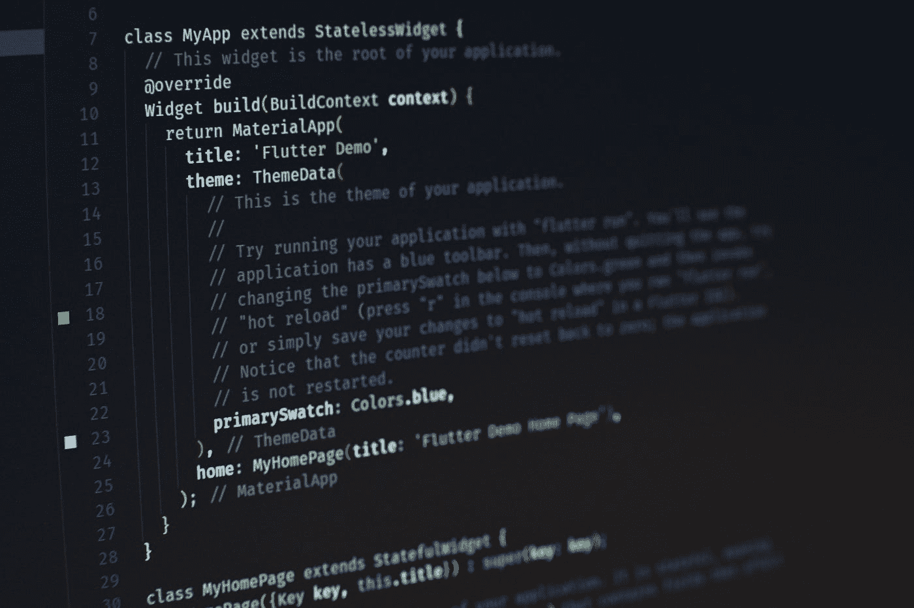

# 在代码中写更好注释的 5 个技巧

> 原文：<https://towardsdatascience.com/5-tips-to-write-better-comment-in-your-code-1d4681071967>

## 帮助他人更容易地遵循您的代码

Artur Shamsutdinov 在 [Unsplash](https://unsplash.com?utm_source=medium&utm_medium=referral) 上拍摄的照片

作为程序员或技术领域的一部分，我们经常需要定期阅读、分析和编写代码。有些代码比其他代码更容易编写和遵循。代码越清晰，理解、使用和构建的速度就越快。对于任何程序员或数据科学家来说，编写优秀代码的能力都是一项基本技能。

但是，另一个重要的技能是写好评论。现在，我知道如果你掌握了编写可读代码的艺术，你就可以写更少的注释，但是我们不能为了现实而完全停止写注释。所以，即使你擅长写代码，你也需要能够写出好的注释。

注释是每一个好代码的主要部分。如果你打开一个代码，它没有任何注释，阅读和理解代码将会很费时间。缺乏评论和使用过多的评论一样糟糕。如果你的代码文件有 50%或更多的注释，那么你的代码可能写得不是很好，因此你需要很多注释来解释它。

写好评论并不是一件难事；这只是一个需要大量练习的问题。幸运的是，如果你正在阅读这篇文章，你要么是一名程序员，一名数据科学家，要么在技术领域工作。这意味着你在职业生涯中需要写/读大量的代码。

那么，如何写好评论呢？在这篇文章中，我将介绍 5 个技巧来帮助你写更好的评论，让你的评论写作技巧更上一层楼。

# 提示 1:保持简短，简明，切中要点

说到写评论，我会说，少即是多。尽量不要过度解释代码的每一步。保持你的注释简短，对于类和函数不要超过三句话，对于行内注释不要超过一句话。如果你的代码写得很好，你不需要很多注释来解释它。你只需要给用户(程序员同事)一点提示，告诉他们你为什么做出某些决定，以及不同代码段的整体功能。

一般来说，为了保持事物的有序和数量的统一，编程社区在为一个类编写注释(docstring)时，要包括一个简短的描述和最后一次修改的日期。然而，当你为一个函数编写代码时，它必须包含对其目的、参数和结果的描述。

# 提示 2:保持每个关卡的风格一致

通常，代码分为卡盘、函数、类、模块、库等。每一个都可以被认为是代码的一个层次。因此，当您编写注释时，最好为每个级别开发一种特定的样式，并在代码中维护它。

因此，您将为所有代码函数使用相同的编写 docstring 的风格；你的函数和内嵌注释也是如此。这将帮助任何阅读代码的人快速浏览并理解其结构，甚至不需要深入阅读。

# 技巧 3:在编写代码之前或编写代码时编写注释，然后编辑它们

初学者第一次学习编码时犯的最大错误之一——我也是这样——是先写代码，然后检查代码并写注释。这种方法的问题是，通常我们要花一段时间来编写代码，几天甚至几个月。所以，当我们接近写评论这一步的时候，我们已经忘记了我们为什么要做一些决定。

在这种情况下，最好的办法是在编写代码的同时编写注释。一些程序员甚至会说，你应该在写代码之前写注释(它将作为你的指南)。但是，在我看来，并行移动代码和注释是最省时省力的方法。所以，边走边写评论，最后，如果需要的话，再进行编辑。

# 秘诀 4:明确表达

评论不只是给将来会看你代码的人看的；他们也是为了未来——你将在接下来的发展步骤中维护和扩展它。所以，把你的评论说清楚，对其他开发者和你自己都有帮助。

> 一旦一行代码出现在屏幕上，你就进入了这段代码的维护模式菲尔·哈克

# 提示 5:记得保持简单

最后，也许是最简单的建议，就是保持事情简单。保持你的代码简单，这样就不需要在评论中做太多的解释，同时保持你的评论简单明了，这样别人和将来你都会觉得很容易理解。

一个基本的编程原则是 ***让你的代码自己说话。虽然那场运动最初是由不喜欢写注释的程序员发起的——一般来说，他们中的大多数，你不能 100%消除注释。尽管如此，你仍然可以大大减少它们的数量，但是要写一个更简单的代码。***

# 最后的想法

成为一名成功的数据科学家需要你掌握不同的技能；编程可能是这些技能中最重要的。成为一名优秀的程序员意味着你能写出清晰易读的代码和简洁明了的注释。这两者对于产生高质量的代码同样重要。然而，大多数人更关注开发他们的代码编写技能，而忽略了他们的注释编写技能。

像任何其他技能一样，更好地写评论的唯一方法是练习写更好的评论。首先，阅读你认为写得很好的评论，并反思你为什么喜欢它们。通常，简短、清晰、描述性强且不过度使用的注释是最佳的。

这篇文章讲述了 5 个技巧，它们会让你的评论写作技巧更上一层楼。我留给你这个；注释并不意味着向用户解释代码；相反，您的代码用于向计算机解释注释。