# 掌握熊猫的 5 招追加()

> 原文：<https://towardsdatascience.com/5-tricks-to-master-pandas-append-ede4318cc700>

# 掌握熊猫的 5 招追加()

## 使用 Pandas append()在当前数据帧末尾有效添加行的实践教程


照片由[UX](https://unsplash.com/@uxindo?utm_source=unsplash&utm_medium=referral&utm_content=creditCopyText)在 [Unsplash](https://unsplash.com/s/photos/data-analysis?utm_source=unsplash&utm_medium=referral&utm_content=creditCopyText) 上拍摄

> 数据合并是将两个或多个数据集合并成一个数据集的过程。通常，当您将原始数据存储在多个文件、工作表或数据表中，并且希望一次性分析所有数据时，这个过程是必要的。
> 
> 来源于 DisplayR 博客:什么是数据合并[1]

Pandas 提供了各种内置方法来轻松组合数据帧。其中，`append()`是`[concat()](/pandas-concat-tricks-you-should-know-to-speed-up-your-data-analysis-cd3d4fdfe6dd)`在当前数据帧末尾增加行的一个特例(`axis=0`和`join='outer'`)。这种方法似乎很容易使用，但是仍然有一些技巧你应该知道，以加快你的数据分析。

在这篇文章中，你将学习熊猫`append()`处理以下用例的技巧:

1.  追加单行
2.  追加多行
3.  当列名没有对齐时
4.  带参数`sort=True`
5.  带参数`verify_itegrity=True`

> 请查看[笔记本](https://github.com/BindiChen/machine-learning/blob/master/data-analysis/055-pandas-append/pandas-append.ipynb)获取源代码。更多教程可从 [Github Repo](https://github.com/BindiChen/machine-learning) 获得。

# 1.追加单行

Pandas `append()`可以接受一个类似 Series/dict 的对象或列表，并将其添加到当前数据帧的末尾。为了进行演示，让我们创建一个数据帧`df1`并遍历不同的输入:**一个系列**，**一个字典**，以及**一个列表**。

```
df1 = pd.DataFrame({
    'name': ['A', 'B', 'C', 'D'],
    'math': [60,89,82,70],
    'physics': [66,95,83,66],
    'chemistry': [61,91,77,70]
})
```

## 1.1 A 系列

在这种情况下，我们想追加一只熊猫`Series`。我们需要确保我们的输入索引标签与 DataFrame 列匹配。

```
### Appending a Series
my_series = **pd.Series(
    ['E', 60, 70, 80],  
    index=['name', 'math', 'physics', 'chemistry']
)**df1.append(**my_series**, ignore_index=True)
```

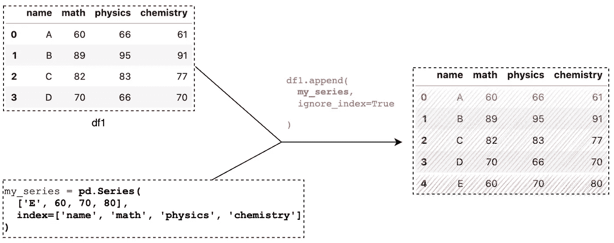

熊猫追加()追加系列(图片由作者提供)

## 1.2 判词

同样，我们可以附加一个字典。该键需要与 DataFrame 列名相匹配。

```
### Appending a dict
my_dict = **{'name': 'E', 'math': 60, 'physics': 80, 'chemistry': 90 }**df1.append(my_dict, ignore_index=True)
```

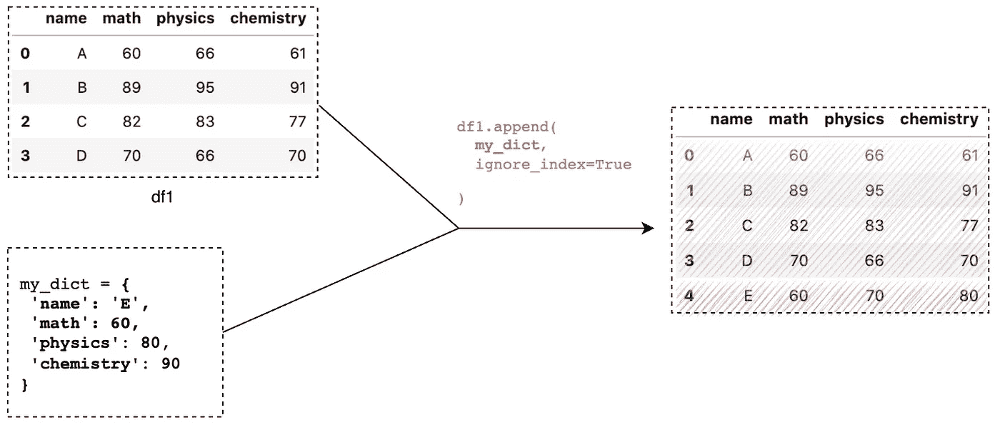

熊猫附加()附加字典(图片由作者提供)

## 1.3 列表

有时，我们的数据可以是没有任何键或标签的列表，例如，JSON 格式的 HTTP 响应。将列表直接传递给熊猫`append()`会得到一个意想不到的结果:

```
### Appending a list - **wrong**
my_list = ['E', 60, 70, 80]df1.append(my_list, ignore_index=True)
```

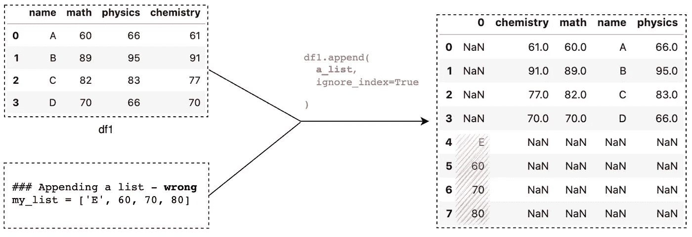

熊猫追加()追加列表—错误(图片作者)

问题是 1D 数组`['E', 60, 70, 80]`被视为一个 4 乘 1 的矩阵，列名是从 0 开始的索引。列名不匹配，因此它被作为一个新列`**0**`。

要修复它，我们需要使用`pd.Series()`和参数`index=df1.columns`将列表转换成熊猫系列:

```
### Appending a list - **correct**my_list = ['E', 60, 70, 80]# Convert a lint to Pandas Series
**a_series = pd.Series(my_list, index=df1.columns)**df1.append(**a_series**, ignore_index=True)
```

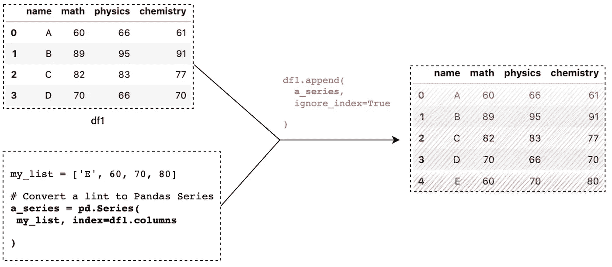

熊猫追加()追加列表(图片由作者提供)

# 2.追加多行

通常，我们需要同时添加多行。熊猫`append()`可以接受类似 DataFrame/dict 的对象来添加多行。

## 2.1 数据框架

这里我们将把一个数据帧附加到`df1`。

```
# Create a DataFrame
df2 = pd.DataFrame({
    'name': ['E', 'F', 'G', 'H'],
    'math': [66,95,83,66],
    'physics': [60,89,82,70],
    'chemistry': [90,81,78,90]
})
```

要将`df2`追加到`df1`，我们可以简单地调用`df1.append(df2)`，它会将`df2`放在`df1`的底部。

```
df1.append(df2)
```

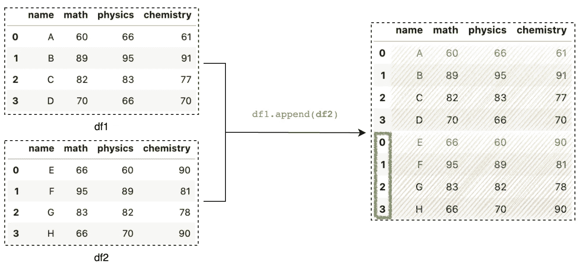

熊猫 append()追加数据帧(图片由作者提供)

您可能会注意到保留了`df2`的原始索引。如果我们希望从 0 开始的索引继续，我们可以设置`ignore_index=True`:

```
# With ingore_index=True
df1.append(df2, **ignore_index=True**)
```

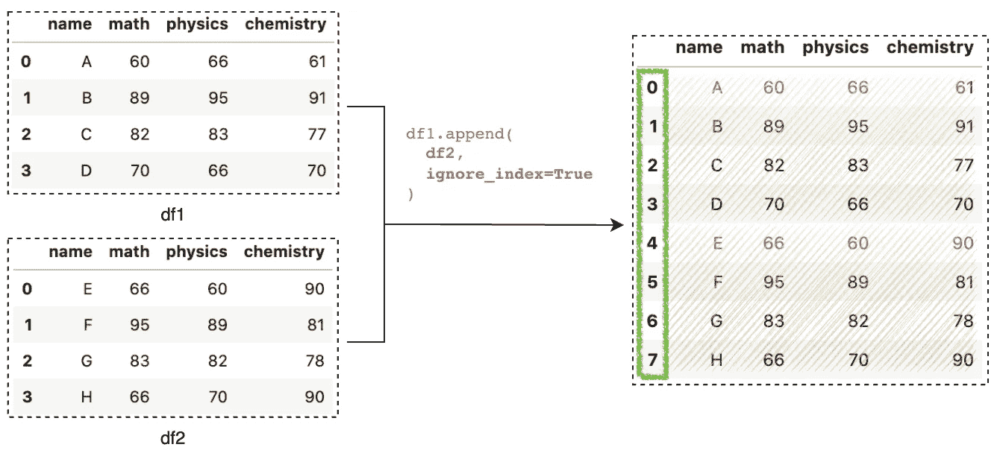

熊猫 append()追加数据帧(图片由作者提供)

## 2.2 字典列表

我们也可以通过**一个字典列表**来追加多行。该键需要与 DataFrame 列相匹配。

```
## A list of dict
my_dict_list = [
  {'name' : 'E', 'math' : 66, 'physics' : 60, 'chemistry': 90 },
  {'name' : 'F', 'math' : 95, 'physics' : 89, 'chemistry': 81 },
  {'name' : 'G', 'math' : 83, 'physics' : 82, 'chemistry': 78 },
  {'name' : 'H', 'math' : 66, 'physics' : 70, 'chemistry': 90 }
]
```

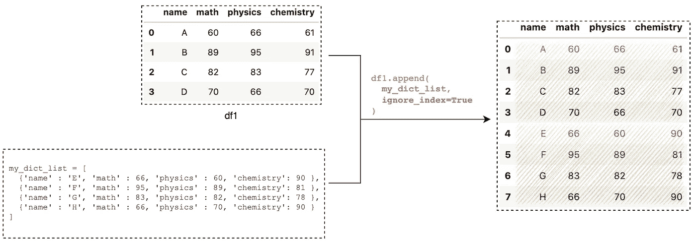

熊猫追加()追加字典列表(图片由作者提供)

## 2.3 清单列表

类似地，我们也可以向**传递一个列表列表**来追加多行。最重要的部分是，我们首先需要使用带有参数`columns=df1.columns`的`pd.DataFrame`将列表转换成数据帧:

```
# A list of lists
my_list_of_list = [
    ['E', 66, 60, 90],
    ['F', 95, 89, 81],
    ['G', 83, 82, 78],
    ['H', 66, 70, 90]
]# Convert a list of lists to a DataFrame
my_df = **pd.DataFrame**(my_list_of_list, **columns=df1.columns**)df1.append(my_df, ignore_index=True)
```

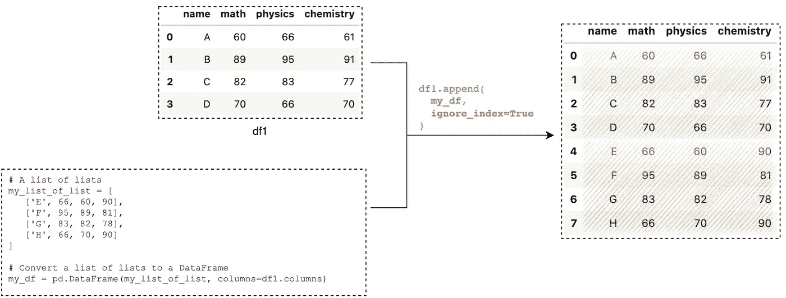

熊猫 append()追加列表列表(图片由作者提供)

# 3.当列名没有对齐时

我们已经添加了一个类似数据帧/序列的对象，其列与原始数据帧的列相同。Pandas `append()`允许我们添加带有缺失/新列的数据集。

## 3.1 缺少的列

如果 DataFrame、Series 或 dict 中缺少列，则它们的值将作为输出中的`NA`:

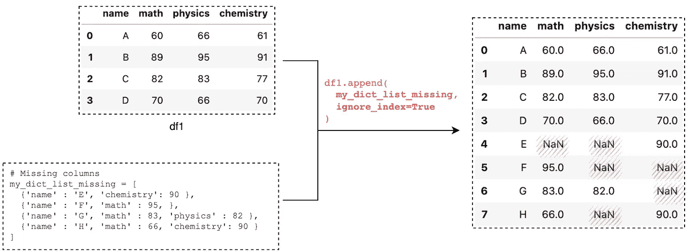

熊猫 append()追加一个缺少列的数据帧(图片由作者提供)

**3.2 新增栏目**

如果我们在 DataFrame、Series 或 dict 中传递新的列名，那么新的列将在原始 DataFrame 上创建。

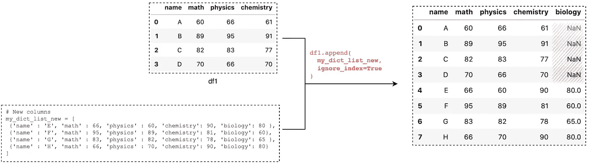

熊猫 append()用新列追加数据帧(图片由作者提供)

# 4 排序列名，sort=True

默认情况下，Pandas `append()`方法将遵循原始 DataFrame 的列顺序。如果我们希望输出按字母顺序排序，我们可以将参数`sort`设置为`True`:

```
df1.append(my_dict_list, ignore_index=True, **sort=True**)
```

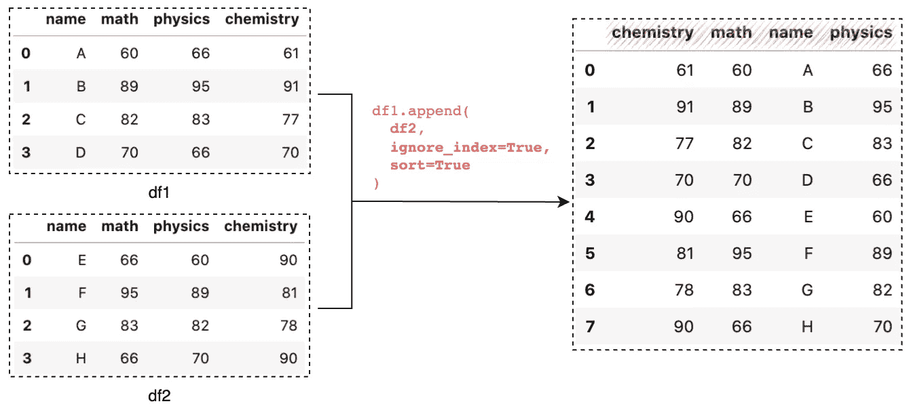

熊猫 append()，sort=True(图片由作者提供)

# 5 避免 verify_integrity=True 的重复索引

熊猫`append()`中有一个参数`verify_integrity`用来配置输出是否允许重复索引。`verify_integrity`默认为`False`，表示输出允许重复索引。我们可以将它设置为`True`,以便在两行或更多行具有相同的索引时引发一个错误。例如，它抱怨重复的索引值`**[1]**`:

```
# Create a DataFrame
df2 = pd.DataFrame({
    'name': ['E', 'F', 'G', 'H'],
    'math': [66,95,83,66],
    'physics': [60,89,82,70],
    'chemistry': [90,81,78,90]
}, index=[**1**, 4, 5, 6])# Error Message
df1.append(df2, **verify_integrity=True**)
```

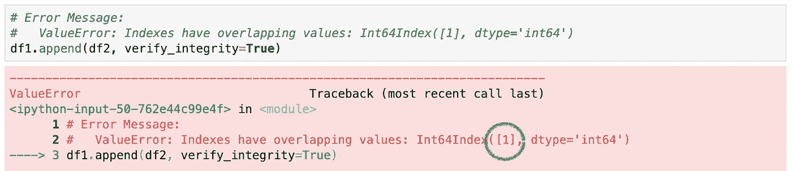

熊猫 append()，verify_integrity=True(图片由作者提供)

# 结论

在本文中，我们已经讨论了 5 个使用熊猫`append()`在当前数据帧末尾添加行的用例。该方法本身使用起来非常简单，是数据预处理中组合数据的最受欢迎的方法之一。

感谢阅读。请查看[笔记本](https://github.com/BindiChen/machine-learning/blob/master/data-analysis/055-pandas-append/pandas-append.ipynb)获取源代码，如果您对机器学习的实用方面感兴趣，请继续关注。更多教程可从 [Github Repo](https://github.com/BindiChen/machine-learning) 获得。

# 参考

[1] [什么是数据合并？](https://www.displayr.com/what-is-data-merging/)