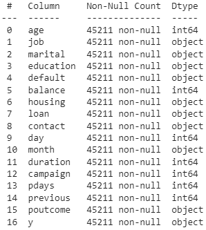
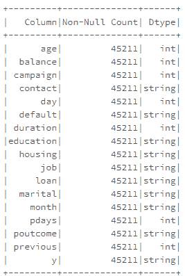
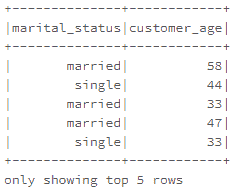
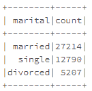
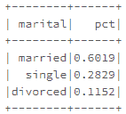

# Pyspark 中重新实现的 5 个有用的熊猫函数

> 原文：<https://towardsdatascience.com/5-useful-pandas-functions-reimplemented-in-pyspark-2619d2359d38>

## 在 pyspark 中重新实现缺失的熊猫函数


照片由[戴安娜·帕克豪斯](https://unsplash.com/@ditakesphotos?utm_source=medium&utm_medium=referral)在 [Unsplash](https://unsplash.com?utm_source=medium&utm_medium=referral) 上拍摄

# 介绍

Pandas 是 Python 中最流行的数据辩论工具之一，因为它具有直观的数据结构和丰富的 API。在 Pandas 和 Pyspark 之间切换的用户可能会注意到，某些 Pandas 方法或属性没有 Pyspark 等价物。

在本文中，我们将研究 Pyspark 中没有的一些常用的 Pandas 方法和属性，以及如何在 Pyspark 中创建我们自己的等效自定义方法。我们将使用`pd_df`和`ps_df`分别代表熊猫和 Pyspark 数据帧。

需要以下导入:

```
import pyspark
from pyspark.sql.window import Window
from pyspark.sql import functions as f
```

# 形状

熊猫的`.shape`属性允许我们检查数据帧的行数和列数。

```
pd_df.shape>> (45211, 17) # number of rows, columns
```

为了在 Pyspark 中获得类似的输出，我们可以通过包含一个新的`shape()`方法来扩展`pyspark.sql.DataFrame`。

我们可以找到 Pyspark 数据帧的形状

```
ps_df.shape()>> (45211, 17) # number of rows, columns
```

# 信息

Pandas 的`.info()`方法为我们提供了每一列的数据类型和空值数量

```
pd_df.info()
```



作者图片

下面的代码片段展示了 Pyspark 的等效代码。

对 Pyspark 数据帧执行`.info()`会返回相关的 Pyspark 数据类型，这些数据类型可能与 Pandas 数据类型不同。

```
ps_df.info()
```



# 重新命名

Pandas 的`.rename`方法允许我们使用字典重命名多个列，其中键是当前列名，值是新列名`{"old_col_name":"new_col_name"}`。

Pyspark 允许用`.withColumnRenamed`方法重命名 Pyspark 数据帧。

```
sp_df = spdf.withColumnRenamed('old_col_name', 'new_col_name')
```

为了重命名多个列，我们多次调用`.withColumnRenamed`方法:

```
sp_df = spdf.withColumnRenamed('old_col_name1', 'new_col_name1').withColumnRenamed('old_col_name2', 'new_col_name2')
```

让我们创建一个 Pyspark `.rename()`方法，它允许我们使用映射器字典重命名多个列。

我们现在可以使用以下方式重命名`pyspark.sql.DataFrame`:

```
new_df = ps_df.select('marital', 'age').rename({'marital':'marital_status', 'age':'customer_age'})
new_df.show(n = 5)
```



作者图片

# 值计数

熊猫的`.value_counts()`计算具有唯一列组合的行数。

```
pd_df.value_counts('marital')
```

在派斯帕克

与 Pandas `.value_counts()`类似，有一个使用`normalize`参数来标准化频率的选项。

```
ps_df.value_counts('marital')
```



作者图片

```
ps_df.value_counts('marital', normalize = True)
```



作者图片

# 复制

Pandas 的`.duplicated`方法返回一个布尔序列来表示重复的行。我们的 Pyspark 对等函数将返回 Pyspark 数据帧，其中有一个名为`duplicate_indicator`的附加列，其中`True`表示该行是重复的。

```
ps_df\\
  .select(['age', 'job', 'marital', 'education', 'balance'])\\
  .duplicated(subset = ['age', 'job', 'marital', 'education'], orderby = ['balance'], ascending = True, keep = 'first')\\
  .show()
```

`.duplicated()`的 pyspark 当量

# 结论

在本文中，我们研究了 5 个常用的 Pandas 方法/属性，并在 Pyspark 中创建了它们的对等物。Pyspark 中的这些方法可以作为快速数据探索和清理的便利功能。你可以在[这个 github 资源库](https://github.com/edwintyh/pyspark-utils/blob/main/utils.py)中找到完整的代码。

*   加入 Medium 阅读更多类似的故事
*   关注我关于[熊猫](https://medium.com/@edwin.tan)的教程