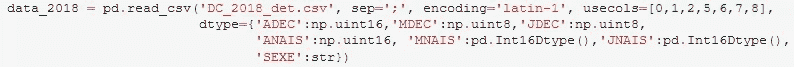

# 用 Python 处理大型数据集的 3 种方法

> 原文：<https://towardsdatascience.com/5-ways-to-deal-with-large-datasets-in-python-9a80786c4182>

作为一名数据科学家，我发现自己越来越需要处理“*大数据”*。我戏称为*的大数据*对应的数据集，虽然并不真的那么大，但却大到足以让我的计算机努力处理它们，并真的减慢一切。

米卡·鲍梅斯特在 [Unsplash](https://unsplash.com/collections/9683625/big-data?utm_source=unsplash&utm_medium=referral&utm_content=creditCopyText) 上的照片

这个问题并不新鲜，就像所有事情一样，不存在放之四海而皆准的神奇公式。最佳方法将取决于您的数据和应用程序的目的。然而，最[流行的](/loading-large-datasets-in-pandas-11bdddd36f7b) [解决方案](https://www.codementor.io/@guidotournois/4-strategies-to-deal-with-large-datasets-using-pandas-qdw3an95k)通常属于下述类别之一。

# 1.通过优化数据类型减少内存使用

当使用 Pandas 从文件中加载数据时，它会自动推断数据类型，除非另有说明。大多数情况下，这样做很好，但是推断的类型不一定是优化的。此外，如果数字列包含缺失值，那么推断的类型将自动为 float。

我最近使用这个方法进行了一项分析，我主要处理表示年、月或日的整数类型:

使用 Pandas 加载文件并指定 dtypes(图片由作者提供)

对于这种特殊的情况，指定数据类型可以大大减少所使用的内存。请注意，在上面的例子中，我使用了熊猫类型[熊猫。Int16Dtype](https://pandas.pydata.org/pandas-docs/stable/reference/api/pandas.Int16Dtype.html) 强制包含缺失值的列为 Int 类型。这是通过使用熊猫在内部实现的。NA，而不是 numpy.nan

[处理大型数据集时，优化数据类型](/optimize-pandas-memory-usage-while-reading-large-datasets-1b047c762c9b)需要事先了解您正在处理的数据。在未知数据集的纯探索阶段，它可能没有用。

# 2.将数据分割成块

当数据太大而不适合内存时，您可以使用 Pandas 的 *chunksize* 选项将数据分割成块，而不是处理一个大块。使用此选项创建一个 [*迭代器*](https://wiki.python.org/moin/Iterator) 对象，该对象可用于遍历不同的块并执行过滤或分析，就像加载完整数据集时所做的一样。

下面是一个使用该选项遍历 [Yelp 评论数据集](https://www.yelp.com/dataset)的示例，提取每个块的最小和最大评论日期，然后重建评论的完整时间跨度:

从最初的探索性分析到[模型训练](/strategies-to-train-out-of-memory-data-with-scikit-learn-7b2ed15b9a80)，都可以使用分块，并且只需要很少的额外设置。

# 3.利用懒惰评估

惰性求值指的是将表达式的求值延迟到实际需要该值时进行的策略。[惰性求值](https://data-flair.training/blogs/apache-spark-lazy-evaluation/)是一个重要的概念(尤其在函数式编程中使用)，如果你想了解更多关于它在 Python 中的不同用法，你可以从这里开始。

惰性评估是构建分布式计算框架的基础，如 [Spark](https://spark.apache.org/) 或 [Dask](https://dask.org/) 。尽管它们是为集群设计的，但是您仍然可以利用它们在您的个人计算机上处理大型数据集。

与 Pandas 的主要区别在于，它们不直接将数据加载到内存中。相反，在 read 命令期间发生的是，它们扫描数据，推断数据类型，并将其分成分区(到目前为止没有什么新内容)。计算图是为这些分区独立构建的，只有在真正需要的时候才执行(这就是懒惰的原因)。

我在另一篇文章中提供了一个使用 Pyspark 对大于内存的数据集进行探索性分析的例子，并在另一篇文章中写了关于 [Spark 核心原则](https://medium.com/@georgiadeaconu/understanding-core-concepts-in-apache-spark-73dce67a5f73)的内容，所以我在这里不再重复。 [Dask](https://pythonspeed.com/articles/faster-pandas-dask/) 也很受欢迎[例子](https://examples.dask.org/machine-learning/incremental.html)不难找到(要比较两者，你可以从[这里开始](https://docs.dask.org/en/latest/spark.html))。Dask 的语法模仿了 Pandas 的语法，所以看起来很熟悉，但是，它仅限于 Python 的使用，而 Spark 也可以在 Java 或 Scala 中工作。

其他库，如 [Vaex 或 Modin](/4-python-libraries-that-ease-working-with-large-dataset-8e91632b8791) 提供了类似的功能，但我个人没有使用过它们。