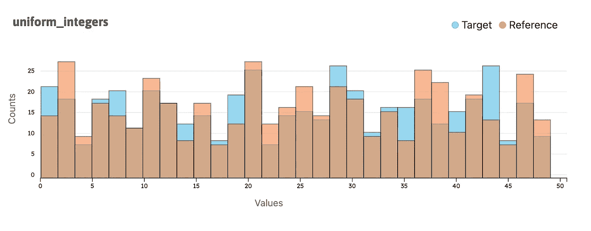
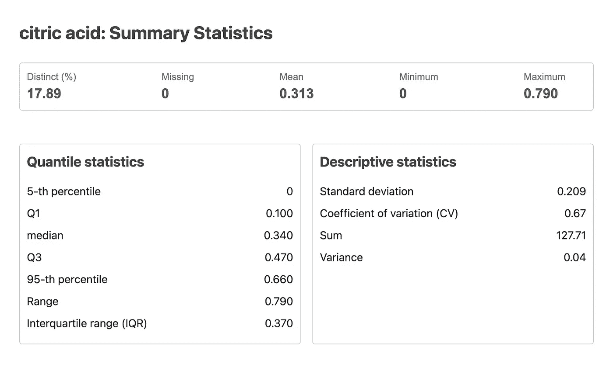
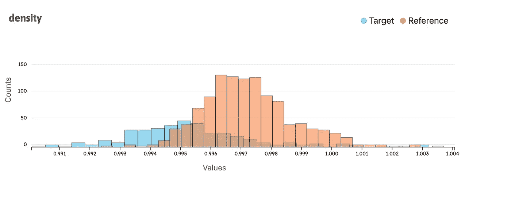
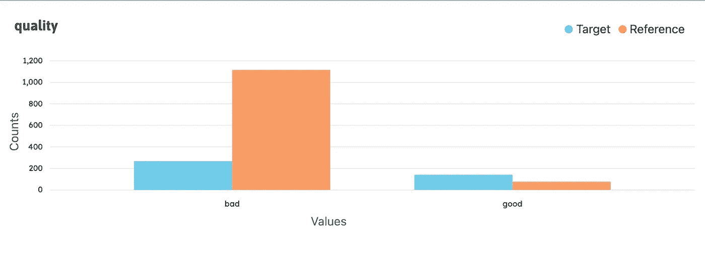
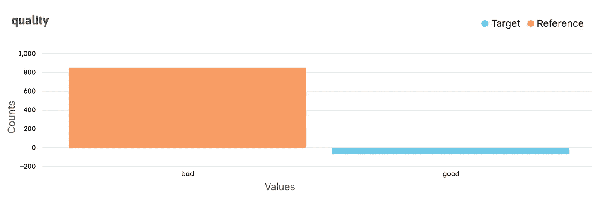

# 使用 whylogs profile visualizer 检查数据和模型的 5 种方法

> 原文：<https://towardsdatascience.com/5-ways-to-monitor-data-models-with-whylogs-profile-visualizer-8f1048f8f72e>

## 发现数据漂移并确保机器学习模型质量



使用 whylogs profile visualizer 在示例数据集上使用 *uniform_integers* 功能制作的双直方图。图片由作者提供。

开源的 **whylogs profile visualizer** 支持使用 Python 对机器学习和数据工程中的数据进行可视化观察。将可视化添加到数据可观察性中，可以进一步提取和增强可以在 **whylogs** 数据记录配置文件中捕获的信号，以帮助您了解数据中发生的情况，快速识别和纠正问题，并保持高性能数据和机器学习模型的质量和相关性。profile visualizer 与您的日志记录代码一起在 Jupyter 笔记本中运行，并增强了开源 whylogs 库的解释能力，迅速成为 ML 模型和数据管道的数据日志记录和监控标准。

作为 Slack 上强大而负责任的人工智能社区的一员，我直言不讳地表达了我对可视化分析的热情，像往常一样，WhyLabs 团队的成员向我介绍了正在开发的 profile visualizer。这进一步激发了我的好奇心，即一旦数据集或模型进入生产阶段，可视化如何弥补数据可观测性中存在的差距——观察它在世界上的表现。

[Felipe Adachi](https://felipe-p-adachi.medium.com/) 编写了示例[代码笔记本](https://github.com/whylabs/whylogs/blob/1.0.x/python/examples/basic/Notebook_Profile_Visualizer.ipynb)，这是我学习使用 profile visualizer 的基础，我在这篇文章中突出显示了其中的摘录，并添加了其他示例，您可以从[我自己的笔记本](https://github.com/khurchla/whylogs-examples/blob/mainline/Notebook_Profile_Visualizer_drift_analysis.ipynb)中尝试。两者都是对这个帖子的逐步补充。Felipe 和 Danny Leybzon 都慷慨地回答了我的问题，并在我写这篇文章时，从他们作为 whylogs 和 profile visualizer 的维护者的角度，以及为了开发刚刚发布的 v1 代码库的准确性，提供了反馈。

# 学习有效地使用个人资料可视化工具

*   检查在管道的关键输入和输出接合点记录的数据
*   一眼就能看出两个数据分布的差异
*   快速查明机器学习操作中的数据漂移

*开始吧！*

___________________________________________________________________

# 审查记录和统计资料

简而言之，在深入剖析 profile visualizer 之前，了解数据记录的价值和 whylogs profiles 的工作原理是非常重要的。如今，随着机器学习和人工智能的集成，数据管道以无与伦比的速度流动，其规模可能使监控数据变得困难。出于同样的原因[监控你的数据](https://whylabs.ai/blog/posts/a-comprehensive-overview-of-data-quality-monitoring-2)比以往任何时候都更重要，以保持其完整性。

第一步是在靠近数据工作流的地方捕获日志，在数据进入或退出管道的地方，或者在数据经过可能引入或突出问题的主要转换的地方，例如丢失值或上游数据类型的变化没有被考虑。为了使用 profile visualizer，这意味着使用 Python 记录数据概要。


图片由 [cottonbro](https://www.pexels.com/@cottonbro/) 通过 [Pexels](https://www.pexels.com/) 根据作者许可进行修改组合。

**profile visualizer 可以与您在 whylogs profiles** 中捕获的任何类型的数据一起使用，以检测不同的导致漂移的情况以及其他数据质量和模型性能问题。这包括结构化或非结构化数据，以及批处理或流数据。whylogs 配置文件是对您的数据的轻量级总结，它被很好地校准到适合于数据监控的范围和近似程度，不多也不少。与监控和可视化特别相关的是 whylogs 配置文件的轻量级性质，以及与传统采样方法相比，它们对异常值更敏感。可能表明质量问题的罕见事件很容易发现。

然而，以一种比必要的更具体的方式记录数据很容易成为团队和基础设施的资源拖累，并且成为一种新形式的技术债务。选择记录这些汇总的统计数据，而不是存储哪怕是很小的详细数据样本，也可以为您节省因数据所有权和隐私相关法规的强化而面临巨额法律罚款的风险。

# 如何直观地检查单个概要文件的统计数据

首先，使用统包功能统计来查看单个 whylogs 数据配置文件的任何功能。执行这种单变量分析(或对一个要素的分析)是在探索性分析过程中描述数据、预测模式以及了解基数、集中趋势、离差、可变性和缺失值发生率等关键方面的快速方法。

包含这篇文章中的这个例子和其他例子的全部代码的 Jupyter 笔记本可以在 Colab 中打开，或者下载，或者与同一个 GitHub 存储库中的其他例子一起使用。我在这篇文章中提到了数据特性，因为我更多地是从数据科学而不是工程的角度来看待可视化工具。无论您将这些数据称为变量、特征还是数据列，您都可以使用这些图表和报告来查看您的数据并提前发现问题。

# 为配置文件可视化工具准备一个笔记本

首先，安装最近发布的`whylogs` v1 包和`viz`包来使用 profile visualizer。我使用一台 macOS 机器，默认情况下在其终端运行 zsh shell 语言，因此运行下面的第一个代码单元就可以了。如果您之前已经安装了 whylogs，请确保包含`--upgrade`选项，因为 profile visualizer 仅在最近的 whylogs v1 版本之后才可用。

这个代码要点还展示了几种不同场景的 install 命令。您的操作系统和您选择运行 install 命令的位置会影响哪种语法适合您。对于 Z shell (Zsh)，必须用硬括号对`viz`包进行转义，以防止它被解释为模式。通过在命令前加上感叹号直接在你的 Jupyter 笔记本中安装包，在这种情况下，如果你不想看到安装过程的所有自动输出，尝试添加`-q` quiet 命令选项。

# 为示例加载数据

使用 profile visualizer 比较来自著名机器学习数据集的两个剖面图的一个示例非常有趣！加载数据，然后打印熊猫数据帧的简明摘要。

请注意，质量特性包含整数值。在演示过程中，您将把它转换成分类数据类型，以制作快速图表，通过“好”或“坏”的角度来查看您的数据。

# 初始化配置文件可视化工具

在导入了本例所需的 Python 库之后，加载葡萄酒质量数据集，将数据帧记录到 whylogs 配置文件中，并生成一个配置文件视图，以便与 profile visualizer 一起使用。然后，实例化“NotebookProfileViewer”并设置您的目标配置文件。这篇文章中的大部分代码也可以在一本 [Jupyter 笔记本](https://github.com/whylabs/whylogs/blob/1.0.x/python/examples/basic/Notebook_Profile_Visualizer.ipynb)中找到。选择“在 Colab 中打开”按钮或直接下载笔记本。

完成后，一行代码就可以获得各种有用的汇总统计数据，如基于柠檬酸特性的示例所示。

```
visualization**.**feature_statistics(feature_name**=**"citric acid", profile**=**"target")
```



统计数据描述了你的数据。每种类型的总结都是对其他总结的补充。图片由作者提供。

要素统计数据由最基本但仍能提供大量信息的数据聚合的顶级波段组成。不同值的百分比可以表示一致性程度(高%)或不一致性程度(低%)。这里，您可以看到目标配置文件中只有 18%的柠檬酸值是不同的。

分位数统计说明数据如何分布在出现的值范围内。在 UCI 葡萄酒数据集的这一部分中，柠檬酸的四分位数范围 0.3 相对于 1.0 较低。如果你对数据的印象是，中间的 50%的值应该在中间值附近相互靠近。相反，较高的 IQR(如 0.8)将显示范围内分布更广的值。

在描述性统计中，变异系数是标准差除以平均值。作为比率，它独立于其要素的单位比例，并且可以与数据中另一个要素的 CV 进行比较，只要两个要素都具有从零开始的连续数值比例。例如，柠檬酸的 0.72%或 72% CV 表示广泛分散的值。例如，如果将它与另一个特征的 CV . 30 进行比较，您会发现柠檬酸比另一个特征分散得更广。然而，当 CV 方程接近零时，它对均值的微小差异很敏感，在这种情况下，标准差本身更能提供信息，因此在上下文中考虑所有这些统计数据很重要。

# 如何比较两个数据配置文件

profile visualizer 带来了激动人心的改进，可以在笔记本中直接使用两个 whylogs 配置文件进行直观比较。接下来的步骤将引导您运行漂移汇总报告，以了解所有数据集要素的统计信息以及代表目标和参考配置文件之间漂移量的每个属性的差异。然后，简短的演示说明了可视化工具可用于关注两个配置文件中的单个数字或分类特征的图表类型，以及每个图表最有用的时间。

对照基线目标监控您的数据，并能够看到它，就像当您还不清楚时的水晶球一样！一旦机器学习模型投入生产，数据质量就会恶化，监控模型的性能以检测*漂移*或模型输入和输出数据之间关系的变化也很重要。

可视化工具可以帮助您发现机器学习中数据漂移的一个原因是选择偏差，当模型根据不代表其打算执行的整个群体的数据进行训练时，就会引入选择偏差。下面的示例通过使用有偏见的标准将数据集分成两个分析组来说明这种常见情况。然而，要理解漂移的不同根本原因，以及每种原因何时会出现在模型数据的模式中，[一本关于数据漂移的初级读本](https://medium.com/data-from-the-trenches/a-primer-on-data-drift-18789ef252a6)是一本很好的读物。

# 在配置文件可视化工具中初始化目标和引用配置文件

现在，将葡萄酒质量案例研究中的数据集分成两组，以有意创建一个样本选择偏差场景，其中训练样本不代表总体。像以前一样加载葡萄酒质量数据集。第一组将包括酒精含量等于或低于 11 的葡萄酒，并将被视为您的基线(或参考)数据集，第二组将包括酒精含量高于 11 的葡萄酒，作为您的目标数据集。

准备两个组，然后将每个组的 whylogs 配置文件传递给配置文件可视化工具，以便在目标配置文件和参考配置文件之间进行比较。`quality`是一个数字特征，代表葡萄酒的质量。将其转换为分类特征，将每种葡萄酒分为好坏。任何高于 6.5 的都是好酒。否则就糟了。

现在，用`whylogs`分析数据帧，并创建`profile_views`作为输入到`NotebookProfileVisualizer`的参数。

如果这看起来像是一个很大的设置，那么你很幸运，因为从现在开始，获得各种相关的图表和报告只需要简单的代码。

# 查看您的个人资料的汇总漂移报告

同时并排比较目标和参考轮廓的许多特征。在汇总漂移报告中，您将看到概览统计数据，例如观测值和缺失像元的数量，以及每个要素分布的比较。在报告中会为您计算每个特定数值或分类特征的漂移，并且会显示与每个特征的漂移严重性相关的警报。

您只需要输入一行代码，就可以对您在上面的步骤中实例化 profile visualizer 时已经传递给它的概要文件运行概要漂移报告。

```
visualization.summary_drift_report()
```

葡萄酒质量示例数据配置文件的汇总漂移报告，显示其包含的一些单个特征的直方图，以及每个特征的差异、计数和均值。作者视频。

请注意，在汇总漂移报告的右上角有一个搜索输入框，您也可以在其中搜索特定的数据特征，如“质量”或按推断类型过滤。下面的代码要点显示了从开始到结束的代码，以制作一个总结漂移报告。

# 数字特征的双直方图叠加剖面图

使用直方图可以在高层次上快速看出单个数字特征的差异，直方图提供了数据分布和频率的大致情况。当使用关键整数或浮点数据功能时，profile visualizer 中的双直方图是一个图表，您可以在此图表中先发制人地捕捉到未预料到的变化，例如，在生产中监控机器学习模型，并使用该知识重新评估您的数据收集和选择，直到您找到根本原因为止。

当前目标和参考配置文件的直方图显示在一个图形中，带有预设的颜色编码和不透明度，可有效区分两个配置文件，并在数据层重叠的地方产生混合色调。直方图的框大小是在初始化 profile visualizer 时分配的。这种动态的宁滨确保了一个共同的尺度，区间范围，以及你在解读图表时所做的比较的保真度。

在本例中，重点关注两个数据剖面的“密度”特征。从这个简洁的图表中，您可以评估两个剖面中“密度”的相似性，查看两个数据集相交的值的范围，并通过一目了然的平均值差异来衡量。同样，只需一行代码，就可以用覆盖在目标数据上的参考数据制作一个双直方图。

```
visualization.double_histogram(feature_name="density")
```



直方图一次显示两个分布图的分布、频率、平均值和异常值之间的对齐或差异。图片由作者提供。

很快，我们的“密度”目标数据和参考数据之间出现了巨大的变化。虽然蓝色的目标条和橙色的参考条仍然稍微向右倾斜，但这种变化可以从几个方面看出来。

*   x 轴上的值的分布总体上缩小了，从接近轴跨度的目标扩展到更接近其平均值的参考聚类，如果要计算的话，超出 1-2 标准偏差的范围更小。
*   参考文献中的频率现在更加标准化；而更多的随机性出现在目标中。
*   参考值的平均值比目标值的平均值多近 100 个数据点。

在我们的例子中，这并不奇怪，因为这两个配置文件被有意分开，以说明选择偏差，将低酒精含量的葡萄酒放在一个数据配置文件中，将高酒精含量的葡萄酒放在另一个数据配置文件中。很明显，如果这样一个模型遇到的葡萄酒超出了它被训练的酒精范围，那么这个关于训练数据选择的决定将导致糟糕的性能，并且需要重新训练。

想象一个模型在生产中的真实场景。如果本例中的目标是模型首次部署到生产环境中时记录的输入数据的概要文件，而引用是在同一输入点但在稍后时间记录的概要文件，那么您对可观察性的期望是，这两个概要文件以及在该点记录的任何其他概要文件看起来相同，或者仅显示可接受程度的差异。换句话说，如此明显的变化表明输入到模型中的数据可能存在问题，因此任何结果输出也可能存在问题。

# 参见分类特征的分布

在分布图中，您的两个配置文件之间的分类数据元素的差异将会很明显。使用基于您在数据准备步骤中创建的“质量”特征的图表，您将看到每个葡萄酒数据档案中有多少是“好”的，有多少是“差”的。你会记得你将数值高于 6.5 的葡萄酒归类为“好”。

和上面的例子一样，一行代码就构成了“质量”特性的分布图。

```
visualization.distribution_chart(feature_name="quality")
```



并排比较两个数据配置文件的“质量”特征。图片由作者提供。

你注意到的第一件事可能是目标酒和参考酒之间“坏”酒分布的巨大差异，参考酒显示更多的“坏”劣质酒。您应该还记得，您将酒精含量等于或低于 11 的葡萄酒归为一类，形成了参考资料。从表面上看，这确实导致了样本选择偏差的情况，正如本例所预期的那样，我们看到偏差导致了基于原始数据集中的原始数字质量度量的特征“质量”的两个轮廓之间的漂移。

# 查看分类特征分布的差异视图

另一种更快查看分类特征分布差异的方法是只查看绘制在单个条形图中的两个分布图之间的特征差异。和以前一样，一行代码就可以在您的个人资料上生成图表。

```
visualization.difference_distribution_chart(feature_name="quality")
```



很明显，尽管这两个档案中“好”葡萄酒的分布几乎相同，但“坏”葡萄酒的分布却有很大的不同。图片由作者提供。

使用这种图表类型，你的眼睛做的跟踪工作最少，来来回回比较棒线，让你得到与标准分布图相同的结论，但认知工作更少。一张图也有助于加强你从另一张图中得到的发现，两者都说明了你在工作中可能遇到的这种类型的偏见。

您还可以通过下载并以 HTML 文件的形式发送此图表或 profile visualizer 中的任何可视报告和图表，与组织中的任何人轻松共享。

# 总结

在 whylogs GitHub 存储库中，除了 profile visualizer 示例之外，还有许多其他有用的代码示例，用于学习 whylogs 的不同特性，例如使用约束和 visualizer 来更主动地监控质量。

profile visualizer 使用来自数据的视觉线索来检测数据集漂移和质量问题。它将可视化分析引入了 Python 中的开源 whylogs 库，并提供了数据集或机器学习模型在设计场景中表现如何的证据。有了它，当您的数据需要调试或完全重启时，您将不会措手不及。

用您自己的数据试试开源的 whylogs profile visualizer！

无论您是数据工程师、数据科学家、机器学习工程师，还是团队中的所有成员，您都可以通过 profile visualizer 的图表更快地关注数据和模型的健康状况，并减少对工作流程的中断。profile visualizer 为您节省了时间和精力，让您可以将数据和模型投入到工作中，从而扩展您的运营、最小化风险并取悦您的客户。

# 感谢

非常感谢在本学习资源中使用来自 UCI 机器学习资源库的[葡萄酒质量数据集](https://archive.ics.uci.edu/ml/datasets/wine+quality)。

页（page 的缩写）科尔特斯、塞德伊拉、阿尔梅达、马托斯和雷伊斯。

通过物理化学特性的数据挖掘建立葡萄酒偏好模型。在决策支持系统中，爱思唯尔，47(4):547–553，2009。

Dua d .和 Graff c .(2019 年)。UCI 机器学习知识库[http://archive . ics . UCI . edu/ml]。加州欧文:加州大学信息与计算机科学学院。