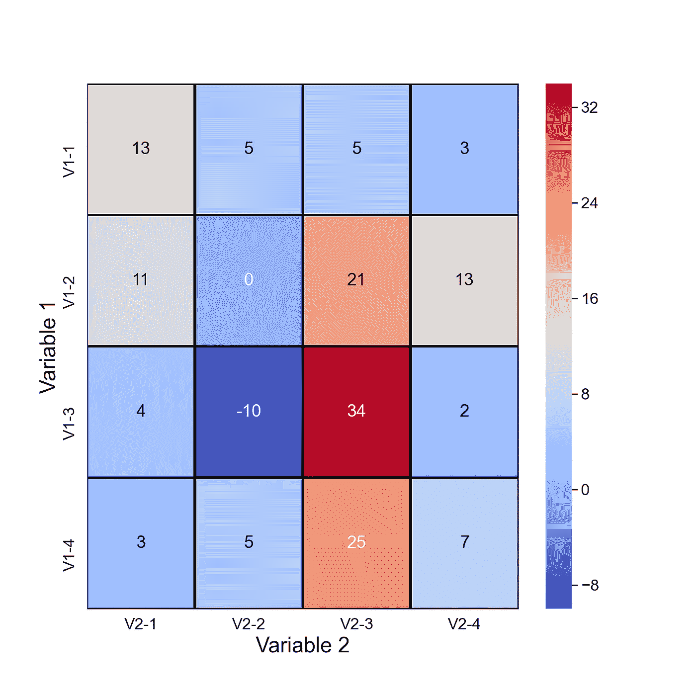
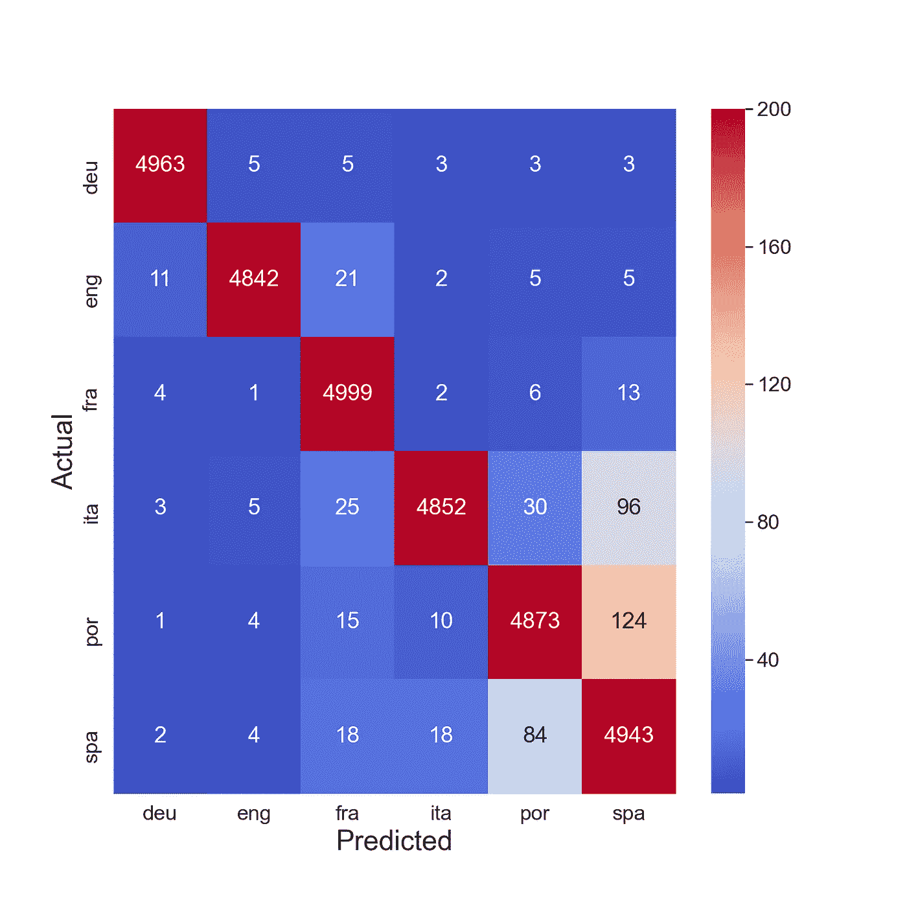
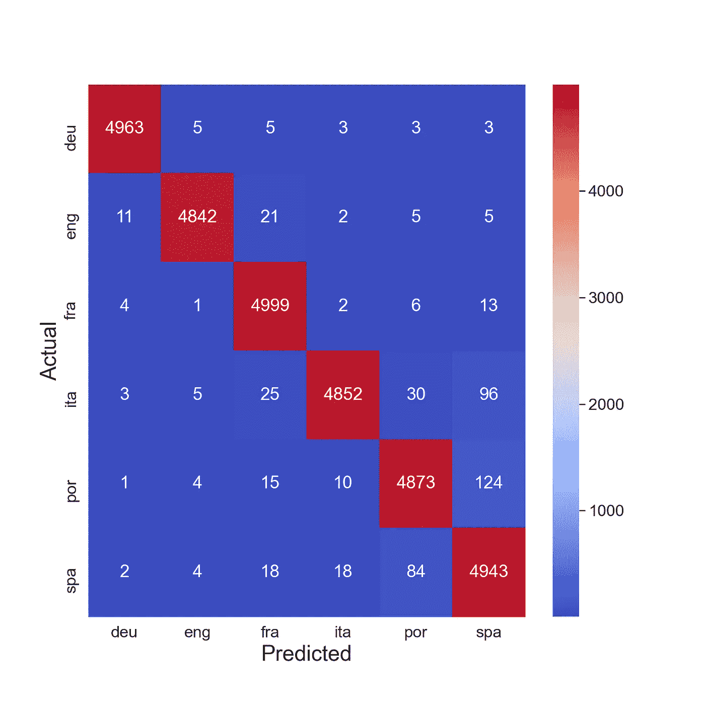
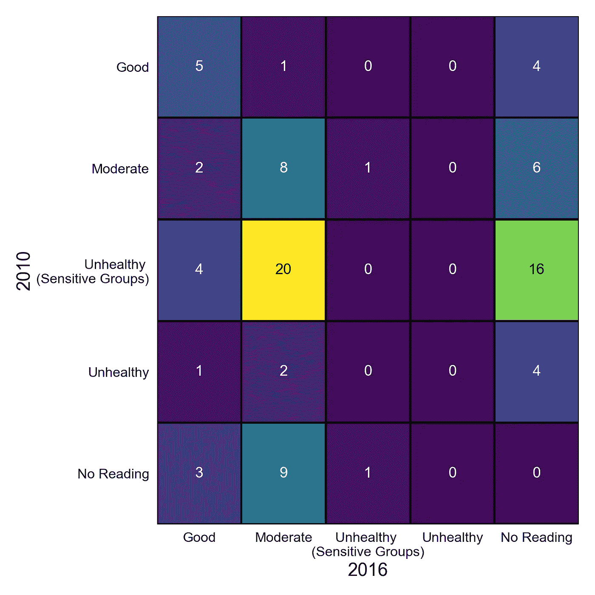
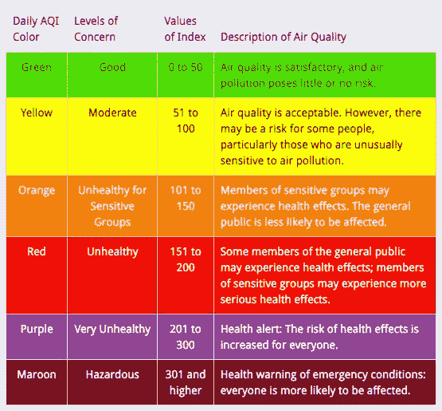
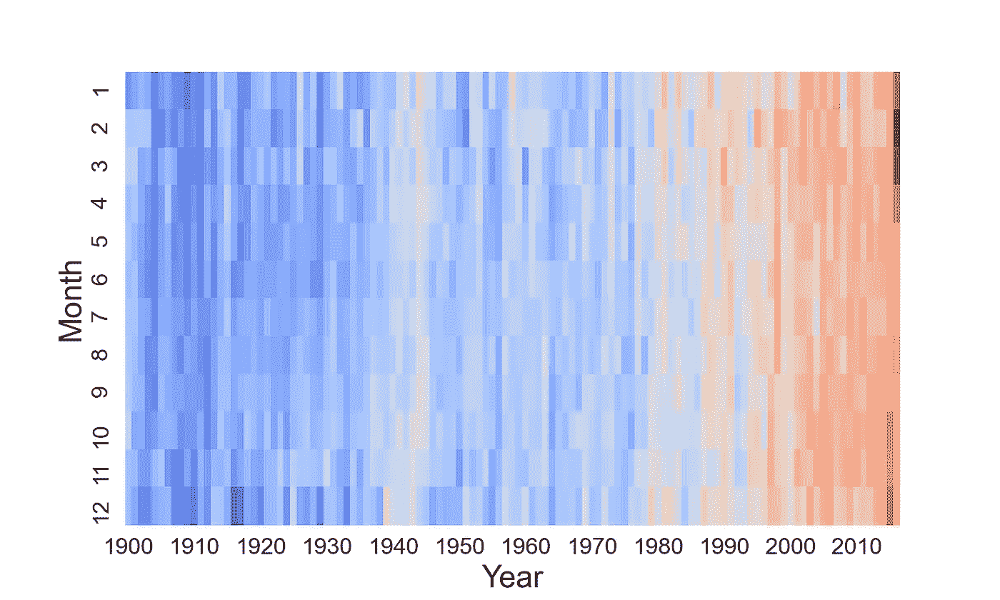
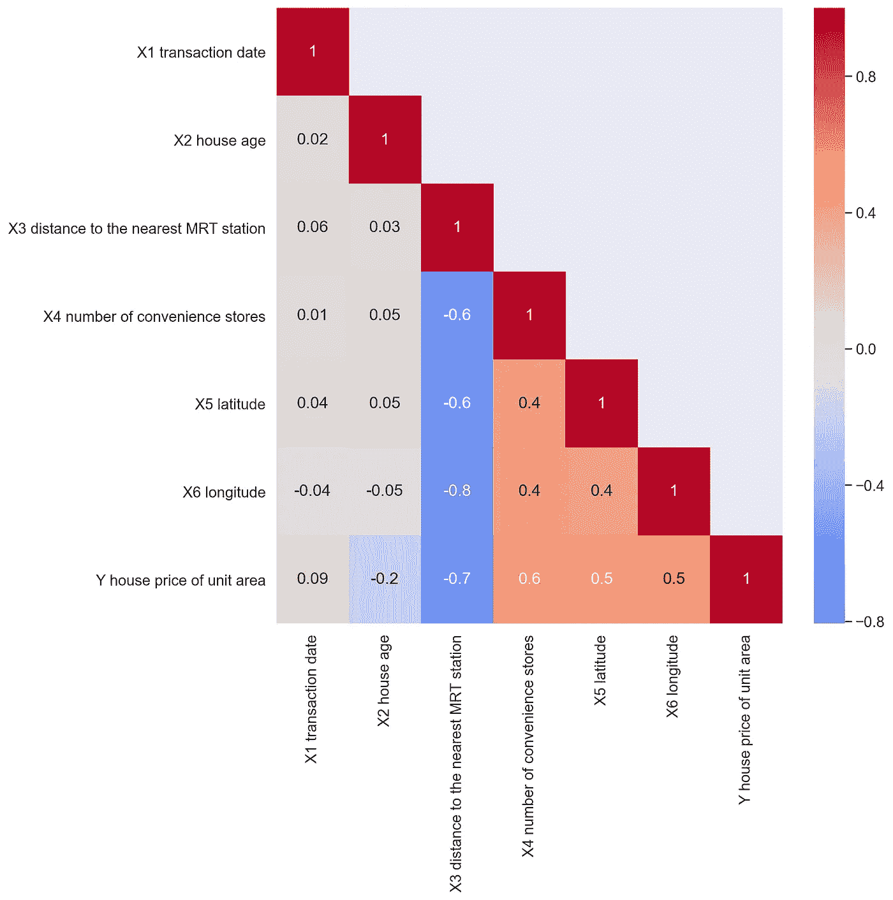

# 使用 Seaborn 热图的 5 种方法(Python 教程)

> 原文：<https://towardsdatascience.com/5-ways-to-use-a-seaborn-heatmap-python-tutorial-c79950f5add3>

## 使用热图显示混乱矩阵、时间序列变化、温度变化、相关矩阵和 SHAP 相互作用值

(来源: [flaticon](https://www.flaticon.com/free-icon/statistics_2920323) )

热图可以让您的数据栩栩如生。百搭又抢眼。在许多情况下，它们可以突出显示数据中的重要关系。具体来说，我们将讨论如何使用它们来观想:

*   用于模型准确性的**混淆矩阵**
*   显示组间**运动的时序数据**
*   显示**温度变化的时间序列数据**
*   一个**相关矩阵**
*   平均值 **SHAP 相互作用值**

在此过程中，您将了解到定制热图的不同方法。我们将讨论创建它们的代码，你可以在 [Github](https://github.com/conorosully/medium-articles/blob/master/src/seaborn_heatmap.ipynb) 上找到完整的项目。

首先，您可以观看此视频进行概述:

# 什么是热图？

让我们从讨论什么是热图以及为什么它们如此有用开始。你可以在**图 1** 中看到一个例子。y 轴上是变量 1。在这种情况下，变量 1 可以采用不同的 4 个值。即“V1-1”是变量 1 的第一个值。类似地，我们在 y 轴上有变量 2。还有第三个变量。这是每个单元格内的值。每个单元格的颜色由该变量的值决定。

图 1:示例热图(来源:作者)

因此，使用热图，我们能够可视化 2D 平面上 3 个变量之间的关系。这些关系可能很复杂。这就是使用颜色的原因。它可以突出关系的重要方面，使它们更容易理解。

我们应该记住，热图仍然是有限的。变量 1 和变量 2 需要是**离散的**或**分类的**。或者，如果它们是连续的，我们需要能够将它们分组。另一方面，变量 3 需要是一个**连续的**变量。希望在我们讨论下面的 5 个热图时，这一点会很清楚。

# 1)混淆矩阵

我们的第一张热图，在图 2 中，是混乱矩阵的可视化。这来自于一个用来预测一段文字语言的模型。y 轴给出了文本的实际语言。x 轴给出了模型预测的语言。对角线上的数字给出了正确预测的次数。非对角线给出了错误预测的数量。例如，英语(eng)被错误地预测为德语(deu) 11 次。

图 2:相关矩阵(来源:作者)

当你的目标变量有很多类时，像这样可视化一个混乱矩阵是很有用的。它可以突出模型哪里出了问题。例如，我们看到该模型最常混淆葡萄牙语(por)和西班牙语(spa) (124 次)或西班牙语和葡萄牙语(84 次)。这是有道理的，因为在所有的语言中，这两种语言在词汇上是最相似的。

## 热图代码

要创建此热图，我们首先要导入下面的包。热图函数来自 seaborn 包(第 6 行)。我们将对所有 5 个热图使用相同的包。确保您已经安装了它们。

我们有一个 2D 阵列用于填充下面的热图。这些给出了正确和错误预测的数量。您可以看到第一个子阵列(第 2 行)对应于**图 2** 中热图第一行的值。所有热图都是使用类似于此图的 2D 阵列填充的。如果您需要将此代码用于另一个热图，您可以用您的 2D 阵列替换此混淆矩阵。

现在，我们已经对 2D 数组进行了硬编码。下面的文章将带你了解我们是如何得到这些数字的。总而言之，我们已经使用 NLP 技术建立了一个神经网络。然后，我们使用这个模型来预测测试数据集中的文本语言。你在上面看到的数字来自这些预测。

</deep-neural-network-language-identification-ae1c158f6a7d>  

使用这个 2D 数组，我们创建一个熊猫数据帧( ***conf_matrix_df*** )。我们使用不同的语言作为列名和行名。

最后，我们使用 seaborn heatmap 函数(第 5–9 行)来可视化这个数据帧。除了 ***conf_matrix_df，*** 我们还传递了几个参数。 ***cmap*** 给出配色方案。将此设置为“冷温”会为我们提供红色和蓝色单元格。将 ***不能*** 设置为 true 会给出每个单元格中的数字。没有它，我们就只有颜色。 ***fmt*** 定义了颜色的格式。在创建其他热图时，我们将看到这些参数的一些变化。

最后一个参数是**VMAX。**这定义了色标的最大值。如果您没有为此参数传递值，它将默认为热图中的最大值。在这种情况下，它是正确的法语(fra)预测数(即 4999)。我们将该值设置为 200，因为这样更容易区分不正确的预测。你可以在**图 3** 中看到我们的意思。此热图是使用 ***vmax*** 的默认值创建的。

图 3:没有 vmax 的关联矩阵(来源:作者)

# 2)群体间的运动

我们的第二张热图展示了我们如何可视化分类变量随时间的变化。具体来说，我们显示了美国城市的空气质量指数(AQI)。y 轴表示 2010 年的空气质量指数水平，x 轴表示 2016 年的水平。单元格值给出了从一个级别移动到另一个级别的城市的数量。例如，我们可以看到 20 个城市从不健康(敏感人群)水平改善到中等水平。

图 4:一段时间内的空气质量指数水平(来源:作者)

AQI 是 0 到 500 之间的值。数值越高，空气污染程度越高。空气质量指数是使用 4 种不同的污染物计算的——二氧化氮(NO2)、二氧化硫(SO2)、一氧化碳(CO)和臭氧(O3)。具体来说，为了得到最终的空气质量指数，我们取这 4 种污染物的最大空气质量指数。在**图 5** 中，您可以看到不同关注级别的 AQI 范围。我们在热图中使用了这些级别。

图 5:空气质量指数水平(来源: [AirNow](https://www.airnow.gov/aqi/aqi-basics/)

为了创建热图，我们首先加载数据集(第 2 行)。你可以在 [Kaggle](https://www.kaggle.com/datasets/sogun3/uspollution) 上找到这个数据集。每天都有读数。我们只对阅读的年份感兴趣。因此，我们创建了一个包含阅读年份的列(第 5–6 行)。

这是一个 x 轴和 y 轴上的变量最初是连续变量的例子。如前所述，我们需要对这个变量进行分组。下面的 ***aqiGroup*** 函数就是用来做这个的。它将根据 AQI 值返回一个级别。它使用与图 5 中**相同的范围。**

为了得到最终的 2D 矩阵，我们需要做一些数据处理。我们首先使用 4 种污染物的值计算 AQI 值(第 2 行)。然后对于每个城市，我们计算每一年的最大 AQI(第 5 行)。因此，您在热图中看到的数值实际上是基于 2010 年和 2016 年的最大 AQI 值。最后，我们使用 ***aqiGroup*** 函数对 AQI 值进行分组(第 8 行)。

我们得到了 2016 年(第 2-3 行)和 2010 年(第 6-7 行)的所有 AQI 值。然后我们连接这些表(第 10 行)。在某些情况下，一个城市可能一年有一个读数，而另一年没有。在这种情况下，我们用“无读数”替换丢失的值(第 11 行)。这个最终数据集 **AQI** 将包含每个城市在 2016 年和 2010 年的水平。

好了，现在我们有了这个数据集，我们可以用它来创建 2D 数组， ***hm_array*** 。这用于填充热图。这将与我们在第一个热图中看到的硬编码阵列具有相同的结构。该数组是在第 6 到 12 行创建的。其中，对于每个级别组合，我们计算 ***AQI*** 数据集中的记录数(第 10-11 行)。和以前一样，我们使用这个 2D 数组创建一个数据帧。我们使用 AQI 级别作为列名和行名。

最后，我们像以前一样创建热图。这次我们有不同的参数值。我们使用了不同的配色方案， ***cmap*** 。我们已经将 ***cbar*** 设置为 false。这隐藏了颜色栏。我们还使用了 ***线宽*** 和 ***线条颜色*** 参数来给出热图的黑色网格线。

# 3)温度随时间变化

类似于上一个热图，我们用这个来可视化时间序列数据。除了现在，我们展示了一个连续变量是如何随时间变化的。在**图 4** 中，您可以看到一段时间内的全球平均气温。从 1900 年到 2016 年每个月都有读数。在接下来的几个月里，你可以清楚地看到气候变化的影响。也许我们对“热图”这个术语的理解有点过于字面化了。

图 6:一段时间内的平均温度(来源:作者)

我们从加载数据集开始(第 1 行)。你可以在[数据中心]找到这个。数据集包含两个不同的温度读数来源。我们只选择 GISTEMP 读数(第 4 行)。然后我们为每个读数创建一个年和月的列(第 7-9 行)。

与之前一样，我们创建了一个用于填充热图的 2D 阵列。在之前的热图中，所有 2D 阵列都是对称的。情况并不总是如此。对于此热图，每个月都有一个子阵列(即 1 到 12)。这些子数组中的每一个都将包含从 1900 年到 2016 年每年的温度值。所以我们现在有一个 12x117 的阵列。我们用年份作为列名，用月份作为行名来创建一个数据帧。

我们像以前一样想象这个数据帧。最大的不同是我们将**x*tick labels*参数设置为 10。这意味着只显示 x 轴上的第 10 个标签。您可以在图 6** 的**中看到这一点，其中只有 1900、1910、1920 等的标签..被显示。**

# 4)相关矩阵

我们的第四张热图可能你已经看过了。一个常见的用途是可视化数据集中的相关性。例如，我们在**图 7** 中有一个房价数据集的相关矩阵。我们可以利用这一点来确定任何可能在我们的模型中引起问题的多重共线性。例如，X3 和 X4 呈负相关。最后一行还给出与目标变量 y 的相关性。我们可以利用这一点来了解是否有任何特征与 y 有显著关系。

图 7:相关矩阵(来源:作者)

为了创建这个热图，我们首先加载数据集(第 2 行)。你可以在 UCI 的[机器学习知识库](http://archive.ics.uci.edu/ml/datasets/Real+estate+valuation+data+set)中找到它。使用这个数据集，我们创建一个相关矩阵(第 5 行)。结果将是一个熊猫的数据框架。列名和行名将与数据集中的要素名相同。

您可能已经注意到，在**图 7** 中，对角线上方的单元格是空白的。为此，我们首先需要创建一个遮罩。这是一个 2D 阵列，类似于我们用来填充以前的热图的阵列。对于要显示的单元格，数组的值应为“True”。否则，对于空白单元格，它们应该为“False”。我们使用下面的代码来创建遮罩。

最后，我们可以显示我们的热图。这一个的唯一区别是我们需要将掩码作为参数传递(第 8 行)。

# 5) SHAP 互动价值观

我们最后的热图可用于突出显示对模型预测很重要的特征。它是通过取平均 SHAP 相互作用值产生的。它在对角线上显示了平均主效应。比如我们可以看到，对于体验、学位、性能、销量，主效应大。类似地，平均相互作用效应在非对角线上。我们可以看到，体验、程度和绩效、销售互动的影响是显著的。

图 8:平均 SHAP 互动值(来源:作者)

我们不会讨论用于创建该热图的代码。如果你感兴趣，你可以在下面的文章中找到它。我们深入研究 SHAP 互动价值观。我们还使用这些值创建和解释其他图。这些用来解释你的机器学习模型。

</analysing-interactions-with-shap-8c4a2bc11c2a>  

我希望这篇文章对你有帮助！如果你想看更多，你可以成为我的 [**推荐会员**](https://conorosullyds.medium.com/membership) **来支持我。你可以访问 medium 上的所有文章，我可以得到你的部分费用。**

<https://conorosullyds.medium.com/membership>  

你可以在|[Twitter](https://twitter.com/conorosullyDS)|[YouTube](https://www.youtube.com/channel/UChsoWqJbEjBwrn00Zvghi4w)|[时事通讯](https://mailchi.mp/aa82a5ce1dc0/signup)上找到我——注册免费参加 [Python SHAP 课程](https://adataodyssey.com/courses/shap-with-python/)

## 图像来源

所有图片都是我自己的或从[www.flaticon.com](http://www.flaticon.com/)获得。在后者的情况下，我拥有他们的[保费计划](https://support.flaticon.com/hc/en-us/articles/202798201-What-are-Flaticon-Premium-licenses-)中定义的“完全许可”。

## 数据集源

**热图 2，**来源:[美国污染数据](https://www.kaggle.com/datasets/sogun3/uspollution)，许可证:开放数据库许可证(ODbL) 1.0

**热图 3** ，来源:[全球气温时间序列](https://datahub.io/core/global-temp)，牌照:ODC-PDDL-1.0

**热图 4** ，来源:[房地产估价数据集数据集](http://archive.ics.uci.edu/ml/datasets/Real+estate+valuation+data+set)，牌照:CC0:公共领域