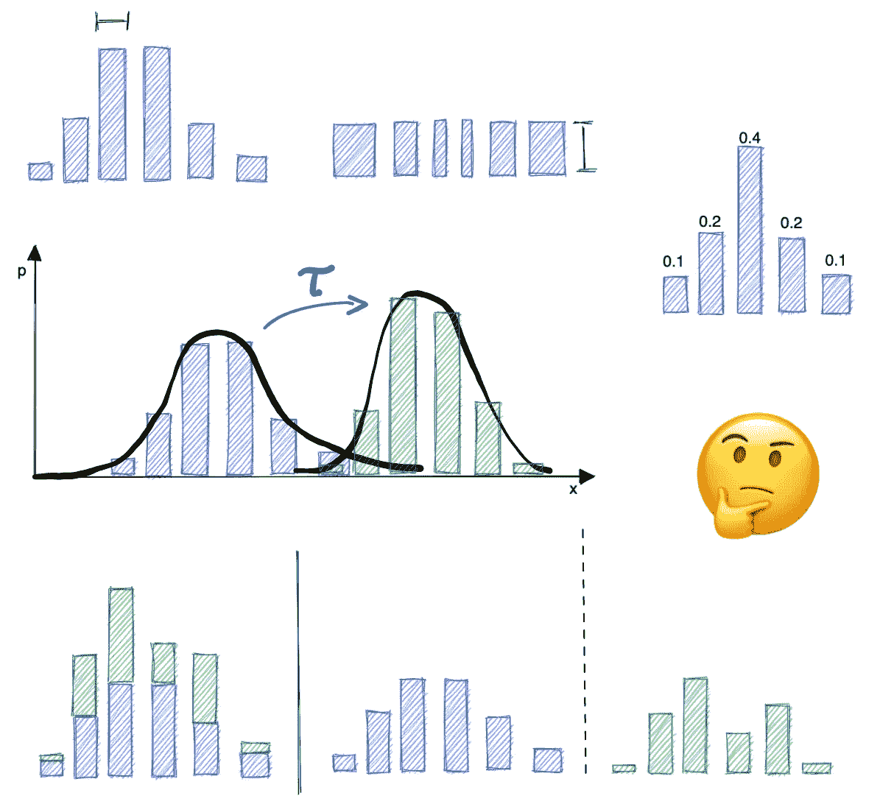
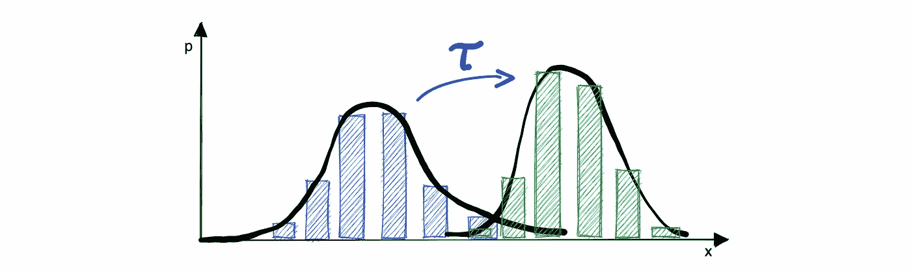
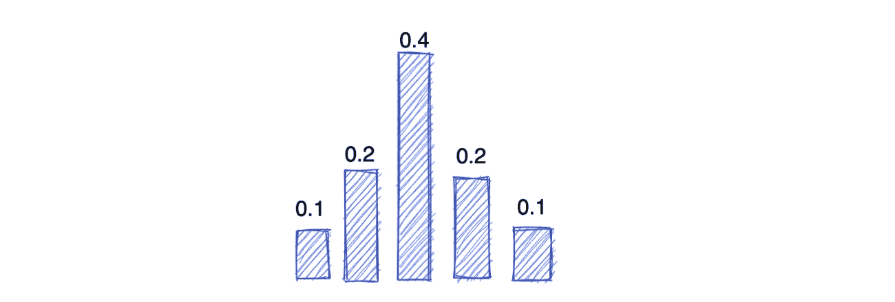
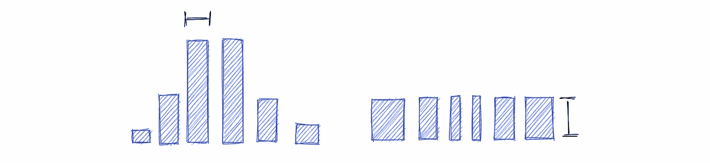
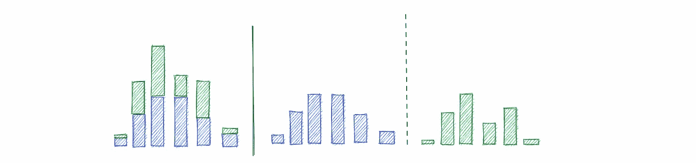
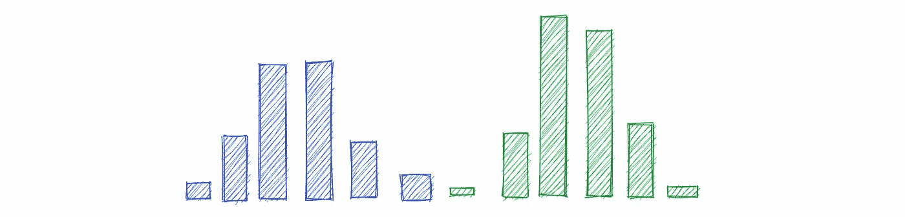

# 将直方图与机器学习算法结合使用的 5 种方法

> 原文：<https://towardsdatascience.com/5-ways-to-use-histograms-with-machine-learning-algorithms-e32042dfbe3e>

## 从特征工程的角度来看

机器学习的直方图特征工程(图片由作者提供)

特征工程是使用领域知识来创建使机器学习算法更好工作的特征的过程。这是应用机器学习的一个关键部分，通常是成功和不成功项目的区别。

另一方面，直方图被认为是数据预处理的第一步。这是用简单的基础进行数据探索的必要步骤:它总结了您的观察结果，并以简洁的方式呈现出来。

但是我们如何从直方图中提取特征呢？

让我们看看五种可以帮助我们提取特征的方法，这些特征可以使我们的模型更加健壮和高效。

# 测量直方图之间的距离

距离测量用于确定两个物体有多相似或不相似。它是许多机器学习算法中的关键元素。要素向量之间的距离函数为您提供了一种评估数据集中两个对象是否相似的方法。

> 换句话说，它为您提供了评估两个特征之间相似程度的标准。

测量距离有许多不同的方法，每种方法都有自己的优缺点。最常见的距离度量是欧几里德距离、曼哈顿距离和余弦相似性。

但是直方图之间的距离呢？

还有很多方法:库尔贝克-莱布勒散度，卡方统计，指数散度，海灵格距离，沃瑟斯坦距离…

两个直方图之间距离的图示(图片由作者提供)

后者是概率测度空间中非常自然的度量。这是一个非常通用的度量标准，用于测量将一个直方图改变为另一个直方图所需的“工作量”,并可用于比较不一定相同的分布。

# 归一化直方图

规范化数据非常重要，因为这有助于提高使用要素的算法的性能。当数据被归一化时，这意味着数据中的所有要素都在相同的比例上。

一些算法对数据的规模很敏感，规范化数据甚至可以帮助一些算法更快地收敛到一个解决方案。

介于 0 和 1 之间的归一化直方图(图片由作者提供)

但是归一化直方图还有其他原因:

1.  以确保数据均匀分布。
2.  以确保所有数据可见。
3.  使数据集之间的比较更容易。

# 更改宁滨方案

对于对高维特征向量敏感的机器学习算法，我们可以通过简单地使用较少数量的箱或较小范围的值来减少维数。

宁滨计划主要有两种类型:

*   等宽宁滨:在等宽宁滨中，每个箱子的宽度是相同的。这是最常见的宁滨。
*   等频宁滨:在等频宁滨中，每个箱包含相同数量的数据点。

等宽(左)和等频(右)宁滨示例(图片由作者提供)

还有其他类型的宁滨计划，但这是两个最常见的。等宽宁滨是最常见的宁滨类型，因为它最容易实现，也最容易理解。

> 然而，等频率宁滨可能更有效，因为它确保每个箱包含相同数量的数据点。

# 将直方图分成几部分

有几个原因可以解释为什么要将直方图分成几个部分。一个原因是，如果将两个或多个直方图分成几个部分，比较它们会更容易。

直方图分割示例(按作者分类的图像)

这是因为当数据被分成几个部分时，数据中的模式或趋势会变得更加明显。

例如，人口身高直方图可以按地理区域划分，并可能显示不同国家的身高分布不同。

# 组合直方图

这最后一部分非常具体。我举个例子解释一下。假设我们有一个图片数据集，我们想用[方向梯度直方图](https://medium.com/analytics-vidhya/a-gentle-introduction-into-the-histogram-of-oriented-gradients-fdee9ed8f2aa)进行分析，但是我们也想根据它们的颜色分量来分离数据。

两个组合直方图的示例

在这种情况下，我们可以将方向梯度直方图与颜色直方图结合起来，如下所示。

*   猪:[0.01，0.02，..]
*   颜色直方图:[0.02，0.03，..]
*   合计:【0.01，0.02，..,0.02, 0.03, ..]

我们可以连接两个直方图，甚至给每个直方图增加权重，以给予一个直方图或多或少的重要性:

*   结合权重:【0.01*w1，0.02*w1，..，0.02*w2，0.03*w2，..]

# 结论

为了更好地理解直方图所代表的数据，有多种方法可以操作直方图。通过测量直方图之间的距离，我们可以知道它们有多相似或不同。

我们还可以归一化直方图以便更容易地进行比较，更改宁滨方案以便更好地可视化数据，或者将直方图分割成几个部分以便更好地理解数据分布。

最终，我们可以将直方图结合在一起，形成可以帮助我们解决非常具体的机器学习问题的特征。

好奇想了解更多关于 Anthony 的工作和项目吗？在[中](https://medium.com/@anthonycvn)、 [LinkedIn](https://www.linkedin.com/in/anthonycavin/) 、 [Twitter](https://twitter.com/Anthony66333223) 上关注他。

*需要技术作家？将您的请求发送到*[*https://amigo CCI . io*](https://amigocci.io/blog/mlops-at-medium-scale/)*。*