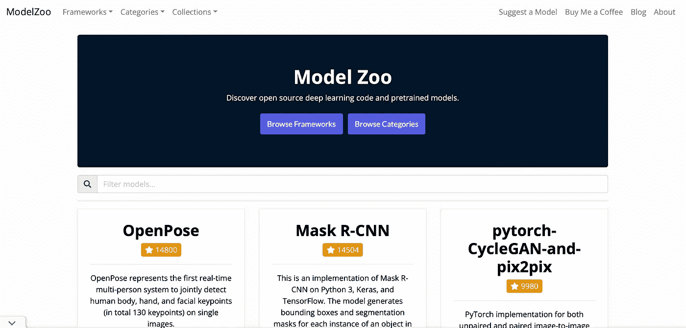
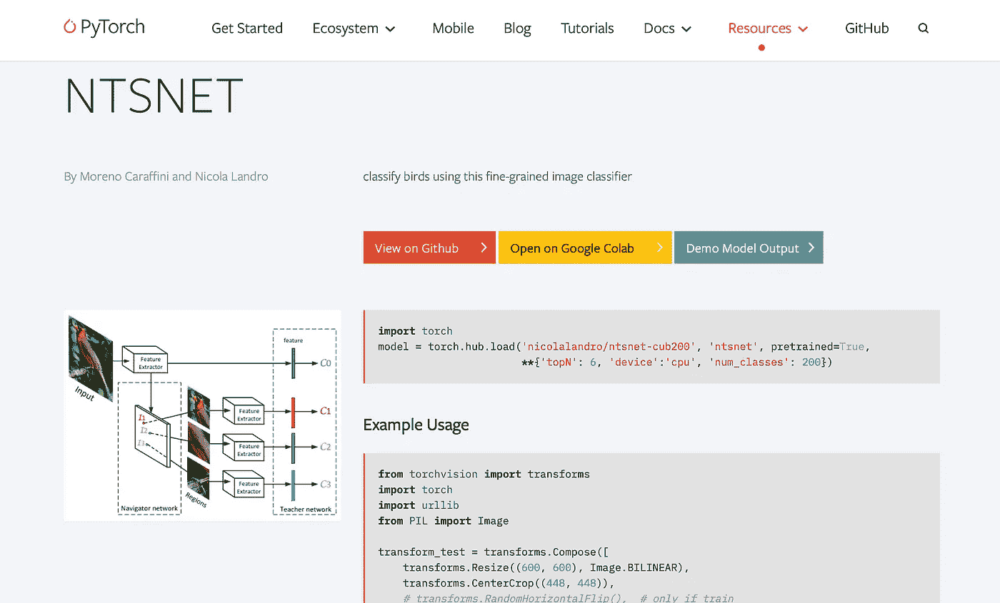
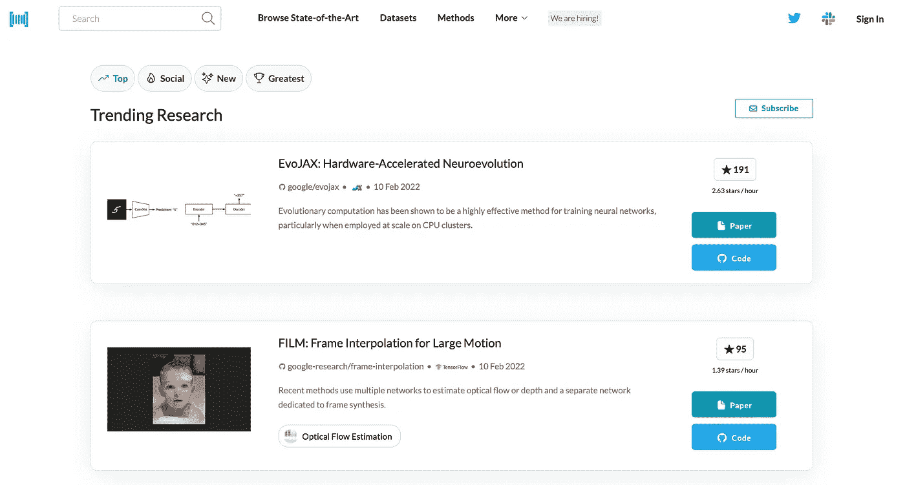
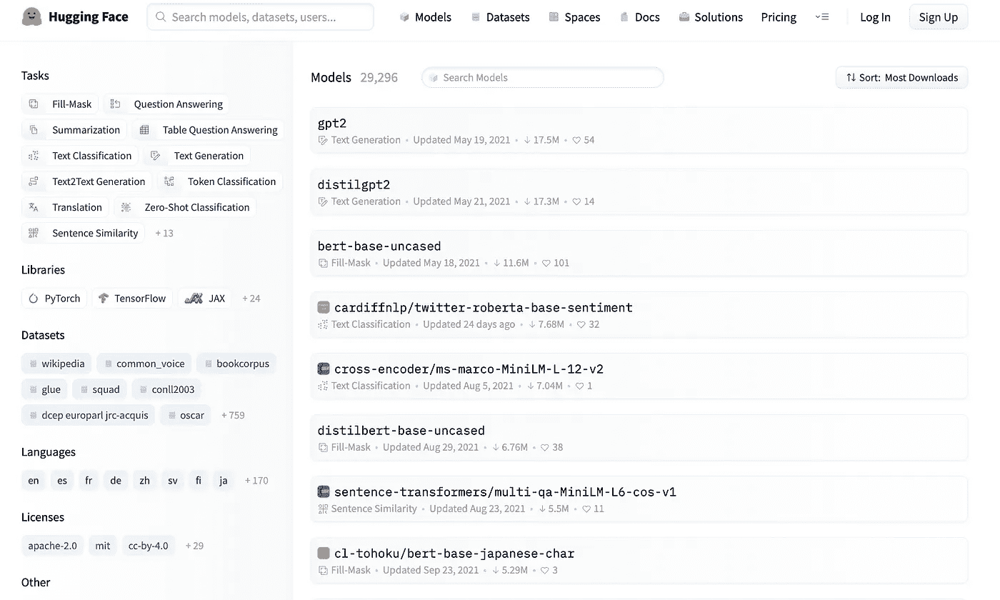

# 5 个网站下载预先训练好的机器学习模型

> 原文：<https://towardsdatascience.com/5-websites-to-download-pre-trained-machine-learning-models-6d136d58f4e7>

## 不需要训练机器学习模型，只需下载一个预先训练好的模型，让其他人来做繁重的工作

从计算机视觉到自然语言处理(NLP ),机器学习模型似乎每年都在各种任务和领域中实现更高的准确性。)为了做到这一点，在公司和研究机构工作的科学家和工程师会修改模型的架构，通常会使它们变得更加复杂，并使用令人印象深刻的大量数据来训练它们。举个例子，来自 OpenAI 的最新 NLP 模型，GPT-3，有[1750 亿个参数(是的，那是一个 b)，在一台机器上训练它需要大约 355 年](https://lambdalabs.com/blog/demystifying-gpt-3/)。但即使训练更简单的模型也可能很难:获得足够的数据以实现良好的性能通常是一个很大的挑战。这使得个人甚至小公司很难使用这些 ML 模型，如果他们不得不从头开始训练它们的话。

让别人帮你做这些繁重的工作[约翰·阿拉诺](https://unsplash.com/@johnarano?utm_source=medium&utm_medium=referral)在 [Unsplash](https://unsplash.com?utm_source=medium&utm_medium=referral) 上拍摄。]

幸运的是，我们可以通过使用预先训练的 ML 模型来解决这个问题。这已经成为 ML 中事实上的新趋势，理由很充分:它不仅节省了时间和金钱，而且意味着您将要使用的模型已经过测试，并且实现了非常好的(如果不是最先进的)性能。然而，找到预先训练的模型并不容易，因为还没有太多公开可用的资源。

这就是为什么我列出了我认为最好的 5 个下载预训练模型的网站。我真诚地希望这能帮助任何对使用 ML 感兴趣的人，如果是你，请在下面的评论中告诉我。没有任何进一步的行动，让我们从列表开始。

## [模型动物园](https://modelzoo.co)

这可能是当今最受欢迎的预训练 ML 模型库。Model Zoo 有一个很好的、易于使用的界面，在其中你可以搜索可用的模型，通过关键词、任务和框架进行过滤。可以找 Tensorflow，PyTorch，Caffe 等几款。大多数模型都发布在 Github 上，所以你也可以在那里看到它们的许可和要求。

模型动物园可能已经成为预先训练的 ML 模型的最受欢迎的储存库。]

## [TensorFlow —模型&数据集](https://www.tensorflow.org/resources/models-datasets)

Tensorflow 提供了另一个受欢迎的资源。在这里，您可以找到:

*   [TensorFlow hub](https://tfhub.dev/)，tensor flow 的预训练模型库。
*   [模型花园](https://github.com/tensorflow/models/tree/master/official)，一个用预先训练好的模型和例子创建的 Github 库。
*   [TensorFlow.js models](https://github.com/tensorflow/tfjs-models) ，可以在任何网络浏览器上运行的 TensorFlow 模型集合。

当然，这里的限制因素是所有这些模型都只能在 TensorFlow 上运行，所以如果您使用 PyTorch，请进入下一部分。

## [PyTorch Hub](https://pytorch.org/hub/)

PyTorch 也有一个专门用于预训练模型的部分，称为 PyTorch Hub(不是一个非常原始的名称，但是嘿，这不是这里重要的。)在这里，您可以按类别过滤模型，也可以使用关键字搜索模型。对于每个模型，您都可以找到简短的描述和使用说明，包括代码。

PyTorch Hub 包括使用每一个已发布模型的代码，甚至给你在 Google Colab 上使用的选项。]

## [证件代码](https://paperswithcode.com)

《带代码的论文》并不仅仅关注 ML 预训练模型，在这里还可以找到几个最先进的 ML 模型。该网站允许我们在大量已发表的论文中进行搜索，这些论文与它们的代码实现一起发布。你可以为你喜欢的任何任务和任何框架找到模型。不过筛选模型并不像前面三个网站那么容易，但是这个网站一个非常好的地方就是有代码的论文通常会先发布最新的 ML 模型。另外，你还可以找到与论文一起发表的数据集。

有代码的论文【图片由作者提供。]

## [抱紧脸🤗](https://huggingface.co)

最后，[🤗](https://huggingface.co)本质上可能不是一个预训练的 ML 模型目录，但它确实包括几个用于 NLP 的预训练模型，范围从情感、机器翻译、摘要等等。另外，因为[🤗](https://huggingface.co)实际上是一个 Python 库，一旦你安装了它，你只需要调用一个函数就可以使用所有包含的模型，非常方便易用。说到 NLP，[🤗](https://huggingface.co)永远是我的首选。我也不得不承认我喜欢它的名字(或者实际上是它的表情符号。)

[🤗](https://huggingface.co)是我最喜欢的 NLP 库【图片作者。]

# 还有一点

您可能已经注意到了，这些站点中的大多数会将您重定向到 github 存储库。Github 确实是你能找到的最大的预训练模型库。这意味着你可以随时在 Github 上搜索预先训练好的模型，并可能找到许多选项可供选择。

当然，你也可以找到很多其他的软件，但是软件仓库的质量没有保证。之前的网站的附加价值是他们已经选择了 Github 库，所以如果你决定直接在 Github 中搜索，你必须耐心找到你要找的东西。作为一个建议，总是检查项目中最后一次提交的日期，以查看项目的维护情况，并检查项目发布时使用的许可证。

# 其他有用的资源

*   如果您仍然想从头开始训练您的 ML 模型，那么您将需要一个好的数据集来完成这项工作。我用不同的数据集资源写了这篇文章，你可能会觉得有用。

  

*   [用 Python 进行深度学习](https://amzn.to/3oKx4OQ):如果你想用 Python 学习更多关于 ML 应用和模型的知识，这本书就是为你准备的！由 Keras 的创建者编写，它以实用的方式教授如何开发和部署 ML 模型。

 