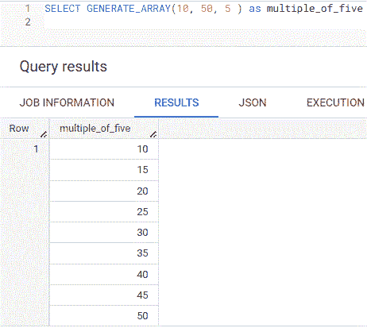
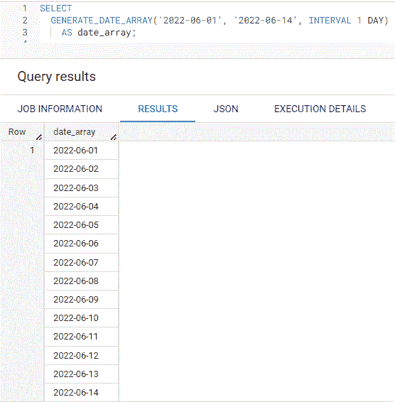
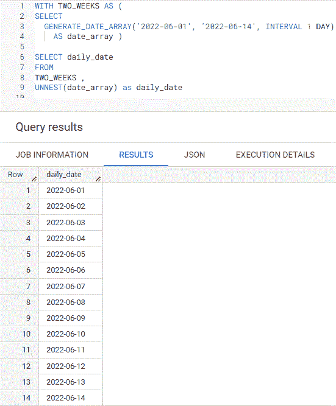
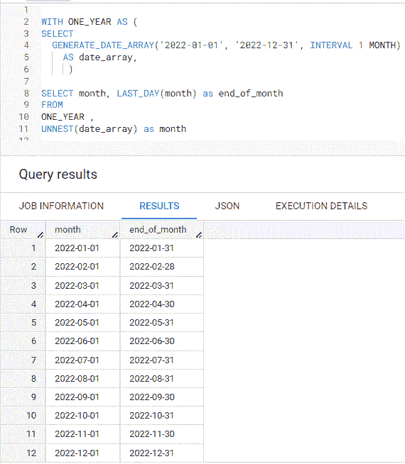
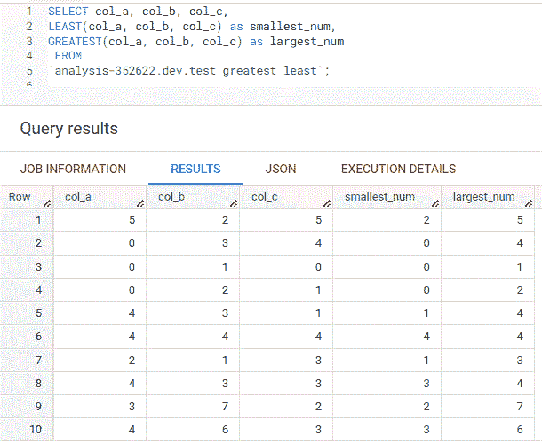

# 每个用户都应该知道的 6 个大查询 SQL 函数

> 原文：<https://towardsdatascience.com/6-bigquery-sql-functions-every-user-should-know-9ed97b1cf72e>

## 检查您的数据库是否也有它们

照片由来自[佩克斯](https://www.pexels.com/photo/photography-of-woman-using-laptop-1181681/)的[克里斯蒂娜·莫里洛](https://www.pexels.com/@divinetechygirl/)拍摄

在我的上一篇文章中，我讨论了可以简化查询的 [4 大查询 SQL 快捷方式](/4-bigquery-sql-shortcuts-that-can-simplify-your-queries-30f94666a046)。从那时起，我发现了 6 个更有用的 SQL 函数，我希望我能早点知道，今天我想和大家分享一下。

## 1.生成数组

**GENERATE_ARRAY** 函数允许您创建一个数组，其起始值和结束值以步长值递增。如果您想要生成一系列具有特定序列的数字，这将非常有用。注意，查询结果只有一行数据，因为值在一个数组中。

作者创建的 GENERATE_ARRAY 查询示例的屏幕截图

## 2.生成日期数组

与 GENERATE_ARRAY 类似， **GENERATE_DATE_ARRAY** 函数允许您按步长间隔创建一个日期数组。如果您需要创建一系列具有特定间隔的日期，这将非常有用。我使用下面的 1 天间隔创建了 14 个日期，但是您可以使用 BigQuery 支持的任何间隔，例如周、月和年。

作者创建的 GENERATE_DATE_ARRAY 查询示例的屏幕截图

## 3.UNNEST

函数允许你为一个数组的每个值创建行。UNNEST 可以与 GENERATE_ARRAY 或 GENERATE_DATE_ARRAY 一起使用。当我需要一个日期的主列表来连接时，这个函数非常有用，这样可以确保我查询的时间段内的所有日期都有值。

在下面的查询中，我创建了一个名为 *two_weeks* 的 [CTE](https://chartio.com/resources/tutorials/using-common-table-expressions/) ，然后对名为 *date_array* 的结果数组列使用 **UNNEST** 函数来创建每个日期的一行。为了让 UNNEST 正确工作，您**必须在从**和**中查询的****或**表名后添加一个逗号** **，然后在数组列上调用**的 **UNNEST** 函数。注意，查询结果显示了 14 行，表明 UNNEST 为 *date_array* 中的每个日期创建了一行。**

****

**作者创建的 UNNEST 查询示例的屏幕截图**

## **4.最后一天**

****LAST_DAY** 函数返回给定日期的当月最后一天。如果您需要提供一个月的最后一天来进行报告，这将非常有用。**

**在下面的查询中，我使用包含 2022 年每个月的第一天的 GENERATE_DATE_ARRAY 创建了一个名为 *one_year* 的 CTE，然后调用 **LAST_DAY** 函数来创建包含该月最后一天的第二列。查询结果显示 2022 年每个月的开始和结束。**

****

**作者创建的最后一天查询示例的屏幕截图**

## **5 / 6.最小和最大**

****最小**返回一组值或列中的最小值，而**最大**显示最大值。注意，如果任何参数为空，则返回空值。**

**在下面的例子中，我使用了**最小**和**最大**函数来返回样本表 *test_greatest_least* 中 3 列的最小和最大值。请注意，最小和最大与最小和最大函数有何不同，后者查看表中一列的所有行。这里， *col_a* 上的 MIN 和 MAX 将返回 0 作为 10 行中的最小值，MAX 将返回 5。**

****

**作者创建的最小和最大查询示例的屏幕截图**

## **最后的想法**

**虽然我提到的函数在 BigQuery 中可用，但 LAST_DAY、GREATEST 和 LEAST 等一些函数在 Redshift 和 Snowflake 等其他数据库中也可用。如果你有几分钟的时间，我强烈推荐阅读你的数据库文档，因为你永远不知道你可能会发现有用的功能。**

***注意:以上所有的查询都是在* [*大查询沙箱*](https://cloud.google.com/bigquery/docs/sandbox) *上运行的，这对任何拥有谷歌账户的人来说都是免费的。***

## **你可能也会喜欢…**

** [## 4 个可以简化查询的 BigQuery SQL 快捷方式

### 检查您的数据库是否也有它们

towardsdatascience.com](/4-bigquery-sql-shortcuts-that-can-simplify-your-queries-30f94666a046)  [## 如何对异常 KPI 变化进行故障排除

### 调查 DAU 下降的案例研究

towardsdatascience.com](/how-to-troubleshoot-an-abnormal-kpi-change-b9eb0c3d46a1)  [## 为什么建立机器学习模型就像烹饪一样

### 逐步比较

towardsdatascience.com](/why-building-a-machine-learning-model-is-like-cooking-4bed1f6115d1)**