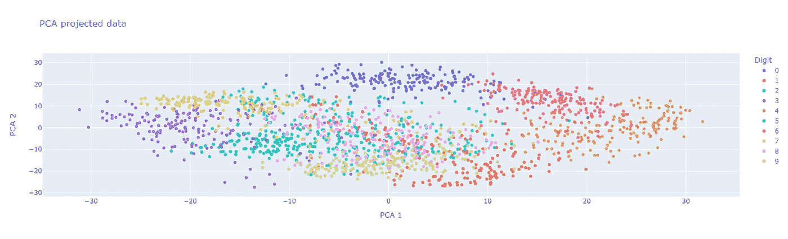
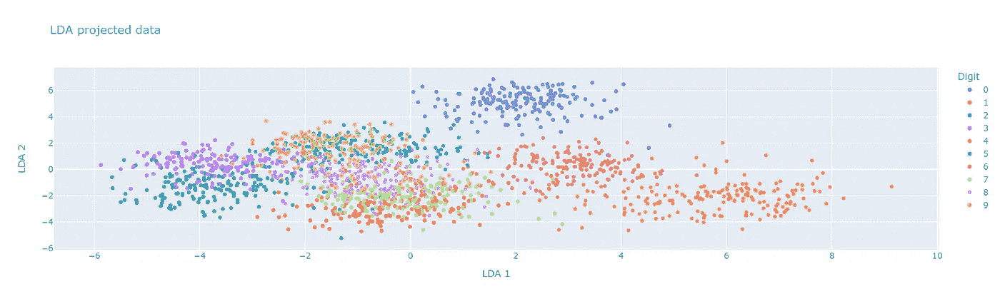
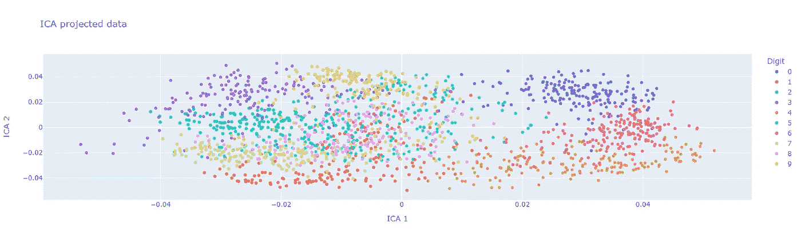
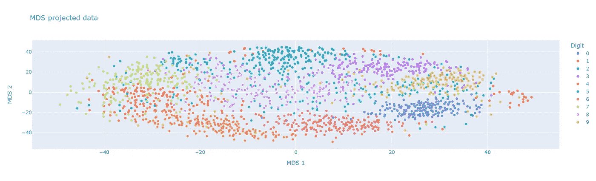
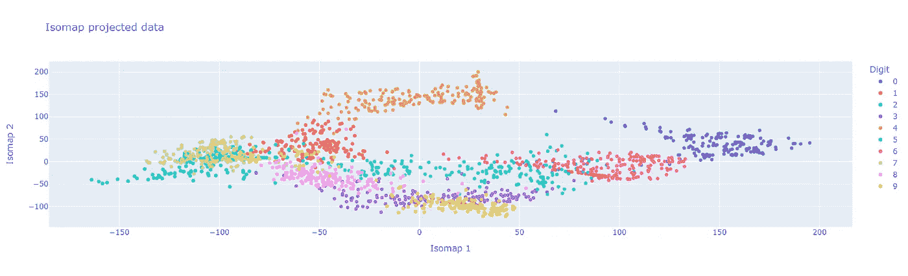
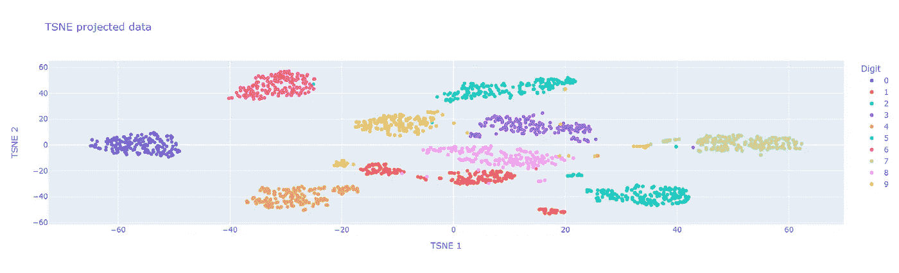

# 6 种降维技术

> 原文：<https://towardsdatascience.com/6-dimensionality-reduction-techniques-how-and-when-to-use-them-e4891c10b5db>

## 如何以及何时使用它们

来自 [Pexels](https://www.pexels.com/photo/yellow-and-white-3-d-cube-9436715/) 的 [Rodion Kutsaiev](https://www.pexels.com/@frostroomhead/) 摄影

在大数据时代，数据科学家正在使用拥有越来越多功能的数据集。这导致了一个众所周知的效应:**维度的诅咒。**当特征数量增加时，在某一点之后，模型的性能会下降。这是因为数据点的密度将随着维度的增加而降低(没有添加任何样本)。其中一个主要的后果是，模型变得非常容易过度拟合。

为了克服由于高维导致的过拟合、训练时间和存储的问题，一种流行的方法包括对原始数据集应用降维技术。

在这篇文章中，我将描述你在做数据科学项目时必须知道的六种降维方法。我将展示这些方法在著名的 [MNIST 数据集](http://yann.lecun.com/exdb/mnist/)上的应用。最后，我会在最后一部分比较和详细说明何时使用哪种方法。

# 主成分分析

该算法是最著名的特征提取算法之一。PCA 是一种无监督的线性变换算法，通过确定数据的最大方差来产生新特征。算法如下:

*   构建数据的协方差矩阵
*   对矩阵应用特征分解，并按降序对特征值进行排序
*   通过投影前 k 个特征值的子集来变换数据

主成分分析应用于 MNIST 数据集

PCA 有几个好处，比如不迭代，因此耗时较少。此外，它很好地减少了过拟合。然而，它仅限于线性投影，因此不能很好地处理非线性数据。这就是为什么没有一个数字在投影的 PCA 上形成真正分开的簇的原因。

# 线性判别分析(LDA)

与前一种方法一样，这种方法是一种线性特征提取算法，但这次是有监督的。该方法创建了一个新的特征空间来投影数据，目标是最大化类的可分性。它通过创建两个距离矩阵来做到这一点:类间的**和类内的**。第一个计算每个类的平均值之间的距离。第二个函数计算每个类的平均值与该类中的数据之间的距离。****

**算法如下:**

*   **构建两个距离矩阵**
*   **计算这些矩阵组合的特征值**
*   **对特征向量进行排序并构建 top-k 矩阵**
*   **投影新子空间的数据**

****

**应用于 MNIST 数据集的 LDA**

**选择前 k 个特征向量使得 LDA 类似于 PCA。然而，该算法的一个主要不便之处在于，在二元分类的情况下，在 LDA 之后将只有一个可用特征，而与最初可用特征的数量无关。**

# **独立成分分析**

**在介绍一些非线性算法之前，我想强调一下独立分量分析方法。这是一种线性的监督特征提取算法，可生成统计上独立的新特征。这是通过减少给定数据集中的二阶和高阶相关性来实现的。**

**算法是这样的:**

*   **将数据分解成混合矩阵 **A** 和新的基矩阵 **S****
*   **选择前 k 个组件**
*   **通过在那些 k 组件上投影来构建新的特征**

****

**IDA 应用于 MNIST 数据集**

**与前两种算法相比，ICA 搜索统计上独立的特征。它通过搜索非高斯特征来做到这一点。这种算法常用于*盲源分离*问题。该算法的一个限制是它不能分离高斯特征。**

# **多维标度(MDS)**

**接下来我将介绍的三种方法是非线性降维技术。第一种是非线性、无监督的维数约简技术。它侧重于多维空间中数据之间的关系，如相似性或不相似性。MDS 将相似的数据放在一起表示，将不太相似的数据放在一起表示。它通过找到一个输出来最大化原始要素和修改后的要素的距离矩阵之间的相似性。**

**算法是:**

*   **计算数据的相异矩阵**
*   **通过将数据居中来计算核矩阵 **K** 。**
*   **应用特征分解**
*   **通过选择前 k 个特征向量获得新的特征空间**

****

**MDS 应用于 MNIST 数据集**

**小心使用这种方法，因为它计算量很大。**

# **等距映射**

**这种方法来自于这样一个事实，即经典的缩放方法不能捕捉数据集中可能的非线性模式。这种非线性无监督方法通过在低维空间中保持数据之间的*成对测地线距离*来解决这个问题。它计算邻域图中所有数据对之间的最短路径，以近似它们之间的测地线距离。**

**这些步骤是:**

*   **构建数据的邻域图**
*   **计算测地线距离矩阵**
*   **将 MDS 应用于此测地线矩阵**

****

**ISOMAP 应用于 MNIST 数据集**

**正如我们可以观察到的将该方法应用于 MNIST 数据集，一些数字被很好地分离，但是对于类似的数字，例如 2 和 7，操作更复杂。这是因为 ISOMAP 是一种流形学习算法(最早的算法之一)，但由于它使用邻域图，有时会在元素之间建立错误的连接。非凸流形也很难用这种算法来分析。**

# **t 分布随机邻居嵌入(t-SNE)**

**我将介绍的最后一个算法是基于流形的降维技术。它是一种非线性的无监督方法，由于保留了数据的结构，因此便于可视化。该算法首先将数据点之间的欧几里德距离转换为表示相似性的条件概率。之后，t-SNE 最小化来自低维和高维空间的概率之间的差异(使用 Kullback-Leibner 散度)。**

**概括的算法是:**

*   **应用随机邻居嵌入来获得条件概率**
*   **通过最小化概率之间的距离，将高维空间映射到低维空间**

****

**t-SNE 应用于 MNIST 数据集**

**通过保持局部结构，该算法特别适用于低维空间中的数据可视化，如可以证明上面的 MNIST 数据，其中大多数数字类被很好地分离。**

# **结论**

**这六种降维技术代表了可用于此目的的各种方法。每种方法都有其特殊性和弱点，其中一些方法主要用于数据可视化，如 t-SNE。所有这些都与 Scikit-Learn 集成在一起，Scikit-Learn 提供了一种在机器学习管道中实现它们的简单方法。**

**通过下面的两个表格，我提供了整篇文章的有用摘要，详细说明了何时以及如何使用这些不同的特征提取算法。我们确实有一套工具来降低数据的维度，但每一种工具都必须在特定的环境中使用，才能真正有效。**