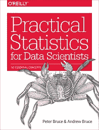
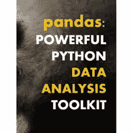
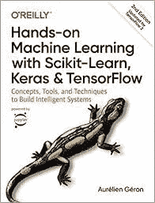
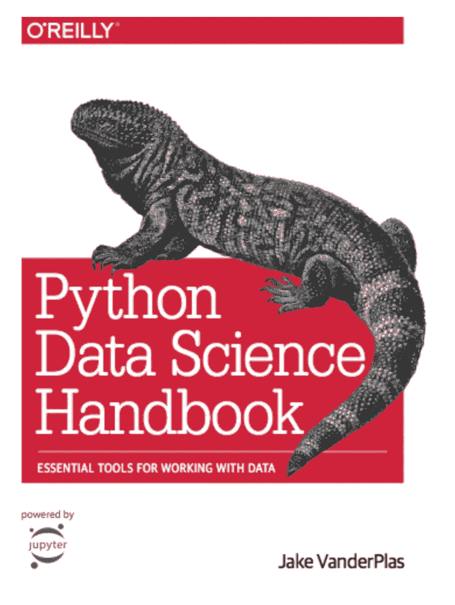
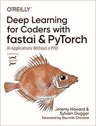

# 6 本面向完全初学者的免费数据科学书籍

> 原文：<https://towardsdatascience.com/6-free-data-science-books-for-complete-beginners-636810c0a06f>

## 你需要的每本书都是免费的

汤姆·赫曼斯在 [Unsplash](https://unsplash.com/s/photos/books?utm_source=unsplash&utm_medium=referral&utm_content=creditCopyText) 上的照片

数据科学是一个跨学科领域，需要包括计算机科学、数学、统计和机器学习在内的多个领域的广泛技能。作为学习数据科学的完全初学者，可能很难知道从哪里开始。

数据科学学位课程和训练营可以指导你完成结构化的课程。然而，如果你没有数千美元来支付这些课程，另一种选择是开发自己的课程，并使用免费或低成本的资源来学习。

我以前写过如何着手创建自己的个性化数据科学学习课程，可以在这里找到。免费资源在网上随处可见，但很难找到最好的。对于初学者来说，一个很好的学习来源是书籍，幸运的是，有几本免费的书籍可供阅读，涵盖了入门所需的概念。

在下面的文章中，我将为初学者介绍六本我最喜欢的免费书籍。本文中的每本书都涵盖了数据科学最重要的基础概念之一。我按照我个人推荐的顺序组织了这些标题。内容如下:

*   Python 编程基础。
*   数据科学统计学。
*   熊猫进行数据分析。
*   Python 数据科学工具包。
*   机器学习。
*   深度学习。

# 1.用正确的方法学习 Python

彼得·温特沃斯、杰弗里·埃尔克纳、艾伦·b·唐尼和克里斯·梅耶斯

 [## 用正确的方法学习 Python

### 《如何像计算机科学家一样思考》已经是现有的最好的 Python 入门书籍，但是我们有…

learnpythontherightway.com](https://learnpythontherightway.com/#about) 

[**在这里免费阅读**](https://learnpythontherightway.com/#read) **。**

Python 是数据科学的首选编程语言。因此，学习这种语言的编程基础是该领域初学者应该学习的第一件事。这本书不是专门针对数据科学编程的，而是涵盖了编写 Python 代码的一般概念。我建议先从这本书开始，然后再看本文后面推荐的书中涉及的数据科学 Python 包。

这本书假设没有编程知识，并介绍了 Python 语言和基本的通用编码原则。每章包含一个补充的 Youtube 视频，有助于进一步解释所涵盖的概念。

本书的作者还提供了一套[实践教程](https://www.codewithreplit.com)，其中包含超过 15 个实用的 Python 项目，可以将您的知识付诸实践。

# 2.数据科学实用统计学

*作者彼得·布鲁斯&安德鲁·布鲁斯*

图片由 amazon.co.uk 的[提供](https://www.amazon.co.uk/Practical-Statistics-Scientists-Peter-Bruce/dp/1491952962)

[**在这里免费阅读。**](https://github.com/ghoshark/E_Books/blob/master/Practical%20Statistics%20for%20Data%20Scientists.pdf)

这是迄今为止我发现的向初学者介绍数据科学中最重要的统计概念的最佳书籍之一。它涵盖了广泛的主题，包括数据采样，分布，统计实验和机器学习。

所有概念都用初学者友好的术语解释，并包括混合使用 R 和 Python 的实际代码示例。

# 3.熊猫:强大的 Python 数据分析工具包

韦斯·麦金尼和熊猫开发团队

图片来自[pandas.org](https://pandas.pydata.org/docs/pandas.pdf)

[**在这里免费阅读。**](https://pandas.pydata.org/docs/pandas.pdf)

Python 包 Pandas 是探索、转换、清理和处理数据科学数据的首选工具。这本书是该工具的完整用户指南。

它涵盖了一切，包括安装，基本使用，绘图和数据分析。它假设了 Python 的基础知识，这对于首先以正确的方式学习 Python 中的概念非常重要，但对于初学者和更有经验的学习者来说，它是这一基本工具的极好的参考指南。

# 4.使用 Scikit-learn、Keras 和 Tensorflow 进行机器实践学习

*作者奥雷连·杰龙*

图片由[amazon.co.uk](https://www.amazon.co.uk/Hands-Machine-Learning-Scikit-Learn-TensorFlow/dp/1491962291)提供

[**在这里免费阅读。**](https://www.knowledgeisle.com/wp-content/uploads/2019/12/2-Aurélien-Géron-Hands-On-Machine-Learning-with-Scikit-Learn-Keras-and-Tensorflow_-Concepts-Tools-and-Techniques-to-Build-Intelligent-Systems-O’Reilly-Media-2019.pdf)

这本书使用一些最流行的 Python 机器学习包 Scikit-learn、Keras 和 Tensorflow 对机器学习进行了详细的实践介绍。

这本书在介绍机器学习的重要理论概念方面做得很好，包括机器学习系统的类型、过拟合和欠拟合，以及常见算法如何工作的描述。

有很多实用的内容，包括一个典型的端到端机器学习项目的完整演练。这本书将为这一领域的新手提供完整的介绍。

# 5.Python 数据科学手册

杰克·范德普勒斯

图片来自 [jakevdp.github.io](https://jakevdp.github.io/PythonDataScienceHandbook/)

[**在此免费阅读。**](https://jakevdp.github.io/PythonDataScienceHandbook/)

这本书是对 Python 数据科学工具包的很好的、广泛的介绍。它介绍了 NumPy 库，包括数组、数组计算和 Python 中的数据类型等概念。

它还对熊猫的数据分析和 Scikit-learn 的机器学习进行了很好的、初学者友好的介绍。

# 6.Fastai 和 Pytorch 的深度学习:没有博士学位的人工智能应用

由杰瑞米·霍华德和西尔万·古格创作

amazon.co.uk[的形象礼仪](https://www.amazon.co.uk/Deep-Learning-Coders-fastai-PyTorch/dp/1492045527/ref=asc_df_1492045527/?tag=googshopuk-21&linkCode=df0&hvadid=427942038446&hvpos=&hvnetw=g&hvrand=30326276525358601&hvpone=&hvptwo=&hvqmt=&hvdev=c&hvdvcmdl=&hvlocint=&hvlocphy=9045104&hvtargid=pla-917301026067&psc=1&th=1&psc=1&tag=&ref=&adgrpid=103526071870&hvpone=&hvptwo=&hvadid=427942038446&hvpos=&hvnetw=g&hvrand=30326276525358601&hvqmt=&hvdev=c&hvdvcmdl=&hvlocint=&hvlocphy=9045104&hvtargid=pla-917301026067)

[**在这里免费阅读。**](https://github.com/fastai/fastbook)

这本书是深度学习的实用入门。它的目标读者是程序员，所以在深入阅读本书之前，理解 Python 编程是必不可少的。然而，它并不假设对数学和统计学有深刻的理解，并包括一些对深度学习背后理论的优秀和简单的解释。

这是学习深度学习的理想的第一次介绍，并将让你开始开发你的第一个深度学习模型。

互联网上有大量免费或低价的学习数据科学的资源。这包括免费课程、大学讲座、教程、视频、博客帖子和书籍。在本文中，我提供了六本免费阅读的书籍的链接，这些书籍本身就可以为一个完全的初学者提供数据科学领域的优秀知识基础。

我以前写过几篇文章，涵盖了学习这些主题的各种免费资源。如果你想超越这些介绍性的概念，或者正在寻找教科书以外的资源，下面的链接将帮助你开始。

 [## 如何免费学习数据科学

### 一个完整的学习路径，包括不花你一分钱的资源

towardsdatascience.com](/how-to-learn-data-science-for-free-eda10f04d083)  [## 学习自然语言处理的 10 个免费资源

### 使用这些神奇的资源免费学习 NLP

towardsdatascience.com](/10-free-resources-for-learning-natural-language-processing-81a380540cd1)  [## 数据科学学习资源

### 介绍学习数据科学的免费资源精选列表

rebecca-vickery.medium.com](https://rebecca-vickery.medium.com/data-science-learning-resources-ef034c8f2713) 

感谢阅读！