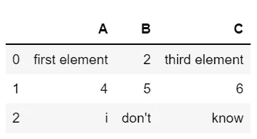
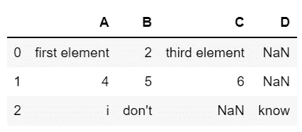

# 使用熊猫系列时的 6 个基本问题

> 原文：<https://towardsdatascience.com/6-fundamental-questions-when-working-with-a-pandas-series-1d142b5fba4e>

## 了解熊猫系列的特点


[自由股票](https://unsplash.com/@freestocks?utm_source=medium&utm_medium=referral)在 [Unsplash](https://unsplash.com?utm_source=medium&utm_medium=referral) 上的照片

Pandas 系列是一个一维数组，它可以有一个带标签的索引，即非数字索引。系列也可以被认为是表格中的一列，可以存储各种[类型](https://databasecamp.de/en/data/data-types)的数据。

# 1.你要熊猫做什么？

Python 的基本安装已经带来了四种不同的数据结构，其中可以存储任何[数据类型](https://databasecamp.de/en/data/data-types):

*   列表[是元素的有序集合。它是可变的，也能够存储重复的元素。](https://databasecamp.de/en/python-coding/python-lists)
*   [元组](https://databasecamp.de/en/python-coding/python-tuples)与列表非常相似，唯一的区别是不可更改。这意味着在创建元组之后，不能添加或删除任何元素。
*   [集合](https://databasecamp.de/en/python-coding/python-sets)不允许重复输入。同时，顺序也不固定。
*   从 Python 版本开始，[字典](https://databasecamp.de/en/python-coding/python-dictionarys)是一个键值对的有序集合。

尽管您已经可以用这些数据结构处理许多用例，但是有些情况下它们是不够的。例如，不能用这些本机结构显示表。因此，存在所谓的模块，例如 [Pandas](https://databasecamp.de/en/python-coding/pandas-introduction-1) 或 Numpy，其使得使用在基本安装中不可用的更多功能成为可能。同时，通常情况下，来自模块的数据结构比 [Python 的](https://databasecamp.de/en/python-coding)标准数据对象更具性能。例如，Numpy 数组已经针对向量和矩阵计算进行了优化。

同样，还有许多其他应用程序的模块来补充 [Python](https://databasecamp.de/en/python-coding) 编程语言及其功能。例如，模块 [TensorFlow](https://databasecamp.de/en/python-coding/tensorflow-en) 或 [Scikit-Learn](https://databasecamp.de/en/python-coding/scikit-learns) 用于创建[机器学习](https://databasecamp.de/en/machine-learning)模型。

[](/an-introduction-to-tensorflow-fa5b17051f6b) [## 张量流简介

### 了解机器学习框架、其架构以及与 PyTorch 的比较

towardsdatascience.com](/an-introduction-to-tensorflow-fa5b17051f6b) 

# 2.熊猫系列由哪些部分组成？

熊猫系列是在[熊猫](https://databasecamp.de/en/python-coding/pandas-introduction-1)中使用的最基本的数据结构之一。它是一种一维的有序数据结构，例如，可以用来存储表列中的信息或向量中的数字。

它提供了使用标签索引的可能性。但是，如果没有明确指定，则会自动设置从零开始的数字索引。因此，熊猫系列中元素的顺序扮演着重要的角色，这一点也变得很明显。该序列被称为有序数据结构。这意味着两个具有不同顺序的相同元素的熊猫系列不是同一对象。

最简单的熊猫系列是空系列，其定义如下:

```
import pandas as pdseries_1 = pd.Series()
print(series_1)Out:
Series([], dtype: float64)
```

在熊猫系列函数中可以指定一些参数来改变对象的属性。如果没有明确指定，它们将被自动设置或使用默认值。以下参数可以设置，但不是必须设置:

*   **数据**:该参数定义系列中要存储的数据。可以使用不同的数据结构，比如一个[列表](https://databasecamp.de/en/python-coding/python-lists)、一个[字典](https://databasecamp.de/en/python-coding/python-dictionarys)，甚至是一个单一的值。
*   **索引**:在索引的帮助下，可以为序列中的元素定义一个带标签的索引。如果未设置该参数，元素将从零开始自动编号。
*   **dtype** :可选参数 dtype 设置系列的[数据类型](https://databasecamp.de/en/data/data-types)。如果系列中的所有数据都是相同的[数据类型](https://databasecamp.de/en/data/data-types)，这将特别有用。例如，您可以定义将数字存储为整数还是小数。
*   **名称**:该参数可以对系列进行命名。如果系列是[数据帧](https://databasecamp.de/en/python-coding/pandas-dataframe-basics)的一部分，这尤其有用。那么这个名称就是[数据帧](https://databasecamp.de/en/python-coding/pandas-dataframe-basics)中相应的列名。
*   **复制**:该参数只能取值 True 或 False，因此是一个布尔值。它指定传递的数据是否应该保存为副本。然而，在大多数情况下，这并不重要。

当使用所有这些参数时，一个完整定义的序列如下所示:

```
series_1 = pd.Series([1, 2, 3], index = ["A", "B", "C"], dtype = "int64", name = "Series of Integers", copy = False)
print(series_1)Out:
A    1
B    2
C    3
Name: Series of Integers, dtype: int64
```

# 3.如何从序列中检索数据？

当从 Pandas 系列中查询数据时，我们使用方括号中的索引，正如我们从 [Python 列表](https://databasecamp.de/en/python-coding/python-lists)中已经知道的。如果文本索引可用，我们就使用它，否则，可以使用数字索引:

```
series_1 = pd.Series(["first element", 2, "third element"])
print(series_1[0])series_1 = pd.Series(["first element", 2, "third element"], index = ["A", "B", "C"])
print(series_1["A"])Out:
first element
first element
```

可能会发生这样的情况，我们只知道要从序列中查询的元素，而不知道相应的索引。然而，在熊猫系列中，找出相关联的索引并不像例如使用列表那样容易。一种方法是将序列转换为列表[然后使用“.”。指标"功能找出相应的指标:](https://databasecamp.de/en/python-coding/python-lists)

```
series_1 = pd.Series(["first element", 2, "third element"], index = ["A", "B", "C"])
list(series_1).index(2)Out:
1
```

# 4.如何覆盖或添加序列中的值？

可以通过调用相应的索引来覆盖序列中的现有值:

```
series_1 = pd.Series(["first element", 2, "third element"], index = ["A", "B", "C"])
series_1["A"] = 1
series_1Out:
A                1
B                2
C    third element
dtype: object
```

如果要在现有系列中包含新值，也可以使用此调用。为此，只需使用一个尚未使用的索引:

```
series_1 = pd.Series(["first element", 2, "third element"], index = ["A", "B", "C"])
series_1["D"] = "fourth_element"
series_1Out:
A     first element
B                 2
C     third element
D    fourth_element
dtype: object
```

# 5.如何用条件查询数据？

特别是对于数字数据，从满足特定条件的系列中查询数据会很有用。为此，相应的过滤器定义在方括号中，而不是索引中。例如，这可用于输出序列中大于四的所有元素:

```
series_1 = pd.Series([1, 2, 3, 4, 5, 6, 7, 8], index = ["A", "B", "C", "D", "E", "F", "G", "H"])
series_1[series_1 > 4]Out:
E    5
F    6
G    7
H    8
dtype: int64
```

如果要同时使用几个条件，可以在连续的方括号中定义它们。请注意，条件由逻辑“and”连接，这意味着只输出满足所有条件的值。这使我们能够过滤所有大于 4 但不等于 8 的值，例如:

```
series_1 = pd.Series([1, 2, 3, 4, 5, 6, 7, 8], index = ["A", "B", "C", "D", "E", "F", "G", "H"])
series_1[series_1 > 4][series_1 != 8]Out:
E    5
F    6
G    7
dtype: int64
```

# 6.如何从字典创建一个系列？

除了列表，你还可以使用一个 [Python 字典](https://databasecamp.de/en/python-coding/python-dictionarys)作为熊猫系列的数据。这样做的好处是不必显式指定索引。字典的键用作序列的索引，字典的值用作数据:

```
dict_1 = {"A": 1, "B": 2, "C": 3}
print(pd.Series(dict_1))Out:
A    1
B    2
C    3
dtype: int64
```

# 7.熊猫系列是用来做什么的？

熊猫系列主要用于熊猫数据框。它们用于构建这些类似表格的数据结构，因为数据帧的每一列都由一个单独的序列组成。

它还可以用来存储不同数据类型的一维数据，并使用它们执行计算。在机器学习领域，它们也可以用于存储一维向量和执行复杂的计算，如向量乘法。

# 8.如何从熊猫系列创建数据框架？

一个[数据框](https://databasecamp.de/en/python-coding/pandas-dataframe-basics)基本上是几个熊猫系列的集合。因此，通过命名所使用的系列，可以相对容易地创建它。

```
series_1 = pd.Series(["first element", 2, "third element"], index = ["A", "B", "C"])
series_2 = pd.Series([4, 5, 6], index = ["A", "B", "C"])
series_3 = pd.Series(["i", "don't", "know"], index = ["A", "B", "C"])pd.DataFrame([series_1, series_2, series_3])Out:
```



重要的是，系列对象要么都有相同的索引，要么没有索引。否则，将为每个不同的索引创建一个单独的列，而其他行没有值:

```
series_1 = pd.Series(["first element", 2, "third element"], index = ["A", "B", "C"])
series_2 = pd.Series([4, 5, 6], index = ["A", "B", "C"])
series_3 = pd.Series(["i", "don't", "know"], index = ["A", "B", "D"])pd.DataFrame([series_1, series_2, series_3])Out:
```



# 9.熊猫系列和 Python 列表有什么区别？

本文至此，您可能已经有了这样的印象，熊猫系列和 [Python 列表](https://databasecamp.de/en/python-coding/python-lists)是两个非常相似的数据结构，它们的主要区别在于[列表](https://databasecamp.de/en/python-coding/python-lists)只能使用数字索引，而熊猫系列也允许文本索引。

该系列与[列表](https://databasecamp.de/en/python-coding/python-lists)的主要区别不在于它们的功能或结构，而在于它们的应用可能性。在数据科学领域，数列主要用作表格数据的初步阶段，而表格数据又要用图表来说明。这意味着可以具体地看待这个系列。

另一方面，列表用于临时存储复杂的数据结构，因此它倾向于留在后台，并作为复杂计算的工具。

# 这是你应该带走的东西

*   Pandas 系列是一个一维数组，它可以有一个带标签的索引，即非数字索引。
*   它主要与熊猫数据框一起使用。在这里，您可以将系列视为单个表格列。
*   该系列在许多功能上类似于 Python 列表，不同之处在于列表不允许文本索引，但该系列允许。

*如果你喜欢我的作品，请在这里订阅*[](https://medium.com/subscribe/@niklas_lang)**或者查看我的网站* [*数据大本营*](http://www.databasecamp.de/en/homepage) *！还有，medium 允许你每月免费阅读* ***3 篇*** *。如果你希望有****无限制的*** *访问我的文章和数以千计的精彩文章，不要犹豫，点击我的推荐链接:*[【https://medium.com/@niklas_lang/membership】](https://medium.com/@niklas_lang/membership)每月花$***5****获得会员资格**

*[](https://medium.com/codex/why-you-should-know-big-data-3c0c161b9e14) [## 为什么您应该了解大数据

### 定义大数据及其潜在威胁

medium.com](https://medium.com/codex/why-you-should-know-big-data-3c0c161b9e14) [](https://medium.com/@niklas_lang/understanding-mapreduce-with-the-help-of-harry-potter-5b0ae89cc88) [## 借助《哈利·波特》理解 MapReduce

### MapReduce 是一种允许并行处理大型数据集的算法，例如，在多台计算机上…

medium.com](https://medium.com/@niklas_lang/understanding-mapreduce-with-the-help-of-harry-potter-5b0ae89cc88) [](/learn-coding-13-free-sites-to-help-you-do-it-9b2c1b92e573) [## 学习编码:13 个免费网站帮助你开始

### 一旦你决定要学习编码，你会被众多的在线工具宠坏，这些工具可以帮助你…

towardsdatascience.comm](/learn-coding-13-free-sites-to-help-you-do-it-9b2c1b92e573)*