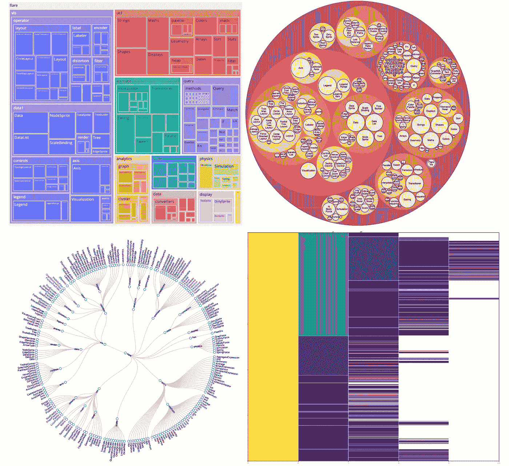
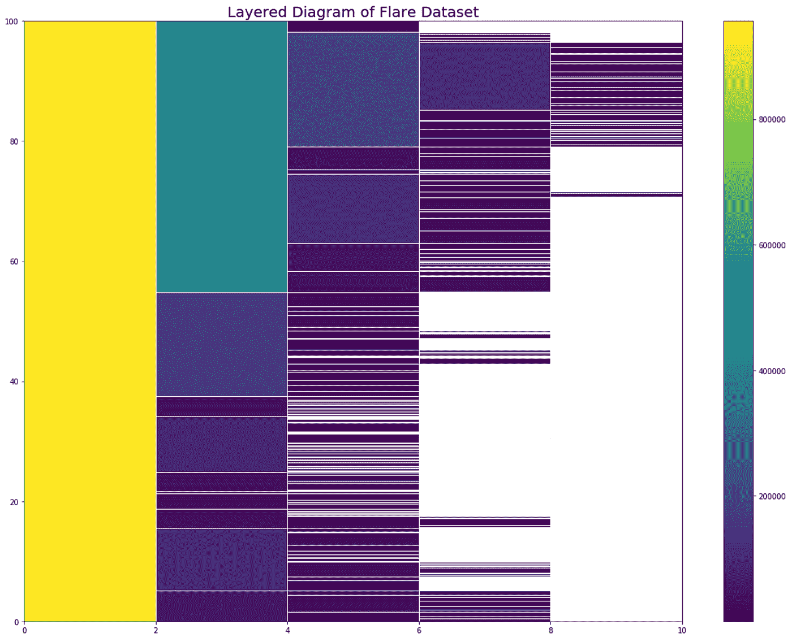
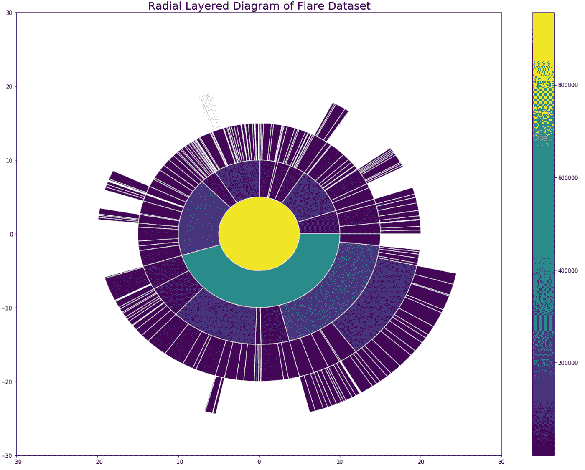

# 6 分层数据可视化

> 原文：<https://towardsdatascience.com/6-hierarchical-datavisualizations-98318851c7c5>

## 使用分层数据创建各种数据可视化

以下引用的个别图像

分层数据是一种数据结构，其中数据点通过形成树形结构的父子关系相互链接。分层数据是一种常见的数据结构，因此了解如何将其可视化非常重要。用于此的可视化技术与其他数据结构不同，因为需要维护层次关系。本文将展示六种类型的可视化。

## **数据集**

使用的数据集是 flare 数据集，它显示了 Flare ActionScript 可视化库的层次关系。它显示了类的层次结构和类之间的联系。数据集可以作为 json [在这里](https://gist.github.com/mbostock/1044242#file-readme-flare-imports-json)下载。

## **树木**

树形可视化显示具有节点(数据点)和边(节点之间的分层关系)的集合的分层数据。

1.  *正常*

耀斑数据集的树形图(Mike Bostock 在[可观测到的](https://observablehq.com/@d3/tree)上拍摄的图像)

正常树可视化是最常用的层次可视化类型。这很容易解释，因为传统的树结构广为人知。然而，大树可能会扭曲以适应屏幕，或者需要添加滚动功能来查看整个树，这使得可视化更加难以解释。

*2。径向*

耀斑数据集的径向树(由 Mike Bostock 在[可观察到的](https://observablehq.com/@d3/radial-tree)上拍摄的图像)

辐射状树，有时也称为辐射状树状图，与普通的树可视化相同，但采用的是圆形格式。使用径向树的一个好处是它比普通树更紧凑，所以更适合大树。这种格式的缺点是，根据标签的显示方式，标签可能难以阅读。

## **分层图**

分层图适用于显示空间关系，也称为整体的一部分。

**1。正常**

(图片由作者提供)

正常分层图将数据集的根节点或起点显示为最左侧的列，而最深的叶节点位于最右侧。这个使用 flare 数据集的特定示例显示了 flare 类中的层次关系。第一列是根，它表示整个 flare 类的大小，第二列是 flare 案例中的类的大小，依此类推。正常分层图的一个缺点是，如果大小比率很大，叶节点变得难以解释，尤其是在大树中。

**2。径向**

(图片由作者提供)

放射状分层图也称为旭日图，除了采用放射状格式之外，它遵循与普通分层图相同的概念。使用径向格式的一个好处是它更紧凑，因此对于较大的数据集很有用。一些缺点是，大小可能会因位置而有所偏差，因为靠近圆外侧的部分会比靠近内侧的相同大小的部分更大。这是因为内圈的周长自然比外圈小。此外，由截面产生的角度会使尺寸更难解释。两个分层图的代码都可以在[这里](https://github.com/kruthik109/Data-Visualization/blob/main/Advanced-Visualizations/Layered-Diagram.ipynb)找到。

## **树状图**

树形图用一组嵌套的形状表示分层数据。这些形状用于显示相对于其面积的大小。树形图能够显示类别是如何根据层次结构的每一层来划分的。

**1。正常**

耀斑数据集的树形图(图片由作者提供)

普通的树形图由嵌套的矩形组成。普通树形图的一个好处是它提供了层次数据的清晰视觉。由于空间被划分成矩形，这允许观察者容易地看到与其父节点成比例的节点大小，这反过来对于比较非常有用。一个缺点是深树会使静态视觉混乱，因此深度大于三的数据集可以受益于增加的交互式功能以提高可读性。

**2。圆形**

耀斑数据集的循环打包(daktari 在 [ObservableHQ](https://observablehq.com/embed/@tasqon/d3-circle-packing?cells=chart) 上拍摄的图像)

圆形树图，也称为圆形打包，类似于普通的树图，只是它使用嵌套的圆形。使用循环包装的好处是它清楚地突出了组之间的层次关系。缺点是它不能像普通的树形图那样有效地利用空间。类似于普通的树形图，它只清楚地显示三到四层，之后可视化就变得不清楚了。如果正在使用的数据的深度大于 4，则添加交互功能非常重要。

## **互动功能**

可视化分层数据的一个常见缺点是可读性，尤其是对于大型数据集。树越宽越深，观众就越难理解所传达的信息。一个解决方案是使可视化具有交互性。

互动版的树状图(图片由作者提供)

**1。滑块:改变深度**

第一个解决方案是创建一个滑块，这样用户就可以控制深度或显示的级别数。这允许用户与可视化交互，以便他们可以看到当添加更多层时它是如何变化的。可以使用的两种类型的滑块是简单滑块和范围滑块。简单的滑块允许用户控制在可视化中显示多少级别。范围滑块仅显示两个深度值之间的数据点。上面的交互式树形图包括一个简单的滑块。

**2。缩放:关注细节**

大型分层可视化会使一些或所有节点难以看到。添加缩放功能允许用户单击某个部分以获得更详细的视图。在上面的树形图中，点击任何一个节点，它就会放大，给出它的后代的更详细的视图。再次点击同一节点将缩小到包括前一层。

**3。工具提示:悬停以获取更多信息**

工具提示允许用户将鼠标悬停在可视化的某个部分上，将出现一个包含附加信息的弹出窗口。当没有空间向每个节点添加标签时，也可以使用这种方法。在上面的例子中，你可以将鼠标悬停在任何节点上，名称和大小就会弹出。

**4。亮点:引起对特定部分的注意**

分层可视化很好地展示了整体数据，但是，如果有特定的部分需要突出显示，一个好的方法是突出显示预期的区域。

关于如何用 Python 创建这个交互式树形图的一步一步的教程，请查看我下面的文章。

  

## 引文

博斯托克，M. (2017 年 11 月 15 日)。*树，径向整齐*。可观察的。检索于 2022 年 6 月 23 日，发自 https://observablehq.com/@d3/radial-tree

博斯托克，M. (2021，10 月 27 日)。具有 Flare 类层次结构的 JSON 文件。[https://gist . github . com/MBO stock/1044242 # file-readme-flare-imports-JSON。许可证:gpl-3.0](https://gist.github.com/mbostock/1044242#file-readme-flare-imports-json.)

博斯托克，M. (2022 年 4 月 6 日)。*树，整齐*。可观察的。于 2022 年 6 月 23 日从[https://observablehq.com/@d3/tree](https://observablehq.com/@d3/tree)检索

达克塔里。(2019 年 2 月 5 日)。 *D3 圆形包装*。可观察的。于 2022 年 6 月 23 日从 https://observablehq.com/embed/@tasqon/d3-circle-packing?检索单元格=图表