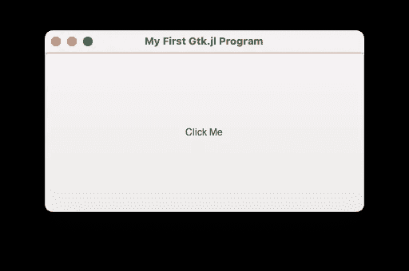
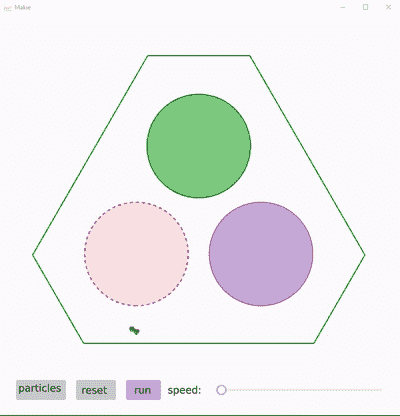
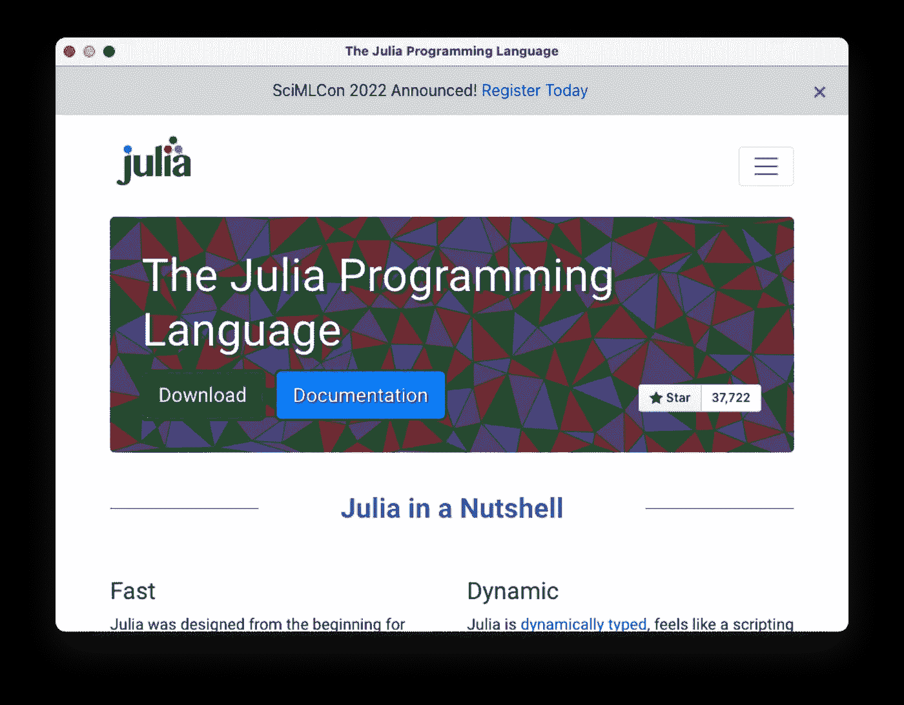

# 6 Julia 框架来创建桌面 GUI 和 Web 应用程序

> 原文：<https://towardsdatascience.com/6-julia-frameworks-to-create-desktop-guis-and-web-apps-9ae1a941f115>

# 6 Julia 框架来创建桌面 GUI 和 Web 应用程序


阿尔瓦罗·雷耶斯在 [Unsplash](https://unsplash.com?utm_source=medium&utm_medium=referral) 上拍摄的照片

Julia 用于许多深度技术应用，如机器学习和数据科学。但作为一种通用编程语言，Julia 也可以用于构建网站和交互式可视化。在本文中，我们将介绍 5 个 Julia 包，它们可以用来创建桌面 GUI 或 web 应用程序。

*编辑:我和我的合著者很高兴地告诉大家，我们的新书《茱莉亚速成班》已经开始预售了:*

[](https://logankilpatrick.gumroad.com/l/juliacrashcourse) [## 朱莉娅速成班(电子书预购)

### Julia 速成课程是使用 Julia 编程语言的实践指南，是为初学者编写的。我们接受…

logankilpatrick.gumroad.com](https://logankilpatrick.gumroad.com/l/juliacrashcourse) 

# 精灵🧞‍♂️的网络应用

Genie.jl 是基于 Django 的纯 Julia web 框架。来自 Genie 网站:

> Genie Framework 包含了使用 Julia Lang 快速构建生产就绪的 web 应用程序所需的全部内容。开发 Julia 后端，创建漂亮的 web UIs，与数据库集成，并设置高性能的 web 服务和 API。

像 Django 一样，Genie 不仅仅是一个独立的软件包，它是一个完整的生态系统！让我们看一个带有 Genie 的基本 hello world 示例:

```
# Genie Hello World!
using Genie
route("/helloworld") do
    "Hello and welcome to Genie!"
end# Powerful high-performance HTML view templates
using Genie.Renderer.Html
route("/html") do
    h1("Welcome to Genie!") |> html
end# JSON rendering built in
using Genie.Renderer.Json
route("/json") do
    (:greeting => "Welcome to Genie!") |> json
end# Start the app!
up(8888)
```

正如您所看到的，Genie 遵循了与 Django 相似的设计模式，并附带了 web 服务器、模板引擎、cookies、加密、认证、路由引擎、用 Julia 编写的后端视图等特性。

如果您想构建现代 web 应用程序，并且熟悉 Django，Genie 是正确的起点！你可以在这里了解更多:[https://genieframework.com](https://genieframework.com)

有关 Genie 的全面视频教程，请查看:

# 朱莉娅中的 GTK 绑定

jl 是一个 Julia 包，构建在非常流行的 Gtk 窗口工具包之上。你可以在这里找到入门手册:[https://Julia graphics . github . io/GTK . JL/latest/manual/getting started/](https://juliagraphics.github.io/Gtk.jl/latest/manual/gettingStarted/)

让我们看一个简单的例子:

```
using Gtkwin = GtkWindow("My First Gtk.jl Program", 400, 200)b = GtkButton("Click Me")
push!(win,b)showall(win)
```

首先，我们设置窗口的名称和尺寸。然后，我们创建一个带有特定文本标签的按钮对象，并将其推送到应用程序中。最后，我们通过调用`showall`来显示应用程序。



作者捕获的图像

Gtk.jl 已经被用来构建一些非常酷的应用程序。我强烈建议看看这个视频:

# Makie.jl📊📉

Makie 是 Julia 生态系统中最受欢迎的可视化软件包之一。你能建造的东西有着难以置信的深度。



Gif 截图自 https://github.com/JuliaPlots/Makie.jl

Makie 允许您构建在 GPU 上运行的交互式可视化，也可以在您的浏览器中运行。Makie docs 最近也进行了大规模更新，所以那里的内容是最新的，非常有用:[https://makie.juliaplots.org/stable/](https://makie.juliaplots.org/stable/)

我还建议去看看[https://lazarusa.github.io/BeautifulMakie/](https://lazarusa.github.io/BeautifulMakie/)，这是一个用 Makie 制作的非常好的动画图库。

# Blink.jl，基于 Web 的 Julia 图形用户界面

> Blink.jl 是围绕着[电子](https://electronjs.org/)的 Julia 包装器。它可以在本地窗口中提供 HTML 内容，并允许 Julia 和网页之间的通信。因此，通过这种方式，Blink 可以用作 GUI 工具包，为桌面构建基于 HTML 的应用程序。

我想不出更好的方式来重申这一点，所以以上是从 Blink docs 引用的。Blink 与其他软件包的不同之处在于，你可以使用它构建基于 HTML 的 GUI。

```
julia> using Blink

julia> w = Window() # Open a new window
Blink.AtomShell.Window(...)

julia> body!(w, "Hello World") # Set the body content

julia> loadurl(w, "http://julialang.org") # Load a web page
```

我们首先创建电子窗口，然后在窗口的 body 标签中添加一些文本，最后在窗口中加载一个 URL。如果您在本地运行这段代码，您会看到当我们执行这些命令时，窗口会动态变化。



作者捕获的图像

虽然我不认为 Blink 被广泛使用，但我在各种项目中用它玩得很开心。

# 破折号，由 Plotly📈

Dash 是 Dash 生态系统的一个 Julia 接口，用于在 Julia 中创建分析 web 应用程序，而不需要 JavaScript。这意味着您可以构建像 https://covid-county-dash.herokuapp.com[一样令人印象深刻的仪表盘，并轻松部署它们！](https://covid-county-dash.herokuapp.com)

你可能还想查看 Dash 网站[https://dash.plotly.com/julia](https://dash.plotly.com/julia)了解开始的细节。Dash.jl 上也有全面的文档:[https://github.com/plotly/Dash.jl](https://github.com/plotly/Dash.jl)

# 带有软件包编译器的桌面应用📦

目前，创建一个可以在没有安装 Julia 的电脑上共享和运行的桌面应用程序的最佳方式是使用 PackageCompiler。PackageCompiler 允许您将整个 Julia 项目编译成 exe 文件。这个过程将所有的依赖项捆绑到一个文件中，使其可以分发。

我会注意到目前有一些关于你需要做什么来创建一个 exe 的限制。可能需要重写一些代码来使其兼容。有关使用 PackageCompiler 的分步演练，请查看:

你可以在文档中了解更多关于包编译器的信息:[https://Julia lang . github . io/Package Compiler . JL/stable/apps . html](https://julialang.github.io/PackageCompiler.jl/stable/apps.html)

# 其他包🥈

上面突出显示的 5 个包只是 Julia 生态系统中现有包的一小部分。下面，我将添加一个我能找到的所有可视化包的半详尽列表，以防前 5 个不适合您的用例:

1.  [Plots.jl](https://docs.juliaplots.org/latest/) ，在 Julia 中可视化的强大便利
2.  [Interact.jl](https://github.com/JuliaGizmos/Interact.jl) ，互动小工具玩你的 Julia 代码
3.  [Stipple.jl](https://github.com/GenieFramework/Stipple.jl) ，纯 Julia 的交互式数据应用的反应式 UI 库。
4.  QML.jl ，为 Julia 程序建立 Qt5 QML 接口。
5.  ClmGui.jl ，cimgui 的 Julia 包装器

我漏了一个吗？请随意评论这篇文章，我会把这个包添加到这个列表中！