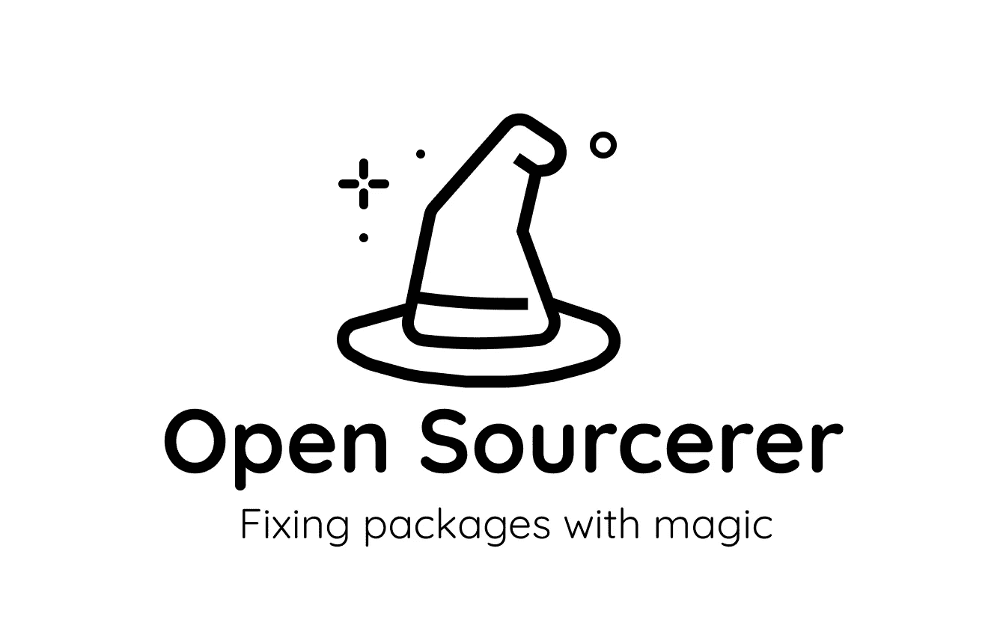
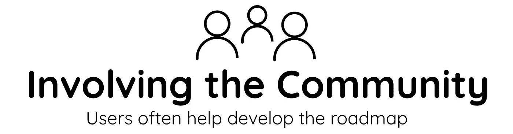
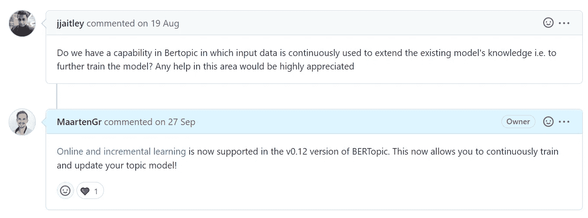
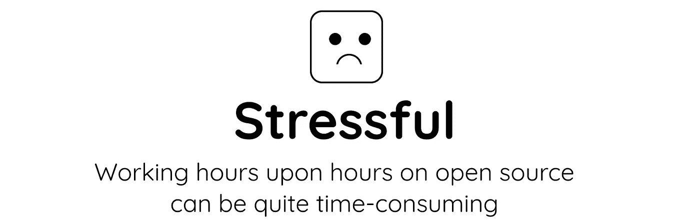
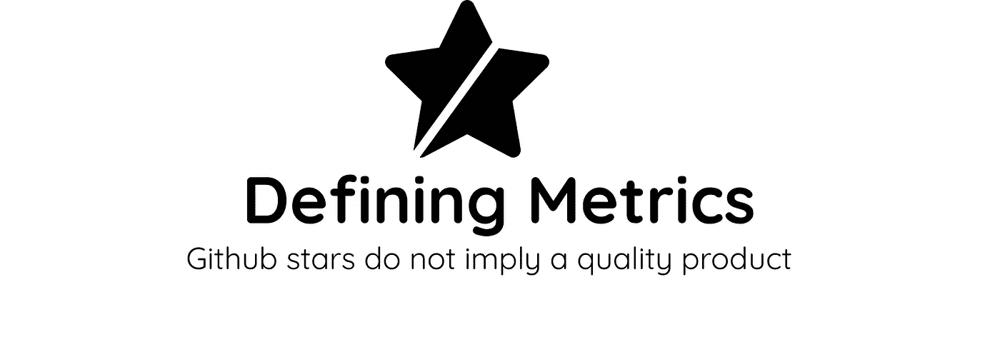
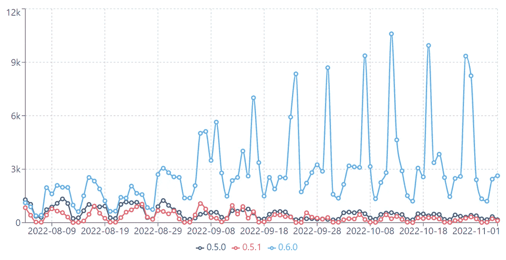
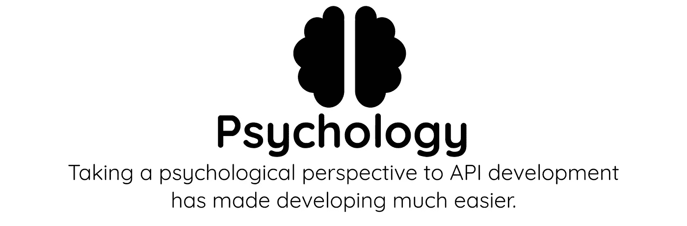
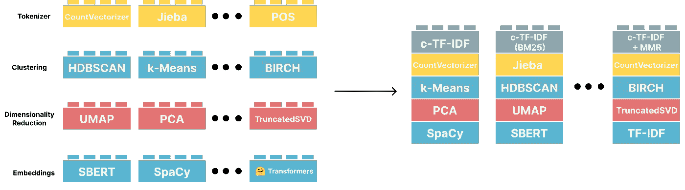

# 我从开发开源项目中学到的 6 个教训

> 原文：<https://towardsdatascience.com/6-lessons-i-learned-from-developing-open-source-projects-4617e26f247c>

## 数据科学家的视角

开源是一个如此神奇的概念！通过整合整个社区的资源、技能和知识，我们可以创造出孤立的工具。从这些合作中产生的工具不仅仅是它们各部分的总和。

因此，我们数据科学家使用这种免费的软件，这种软件推动了如此多的技术，同时仍有机会参与其开发。

在过去的几年里，我非常幸运地参与了开源项目，并有机会开发和维护了几个软件包！

> 开发开源不仅仅是编码

在此期间，有许多障碍需要克服，也有许多教训需要吸取。从棘手的依赖性和 API 设计选择到与用户群的交流。

不管是作为一名作者、维护者还是开发者，从事开源工作都是令人望而生畏的！通过这篇文章，我分享了我在这个领域的一些经验，希望对那些想开发开源软件的人有所帮助。

# 1.文档被低估了

当你创建开源软件时，你通常不是专门为自己制作软件包。来自各种不同背景的用户将会使用你的软件。适当的文档对帮助这些用户开始有很大的帮助。

然而，不要低估文档对您的包的可用性的影响！你可以用它来解释复杂的算法，给出大量的教程，展示用例，甚至允许交互式的例子。

尤其是数据科学相关的软件，涉及到复杂的算法时，可能会很难理解。像对待故事一样对待这些解释经常帮助我使它们更加直观。

> 相信我，写好文档本身就是一种技能。

另一个好处是编写可靠的文档减少了花在问题上的时间。如果用户能在你的文档中找到答案，他们就没有理由问问题。

文档中概述了 [KeyBERT](https://maartengr.github.io/KeyBERT/guides/quickstart.html) 的工作原理。

然而，创建文档不仅仅是写文档。可视化你的算法或软件在使它变得直观方面有很大的帮助。当你想在文档中形象化算法原理时，你可以从[杰伊·阿拉姆马](http://jalammar.github.io/)那里学到很多东西。他的可视化甚至出现在官方的[数字](https://numpy.org/doc/stable/user/absolute_beginners.html)文档中！

# 2.社区就是一切

你的用户群，社区，是你的软件的重要组成部分。由于我们正在开发开源软件，可以肯定地说，我们希望他们参与到开发中来。

通过参与社区，您可以吸引他们分享问题和错误，但也可以提出进一步开发的请求和好想法！所有这些都有助于为他们创造一些东西。

> 开源社区不仅仅是各个部分的总和

BERTopic 中的许多核心功能，如[在线主题建模](https://github.com/MaartenGr/BERTopic/issues/683)，由于受到用户的高度要求而得以实现。因此，社区非常活跃，在发现问题和开发新功能方面提供了巨大的帮助。

由社区实现特性请求有很长的路要走！此处节选讨论[。](https://github.com/MaartenGr/BERTopic/issues/683)

# 3.绝佳的学习机会

无论您的包将被使用数百万次还是仅仅几次，创建一个包都是学习更多关于开源、MLOps、单元测试、API 设计等的绝好机会。在开发开源软件的过程中，我学到了比日常工作中更多的技能。

与社区本身的互动也是一个巨大的学习机会。他们会告诉你他们喜欢或不喜欢哪些设计。有时，我看到同一个问题在几个月的时间里出现了几次。这表明我应该重新考虑设计，因为它不像我预期的那样用户友好！

最重要的是，开发开源项目给了我与其他开发者合作的机会。

# 4.压力会很大

在工作之外从事你自己的开源项目也有它的缺点。对我来说，最重要的一点是维护包、回答问题和参与讨论可能是相当多的工作。

如果你有内在的动力，这肯定会有所帮助，但这仍然需要相当长的时间来确保一切都在一起。

幸运的是，当回答问题、展示用例等时，你可以向你的社区寻求帮助。

在过去的几年里，我已经学会了在遇到重大变化的时候放松一点。尤其是当它涉及到依赖性的时候，有时候你能做的事情实在太多了！

# 5.Github 明星不等于质量！

知道你的包使用的频率对理解它有多流行有很大的帮助。然而，许多人仍在使用 Github stars 将一个包等同于质量和受欢迎程度。

确保定义正确的指标。GitHub 明星可以仅仅因为营销得当而被夸大。很多明星并不意味着受欢迎。

作为数据科学家，我们必须首先理解我们到底在测量什么。GitHub 星无非就是用户给一个包打个星。它甚至不意味着他们已经使用了该软件或它实际上正在工作！

KeyBERT 的下载次数。比 Github stars 好得多的指标。

技术上来说，我可以付钱给一千个人来开始我的回复。相反，我关注各种统计数据，比如下载和分叉，还有我每天收到的问题数量。

例如，如果你的软件包出现在[黑客新闻](https://news.ycombinator.com/item?id=31341250)上，这很好，但它不会告诉你它是否被持续使用。

# 6.API 设计心理学

作为一名心理学家，我倾向于把很多注意力放在我的包装设计上。这包括像文档和教程这样的东西，但它甚至转化为我如何编码。

确保这个包易于使用和安装会使采用变得更加简单。特别是当你关注模块化和透明性这样的设计理念时，一些包会成为使用的热点。

用 [BERTopic](https://github.com/MaartenGr/BERTopic) 进行主题建模的模块化设计。

在开发新功能的同时，从心理学家的角度出发，让我们更容易知道应该关注什么。用户在找什么？我怎样才能用一种解释算法的方式编码？为什么用户实际上在用这个套餐？我的代码的主要缺点是什么？

> 花时间了解普通用户推动采用

所有上述情况往往导致一个基本但重要的规则；
保持超级简单

就个人而言，如果我发现一个新的包很难安装和使用，我就不太可能在我的工作流程中采用它。

# 感谢您的阅读！

如果你和我一样，对人工智能、数据科学或心理学充满热情，请随时在[**LinkedIn**](https://www.linkedin.com/in/mgrootendorst/)**上添加我，或在 [**Twitter**](https://twitter.com/MaartenGr) 上关注我。你也可以在我的 [**个人网站**](https://maartengrootendorst.com/) 上找到我的一些内容。**

***所有未注明出处的图片均由作者创作***