# 6 个让你的下一份数据分析工作变得更好的技巧

> 原文：<https://towardsdatascience.com/6-looker-tips-that-will-power-up-your-next-data-analysis-job-404971a82939>

## 探索从基础到高级的六个技巧，帮助你在下一个项目中用 Looker 完成更多


马库斯·温克勒在 [Unsplash](https://unsplash.com?utm_source=medium&utm_medium=referral) 上的照片

# 什么是 Looker？

Looker 是谷歌的商业智能(BI)工具。它完全基于网络，本质上是多平台的。我很高兴与 PowerBI、Tableau、SAS 和其他公司一起工作。然而，由于其漂亮的表示层、强大的 LookML 建模语言以及与 GitHub 的集成，Looker 仍然是我最喜欢的 BI 平台。

Looker 有一个很棒的培训环境，你可以用它来学习平台的基础知识。我强烈建议你从那里开始。我将使用本文中提供的培训环境和样本数据。查看[旁观者连接](https://connect.looker.com/)。

# 给超级用户一些建议怎么样？

在过去的几年里，我在 [Looker](https://cloud.google.com/looker) 中开发了一些技巧和窍门，可能对每个人都有好处。其中一些相当简单，但也许你还没有遇到过。其他的是真正的超级用户技巧，会让你的长相更上一层楼。我将从基本的技巧开始，以几个我绝对喜欢的结束。

1.  表格计算
2.  另存为便于共享的外观
3.  分组维度
4.  用于清理维度的 CASE 语句
5.  在单值切片中手动设置目标
6.  从 SQL Runner 创建快速浏览器

# 表格计算

这个技巧非常简单，但是有巨大的力量。作为 Looker Explorer 的用户，您可能希望对您的数据执行额外的计算，这些计算不属于所提供的测量。实现这一点的方法是通过**表格计算**。将表格计算想象成在 Excel 的单元格中输入公式。您可以从其他列获取数据，并对其执行许多不同的操作，从简单的加/减/乘/除到更高级的计算，如统计测试。

在这个简单的例子中，我将通过将两个收入除以订单项目计数来得到每个订购项目的平均收入*。您可以选择如何格式化数据，并给它一个更好的名称。*

*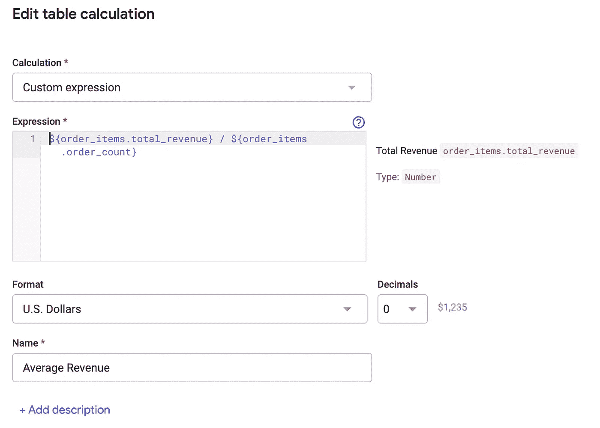*

*作者图片*

*我们可以在这里看到我们的表计算的结果。它们会以绿色显示，给你一个视觉指示，表明它们不是尺寸**(蓝色)或尺寸**(褐色)。*****

***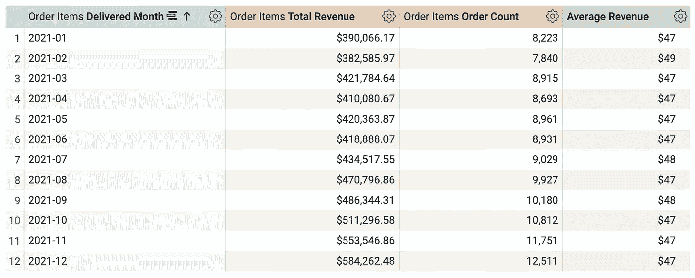***

***作者图片***

*****注意:**表格计算只适用于已经显示在列中的数据。如果删除其中一个度量，计算将会失败。***

# ***另存为便于共享的外观***

***另一个很基础的，但是值得一提。早期使用 Looker 的一个限制是*非常*强大的**探索**功能只能通过更昂贵的**分析师**层级许可证获得。探索功能是人们可以自助服务自己的数据分析的方式，但如果没有许可证，他们将只能利用控制面板上的内容。***

***但是，将浏览保存到**外观**有一个例外！从齿轮图标中，选择**保存>为外观**，然后给它一个名称和位置。***

***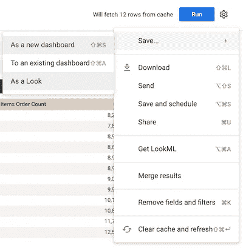***

***作者图片***

***保存后，你可以与他人分享这些照片，他们甚至可以调整你设置的**滤镜**来体验一下自己探索的感觉。***

******

***作者图片***

# ***分组维度***

***这个特殊的技巧花了我一段时间才发现，但现在我一直在使用它。当您的数据需要分类信息，您希望更好地呈现数据时，不要害怕；您可以使用**组**选项创建合成类别。***

***首先，从选择要分组的维度开始。然后，从菜单中选择**组**选项(三个垂直点)。***

***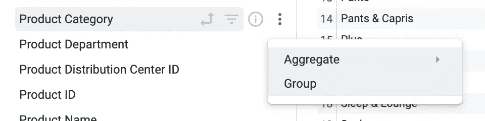***

***作者图片***

***接下来，您创建您想要教它如何对数据进行分组的条件。我正在为这个零售服装数据集创建一个分类特征，包括*上衣*、*下装*，以及另一个名为*其他*的包罗万象的类别。(选择**分组剩余值**选项创建一个总括类别。)***

***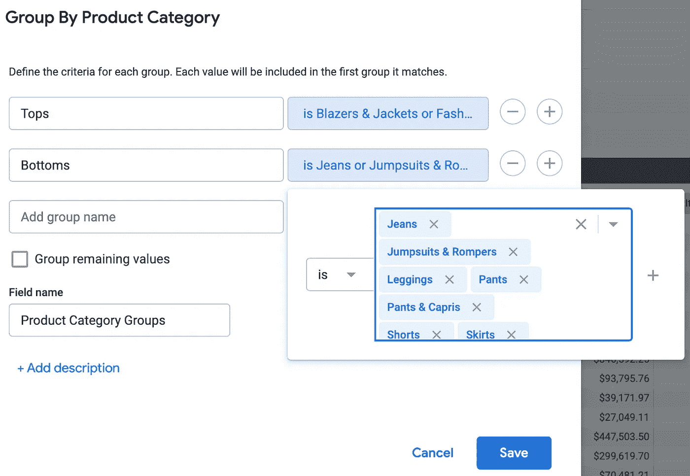***

***作者图片***

***现在我们可以看到我们的新维度以及它是如何对我们的数据进行分组的。超级快速简单。***

***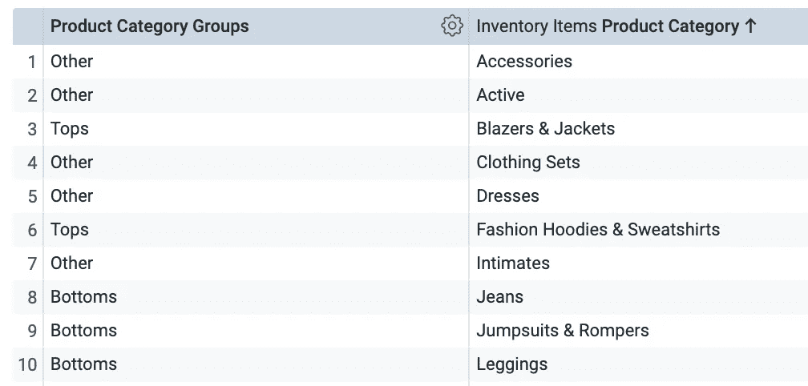***

***作者图片***

# ***用于清理维度的 CASE 语句***

***欢迎来到我的超级用户版块！假设您想要做一些类似于上面的分组示例的事情，但是您希望它更持久。您可以通过直接利用 Explorer 的 LookML 定义中的`CASE`语句来实现这一点。在下面的情况中，我有两个条件，这两个条件对于一个失败的工作来说都是一样的。通过使用这种方法，我将这两个归为一类**失败**。我也用这个来清理标签和大写每个单词的第一个字母。***

```
***dimension:  status{
    label: "Status"
    description: "Status of the job (success, failure, cancelled)."
    type: string
    case: {
      when: {
        sql: ${TABLE}.status='cancelled';;
        label: "Cancelled"
      }
      when: {
        sql: ${TABLE}.status='failure' or
          ${TABLE}.status='failed';;
        label: "Failed"
      }
      when: {
        sql: ${TABLE}.status='success' ;;
        label: "Success"
      }
      else: "Unknown"
    }
  }***
```

***我喜欢使用这种方法的另一种方式是从数据库中清除值，并将它们转换成更易于阅读的格式。例如，我可能有一个值为`US`、`UK`、`CA`的列。我可以用一个`CASE`语句把它们变成`United States`、`United Kingdom`、`Canada`。***

# ***在单值切片中手动设置目标***

***这条建议是我最喜欢的建议的亚军。在设定 KPI 目标时，我们要做的一件基本事情就是为它们选择一个目标。当你有一个你想要达到的目标时，你不只是想看到一个与前一年的比较数字，看看你在这个目标上的表现如何！问题是您需要一种方法来为 Looker 中的度量设置目标值。我想出了这个方法，结果证明效果非常好！***

***当使用**单值**可视化时，您可以选择设置一个**比较**值。Looker 的工作方式是将结果的第一行显示为单值视图中的主值，第二行将作为比较值。在正常情况下，这是通过让您计算月环比或年同比来实现的。***

***第一步是创建一个表计算，它将显示第一行的实际值，然后显示第二行和后续行的固定值。您可以用一个寻找行值的`If`语句来完成这个任务，我下面的例子使用了一个非常简单的硬编码年份。***

*****注意:**您可以利用`now()`功能让这变得更加智能，这样您的仪表板就不需要在一年结束时进行调整。如果你能做到这一点，你会得到加分！***

***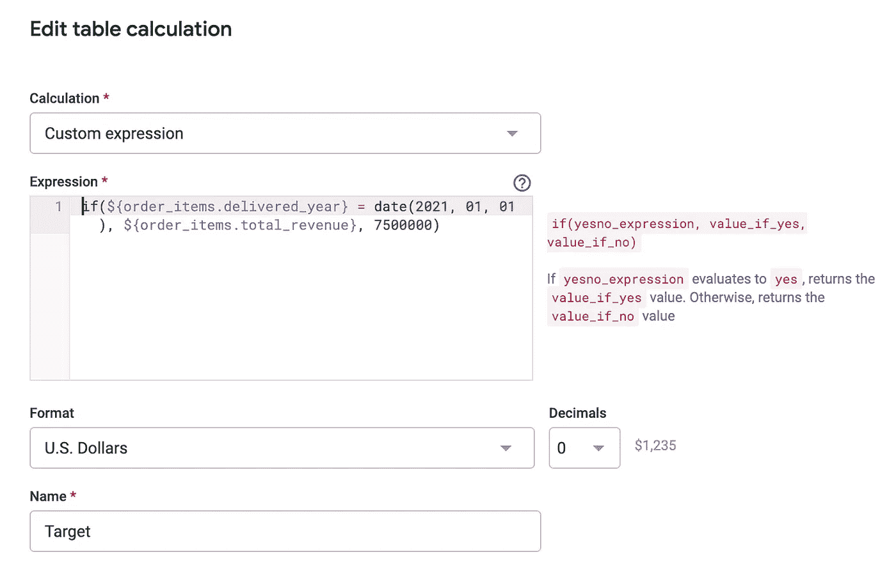***

***作者图片***

***接下来，将视觉上的**比较**值设置为**计算进度(带百分比)**。就是这样！***

***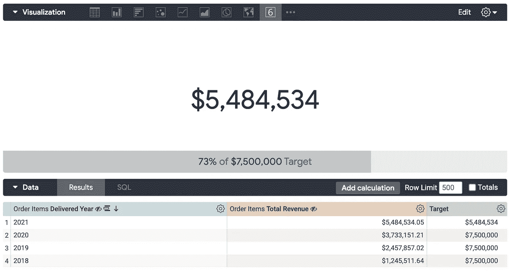***

***作者图片***

***注意 **Target** 表计算如何显示第一行的实际值和第二行的硬编码值。***

***为了实现这一点，**隐藏了可视化中的其他列。对不是目标列的每一列都这样做。*****

***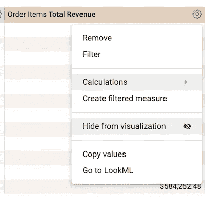***

***作者图片***

## ***更新***

***本周，在与同事交谈时，我学会了一种新方法来设定一个更容易的目标。像前面一样创建一个表计算，但是不用' if '语句，而是直接输入目标的数值！然后，确保取消隐藏值列和目标列。就是这样！***

***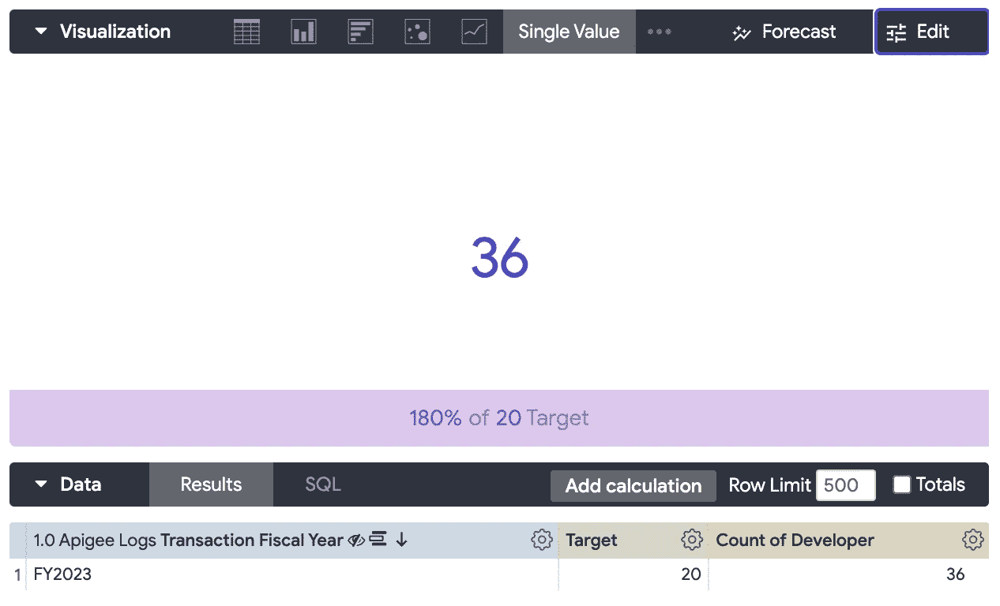***

***作者图片***

# ***从 SQL Runner 创建快速浏览器***

***今天的最后一条建议，也是迄今为止改变我游戏规则的一条。从 **SQL Runner** 中的查询创建**浏览器**的能力。让这个功能如此强大的是，您可以快速地跨多个表执行分析，而不需要所有的 LookML 配置。***

***我如何使用这个？假设您的数据仓库中有几个一直在使用的大规模表。然后，您从另一个来源获得一组数据，并希望将它们连接在一起。在我的例子中，我可能会以 CSV 格式获取一些数据，这些数据包含来自不同来源的客户列表，我会将这些数据上传到仓库中的一个临时表中。一旦它在仓库中，我就可以执行与其他表的连接来完成任务。但是，因为这是临时的，所以我只想建立一些基础设施，使它永久地出现在 Looker 中。 **SQL Runner** 是实现这一切的绝佳场所。***

***转到 **SQL Runner** 并构建您的查询，就像下面这样简单，或者它甚至可以是用[公共表表达式](/common-table-expressions-in-sql-c6dd317e1121) (CTEs)构建的大规模查询。***

```
***SELECT * 
FROM `cloud-training-demos.looker_ecomm.order_items` AS order_items
LEFT JOIN `cloud-training-demos.looker_ecomm.users` AS users 
ON order_items.user_id = users.id
limit 100***
```

***一旦构建了查询，单击 **Explore** 选项。您会受到一些限制。默认情况下，它只有一个度量值(计数)。如果您需要一些特定的度量，您可以通过选择字段并选取所需的聚合(计数、求和、平均)来添加它们。在大多数情况下，您也不能将其保存到仪表板。但是您可以保存到 Explorer 的链接并与其他人共享。利用这个方法，我已经节省了无数的时间。试试看！***

***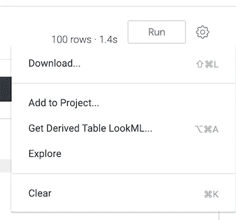***

***作者图片***

# ***结论***

***这就是了。六个快速观察技巧将帮助你提高和加快你的分析。Looker 是一个非常强大的 BI 工具；这些建议将帮助你充分利用它。我从三个基本技巧开始:表计算、将资源管理器保存为外观以及对维度进行分组。接下来，我分享了几个更高级的技巧。我首先从使用 CASE 语句清理数据开始。然后，我向您展示了如何在单值图块中手动设置目标。最后，我向您展示了如何在 SQL Runner 中通过查询创建浏览器。享受快乐建筑！***

***如果你喜欢阅读这样的故事，并想支持我成为一名作家，考虑注册成为一名媒体成员。一个月 5 美元，让你可以无限制地访问成千上万篇文章。如果您使用 [*我的链接*](https://medium.com/@broepke/membership) *注册，我将为您赚取一小笔佣金，无需额外费用。****