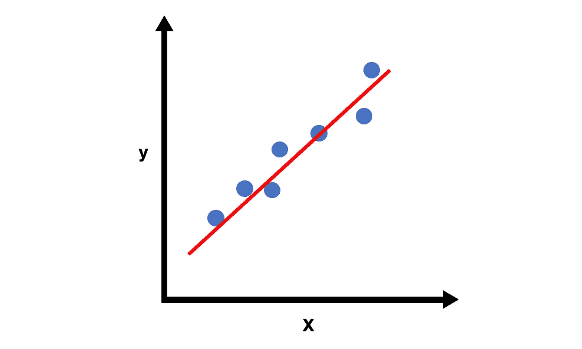
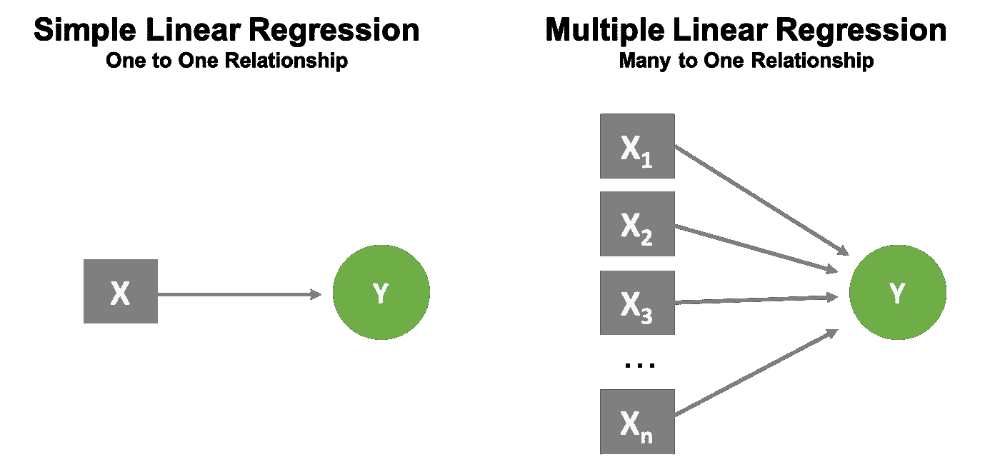
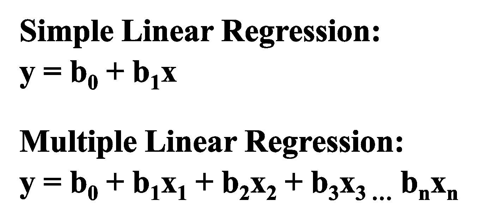
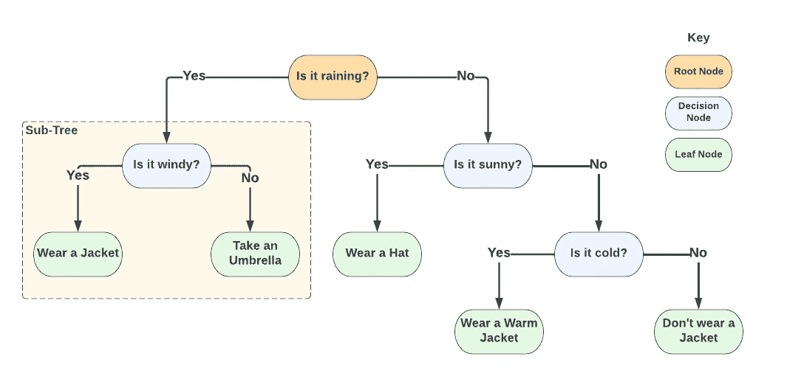
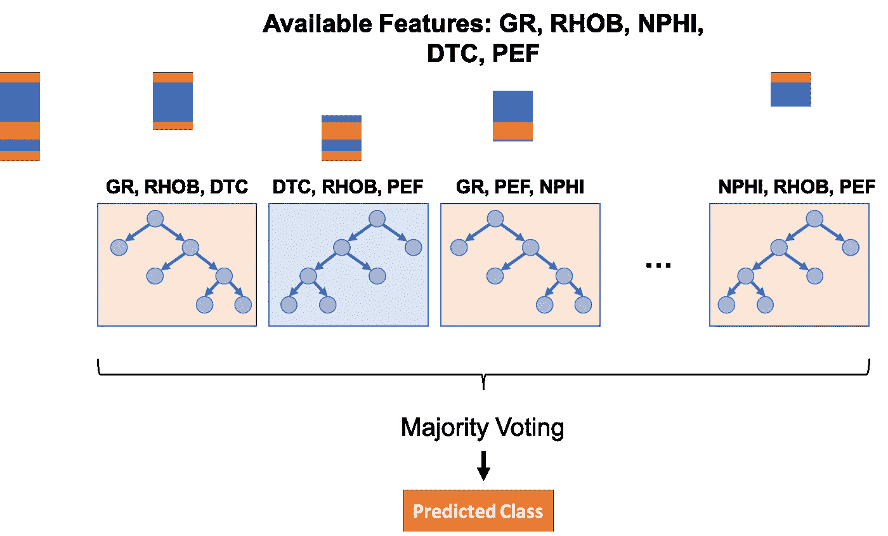
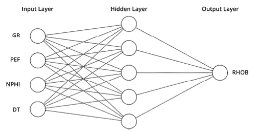
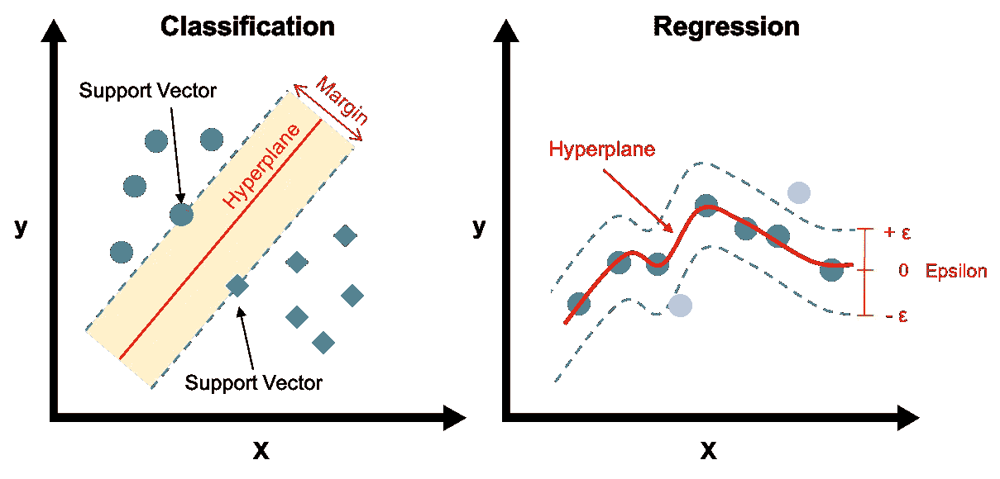
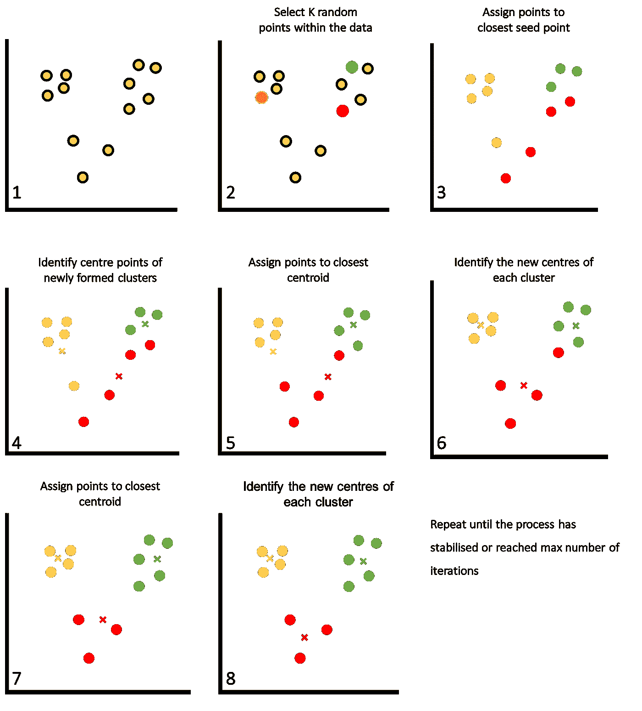

# 学习数据科学时需要了解的 6 种机器学习算法

> 原文：<https://towardsdatascience.com/6-machine-learning-algorithms-to-know-when-learning-data-science-6e45ef139b99>

## 6 种流行的机器学习算法的简短说明

[图片由来自 Pixabay 的烈斗·谢维勒拍摄](https://pixabay.com/photos/circle-tech-technology-abstract-5090539/)

[机器学习](https://en.wikipedia.org/wiki/Machine_learning)在过去十年左右变得非常流行，许多行业都采用新算法来自动化流程和提高生产率。

机器学习是[人工智能](https://en.wikipedia.org/wiki/Artificial_intelligence)的一个分支，涉及机器/计算机从数据中学习并生成结果，而无需显式编程。在传统编程中，我们提供输入数据和生成输出的规则。在机器学习中，我们让算法通过提供输入数据和答案来找出规则。

一旦这些算法经过训练，我们就可以用它们来对呈现给它们的任何新数据进行预测。

在这篇文章中，我们将看看你需要知道的 6 种常用的机器学习算法。

# 机器学习模型的类型

机器学习算法可以分为四种主要类型:监督、非监督、半监督和强化。前两种，有监督的和无监督的，是与本文讨论的算法相关的主要类别。

监督学习旨在通过使用带标签的数据集从示例中学习。这是输入数据与正确输出配对的地方。根据目标(输出)变量的数据类型，监督学习可以进一步细分为分类数据的分类或连续数据的回归。

无监督学习则相反，不依赖于标记数据集。相反，这些算法用于识别数据中隐藏的模式，这些模式可能不容易被人眼看到。无监督学习通常应用于探索性数据分析(EDA)过程中，包括基于相似性和维度减少的数据聚类，其中多个输入可以减少到更有意义的输入数量，同时最大化数据可变性。

# 线性回归

线性回归是一种受监督的机器学习算法，您将在数据科学之旅的早期遇到，并且您很可能在过去使用过它。

简而言之，您试图对两个(简单线性回归)或多个变量(多元线性回归)之间的关系进行建模。这使我们能够理解变量之间的关系，并推导出一个方程，我们可以用它来预测我们的目标变量。

通过一系列点的线性回归。图片由作者提供。

通过简单的线性回归，我们试图了解两个变量之间的关系:自变量(x)是我们的解释变量，因变量(y)是被研究的变量。例如，我们可能试图找出房价(因变量)与房屋面积(自变量)之间的关系。

在多元线性回归的情况下，我们有一个多对一的关系，其中我们有许多自变量(X1-Xn)和一个因变量(y)。

简单线性回归(一对一关系)和多元线性回归(多对一关系)的区别。图片由作者提供。

当我们运行线性回归时，我们得到如下所示形式的方程，其中`y`是我们的因变量，换句话说，我们的目标变量和`x1, x2, x3 ... xn`是自变量。

`b0`是 y 轴截距，`b1, b2, b3 ... bn`是每个变量的系数(乘数)。

简单线性回归方程与多元线性回归方程的比较。图片由作者提供。

尽管线性回归很容易实现，但是您必须小心异常值，因为它们会对导出的回归结果产生巨大影响。

# 决策树

决策树是一种受监督的机器学习算法，使用起来相当直观。我们每天都利用它们来做决策，尽管我们并不把它们称为决策树。

例如，我们可能在早上打开窗帘，查看天气情况。如果下雨，如果风不太大，我们可能要穿夹克或带把伞。同样，如果天气晴朗，我们可能想用帽子来保护自己；如果天气不好，我们可能想根据气温穿上暖和的夹克。

日常生活中使用的决策树示例。图片由作者提供。

决策树是类似于包含决策和可能结果的树状结构的模型。它们由根节点、决策节点和叶节点组成，根节点构成了树的起点，决策节点用于根据条件分割数据，叶节点构成了树的终点和最终结果。

一旦决策树形成，当新数据出现时，我们可以用它来预测值。

决策树可能会有一些问题，例如对训练数据的过度拟合或欠拟合，并且在解释它们变得更大时会变得很麻烦。

# 随机森林

随机森林是一种受监督的集成机器学习算法，它聚集了来自多个决策树的结果，并且可以应用于基于分类和回归的问题。

使用来自多个决策树的结果是一个简单的概念，并且允许我们减少单个决策树所经历的过拟合和欠拟合的问题。

为了创建随机森林，我们首先需要从主数据集中随机选择样本和特征的子集，这一过程称为“引导”**。**这些数据随后用于构建决策树。执行自举避免了决策树高度相关的问题，并提高了模型性能。

在下面的例子中，我们可能会从每个决策树中得到不同的结果。然后将这些结果汇总在一起，通过多数投票(分类)或平均(回归)的过程，我们得到最终结果。

岩石物理数据的随机森林算法示例。图片由作者提供。

此外，值得记住的是，随着随机森林中决策树数量的增加，计算时间和使用的资源也会增加。

# 人工神经网络

在你的数据科学和机器学习之旅的某个时候，你最终会看到一篇提到人工神经网络的文章。

这些是一种非常受欢迎的监督(主要是)机器学习算法，由一系列函数和互连节点(神经元)创建。他们受到人类大脑运作方式的启发——接受输入，通过识别数据中的模式来处理数据，然后输出最终结果。

典型的人工神经网络由三个主要部分组成:输入层、隐藏层和输出层。

**输入层**是网络中的第一层，是我们传递输入特性的地方。

**隐藏层**存在于输入层和输出层之间。它由多个节点组成，这些节点接受输入并使用激活函数、权重和偏差对其进行转换。隐藏层数可以大于 1，网络的隐藏层数越多，据说就越深。

**输出层**是网络中的最后一层，代表通过网络运行数据的最终结果。该图层可以由单个节点组成，如下图所示，也可以由多个节点组成，例如在多类分类问题中。

由输入层、单个隐藏层和单个输出节点组成的神经网络示例。图片来自麦当劳(2022)。

人工神经网络已经在许多应用中使用，包括:银行欺诈检测、图像处理、从图像中识别项目、时间序列预测等等。

# 支持向量机

支持向量机(SVM)是一种受监督的机器学习算法，可用于分类和回归(SVR)。它们是基于统计学习的健壮的机器学习算法，并且可以应用于线性和非线性问题。它们还提供了一种替代传统人工神经网络的数据驱动方法。

在分类中，支持向量机试图找到一个超平面(2D 空间中的一条线)，该超平面最佳地分离数据并允许对其进行分类。

超平面两侧最近的点称为支持向量。这些点对超平面的位置和方向影响最大。

支持向量分类(左)和支持向量回归(右)的示例。图片由作者提供。

在支持向量回归的情况下，它使用相同的基本原理，并试图通过在定义的阈值内具有最大点数的数据找到最佳拟合线。

支持向量机具有许多优点，例如能够处理与观测值相比具有大量特征的数据，处理非线性数据而不会变得不稳定。然而，当处理大型数据集时，它们在计算上可能变得昂贵，这是由于在优化期间使用了二次规划算法。

# k 均值聚类

K-Means 聚类是一种非常常用的无监督机器学习算法，相对容易理解。它主要用于根据属性将相似的数据点组合在一起，从中我们可以识别数据中任何潜在的隐藏模式。

k-means 聚类算法综述。数字代表步骤的顺序。图片由作者提供。

给定一个数据集，k-均值聚类可用于通过最小化数据点和聚类中心点(质心)之间的距离将数据分成“k”个聚类。

每个聚类的质心在数据内的 k 个随机点初始化。然后，基于到最近质心的距离，将剩余的数据点分配给相关的聚类。

然后将质心调整到群集的中心点，并重新分配其周围的点。

这一过程持续到:

*   质心没有变化，换句话说，是稳定的
*   这些点保持在同一个聚类中
*   已经达到用户定义的最大迭代次数

K-means 聚类易于实现、理解，并且可以很好地扩展到大型数据集，但是，该算法要求您选择聚类的数量，并且可能不适用于所有数据集。

 [## 如何使用 Python 使用无监督学习对测井数据进行聚类

towardsdatascience.com](/how-to-use-unsupervised-learning-to-cluster-well-log-data-using-python-a552713748b5) 

# 摘要

这里介绍的算法只是您在数据科学之旅中会遇到的算法中的一小部分。有许多视频、文章和书籍详细介绍了这些算法，我强烈建议深入研究您感兴趣的算法。

*感谢阅读。在你走之前，你一定要订阅我的内容，把我的文章放到你的收件箱里。* [***你可以在这里做！***](https://andymcdonaldgeo.medium.com/subscribe)**或者，您可以* [***注册我的简讯***](https://fabulous-founder-2965.ck.page/2ca286e572) *免费获取更多内容直接发送到您的收件箱。**

*其次，通过注册会员，你可以获得完整的媒介体验，并支持我自己和成千上万的其他作家。它每个月只花你 5 美元，你可以完全接触到所有令人惊叹的媒体文章，也有机会用你的写作赚钱。如果你用 [***我的链接***](https://andymcdonaldgeo.medium.com/membership)**报名，你直接用你的一部分费用支持我，不会多花你多少钱。如果你这样做了，非常感谢你的支持！***