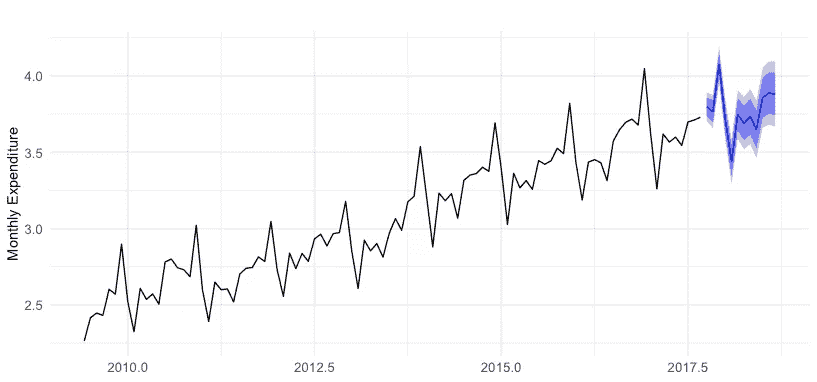
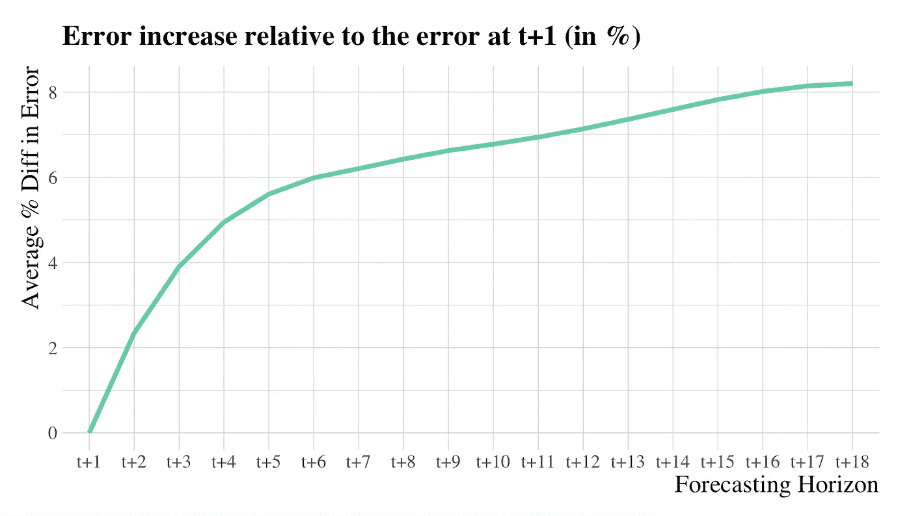

# 多步预测的 6 种方法

> 原文：<https://towardsdatascience.com/6-methods-for-multi-step-forecasting-823cbde4127a>

## 如何使用 Python 预测时间序列的多个值

西蒙·伯杰在 [Unsplash](https://unsplash.com?utm_source=medium&utm_medium=referral) 上的照片

重要的事情先来。**什么是多步预测？**

多步预测就是预测时间序列的多个值的问题。

图 1:澳大利亚未来 12 个月外出就餐总支出(十亿)预测。图片作者。

大多数预测问题都被框定为提前一步预测。也就是说，根据最近的事件预测序列的下一个值。但是，对许多问题来说，预测一个单一的步骤是过于狭隘的。

提前预测许多步骤具有重要的实际优势。它减少了长期的不确定性，从而实现了更好的运营规划。图 1 显示了一个为时间序列的下 12 个值生成预测的示例。

预测很难。试图预测未来的许多步骤甚至更糟。当我们试图预测未来时，这一系列的不确定性增加了。

例如，预测明天的最高温度很简单。它会有点像今天的。但是，预测一个月后的最高温度要困难得多。

以下示例显示了误差在预测范围内是如何增加的:

图 2:预测 18 个步骤的性能。这些值表示相对于 t+1 时的误差的百分比增量(提前一步预测)。作者图片

图 2 显示了一个模型在预测范围内的表现(18 个步骤)。

误差随着预测范围的增加而增加。这个误差是上千个时间序列的平均值。我从 gluonts 库得到了它们。

在这个故事的其余部分，我将描述多步预测的 6 种方法。我还将展示如何使用 Python 实现它们。

首先，让我们从创建一个模拟时间序列开始。我用下面的代码做到了这一点:

下面是前几个的样子:

以第一排为例。目标是预测涉及目标变量 t+1，…，t+4 的值[4，5，6，7]。解释变量是过去的 4 个滞后(t，…，t-3)。

现在，让我们看看如何获得多步预测。

# 1.递归(也称为迭代)

最简单的多步预测方法是**递归**方法。它的工作原理是为一步预测训练一个单一的模型。也就是预测下一步。然后，使用之前的预测对模型进行迭代，以获得多个步骤的预测。

以下是实现它的方法:

我从头实现了递归，以阐明它是如何工作的。但是，可以使用 sktime 库中可用的方法[**【recursivetimeseriesregressionpredictor】**](https://www.sktime.org/en/stable/api_reference/auto_generated/sktime.forecasting.compose.RecursiveTimeSeriesRegressionForecaster.html)、。

递归方法很吸引人，因为你只需要一个完整预测范围的单一模型。此外，您不需要提前确定预测范围。

但是，这也有严重的缺陷。用自己的预测作为输入来迭代同一个模型会导致误差的传播。这导致长期预测的预测性能较差。

# 2.直接的

**直接**方法为每个地平线建立一个模型。这里有一个片段:

scikit-learn 的 *MultiOutputRegressor* 类为每个目标变量复制了一个学习算法。在这种情况下，算法是线性回归。

这种方法避免了错误传播，因为不需要迭代任何模型。

但是，也有一些缺点。额外的模型需要更多的计算资源。此外，它假设每个视界都是独立的。通常，这种假设会导致糟糕的结果。

# 3.直接递归

顾名思义， **DirectRecursive** 试图融合 **Direct** 和 **Recursive** 的思想。为每个层位建立一个模型(直接跟随)。但是，在每一步，输入数据都随着前一个模型的预测而增加(遵循递归)。

这种方法在机器学习文献中被称为**链接**。scikit-learn 用 *RegressorChain* 类为它提供了一个实现。

# 4.数据作为演示器(DaD)

DaD 是一种用于多步预测的元学习算法。它试图减轻递归的错误传播问题。

其思想是使用训练集来纠正多步预测过程中出现的错误。它用这些修正迭代地丰富训练集。之后，使用丰富的训练数据执行递归方法。

作者提供了他们在 Github 中的实现。链接如下:

*   [https://github.com/arunvenk/DaD](https://github.com/arunvenk/DaD)

除了预测，爸爸在强化学习问题上也表现不俗。查看参考文献[1]了解详情。

# 5.动态因子机器学习(DFML)

DFML 方法是专门为多元时间序列设计的。尽管如此，它的原则也可以应用于单变量。

其思想是使用降维方法(例如 PCA)对时间序列进行预处理。所以，不用预测 H 值，你只需要预测几个潜在变量。之后，您可以恢复转换以获得原始维度中的预测。

对于单变量时间序列，你可以这样做:

减少我们需要预测的变量数量的想法可以被视为预处理步骤。因此，我们实际上可以应用任何多步预测方法和 DFML。在上面的例子中，我们使用了直接，但也可以采用不同的方法。

# 6.多输出

到目前为止描述的方法是**单输出方法—** 它们一次模拟一个层位。

这可能是一个限制，因为它们忽略了不同地平线之间的依赖性。捕捉这种依赖性对于更好的多步预测可能很重要。

多输出模型解决了这个问题。这些符合一个单一的模型，该模型联合学习所有的预测范围。

通常，学习算法需要单个变量作为输出。这个变量被称为目标变量。然而，一些算法自然可以接受多个输出变量。

在这种情况下，我们应用 k-最近邻法。其他例子包括山脊、套索、神经网络或随机森林(以及诸如此类的东西)。

多输出方法有一个变体，将它的思想与直接相结合。该变体在预测范围的不同子集中应用了直接方法。该方法在参考文献[2]中有所描述。

# 实用建议

照片由[贾维尔·阿莱格·巴罗斯](https://unsplash.com/@soymeraki?utm_source=medium&utm_medium=referral)在 [Unsplash](https://unsplash.com?utm_source=medium&utm_medium=referral) 上拍摄

那么，你应该使用哪种方法呢？

有一项系统研究表明多输出方法更好。文章还提到，对该系列进行非季节性调整非常重要。详见参考文献[2]。

如果有计算约束，应该避免直接或直接递归方法。除此之外，测试不同的方法，选择最适合您的数据的方法。

# 外卖

多步预测在许多领域都很重要。然而，预先预测多个步骤是一项困难的任务。

在这篇文章中，我描述了 6 种方法来帮助你解决这个问题。这些包括递归、直接、直接递归、DaD、DFML 和多输出。

感谢你的阅读，下一个故事再见！

## 参考

[1] Venkatraman、Arun、Martial Hebert 和 J. Andrew Bagnell。“改进学习时间序列模型的多步预测。”第二十九届 AAAI 人工智能会议。2015.

[2] Taieb，Souhaib Ben 等，“基于 NN5 预测竞赛的多步提前时间序列预测策略的回顾与比较”*专家系统与应用*39.8(2012):7067–7083。