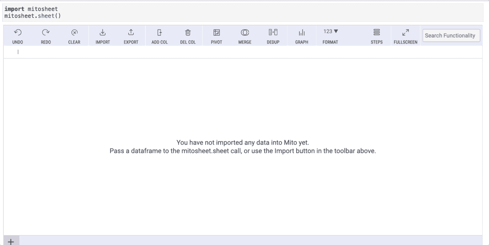
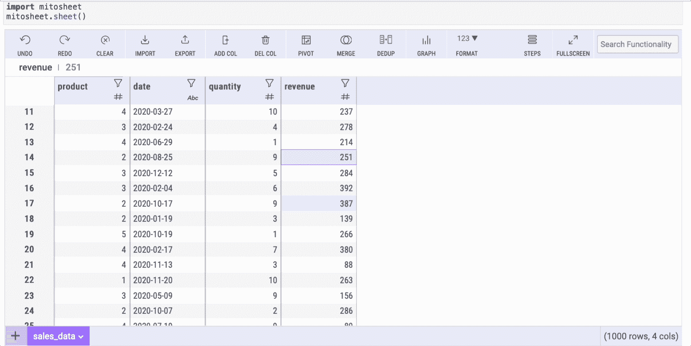
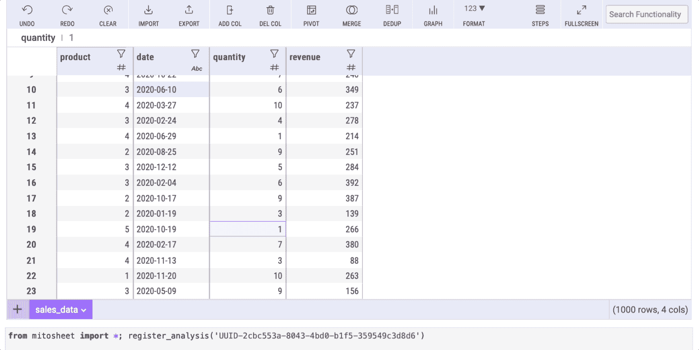
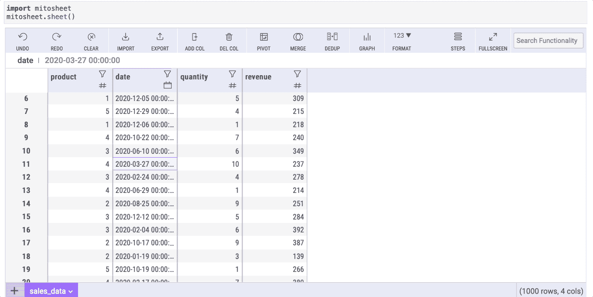
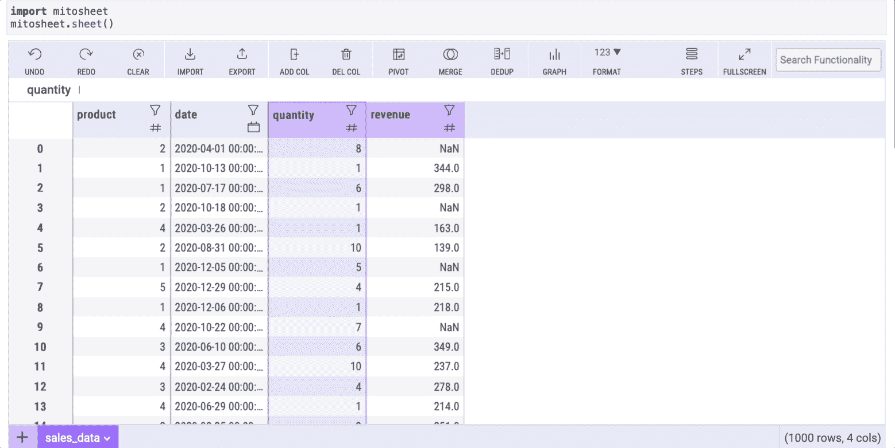
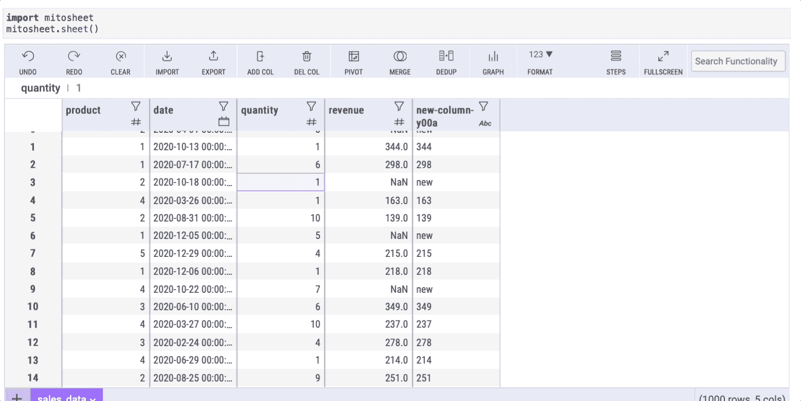

# 用米托简化的 6 种最常见的熊猫方法

> 原文：<https://towardsdatascience.com/6-most-common-pandas-methods-simplified-with-mito-2cd9fe729dab>

## 与熊猫数据框架互动，就像它是一个 Excel 工作簿


由[布鲁克·卡吉尔](https://unsplash.com/@brookecagle?utm_source=medium&utm_medium=referral)在 [Unsplash](https://unsplash.com?utm_source=medium&utm_medium=referral) 拍摄

Pandas 是数据科学家日常使用的数据科学库。它帮助我们清理数据，争论数据，甚至进行可视化。

我已经使用 Pandas 很长时间了，我意识到我在大多数数据科学项目中使用了一些方法。当涉及到使用数据帧时，它们是必不可少的，但是一遍又一遍地使用它们有时会变得有点乏味(并且您可能偶尔会忘记它们的语法)。

这就是为什么，在这篇文章中，我将向你展示如何使用一个叫做米托的库来简化 6 个最常见的熊猫方法。不使用 Python 代码，米托将允许我们与熊猫数据框架进行交互，就像它是一个 Excel 工作簿一样。

# 首要任务—安装米托

为了简化本文中列出的 6 种常见的熊猫方法，首先，我们需要安装[米托](https://www.trymito.io/)，因此打开一个新的终端或命令提示符并运行以下命令(如果可能，将其安装在一个新的虚拟环境中):

```
python -m pip install mitoinstaller
python -m mitoinstaller install
```

请记住，您需要使用 **Python 3.6** 或更高版本以及 **JupyterLab** 才能让米托正常工作。

在这之后，重新启动 JupyterLab 内核，并刷新浏览器页面，开始使用米托。更多信息，你可以查看他们的 [Github](https://github.com/mito-ds/monorepo) 和[文档](https://docs.trymito.io/getting-started/installing-mito)。

# 1.阅读 _csv

毫无疑问，`read_csv`是有史以来最常见的熊猫方法。读取文件以创建数据帧是每个数据科学项目的起点。

您可以导入一个 CSV 文件与几个点击使用米托。你只需要导入 mitosheet 并创建一个表。

```
**import** mitosheet
mitosheet.sheet()
```

运行上面的代码后，会出现一个紫色的工作表，您只需单击“Import”按钮，从您的工作目录导入任何数据集。



作者图片

在本例中，我导入了一个名为“sales-data.csv”的数据集，这是我自己为此例创建的，您可以在我的 [Google Drive](https://drive.google.com/drive/folders/1d3N4hs0dDEdEsUqI9J_MHaF5CdYIlSLM?usp=sharing) 中找到它。

请注意，在下面的单元格中，米托将生成 Python 代码，使这种导入成为可能。

# 2.值计数

另一种常见的熊猫方法是`value_counts`。这个方法允许我们获得一个列中唯一值的计数。使用米托，你只需点击几下鼠标就能获得与`value_counts`相同的功能。

让我们计算一下“产品”列中的独特元素。为此，您只需选择该列并单击过滤器按钮:


作者图片

此按钮打开的窗口有 3 个标签。每个选项卡将帮助我们替换本文中列出的一些常见的 Pandas 方法，所以请记住它！

选择“值”选项卡以获取米托唯一值的计数(和百分比)。



作者图片

# 3.astype

我不知道在 Pandas 中使用`astype`方法改变了多少次列的数据类型。

米托也可以通过几次点击来帮助我们改变数据类型！默认情况下，米托使用列名旁边的图标显示所有列的数据类型。

假设我们想将“date”列的数据类型设置为 date(当前设置为 string)。使用米托更改数据类型非常简单，只需单击过滤器图标，选择“过滤器/排序”选项卡，然后从“Dtype”下拉列表中选择任何数据类型。



作者图片

同样，细胞下方的有丝分裂表将显示代码自动生成的米托。

# 4.形容

这是我们在每次数据分析中使用的方法。`describe`方法帮助我们从数据中获得基本的统计数据，如平均值、中值和众数。

对米托来说，这样做很简单。我们只需点击任意列的过滤器图标，然后选择“Summary stats”选项卡。



作者图片

除了`describe`方法显示的典型信息之外，米托的汇总统计数据还有一个“count: NaN”行，显示一列中缺失数据(NaN)的数量。

# 5.菲尔娜

现实世界的数据集大多数时候都有缺失数据。这就是为什么，作为一名数据科学家，你必须学会如何处理丢失的数据。

一种解决方法是在熊猫身上使用`fillna`方法。也就是说，这种方法可以使用我们的 mitosheet 中的公式进行简化。

首先，我们需要通过单击“Add Col”按钮创建一个新列。然后，我们转到我们创建的列中的任何单元格，并编写以下公式:

```
=FILLNAN(series,’text-to-replace’)
```

其中`series`是缺失数据的列(在本例中，我从“收入”列中删除了一些值以生成缺失的数据)



作者图片

按回车键后，所有单元格将自动填充相同的公式。结果，来自“列 1”的所有 NaN 单元将在“列 2”中具有所需的值。

# 6.分组依据

这是我们每次想要聚集数据以便计数、求和等等时使用的方法。

我找不到用米托替换`groupby`方法的本地方法，但是有一个很好的变通方法，只需几次点击就可以实现。

我们只需要在米托使用“Pivot”选项。然后，我们必须选择要显示的行/列和数据。

假设我们想按产品对数据进行分组，然后对每组中的数量进行求和。为此，请按照以下步骤操作:



作者图片

[**与 1 万多人一起加入我的电子邮件列表，获取我在所有教程中使用的 Python for Data Science 备忘单(免费 PDF)**](https://frankandrade.ck.page/bd063ff2d3)

如果你喜欢阅读这样的故事，并想支持我成为一名作家，可以考虑报名成为一名媒体成员。每月 5 美元，让您可以无限制地访问数以千计的 Python 指南和数据科学文章。如果你使用[我的链接](https://frank-andrade.medium.com/membership)注册，我会赚一小笔佣金，不需要你额外付费。

[](https://frank-andrade.medium.com/membership) 