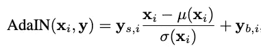
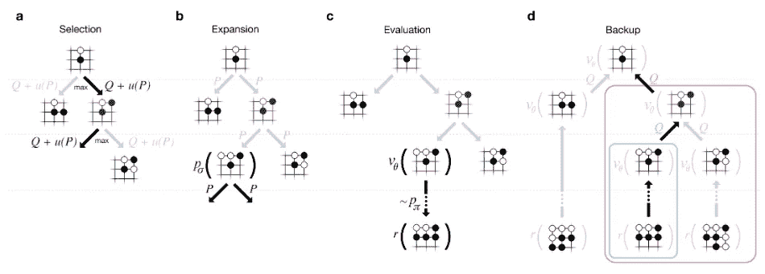

# 每位现代数据科学家必读的 6 篇论文

> 原文：<https://towardsdatascience.com/6-papers-every-modern-data-scientist-must-read-1d0e708becd>

## 该领域的每个人都熟悉的深度学习的一些最重要的现代基础的列表

照片由[🇸🇮·扬科·菲利](https://unsplash.com/@itfeelslikefilm?utm_source=unsplash&utm_medium=referral&utm_content=creditCopyText)在 [Unsplash](https://unsplash.com/?utm_source=unsplash&utm_medium=referral&utm_content=creditCopyText) 上拍摄

***听我讨论这些关于*** [***可讲解播客***](https://open.spotify.com/episode/18hytWnvHhdIwphew2PnaS?si=9795e432804b42f6) ***【希伯来语】***

数据科学家、机器学习专家、算法工程师、深度学习研究员——无论你的头衔可能是什么，如果使用机器学习的先进概念是你职业生涯的一部分，那么跟上最新的创新也是你日常任务的一部分。但是，为了站在所有最新技术的顶端，并真正理解它们是如何工作的，我们还必须熟悉它们所依赖的构件和基础。

深度学习领域正在快速发展，打破和创造每一个可能存在的指标的新纪录。随着它的发展，它创造了新的基本概念，允许前所未见的新架构和概念。

虽然我倾向于假设所有现代 ML 从业者都熟悉基本原理，如 CNN，，和甘，一些新的偶尔会被错过或遗漏。因此，这篇博文将讨论*新的*基础——我相信今天这个领域的每个人都应该熟悉的六篇论文。

## 你所需要的只是注意力

【 [*论文上 arXiv*](https://arxiv.org/pdf/1706.03762.pdf) 】

这篇论文由谷歌的一个团队在 2017 年发布，向世界揭示了一种新的神经网络块，称为*变压器—* ，可以很容易地被标记为现代深度学习模型发展中最重要的里程碑之一。

转换器允许以并行方式处理序列，不像之前的技术水平那样严重依赖于 rnn 的类型。后者往往有几个主要缺点-RNN 图层必须依赖于先前输入的自身输出值。这导致训练时间缓慢，以及众所周知的消失/爆炸梯度问题，导致 RNNs 不足以找到序列中相距太远的单词之间的关系。

变形金刚能够通过使用两种新方法来解决这些问题——第一种，他们使用*位置嵌入*来标记序列中每个元素的位置，第二种是使用*注意力*，特别是自我注意力，以允许模型学习序列中不同元素之间的关系。

除了变形金刚本身之外，论文中充满了优化模型的小宝石。这里是我个人最喜欢的两个:

1.  作者严格提到他们使用层规范化而不是批规范化。总结最初的[图层归一化论文](https://arxiv.org/pdf/1607.06450.pdf)，它基本上意味着归一化不是针对一批中的每个特征，而是针对整个样本(或图层)，每个样本本身。这篇论文证明了 LN 在很多情况下比 BN 更好，因为 Geoffrey Hinton 是三位作者之一，所以我相信他的话。
2.  注意事项中变压器的每个子层都由一个跳过层或残差块包裹(见下图)。这个模块背后的思想是，给定一个输入 **x** ，一个网络试图学习某个函数 **H(x)** ，它可以粗略地写成 **H(x) = F(x) + x** 。利用跳层机制，我们强制中间层学习 **F(x)** ，按照原来的[残差学习层](https://arxiv.org/pdf/1512.03385.pdf)，这样收敛更好。

由跳过层构成的残余块。摘自《你所需要的只是关注》

## (2) BERT:用于语言理解的深度双向转换器的预训练

【 [*论文上 arXiv*](https://arxiv.org/pdf/1810.04805.pdf) 】

由谷歌研究人员在 2019 年发布的 BERT 是一个不容忽视的 NLP 模型，并将 NLP 领域向前推进了一大步。BERT(代表来自变压器的双向编码器表示)是使用变压器开发的，并成为这些类型的模型可以容纳的功率的活生生的证明。我个人倾向于认为“*注意力是你所需要的全部*”和这篇论文多少有些互补；第一个描述了一个更一般的和“理论上的”方法，而后者将它用于一个特定的和定义明确的任务。

BERT 是革命性的，主要有两个原因:第一，它能够在 11 个自然语言处理任务中击败最先进的结果，第二，它被训练和设计用于微调，因此它可以很容易地匹配和定制任何特定的自然语言处理任务。

让 BERT 得到如此高效训练的一个关键因素是使用了[单词片段嵌入](https://arxiv.org/pdf/1609.08144.pdf)，它允许模型将单词分解成片段，使要学习的词汇量变得更小。

## (3)基于风格的生成对抗网络生成器体系结构

【 [*论文上 arXiv*](https://arxiv.org/pdf/1812.04948.pdf)

这篇由 Nvidia Labs 于 2018 年底发表的论文向世界介绍了 StyleGAN 模型。自从 Ian Goodfellow 在 2014 年介绍了[生成对抗网络](https://arxiv.org/pdf/1406.2661.pdf) (GANs)以来，许多研究人员在提高 GAN 能力方面做了大量工作，但主要是通过关注鉴别器，因为更好的鉴别器最终会导致更好的生成器。然而，这种对生成器本身的关注不足导致“ *…生成器继续作为黑盒运行，尽管最近做出了努力，但对图像合成过程各个方面的理解，例如随机特征的起源，仍然缺乏*”*。*style gan 背后的想法是允许通过直接影响发生器本身，使用另一个输入(第二个图像)来调整输出图像的一些功能。

将一个输入的风格与生成的第二个输入混合是通过两个主要步骤完成的——首先，将风格输入插入到密集网络中，输出另一个学习向量。其次，应用一种新颖的“*自适应实例归一化*”(AdaIN)——原始图像输入被归一化，然后新的样式嵌入被混合:

但是我个人认为这篇论文最有趣的部分，是这个模型是如何被训练和评估的。想一想——没有网络可以学习的数据集。因此，研究人员所做的不过是非凡的数据科学——他们理解并利用了他们所拥有的数据。

当谈到损耗时，作者明确提到他们使用了标准 GAN 损耗，这是有意义的，因为 StyleGAN 产生的图像应该看起来很真实，就像任何常规 GAN 产生的图像一样。但是当涉及到评估时——也就是说，输出的风格确实被改变了——他们注意到了他们所谓的“特征纠缠”。他们声称，由于网络被训练的照片是真实的，一些面部特征是相互关联的——例如，长发通常会与女性联系在一起，胡须与男性联系在一起，蓝眼睛与白种人联系在一起，等等。因此，他们为大约 40 种这样的属性训练了一个分类器，并表明 StyleGAN 生成的照片比常规 GAN 具有更高的属性可分性。

## (4)从自然语言监督中学习可转移的视觉模型

【 [*论文上 arXiv*](https://arxiv.org/pdf/2103.00020.pdf)

OpenAI 于 2021 年初发布的这篇论文可能是零镜头分类算法中最伟大的革命之一，它提出了一种被称为*对比语言图像预训练*的新模型，简称 CLIP。

CLIP 在 4 亿对图像及其相应字幕的大规模数据集上接受了训练，并学会了将图像和自由文本嵌入到同一个嵌入空间，因此图像和自由文本描述将共享同一个潜在向量。CLIP 可以处理任何图像和任何英文文本，并且在零镜头分类任务中表现出了出色的能力。

此外，下面的一些工作已经表明，剪辑空间中的潜在向量遵循我们从 NLP 中熟悉的算法。也就是说，我们都知道，在 Word2Vec 潜在空间中，我们得到*男人+皇后-女人=国王*，那么在剪辑空间中，我们可以得到相同的等式，但是在使用单词*男人*和*女人*，以及*国王*和*皇后*的图像时。

## (5)利用深度神经网络和树搜索来掌握围棋

[[*deep mind 网站上的论文*](https://storage.googleapis.com/deepmind-media/alphago/AlphaGoNaturePaper.pdf) ]

DeepMind 在 2016 年初发布的这篇论文在强化学习方面取得了突破，它提出了*alpha Go*——一个以 5 比 0 击败欧洲围棋冠军的模型。这是有史以来第一个人工智能在全尺寸围棋比赛中击败人类职业选手，这一壮举此前被认为是至少十年后的事情。

AlphaGo 使用[蒙特卡罗树搜索](https://hal.inria.fr/inria-00116992/document) (MCTS)来计算它的下一步棋——这意味着，它并不真正计算树中的每个节点，而是对可能的结果进行许多模拟。

AlphaGo 的作者表示，他们训练了一个策略梯度模型，该模型在监督学习模型的基础上进行优化，而监督学习模型又从记录的人类专家游戏中学习。但是这个庞大的网络太慢了，不能在真实游戏中模拟 MCTS，所以他们必须找到一个替代品。相反，他们训练了两个网络——一个轻量级策略梯度，它要弱得多，但也快 1000 倍以上，另一个价值网络，它预测游戏中每个州的价值(即获胜的机会)。这种价值网络通过重度政策梯度的自我游戏学习，从而直接从中学习。在 MCTS 模拟的每个时间步，轻量级网络用于从当前状态生成游戏性，直到游戏结束，并且它接收的奖励与当前状态的价值网络评估相结合，以便提供该状态的 Q 值评估。一旦所有模拟终止，AlphaGo 就会选择它在这些探索模拟中访问最多的州。

AlphaGo 的 MCTS 阶段，摘自《用深度神经网络和树搜索掌握围棋》

2017 年，在这篇论文发表一年后，DeepMind 发表了第二篇与围棋相关的论文，“在没有人类知识的情况下[掌握围棋的游戏](https://www.nature.com/articles/nature24270.epdf?author_access_token=VJXbVjaSHxFoctQQ4p2k4tRgN0jAjWel9jnR3ZoTv0PVW4gB86EEpGqTRDtpIz-2rmo8-KG06gqVobU5NSCFeHILHcVFUeMsbvwS-lxjqQGg98faovwjxeTUgZAUMnRQ)”，其中提出了 *AlphaGo Zero* ，它只使用自对弈进行训练，包含单个网络而不是两个网络——并以 100 比 0 击败 AlphaGo。

## (6)用于 YouTube 推荐的深度神经网络

[ [*谷歌研究论文*](https://static.googleusercontent.com/media/research.google.com/en//pubs/archive/45530.pdf) ]

这篇论文于 2016 年发布，揭示了 YouTube 中用于推荐的深度学习模型的架构。在许多方面，本文中描述的高级体系结构和方法至今仍在业界广泛使用。

本文是您可能想到的每一个使用深度学习的推荐问题的经典之作，涵盖了广泛的主题，如高级架构、处理大规模(使用候选生成和排名模型)、分类为极端多类分类、优化训练和测试数据以实现准确预测、功能的影响、增加网络的影响、使用和选择嵌入等等。底线是，如果你对推荐系统感兴趣，这是必须的。

这是我所有现代数据科学家必读的前 6 篇论文——如果你认为我错过了某篇论文，请告诉我！