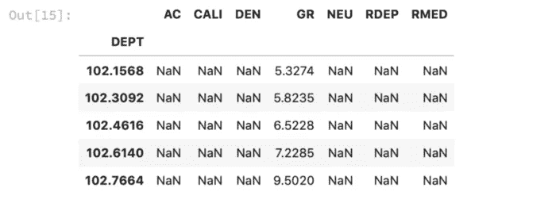
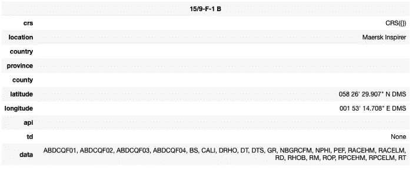
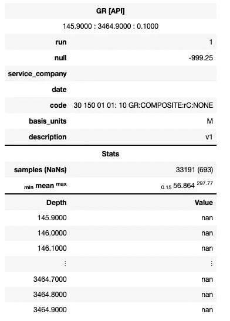
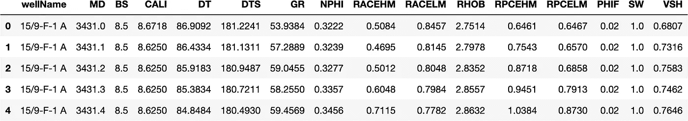
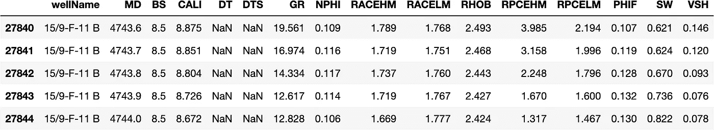
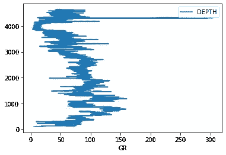
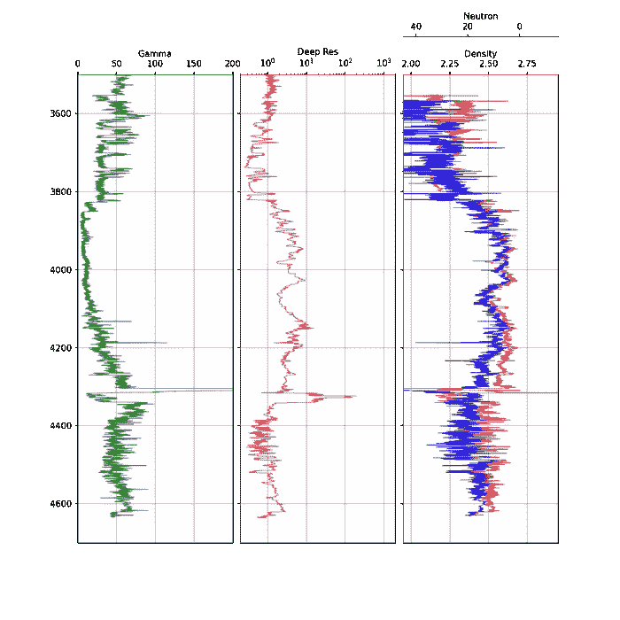

# 关于测井数据和岩石物理学，你应该了解的 6 个 Python 库

> 原文：<https://towardsdatascience.com/6-python-libraries-you-should-know-about-for-well-log-data-petrophysics-3dfde47856b8>

## 发现 6 个很棒的 python 库，您现在就可以开始使用它们处理测井数据


照片由[希特什·乔杜里](https://unsplash.com/@hiteshchoudhary?utm_source=medium&utm_medium=referral)在 [Unsplash](https://unsplash.com?utm_source=medium&utm_medium=referral) 拍摄

Python[的一个伟大之处在于大量的开源库，这些库的开发是为了改善我们处理数据和理解数据的方式。在岩石物理学和地球科学领域，有许多有用的库，可以使处理测井数据变得更容易。](https://www.python.org)

在本文中，我将向您介绍 6 个我最喜欢和最常用的 Python 库，它们可以帮助您完成一些任务，例如为特定文件格式加载数据，以实现数据的可视化。

如果你喜欢看视频形式的内容，你可以在下面找到它。

# lasio —加载、编辑和创建。LAS 文件

测井 ASCII 标准(LAS)文件是存储和传输测井数据的常用文件格式。为了读取这些文件，Kent Inverarity 开发了一个名为 [lasio](https://pypi.org/project/lasio/) 的专用 python 库来读写这些类型的文件。当数据被加载到 lasio 中时，它可以很容易地转换成其他文件格式，包括转换成一个 [pandas dataframe](https://pandas.pydata.org/docs/reference/api/pandas.DataFrame.html) 。

## 如何使用 lasio:

要安装 [lasio](https://lasio.readthedocs.io/en/latest/) ，您只需打开命令提示符或终端并键入`pip install lasio`。一旦安装了这个库，你就可以通过输入`import lasio`轻松导入到你的 Jupyter 笔记本中。

以下示例说明了如何加载 las 文件并查看井口信息。

首先我们需要导入 lasio，然后在函数的括号内调用`lasio.read()`,我们传递 las 文件的路径。

```
import lasio
las = lasio.read("15-9-19_SR_COMP.LAS")
```

加载文件后，我们可以创建一个简单的 for 循环，该循环将遍历 las 文件孔标题部分中的每个项目/条目，并打印出描述、助记符及其值

```
for item in las.well:
    print(f"{item.descr} ({item.mnemonic}): {item.value}")
```

这将返回:

```
Top Depth (STRT): 102.1568
Bottom Depth (STOP): 4636.514
Depth Increment (STEP): 0.1524
Null Value (NULL): -999.25
Field Name (FLD): Q15
NAME (WELL): 15/9-19
WELLBORE (WBN): 15/9-19 SR
COUNTRY (NATI): NOR
COUNTRY (CTRY): NOR
OPERATOR (COMP): STATOIL
PERM DATUM (PDAT): MSL
RIG NAME (COUN): NORTH SEA
STATE (STAT): NORWAY
PB WELL ID (PBWE): 15/9-19
PB WELLBORE ID (APIN): 15/9-19 SR
PB WELL NAME SET (PBWS): ALL
```

如果我们想将测井数据从一个 lasio 对象传输到一个 [pandas 数据帧](https://pandas.pydata.org/docs/reference/api/pandas.DataFrame.html)，我们可以简单地执行以下操作:

```
well = las.df()
well.head()
```

当我们查看[数据帧](https://pandas.pydata.org/docs/reference/api/pandas.DataFrame.html)的标题内容时，我们可以看到我们获得了前五行数据。



从 las.df()返回的 dataframe 显示了测井数据的前五行。图片由作者提供。

## 了解有关 lasio 的更多信息:

要更深入地了解 lasio，您可以在这里[找到我关于使用测井 las 文件的文章](https://andymcdonaldgeo.medium.com/loading-and-displaying-well-log-data-b9568efd1d8)或者查看我们的 YouTube 视频。

# dlisio —与合作。DLIS 档案

另一种用于存储和传输测井数据的通用文件格式是 [DLIS，代表数字测井交换标准](http://w3.energistics.org/RP66/V1/Toc/main.html)。这些是比 LAS 文件和 CSV 文件复杂得多的二进制文件。它们能够存储多维阵列数据，如声波波形、钻孔图像和核磁共振 T2 分布。

Equinor 开发了 [dlsio python 库](https://github.com/equinor/dlisio),以便轻松处理 DLIS 和旧的 LIS 文件

## 如何使用 dlisio:

要安装 [dlsio](https://dlisio.readthedocs.io/en/latest/) ，您只需打开命令提示符或终端并键入`pip install dlisio`。一旦安装了这个库，你就可以通过输入`import dlisio`轻松导入到你的 Jupyter 笔记本中。

以下示例说明了如何加载 dlis 文件并查看孔标题信息。

加载 dlis 文件时，值得记住的是，它们可以包含多组测井数据，这些数据存储在逻辑文件中。这可能包括多口井、来自同一口井的多个数据集以及不同级别的已处理数据。为了说明这一点，我们需要使用下面的语法，它允许第一个文件输出到`f`，任何后续的逻辑文件放入`tail`。

```
import dlisio
f, *tail = dlis.load('Data/NLOG_LIS_LAS_7857_FMS_DSI_MAIN_LOG.DLIS')
```

执行时，此代码返回:

```
LogicalFile(00001_AC_WORK)
[]
```

要查看文件的高级内容，我们可以使用`.describe()`方法。这将返回有关逻辑文件中的帧数、通道数和对象数的信息。当我们将其应用于`f`时，我们可以看到我们有一个包含 4 帧和 484 个通道(测井曲线)的文件，此外还有许多已知和未知的对象。

```
f.describe()
```

它返回:

```
------------
Logical File
------------
Description : LogicalFile(FMS_DSI_138PUP)
Frames      : 4
Channels    : 484Known objects
--
FILE-HEADER             : 1
ORIGIN                  : 1
AXIS                    : 50
EQUIPMENT               : 27
TOOL                    : 5
PARAMETER               : 480
CALIBRATION-MEASUREMENT : 22
CALIBRATION-COEFFICIENT : 12
CALIBRATION             : 341
PROCESS                 : 3
CHANNEL                 : 484
FRAME                   : 4Unknown objects
--
440-CHANNEL                  : 538
440-PRESENTATION-DESCRIPTION : 1
440-OP-CHANNEL               : 573
```

如上所示，我们的数据中有 4 个独立的帧。这些帧也可以表示不同的数据类型、不同的测井通道和不同阶段的处理数据。每个框架都有自己的属性，我们可以使用以下代码将这些属性打印成易于阅读的格式:

```
for frame in f.frames:

    # Search through the channels for the index and obtain the units
    for channel in frame.channels:
        if channel.name == frame.index:
            depth_units = channel.units

    print(f'Frame Name: \t\t {frame.name}')
    print(f'Index Type: \t\t {frame.index_type}')
    print(f'Depth Interval: \t {frame.index_min} - {frame.index_max} {depth_units}')
    print(f'Depth Spacing: \t\t {frame.spacing} {depth_units}')
    print(f'Direction: \t\t {frame.direction}')
    print(f'Num of Channels: \t {len(frame.channels)}')
    print(f'Channel Names: \t\t {str(frame.channels)}')
    print('\n\n')
```

这将返回以下摘要。这表明该文件中存在两个帧。第一帧包含钻头尺寸(BIT)、井径(CAL)、伽马射线(GR)和张力(TEN)的基本测井曲线。第二帧包含后处理的声波波形数据。

```
Frame Name: 		 60B
Index Type: 		 BOREHOLE-DEPTH
Depth Interval: 	 0 - 0 0.1 in
Depth Spacing: 		 -60 0.1 in
Direction: 		 DECREASING
Num of Channels: 	 77
Channel Names: 		 [Channel(TDEP), Channel(BS), Channel(CS), Channel(TENS), Channel(ETIM), Channel(DEVI), Channel(P1AZ_MEST), Channel(ANOR), Channel(FINC), Channel(HAZI), Channel(P1AZ), Channel(RB), Channel(SDEV), Channel(GAT), Channel(GMT), Channel(ECGR), Channel(ITT), Channel(SPHI), Channel(DCI2), Channel(DCI4), Channel(SOBS), Channel(DTCO), Channel(DTSM), Channel(PR), Channel(VPVS), Channel(CHR2), Channel(DT2R), Channel(DTRP), Channel(CHRP), Channel(DTRS), Channel(CHRS), Channel(DTTP), Channel(CHTP), Channel(DTTS), Channel(CHTS), Channel(DT2), Channel(DT4P), Channel(DT4S), Channel(SPCF), Channel(DPTR), Channel(DPAZ), Channel(QUAF), Channel(DDIP), Channel(DDA), Channel(FCD), Channel(HDAR), Channel(RGR), Channel(TIME), Channel(CVEL), Channel(MSW1), Channel(MSW2), Channel(FNOR), Channel(SAS2), Channel(SAS4), Channel(PWF2), Channel(PWN2), Channel(PWF4), Channel(PWN4), Channel(SVEL), Channel(SSVE), Channel(SPR2), Channel(SPR4), Channel(SPT4), Channel(DF), Channel(CDF), Channel(CLOS), Channel(ED), Channel(ND), Channel(TVDE), Channel(VSEC), Channel(CWEL), Channel(AREA), Channel(AFCD), Channel(ABS), Channel(IHV), Channel(ICV), Channel(GR)]Frame Name: 		 10B
Index Type: 		 BOREHOLE-DEPTH
Depth Interval: 	 0 - 0 0.1 in
Depth Spacing: 		 -10 0.1 in
Direction: 		 DECREASING
Num of Channels: 	 4
Channel Names: 		 [Channel(TDEP), Channel(IDWD), Channel(TIME), Channel(SCD)]Frame Name: 		 1B
Index Type: 		 BOREHOLE-DEPTH
Depth Interval: 	 0 - 0 0.1 in
Depth Spacing: 		 -1 0.1 in
Direction: 		 DECREASING
Num of Channels: 	 84
Channel Names: 		 [Channel(TDEP), Channel(TIME), Channel(EV), Channel(BA28), Channel(BA17), Channel(BB17), Channel(BC13), Channel(BD13), Channel(BB28), Channel(BA13), Channel(BB13), Channel(BC17), Channel(BD17), Channel(BA22), Channel(BA23), Channel(BA24), Channel(BC28), Channel(BA25), Channel(BA26), Channel(BA27), Channel(BA11), Channel(BA12), Channel(BA14), Channel(BA15), Channel(BA16), Channel(BA18), Channel(BA21), Channel(BC11), Channel(BC12), Channel(BC14), Channel(BC15), Channel(BC16), Channel(BC18), Channel(BC21), Channel(BC22), Channel(BC23), Channel(BC24), Channel(BC25), Channel(BC26), Channel(BC27), Channel(BB22), Channel(BB23), Channel(BB24), Channel(BD28), Channel(BB25), Channel(BB26), Channel(BB27), Channel(BB11), Channel(BB12), Channel(BB14), Channel(BB15), Channel(BB16), Channel(BB18), Channel(BB21), Channel(BD11), Channel(BD12), Channel(BD14), Channel(BD15), Channel(BD16), Channel(BD18), Channel(BD21), Channel(BD22), Channel(BD23), Channel(BD24), Channel(BD25), Channel(BD26), Channel(BD27), Channel(SB1), Channel(DB1), Channel(DB2), Channel(DB3A), Channel(DB4A), Channel(SB2), Channel(DB1A), Channel(DB2A), Channel(DB3), Channel(DB4), Channel(FCAX), Channel(FCAY), Channel(FCAZ), Channel(FTIM), Channel(AZSNG), Channel(AZS1G), Channel(AZS2G)]Frame Name: 		 15B
Index Type: 		 BOREHOLE-DEPTH
Depth Interval: 	 0 - 0 0.1 in
Depth Spacing: 		 -15 0.1 in
Direction: 		 DECREASING
Num of Channels: 	 12
Channel Names: 		 [Channel(TDEP), Channel(TIME), Channel(C1), Channel(C2), Channel(U-MBAV), Channel(AX), Channel(AY), Channel(AZ), Channel(EI), Channel(FX), Channel(FY), Channel(FZ)]
```

## 了解有关 dlisio 的更多信息:

要更深入地了解如何使用 DLIS 文件和 [dlisio 库](https://dlisio.readthedocs.io/en/latest/)，请查看我的文章[使用 Python 从 DLIS 加载测井数据](/loading-well-log-data-from-dlis-using-python-9d48df9a23e2)

或者您可以在以下网址观看视频:

# welly —用于测井数据的专用 Python 库

[welly 库](https://github.com/agilescientific/welly/tree/main/welly)由 [Agile Scientific](https://github.com/agilescientific) 开发，用于帮助加载、处理和分析单井或多口井的测井数据。

该库允许探索 las 文件头中的元数据，还包含显示典型测井记录的绘图功能。此外，welly 库包含用于识别和处理数据质量问题的工具。

Welly 库可以在位于 https://github.com/agile-geoscience/welly[的敏捷地球科学 GitHub 中找到](https://github.com/agile-geoscience/welly)

## 如何使用 welly:

要安装 welly，你只需打开一个命令提示符或终端，键入`pip install welly`。一旦安装了库，我们就可以开始导入 welly 库的特定模块。对于本例，我们将使用井和曲线模块。这些模块用于处理测井数据和单独的曲线。

```
from welly import Well
from welly import Curve
```

我们的 LAS 文件可以使用`Well.from_las()`方法加载。这将创建一个新的井对象。

```
well = Well.from_las('Data/15_19_F1B_WLC_PETRO_COMPUTED_INPUT_1.LAS')
```

现在我们的数据已经加载完毕，我们可以开始研究所选井的内容和元数据。如果我们调用我们的`well`对象，我们将看到一个包含井名、位置、坐标和曲线助记符列表的汇总表。

```
well
```



由 welly python 库生成的测井标题信息。图片由作者提供。

如果我们想更仔细地查看其中一条测井曲线，我们可以这样传递曲线的名称:

```
well.data['GR']
```



从 welly python 库生成的单个测井曲线标题。图片由作者提供。

## 了解更多关于 welly 的信息:

要更深入地了解这个库，请查看我的文章:[使用 Welly Python 库探索测井数据](/exploring-well-log-data-using-the-welly-python-library-5e808cd3137b)

或者在以下播放列表中查看我在 welly 上的 YouTube 系列:

# 缺失编号-识别缺失的数据

测井测量中的缺失数据是许多岩石物理学家和地球科学家在处理测井数据时面临的一个非常普遍的问题。数据丢失可能有多种原因，包括工具和数据过时、工具传感器问题、工具故障等。

[缺少 python 库](https://github.com/ResidentMario/missingno)非常有用，但是使用起来非常简单。

## 如何使用 missingno:

要安装 [missingno](https://github.com/ResidentMario/missingno) ，您只需打开命令提示符或终端并键入`pip install missingno`。

一旦安装了库，我们就可以使用下面的约定将 missingno 和 pandas 一起导入。我们还可以加载一个 CSV 文件来展示 [missingno 库](https://github.com/ResidentMario/missingno)的强大功能。

```
import pandas as pd
import missingno as msnodf = pd.read_csv('xeek_train_subset.csv')
```

在 [missingno 库内，](https://github.com/ResidentMario/missingno)有四种图形用于显示数据完整性:柱状图、矩阵图、热图和树状图。每种方法在识别缺失数据方面都有自己的优势。

在这篇文章中，我们将看看柱状图。

条形图提供了一个简单的绘图，其中每个条形代表数据帧中的一列。条形的高度表示该列的完整程度，即有多少非空值。它可以通过调用以下命令来生成:

```
msno.bar(df)
```


在图的左侧，y 轴刻度范围从 0.0 到 1.0，其中 1.0 表示 100%的数据完整性。如果柱线小于此值，则表明该列中缺少值。

在图的右侧，标度以指数值度量。右上角代表数据帧内的最大行数。

在图的顶部，有一系列数字表示该列中非空值的总数。

在此示例中，我们可以看到许多列(DTS、DCAL 和 RSHA)有大量缺失值。其他列(如 WELL、DEPTH_MD 和 GR)是完整的，并且具有最大数量的值。

## 了解关于 missingno 的更多信息否:

关于 missingno 库的更多信息，请查看:[在机器学习之前使用 missingno Python 库来识别和可视化丢失的数据](/using-the-missingno-python-library-to-identify-and-visualise-missing-data-prior-to-machine-learning-34c8c5b5f009)

或者你可以在我的 YouTube 频道上观看以下视频:

# 熊猫-使用表格数据

pandas 库是最著名的处理数据的 Python 库之一。

## 如何使用熊猫:

要安装 pandas，你只需打开命令提示符或终端，输入`pip install pandas`。

一旦安装了库，我们就可以使用以下惯例导入 pandas:

```
import pandas as pd
```

如果我们有一个包含数据的 CSV 文件，如常规岩心分析(RCA)或偏差调查数据，我们只需通过以下操作加载它:

```
df = pd.read_csv('data/spwla_volve_data.csv')
```

我们可以调用`.info()`来提供数据帧中所有列的列表，以及它们的数据类型(例如，浮点、整数、字符串等)。)，以及每列中包含的非空值的数量。

```
df.info()
RangeIndex: 27845 entries, 0 to 27844
Data columns (total 16 columns):
 #   Column    Non-Null Count  Dtype  
---  ------    --------------  -----  
 0   wellName  27845 non-null  object 
 1   MD        27845 non-null  float64
 2   BS        27845 non-null  float64
 3   CALI      27845 non-null  float64
 4   DT        5493 non-null   float64
 5   DTS       5420 non-null   float64
 6   GR        27845 non-null  float64
 7   NPHI      27845 non-null  float64
 8   RACEHM    27845 non-null  float64
 9   RACELM    27845 non-null  float64
 10  RHOB      27845 non-null  float64
 11  RPCEHM    27845 non-null  float64
 12  RPCELM    27600 non-null  float64
 13  PHIF      27736 non-null  float64
 14  SW        27736 non-null  float64
 15  VSH       27844 non-null  float64
dtypes: float64(15), object(1)
memory usage: 3.4+ MB
```

下一组有用的方法是`head()`和`.tail()`函数。这些函数返回数据帧的前/后五行

```
df.head()
```



测井测量数据帧的前五行。单击以放大。图片由作者提供。

```
df.tail()
```



测井测量数据帧的最后五行。单击以放大。图片由作者提供。

## 了解更多关于熊猫的信息:

要更深入地了解一些与 pandas 相关的主题，您可以查看我的文章:[使用 Pandas、Matplotlib 和 Seaborn 探索测井数据](/exploring-well-log-data-using-pandas-matplotlib-and-seaborn-712779a39ac2)

如果你有兴趣看看使用熊猫图书馆可以做些什么，我制作了这个关于如何使用熊猫填充缺失数据的短片:

# matplotlib —数据可视化

matplotlib 是我最喜欢的可视化测井数据的 Python 库之一。一旦了解了它的基本工作原理，它在处理测井数据时会变得非常强大。Matplotlib 是最流行的用于数据可视化和探索的 Python 库之一，被许多数据科学家、Python 编码员和机器学习爱好者使用。

该库可以用几行代码生成测井曲线、箱线图、散点图(交会图)。

## 如何使用 matplotlib:

要安装 matplotlib，您只需打开命令提示符或终端，然后键入`pip install matplotlib`。

任何 python 项目或笔记本的第一步都是导入所需的库。在这种情况下，我们将使用`lasio`加载我们的 las 文件，`pandas`存储我们的测井数据，以及`matplotlib`显示我们的数据。

```
import pandas as pd
import lasio
import matplotlib.pyplot as plt
```

为了读取数据，我们将使用 lasio 库，这是我们在之前的笔记本和[视频](https://youtu.be/8U4gxMJybJs)中探索过的。

```
las = lasio.read("Data/15-9-19_SR_COMP.LAS")
```

通过调用`df.plot()`并传递我们的两个列，我们可以很容易地创建一个简单的情节

```
df.plot('GR', 'DEPTH')
```



伽马射线与深度的简单线图。图片由作者提供。

通过更多的代码，我们可以将上面的简单图转换成更全面的对数图，如下图所示



最终测井曲线显示了轨迹 1 中的伽马射线、轨迹 2 中的电阻率(对数标度)和轨迹 3 中的密度/neturon(每种标度都不同)。图片作者。

## 了解有关 matplotlib 的更多信息:

要了解更多有关使用 matplotlib 处理测井数据的信息，请查阅以下文章:

*   [使用 Matplotlib 中的线图创建测井数据的简单测井图](/creating-simple-well-log-plots-using-the-matplotlib-library-in-python-670325462f9e)
*   使用 Pandas、Matplotlib 和 Seaborn 探索测井数据

或者在 YouTube 上查看我的 matplotlib 播放列表:

# 结论

有许多很棒的 Python 库，本文中列出的有:lasio、dlisio、welly、missingno、pandas 和 matplotlib，这些都是在 Python 中处理测井数据的很好的起点。我强烈推荐去看看它们，探索它们的能力。

*感谢阅读！*

*如果您觉得这篇文章有用，请随时查看我的其他文章，这些文章从不同的角度研究了 Python 和测井数据。你也可以在*[*GitHub*](https://github.com/andymcdgeo)*找到我在这篇文章和其他文章中使用的代码。*

*如果你想联系我，你可以在*[*LinkedIn*](https://www.linkedin.com/in/andymcdonaldgeo/)*或者我的* [*网站*](http://andymcdonald.scot/) *找到我。*

有兴趣了解更多关于 python 和测井数据或岩石物理学的知识吗？跟我上 [*中*](https://andymcdonaldgeo.medium.com/subscribe) *。*

*如果你喜欢阅读这些教程，并且想支持我这个作家和创作者，那么请考虑报名成为一名 Medium 会员。一个月 5 美元，你就可以无限制地阅读数千篇各种主题的文章。如果您使用* [***我的链接***](https://andymcdonaldgeo.medium.com/membership) ***，*** *注册，我将为您赚取一小笔佣金，无需额外费用！*

<https://andymcdonaldgeo.medium.com/membership> 