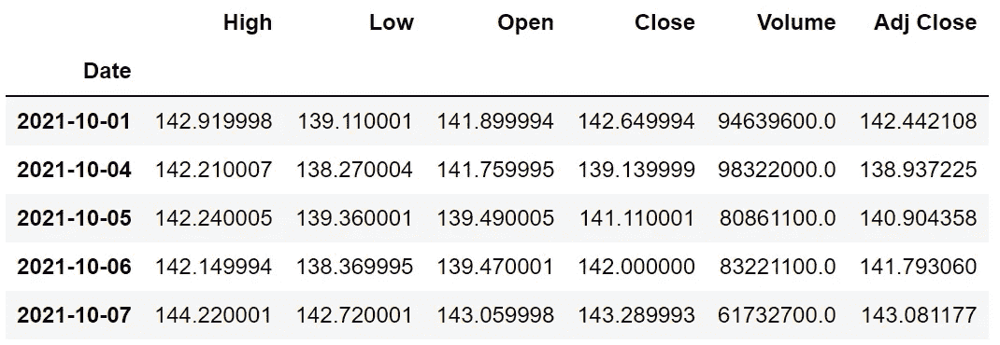
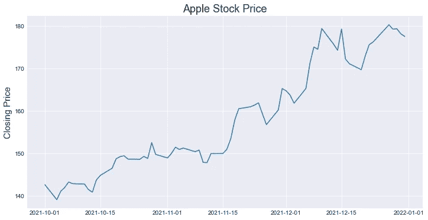
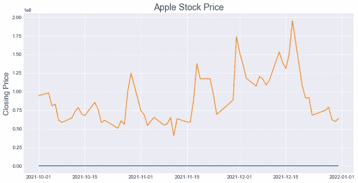
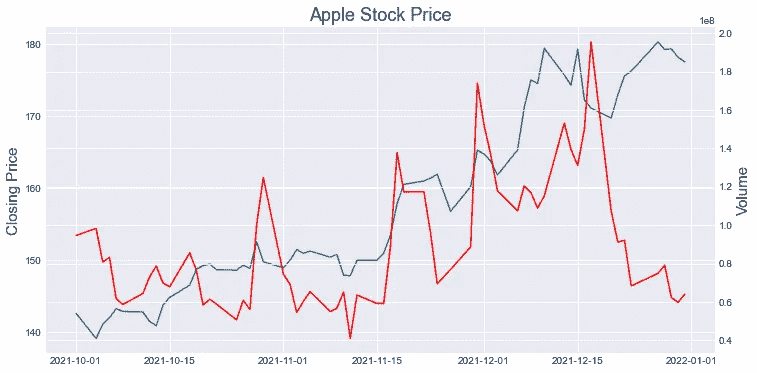
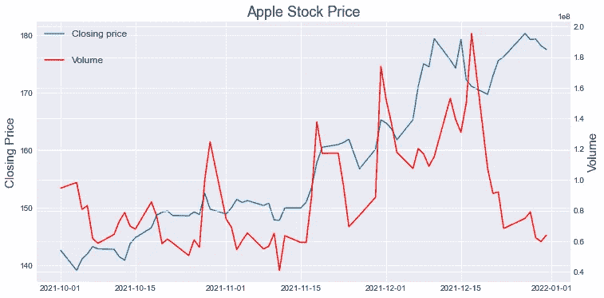
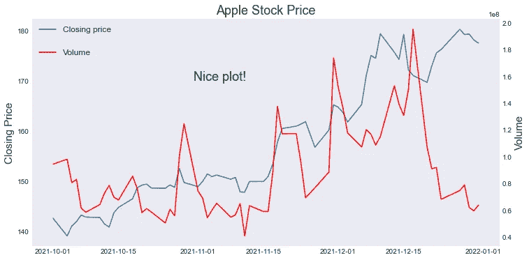
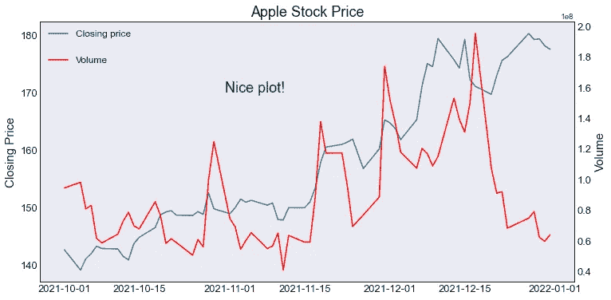

# 6 Python Matplotlib 特性创建更好的数据可视化

> 原文：<https://towardsdatascience.com/6-python-matplotlib-features-to-create-better-data-visualizations-b9fc65b0430b>

# 6 Python Matplotlib 特性创建更好的数据可视化

## 如何展示和展示什么一样重要


戈登·威廉姆斯在 [Unsplash](https://unsplash.com/s/photos/clear?utm_source=unsplash&utm_medium=referral&utm_content=creditCopyText) 上的照片

数据可视化在数据科学中非常重要。它用于许多任务，如探索性数据分析、模型评估、讲故事等。一个设计良好的数据可视化可以比简单的数字提供更多的信息。

数据可视化的两个主要组成部分是它们表示什么以及如何表示。它们代表的是要可视化的数据。“如何做”和数据一样重要。我们通常有许多可视化数据的方法，我们如何选择会产生很大的不同。

在本文中，我们将介绍 6 个有助于使可视化效果更具吸引力和信息量的特性。

# 获取数据

让我们从获得一些可视化的数据开始。我们可以通过 pandas-datareader 库轻松获得股票价格数据。下面的代码块导入我们需要的库，然后创建一个 Pandas 数据框，其中包含指定开始和结束日期之间的苹果股票价格。

```
import pandas as pd
from pandas_datareader import dataimport matplotlib.pyplot as plt
plt.style.use("seaborn-darkgrid")# read the data
aapl = data.DataReader(
    "AAPL", 
    start='2021-10-01',
    end='2021-12-31',
    data_source='yahoo'
)
```



苹果股票价格(图片由作者提供)

# 线形图

折线图用于显示一个或多个值如何随时间变化。我们可以创建一个每日收盘价的线图。

```
plt.figure(figsize=(12,6))
plt.plot(aapl["Close"])
```


(图片由作者提供)

既然我们有了数据和参考基准图，我们可以开始引入一些特性来改进它。

我们观察到苹果股票价格持续上涨。但是，剧情看起来是那么的平淡和平淡。它甚至没有显示这条线代表什么。因此，第一步是添加轴标签和标题。

# 1.坐标轴标签和标题

我们可以使用`xlabel`和`ylabel`方法添加轴标签。标题可以用`title`的方法添加。

```
plt.figure(figsize=(12,6))
plt.plot(aapl["Close"])# axis labels and title
plt.ylabel("Closing Price", fontsize=15)
plt.title("Apple Stock Price", fontsize=18)
```



(图片由作者提供)

# 2.预备之物

通过添加额外的线条，线形图可用于显示多条信息。例如，我们可以在同一个图上显示体积信息。

```
plt.figure(figsize=(12,6))plt.plot(aapl["Close"])# second line
plt.plot(aapl["Volume"])# axis labels and title
plt.ylabel("Closing Price", fontsize=15)
plt.title("Apple Stock Price", fontsize=18)
```



(图片由作者提供)

它显示了两条线，但其中一条只是直线。原因是这些变量的值范围之间的极端差异。

我们可以通过使用辅助 y 轴来解决这个问题。我们还需要添加第二个轴对象，这可以通过使用`subplots`方法来实现。如果你想了解更多关于 Matplotlib 的结构，这里有一个关于这个主题的详细帖子。

[](/understanding-the-structure-of-matplotlib-23b97f507fac) [## 了解 Matplotlib 的结构

### 那些情节是怎么创造出来的？

towardsdatascience.com](/understanding-the-structure-of-matplotlib-23b97f507fac) 

我们将使用`twinx`方法添加一个辅助 y 轴。

```
fig, ax1 = plt.subplots(figsize=(12,6))# second Axes object
ax2 = ax1.twinx()ax1.plot(aapl["Close"])
ax2.plot(aapl["Volume"], color="r")# axis labels and title
ax1.set_ylabel("Closing Price", fontsize=15)
ax2.set_ylabel("Volume", fontsize=15)
plt.title("Apple Stock Price", fontsize=18)
```

第一行创建第一个轴对象，称为“ax1”。然后，我们使用`twinx`方法创建另一个具有不同 y 轴的 Axes 对象。

因为我们现在有了轴对象，所以绘图功能应用于轴对象。类似地，我们不需要使用`ylabel`方法，而是需要使用`set_ylabel`方法，并为两个轴对象分配一个标签。

下面是该代码块如何创建:



(图片由作者提供)

# 3.神话；传奇

不清楚哪一行代表哪一条信息。因此，在这种情况下，传奇是绝对必要的。

```
fig, ax1 = plt.subplots(figsize=(12,6))# second Axes object
ax2 = ax1.twinx()ax1.plot(aapl["Close"])
ax2.plot(aapl["Volume"], color="r")# axis labels and title
ax1.set_ylabel("Closing Price", fontsize=15)
ax2.set_ylabel("Volume", fontsize=15)
plt.title("Apple Stock Price", fontsize=18)# add legends
ax1.legend(["Closing price"], loc=2, fontsize=12)
ax2.legend(["Volume"], loc=2, bbox_to_anchor=(0, 0.9), fontsize=12)
```

`loc`参数指定图例的位置，2 表示“左上”。`bbox_to_anchor`方法提供了一种更灵活的选择图例位置的方式。请随意查看[文档](https://matplotlib.org/stable/api/_as_gen/matplotlib.pyplot.legend.html)以获取关于图例方法的更多详细信息。

我们的图现在看起来如下:



(图片由作者提供)

# 4.网格线

当我们有多个 y 轴时，网格线可能不会重叠，这导致了一种不吸引人的外观。我们可以使用`grid`方法从一个或两个轴上移除网格线。

```
fig, ax1 = plt.subplots(figsize=(12,6))# second Axes object
ax2 = ax1.twinx()ax1.plot(aapl["Close"])
ax2.plot(aapl["Volume"], color="r")# axis labels and title
ax1.set_ylabel("Closing Price", fontsize=15)
ax2.set_ylabel("Volume", fontsize=15)
plt.title("Apple Stock Price", fontsize=18)# add legends
ax1.legend(["Closing price"], loc=2, fontsize=12)
ax2.legend(["Volume"], loc=2, bbox_to_anchor=(0, 0.9), fontsize=12)# remove grid
ax1.grid(False)
ax2.grid(False)
```


(图片由作者提供)

# 5.文本

Matplotlib 允许向绘图添加文本和注释。在某些情况下，添加短信可能很有用。

```
fig, ax1 = plt.subplots(figsize=(12,6))# second Axes object
ax2 = ax1.twinx()ax1.plot(aapl["Close"])
ax2.plot(aapl["Volume"], color="r")# axis labels and title
ax1.set_ylabel("Closing Price", fontsize=15)
ax2.set_ylabel("Volume", fontsize=15)
plt.title("Apple Stock Price", fontsize=18)# add legends
ax1.legend(["Closing price"], loc=2, fontsize=12)
ax2.legend(["Volume"], loc=2, bbox_to_anchor=(0, 0.9), fontsize=12)# remove grid
ax1.grid(False)
ax2.grid(False)# add text
ax1.text(
   "2021-10-31", 
   170, 
   "Nice plot!", 
   fontsize=18, 
   color="green"
)
```

前两个参数指定文本的位置。第三个是情节上要写的文字。其余的参数定义视觉属性，如大小和颜色。



(图片由作者提供)

> 额外收获:我们还可以用`rcParams.`给我们的图添加一个框架。在执行下面两行之后，这些图将生成一个黑盒框架。

```
plt.rcParams["axes.edgecolor"] = "black"
plt.rcParams["axes.linewidth"] = 1
```

# 6.x 刻度和 y 刻度的大小

我们还可以通过使用`tick_params`参数来调整 x 刻度和 y 刻度的大小。

```
fig, ax1 = plt.subplots(figsize=(12,6))# second Axes object
ax2 = ax1.twinx()ax1.plot(aapl["Close"])
ax2.plot(aapl["Volume"], color="r")# axis labels and title
ax1.set_ylabel("Closing Price", fontsize=15)
ax2.set_ylabel("Volume", fontsize=15)
plt.title("Apple Stock Price", fontsize=18)# add legends
ax1.legend(["Closing price"], loc=2, fontsize=12)
ax2.legend(["Volume"], loc=2, bbox_to_anchor=(0, 0.9), fontsize=12)# remove grid
ax1.grid(False)
ax2.grid(False)# add text
ax1.text(
   "2021-10-31", 
   170, 
   "Nice plot!", 
   fontsize=18, 
   color="green"
)# tick size
ax1.tick_params(axis='both', which='major', labelsize=13)
ax2.tick_params(axis='both', which='major', labelsize=13)
```



(图片由作者提供)

最终的剧情似乎比我们创作的第一部好很多。我们在本文中介绍的内容也将有助于创建其他类型的图，如散点图、直方图、箱线图等。

如果你想在我发表新文章时收到电子邮件，别忘了订阅。

*你可以成为* [*媒介会员*](https://sonery.medium.com/membership) *解锁我的全部写作权限，外加其余媒介。如果您使用以下链接，我将收取您的一部分会员费，无需您支付额外费用。*

[](https://sonery.medium.com/membership) [## 通过我的推荐链接加入 Medium-Soner yl DRM

### 作为一个媒体会员，你的会员费的一部分会给你阅读的作家，你可以完全接触到每一个故事…

sonery.medium.com](https://sonery.medium.com/membership) 

感谢您的阅读。如果您有任何反馈，请告诉我。