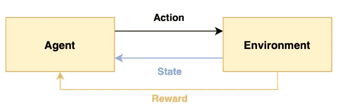
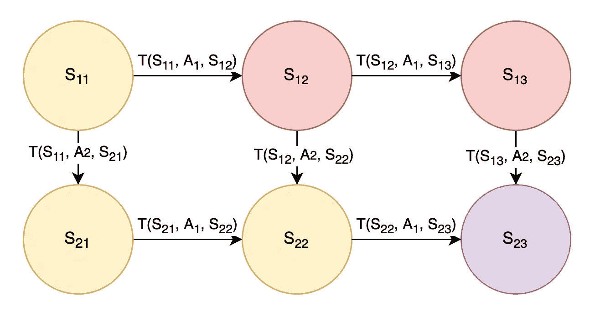
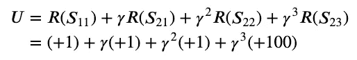
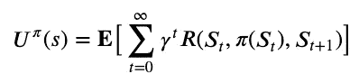
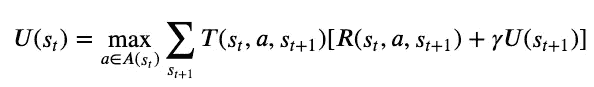
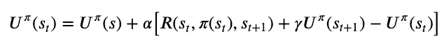
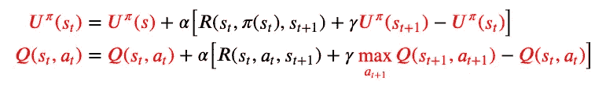
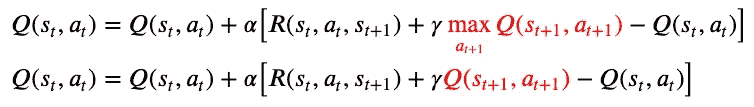
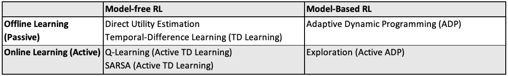

# 解释 6 种强化学习算法

> 原文：<https://towardsdatascience.com/6-reinforcement-learning-algorithms-explained-237a79dbd8e>

## 强化学习术语、基础和概念介绍(无模型、基于模型、在线、离线学习)

瑞安·菲尔兹在 [Unsplash](https://unsplash.com?utm_source=medium&utm_medium=referral) 上拍摄的照片

机器学习分为三个分支:监督学习、非监督学习和强化学习。

*   **监督学习(SL)** :关注在给定标签训练数据的情况下获得正确的输出
*   **无监督学习(UL)** :关注在没有预先存在标签的情况下发现数据中的模式
*   **强化学习(RL)** :关注代理如何在一个环境中采取行动以最大化累积回报

通俗地说，强化学习类似于婴儿学习和发现世界，如果有奖励(正强化)，婴儿可能会采取行动，如果有惩罚(负强化)，则不太可能采取行动。这也是强化学习与监督学习和非监督学习的主要区别，后者从静态数据集学习，而前者从探索中学习。

本文将涉及强化学习的术语和基本组件，以及不同类型的强化学习(无模型、基于模型、在线学习和离线学习)。本文最后用算法来说明不同类型的强化学习。

> 注意:这些方程基于 Stuart J. Russell 和 Peter Norvig 的教科书《人工智能:现代方法》(第四版，全球版),为保持数学方程格式一致，做了一些小改动。

# 目录

*   [强化学习术语](https://medium.com/p/237a79dbd8e/#a72c)
*   [基础知识:马尔可夫决策过程(MDP)](https://medium.com/p/237a79dbd8e/#7922)
*   [无模型与基于模型的强化学习](https://medium.com/p/237a79dbd8e/#652b)
*   [离线学习与在线学习](https://medium.com/p/237a79dbd8e/#eabf)
*   [算法:直接效用估算](https://medium.com/p/237a79dbd8e/#bab1)
*   [算法:自适应动态规划](https://medium.com/p/237a79dbd8e/#95b3)
*   [算法:时间差学习(TD 学习)](https://medium.com/p/237a79dbd8e/#8eb7)
*   [算法:探索](https://medium.com/p/237a79dbd8e/#e32b)
*   [算法:Q 学习](https://medium.com/p/237a79dbd8e/#3ac8)
*   [算法:SARSA](https://medium.com/p/237a79dbd8e/#54c5)

# 强化学习术语

在深入研究不同类型的强化学习和算法之前，我们应该熟悉一下强化学习的组成部分。

图 1:强化学习术语的图解——作者图片

*   代理:从环境中接收感知并执行动作的程序
*   **环境**:代理所处的真实或虚拟环境
*   **状态**:座席可以处于的状态
*   **动作(A)** :代理在给定状态下可以采取的动作
*   **奖励(R)** :采取行动的奖励(依赖于行动)，处于状态的奖励(依赖于状态)，或者在给定状态下采取行动的奖励(依赖于行动和状态)

在婴儿探索世界的例子中，婴儿(代理人)处于现实世界(环境)中，可以是哭泣、感到高兴或饥饿(状态)。因此，婴儿可以选择吃东西或睡觉(动作)，如果婴儿在饿的时候吃东西，他/她就会满足(奖励)。

正如文章开头提到的，强化学习涉及探索，强化学习的输出是最优策略。一个**策略**描述了在每个状态下要采取的动作；类似于说明书。比如政策可以是宝宝饿了就吃，不然就让宝宝睡觉。这也与监督学习形成对比，监督学习的输出只是单一的决策或预测，没有策略复杂。

最后，强化学习的**目标**是通过优化所采取的行动来最大化总的累积回报。和婴儿一样，我们不都想从生活中获得最大的累积利益吗？；)

# 基础知识:马尔可夫决策过程(MDP)

由于强化学习涉及到做出一系列最佳行动，它被认为是一个**顺序决策问题**，可以使用马尔可夫决策过程进行建模。

图 2:MDP 的例子——作者图片

按照前面的部分，状态(由 **S** 表示)被建模为圆圈，动作(由 **A** 表示)允许代理在状态之间转换。在图 2 中，还存在转移概率(由 **T** 表示)，其中`T(S11, A1, S12)`是在状态`S11`采取行动`A1`之后转移到状态`S12`的概率。我们可以认为动作`A1`向右，动作`A2`向下。为简单起见，我们可以假设转移概率为 1，这样采取行动`A1`将保证向右移动，而采取行动`A2`将保证向下移动。

参考图 2，让目标在状态`S23`结束，从状态`S11`开始，黄色状态是好的(奖励`+1`)，红色状态是坏的(奖励`-1`)，紫色是目标状态(奖励`+100`)。我们希望代理了解最佳行动或路线是通过采取行动`A2-A1-A1`向下-向右-向右，并获得总奖励`+1+1+1+100`。更进一步，利用金钱的时间价值，我们在奖励上应用了折扣因子γ，因为现在的奖励比以后的奖励更好。

综上所述，从状态`S11`开始执行动作`A2-A1-A1`的预期效用的数学公式如下:

图 3:从状态 S11 开始的预期效用—作者提供的图像

上面的例子是一个简单的说明，有各种变化，

*   转移概率可能不是 1，需要考虑行动中的不确定性，例如采取某些行动可能不总是保证成功向右或向下移动。因此，我们需要对这个不确定性取一个期望值
*   最佳动作可能还不知道，因此通用表示将把动作表示为来自状态的策略，用 **π(S)** 表示
*   奖励可能不是基于黄色/红色/紫色状态，而是基于前一个状态、动作和下一个状态的组合，由 **R(S1，π(S1)，S2)** 表示
*   问题可能不会在 4 个步骤内解决，它可能需要无限的步骤才能达到目标状态

考虑到这些变化，在遵循策略 **π** 的给定状态 **s** 下，确定期望效用 **U(s)** 的更一般的等式如下:

图 4:从状态 s 开始执行策略的预期效用(等式 16.2)——作者图片

用图 4 的话来说，一个州的预期效用是贴现回报的预期总和。

由此可见，一个国家的效用与其邻国的效用相关；假设选择了最优行动，一个状态的效用是过渡的预期回报加上下一个状态的贴现效用。在编码术语中，这被认为是递归。数学上，它指的是下面的等式，

图 5:遵循最优政策的国家效用(等式 16.5)——作者图片

在图 5 中，这是著名的**贝尔曼方程**，它求解最大效用并导出最优策略。最优策略是在一个状态下采取的行动，它将导致最大的当前效用加上下一个状态的贴现效用，考虑了所有可能的下一个状态的转移概率。

回到图 2 中的 MDP 问题，最优策略是这样的，如果代理处于状态`S11`、`S12`或`S13`，代理应该通过采取行动`A2`向下移动。而如果代理处于状态`S21`或`S22`，代理应该通过采取动作`A1`向右移动。最优策略是通过求解贝尔曼方程得出的，以执行获得最大当前和贴现未来回报的行动。

*   **额外**:在教科书中，MDP 用`(S, A, T, R)`来表示，分别代表一组状态、动作、转移函数和奖励函数。
*   **Extra** : MDP 假设环境是完全可观测的，如果智能体不知道它当前处于什么状态，我们就用**部分可观测 MDP (POMDP)** 来代替！
*   **额外**:图 5 中的贝尔曼方程可用于求解最优策略，使用**值迭代**或**策略迭代**，这是一种将效用值从未来状态传递到当前状态的迭代方法。

> 强化学习类似于求解 MDP，但是现在转移概率和奖励函数是未知的，代理必须执行动作来学习

# 无模型与基于模型的强化学习

上一节中的 MDP 例子是基于模型的强化学习。在形式上，**基于模型的强化学习**有成分转移概率`T(s1, a, s2)`和奖励函数`R(s1, a, s2)`，它们是未知的，代表要解决的问题。

*   基于模型的方法对模拟很有用。
*   基于模型的 RL 的例子包括**值迭代**和**策略迭代**，因为它使用具有转移概率和奖励函数的 MDP。

**另一方面，无模型方法**不需要知道或学习转移概率来解决问题。相反，代理直接学习策略。

*   无模型方法对于解决现实生活中的问题很有用。
*   无模型 RL 的例子包括 **Q 学习**和**策略搜索**，因为它直接学习策略。

# 离线学习与在线学习

离线和在线学习也被称为被动和主动学习。

在**离线(被动)学习**中，通过学习效用函数解决问题。给定一个具有未知转移和回报函数的固定策略，代理人通过使用该策略执行一系列试验来学习效用函数。

*   例如，在自动驾驶汽车中，给定地图和要遵循的大致方向(**固定政策**)，带有错误控制(**未知转移概率** —向前移动可能导致汽车稍微左转或右转)和未知行驶时间(**未知奖励函数** —假设更快到达目的地导致更多奖励)，汽车可以重复运行以了解平均总行驶时间(**效用函数**)。
*   离线 RL 的例子包括**值迭代**和**策略迭代**，因为它使用了使用效用函数的贝尔曼方程(图 5)。其他示例包括**直接效用估计**、**自适应动态规划(ADP)** 和**时间差学习(TD)** ，这些将在后面的章节中详细阐述。

在**在线(主动)学习**中，通过学习计划或决策来解决问题。对于基于模型的在线 RL，有探索和开发组件。在开发阶段，代理通过假设固定的策略和学习效用函数，表现得像离线学习。在探索阶段，代理执行**值迭代**或**策略迭代**来更新策略。

*   如果使用**值迭代**更新策略，则使用最大化效用/价值的一步前瞻提取最佳动作。如果使用**策略迭代**更新策略，则最佳策略可用，并且可以按照建议执行操作。
*   以自动驾驶汽车为例，在探索阶段，汽车可能会学习到在高速公路上行驶时所用的总时间更快，并选择向高速公路行驶，而不是简单地沿大方向行驶(**策略迭代**)。在开发阶段，根据更新后的政策，汽车现在以更少的平均总时间(**更高的效用**)行驶。
*   在线学习的例子包括**探索**、**Q-学习**和 **SARSA** ，这些将在后面的章节中详细说明。

比较两者，当有太多的状态和动作以至于有太多的转移概率时，在线学习是优选的。在网上学习中探索和“边学边做”比在网下学习中一次学会所有东西更容易。然而，由于探索中的试错法，在线学习也可能很耗时。

**注**:在线学习和 On-Policy(以及 Off-Policy 的离线学习)是有区别的，前者指的是学习(策略可以改变或固定)，后者指的是策略(一系列试验是来自一个策略还是多个策略)。在本文的最后两节中，将使用算法来解释符合策略和不符合策略。

照片由克里斯·贾维斯在 [Unsplash](https://unsplash.com?utm_source=medium&utm_medium=referral) 上拍摄

> 在了解了不同类型的强化学习之后，让我们深入研究算法！

# №1.直接效用估计

> 类型:无模型，离线学习

在直接效用估计中，代理人使用固定策略执行一系列试验，一个状态的效用是从该状态开始的预期总报酬或预期的**奖励-继续**。

*   以自动驾驶汽车为例，如果汽车在一次试验中在一个网格`(1, 1)`上启动时，总的未来奖励为`+100`。在同一次试验中，赛车重新回到那个格子，从那一点开始，总的未来奖励是`+300`。在另一次试验中，赛车从那个格子出发，未来总奖励为`+200`。该网格的预期回报将是所有试验和所有访问该网格的平均回报，在本例中为`(100 + 300 + 200) / 3`。

**优点**:给定无限多次尝试，样本平均回报将收敛于真实的预期回报。

反对意见:预期奖励在每次试验结束时更新，这意味着代理人在试验结束前什么也没学到，导致直接效用估计收敛得非常慢。

# №2.自适应动态规划

> 类型:基于模型，离线学习

在自适应动态规划(ADP)中，主体试图通过经验学习转移和奖励函数。通过计算从当前状态转移到下一个状态采取行动的次数来学习转移函数，而在进入该状态时学习回报函数。给定所学的转换和奖励函数，我们现在可以求解 MDP。

*   以自动驾驶汽车为例，假设在给定状态下尝试前进 10 次，如果汽车最终向前移动 8 次，向左移动 2 次，我们得知转移概率为`T(current state, forward, front state) = 0.8`和`T(current state, forward, left state) = 0.2`。

**优点**:由于环境是完全可观测的，所以简单地通过计数就可以很容易地学习转换模型。

**缺点**:代理学习过渡模型的能力限制了性能。这将导致问题对于大的状态空间是难以处理的，因为需要太多的试验来学习转变模型，并且在 MDP 中有太多的方程和未知数要解。

# №3.时间差学习(TD 学习)

> 类型:无模型，离线学习

在时间差学习中，代理学习效用函数，并在每次转换后以学习速率更新该函数。

图 6:效用函数更新方程(方程 23.3)——作者图片

术语“时间差异”指的是连续状态之间效用的差异，并且基于该误差信号更新效用函数，该误差信号由如图 6 所示的学习速率来缩放。学习率可以是一个固定的参数，也可以是对一个状态的访问次数增加的递减函数，这有助于效用函数的收敛。

与每次尝试后学习的直接效用估计相比，TD 学习在每次转换后学习，使其更有效。

与 ADP 相比，TD 学习不需要学习转移和奖励函数，使其计算效率更高，但也需要更长的时间来收敛。

> ADP 和 TD 学习是离线 RL 算法，但是存在作为在线 RL 算法一部分的主动 ADP 和主动 TD 学习！

# №4.探测

> 类型:基于模型、在线学习、主动 ADP

探索是一个**主动 ADP 算法**。与被动 ADP 算法类似，代理试图通过经验学习转换和奖励函数，但主动 ADP 算法将学习所有动作的结果，而不仅仅是固定策略。

还有一个额外的**探索功能**，用于确定代理对在现有策略之外采取行动的“好奇”程度。探索功能应该随着效用的增加而增加，随着经验的增加而减少。

*   例如，如果州具有高效用，则探索功能倾向于更频繁地访问该州。由于贪婪的增加，探索功能*随着效用*增加。
*   例如，如果该州以前没有被访问过或者访问的次数不够多，则探索功能倾向于选择现有策略之外的动作。反之，如果多次访问该状态，探索功能就没有那么好奇了。由于好奇心下降，探索功能*随着经验*减少。

**优点**:勘探政策导致向零政策损失(最优政策)的快速收敛。

**缺点**:效用估计没有策略估计收敛得快，因为代理不会频繁出现低效用状态，因此不知道这些状态的确切效用。

# №5.q 学习

> 类型:无模型、在线学习、主动 TD 学习、非策略

Q-Learning 是一种**主动 TD 学习**算法。图 6 中的更新规则保持不变，但是现在状态的效用被表示为使用 **Q-function** 的状态-动作对的效用，因此命名为 Q-Learning。下面的图 7 显示了被动 TD 学习与主动 TD 学习的更新规则的差异。

这种符号差异是由于被动 RL 具有固定的策略，使得每个状态将仅执行固定的动作，并且效用简单地依赖于状态。而在主动 RL 中，策略将被更新，并且效用现在取决于状态-动作对，因为每个状态可以按照不同的策略执行不同的动作。

图 7:被动 TD(上图)与主动 TD(下图，方程 23.7)的效用函数更新方程——作者图片

Q-Learning 是**偏离策略**，这意味着目标，或者下一个状态的效用，在下一个状态的可能行动上最大化 Q-function(不考虑当前策略！).这样，我们不需要下一个状态的实际动作。

**优点**:可以应用于复杂领域，因为它是无模型的，代理不需要学习或应用转换模型。

**缺点**:它不展望未来，在回报稀少的时候可能会有困难。与 ADP 相比，它学习策略的速度较慢，因为本地更新不能确保 Q 值的一致性。

# №6.萨尔萨

> 类型:无模型、在线学习、主动 TD 学习、基于策略

SARSA 是一种**主动 TD 学习**算法。算法名 SARSA 来源于算法的组成部分，即状态、动作、奖励、(下一个)状态和(下一个)动作。这意味着在更新 Q 函数之前，SARSA 算法等待在下一个状态中采取下一个动作。相反，Q-Learning 是一种“SARS”算法，因为它不考虑下一个状态的动作。

由于这种差异，SARSA 算法知道在下一个状态中采取的动作，并且不需要在下一个状态中的所有可能动作上最大化 Q 函数。Q-Learning 与 SARSA 的更新规则的差异在下面的图 8 中示出。

图 8:Q-Learning 的效用函数更新方程(上图)与 SARSA(下图，方程 23.8)——作者图片

SARSA 是 **On-Policy** 作为目标，或者下一个状态的效用使用当前正在运行的策略中的 Q-function。这样，下一个状态的实际动作就知道了。

**注**:如果 Q-Learning 不探索其他动作，在下一个状态下遵循当前策略，则与 SARSA 相同。

**优点**:如果整体策略由另一个代理或程序控制，则符合策略，这样代理就不会脱离策略并尝试其他操作。

**缺点** : SARSA 没有 Q-Learning 灵活，因为它不会偏离策略去探索其他策略。与 ADP 相比，它学习策略的速度较慢，因为本地更新不能确保 Q 值的一致性。

总之，这是讨论的 6 种算法，分为不同类型的强化学习。

图 9:6 种强化学习算法的总结

这 6 种算法是帮助形成对强化学习的基本理解的基本算法。还有更有效的强化学习算法，如深度 Q 网络(DQN)、深度确定性策略梯度(DDPG)，以及其他具有更实际应用的算法。

如果你一直读到最后，恭喜你！我一直觉得强化学习很有趣，因为它阐明了人类如何学习，以及我们如何将这些知识传授给机器人(当然还有其他应用，如自动驾驶汽车、国际象棋和阿尔法围棋，仅举几例)。希望你已经了解了更多关于强化学习，不同类型的强化学习，以及说明每种强化学习的算法。