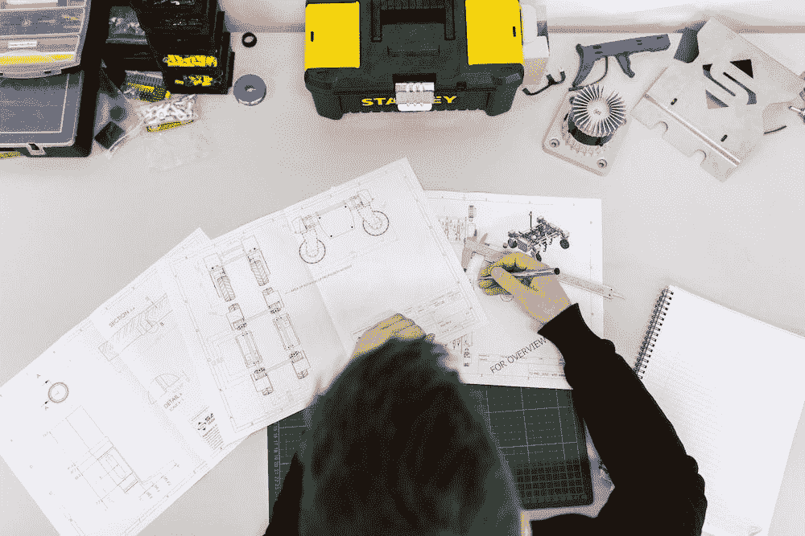
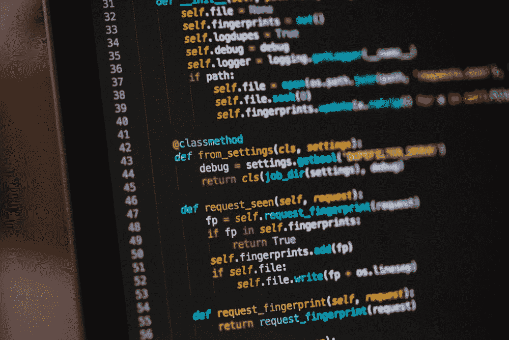
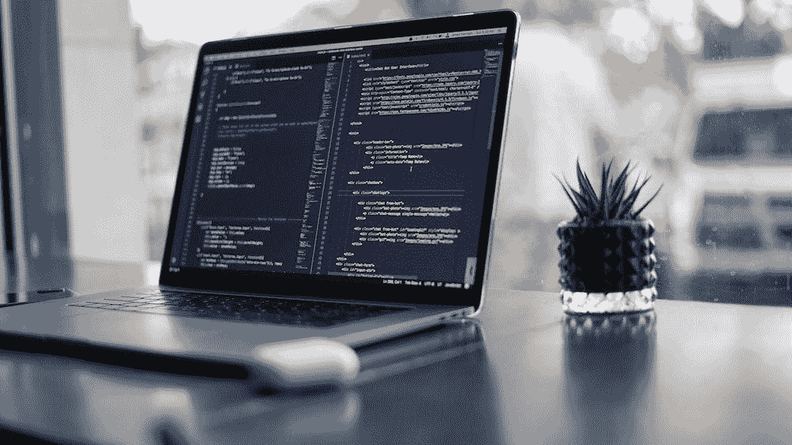

# 面向数据科学家的 6 本软件工程书籍

> 原文：<https://towardsdatascience.com/6-software-engineering-books-for-data-scientists-5134637b118>

## 数据科学家从使用适当的软件工程最佳实践编写代码中受益匪浅。了解 6 本可以帮你实现这一目标的好书

照片由[@ this is engineering](https://unsplash.com/@thisisengineering)@ Unsplash.com 拍摄

*【免责声明:此帖子包含图书保管处的附属链接】*

在我看来，数据科学家是科技行业中最令人兴奋的角色之一。作为一名数据科学家，你有能力学习与软件工程、统计、财务甚至项目管理相关的技能。

虽然这种技能的融合使这份工作非常令人兴奋，但它也给开始在这一领域工作的人带来了很多挑战，因为大多数人可能没有受过上述所有技能的正式培训。

数据科学家可能会纠结的一个领域与软件开发和工程有关。许多人通过经济学、统计学或市场营销进入这个行业，当谈到编码时，他们大多是自学的。虽然这应该庆祝，因为它展示了大多数数据科学家的弹性，但它不应该干扰数据科学家改善他们的软件工程和一般编码的需要。

除此之外，MLOps 和机器学习模型的适当部署(两者都与软件工程密切相关)对于想要走出 POC(概念验证)兔子洞的组织来说越来越重要。即使您不负责您的模型的部署，您至少应该警惕将来有人会查看您的代码。

我个人是有统计学背景的。在我职业生涯的前 7 年，我一直在为一些大公司工作，这些公司在数据科学领域还不太成熟。在那段时间，我主要专注于开发善于展示机器学习潜力的模型，而不是用适当的软件工程最佳实践来构建东西。自从加入 [DareData Engineering](https://www.daredata.engineering/) ，我的整个心态发生了变化，因为我开始同时与不同的公司合作，并理解了以可扩展的方式正确开发事物的必要性。

在工作中学习时，书籍是我用来提高技能的主要媒介之一。与视频和书面文章捆绑在一起，我喜欢阅读一些好的工程相关书籍，这些书籍帮助我提高技术水平，或者给我带来对我来说未知的全新视角。

这篇文章的目标是给你一个 6 本书的列表，这些书与我写更好的代码的旅程非常相关(这是我每天都在努力改进的东西！)

这些书是技术性和非技术性书籍的混合体。其中大部分都有编码示例，但有几个与一般方法和最佳实践相关。请记住，这些书中的大部分可能更适合那些没有接受过正式软件工程师培训或刚刚开始职业生涯的人。开始吧！

## [务实的程序员](https://amzn.to/3S1e36O)

照片由 [@afgprogrammer](https://unsplash.com/@afgprogrammer) 拍摄

*务实的程序员*对于没有任何软件工程背景的人来说是一个极好的选择。

这本书主要通过故事和教训，给你一些关于实现、逻辑、软件管理等方面的很酷的技巧和原则。阅读它将为您带来开发数据科学模型和算法的新视角，例如，它将帮助您理解避免重复的重要性以及如何调试和测试代码的一些策略。

这本书的第一版于 1999 年出版，它的一些建议今天仍然适用——这是对这本书质量的一个很好的论证，因为在技术领域，东西往往很快就会过时。这也是理解软件开发中使用的一些术语和概念的一个很好的选择，当你和其他有阿瑟背景的人一起工作时，理解这些术语和概念可能有点困难。

这本书对于改进我的代码的整体架构非常重要，并且给了我大多数学习旅程的最终目标:我定义了对我的生产力和职业精神非常有价值的新习惯(在这种情况下，是在编写代码时)。

一个相关的细节:如果你已经非常熟悉软件工程，你可能不会从中获得太多的价值。

在这里找到它:

*   [书库上的务实程序员](https://tidd.ly/3AJ6ziY)

## [Python 的搭便车指南](https://amzn.to/3So0pLt)

图片来自 [@cdr6934](https://unsplash.com/@cdr6934) @Unsplash.com

有什么比全世界几百个贡献者写的 Python 书更好？

一本真正实用的 Python 中级到高级实践指南。因为这不是集中在最基本的东西(如数据结构)或 Python 的机器学习组件上，它将帮助您开发适当的 Python 编码实践，并使用您可能没有合并到代码中的其他东西，如面向对象编程或测试。

如果你是一个自学的 Python 程序员，你会从阅读这本书中受益匪浅。无论是从提高代码可读性的角度还是从提高速度的角度来看，这本书都是那些觉得自己的 Python 技能在最近达到了一个平台期的人的绝佳选择。在世界上最著名的开源语言之一中，还有什么比阅读世界上数百名 Python 程序员的思想和观点更好的方法呢？

就我个人而言，在处理 Python 的特殊性时，我发现它极具启发性。Python 是一种如此独特的语言，有如此多的细节，以至于我发现很难找到一种超越基础的学习资源——幸运的是，我找到了这本书，它做到了这一点，同时保持了学习的乐趣和吸引力。

在这里找到它:

*   [Book Depository 上的 Python 搭便车指南](https://tidd.ly/3KlaHsY)

## [设计模式:可重用面向对象软件的元素](https://amzn.to/3qFMT9X)

照片由[@ kellysikkema](https://unsplash.com/@kellysikkema)@ unsplash . com 拍摄

一本理解软件设计模式的好书。难以理解如何设计你的函数或类？这应该是你的首选书籍！

*设计模式*展示了 23 种不同的设计模式，您可以用它们来构建代码的逻辑和结构。在构建机器学习管道时，您可能会发现自己一次又一次地实现相同类型的模式。这本书可以给你一些替代的结构，可以增加你的代码的趣味，提高可读性或性能。

如果你是自学编码的，这本书可能很适合你的学习之旅，因为它可以揭示一些你没有意识到的软件架构模式。

作为数据科学家，我们通常不会一开始编码就使用面向对象编程(OOP)。如果你的 OOP 之旅刚刚开始，你会发现这本书的帮助非常非常有用。

当我从以严格的函数式和线性方法编写代码跳到使用 OOP 时，它真的帮助了我——尽管我没有找到为数据科学和机器学习量身定制的例子，但阅读这篇文章给了我一些工具，我可以很容易地适应这个行业。

您可以在这里找到它:

*   [书库设计模式](https://tidd.ly/3ccHFiA)

## 马丁·福勒的《重构》

照片由[@ jstrippa](https://unsplash.com/@jstrippa)@ unsplash . com 拍摄

最著名的软件架构书籍之一，马丁·福勒的*重构*是持续改进和交付世界的标准。

这本书给了我们一个极好的提示和想法，告诉我们如何不断提高代码的可读性、可用性和性能——这在我们所处的敏捷世界中是至关重要的。通过大量的实际例子，作者给出了几个可以在功能之外改进代码的场景。

我发现这与数据科学和机器学习世界极其相关。尽管这本书没有包含专门的例子，但是由于其不断变化的本质，重构技术非常适合数据科学项目。

尽管这本书使用了 *Java* 示例，这对大多数数据专业人员来说有点困难，但希望你和我一样觉得它很有价值。对我来说，这是在开发的第一阶段后如何改进代码的一个很好的机会，我已经学会了如何在高效的时间内解决改变代码片段的困难任务。

在以下链接中找到*重构*:

*   [书库上的重构](https://tidd.ly/3T8GOQB)

## [devo PS 手册:如何在技术组织中创造世界级的敏捷性、可靠性和安全性](https://amzn.to/3LilDIb)

图片由[@ thought catalog](https://unsplash.com/@thoughtcatalog)@ unsplash . com 提供

说到敏捷，*DevOps 手册*是一本“原则”书，聚焦于 devo PS 哲学和协作开发的最佳实践。这本书比我在这份名单上的其他书都要轻松，它特别适合那些希望继续他们的职业生涯，成为技术领导角色的技术人员。

虽然不像其他书籍那样具有技术性，但这本书详细讲述了一些故事，以揭穿围绕 DevOps 文化的神话，同时展示了一些来自一些最著名的科技公司(网飞、亚马逊、Etsy 等)的例子。)在世界上。

这本书在细节上特别有趣:

*   如何将持续交付整合到您的部署实践中；
*   如何围绕持续改进(CI)和持续交付(CD)的工作方式建立团队；
*   如何将业务和 IT 实践结合起来——这是大多数科技公司赖以发展的事情；

由于我的角色结合了领导能力和技术技能，这本书对于理解大型技术组织如何工作非常有价值。当谈到开发和组织团队时，他们的成功是巨大的，看一眼他们使用的一些原则是在我自己的项目中进行小的改变的一个很好的方式。

一个警告:如果你对 CI/CD 的概念已经相当有经验，这本书可能会有点短，对你来说没有什么新闻。

在以下链接中找到*devo PS 手册*:

*   [devo PS 图书保管手册](https://www.bookdepository.com/DevOps-Handbook-Gene-Kim/9781950508402?ref=grid-view&qid=1661350669739&sr=1-1)

## [干净的代码:敏捷软件工艺手册](https://amzn.to/3eGc4GD)

分解我庞大的 Python 函数的主要贡献者之一。作为大多数数据科学家，我倾向于开发巨大的函数，这些函数做很多事情，并且很难调试。你知道的..这个主函数吸收您的数据并转换每一个简单的列，然后添加 400 个新变量！

这本书摧毁了这种思维模式，提高了我编写干净代码的能力。

这本书的缺点(就像*重构*)是它是为 Java 编程量身定制的，我肯定我错过了一些围绕它的争论，因为我对这门语言不是很流利。即便如此，它教授的原则也可以移植到其他编程语言(如 Python 或 R ),并为我提供了一个非常好的视角，让我知道如何编写更简洁的代码。

好的一面是，这是一本非常实用的书——不要指望作者在展示例子时会有任何闪失。它直截了当，主要集中在实际例子上。

在以下链接中找到*干净代码*:

*   [干净的代码:敏捷软件工匠手册](https://tidd.ly/3dSFPUp)

感谢你花时间阅读这篇文章！我花了大约两年的时间读完所有这些书，目前，我正在完成“ *Clean Code* ”。

当开发新项目时，我仍然会不时地重温它们，因为它们帮助我编写更好的机器学习和数据科学软件。阅读它们是迈向更好地编写代码的伟大旅程——当你成为一名数据科学家时，这是一个永无止境的旅程。

我希望你也能从中汲取一些价值，把它们放在你的书架上，对你的职业成长之旅会像它们对我一样有价值。有其他推荐补充吗？写在评论里吧！

 