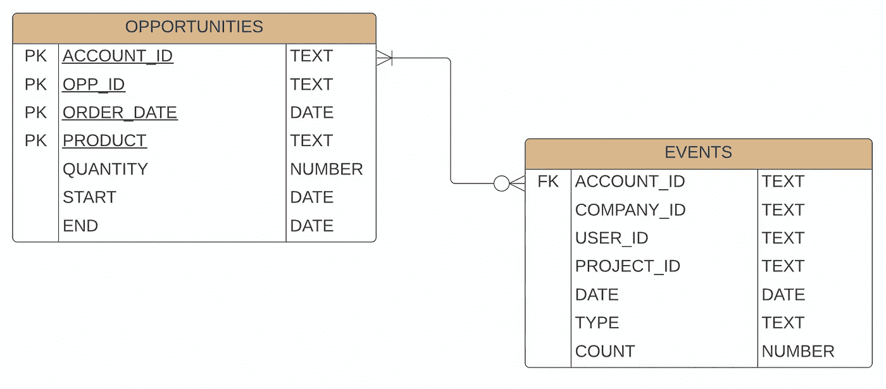

# 在你的下一个机器学习项目中支持特征工程的 6 种技术

> 原文：<https://towardsdatascience.com/6-tips-to-power-feature-engineering-in-your-next-machine-learning-project-d61530eee11b>

## 从数据创建新要素的技术


Vishnu Mohanan 在 [Unsplash](https://unsplash.com?utm_source=medium&utm_medium=referral) 上的照片

# 什么是特征工程？

机器学习中的特征工程是从现有数据中创建新特征。从学习的角度来看，原始数据中包含的信息可能是不够的。因此，您可能需要将这些数据转换为新的要素或列，以帮助您以更有助于学习的方式表示数据。建立模型的一般过程如下。

1.  [探索性数据分析，包括数据清洗](/exploratory-data-analysis-with-python-1b8ae98a61c5)
2.  特征工程(本文)
3.  [功能选择](/4-methods-to-power-feature-engineering-for-your-next-ml-model-5d32fffbe511)
4.  [型号选择](/demystify-machine-learning-model-selection-e3f913bab7e7)
5.  [模型训练和评估](/evaluating-ml-models-with-a-confusion-matrix-3fd9c3ab07dd)

在所有这些步骤中，**可以说最重要的是特征工程**步骤。通过仅默认原始数据，您可能会错过提供有价值的上下文来解释行为发生的原因。无论是预测用户还是机器的行为，特征工程对于项目的成功都是至关重要的。可能需要做些什么的几个例子:

1.  缩放数字数据和编码分类数据
2.  将长格式文本转换成数值
3.  计算日期或时间之间的差异
4.  将数据聚合到一行中，例如求和、计数或计算平均值
5.  创建聚合日期窗口
6.  将来自不同来源的数据合并到一组观测数据中

我喜欢维基百科上提供的定义。它总结了使用领域知识提取新特征的思想:

*特征工程或特征提取是利用领域知识从原始数据中提取特征(特性、性质、属性)的过程。与仅向机器学习过程提供原始数据相比，动机是使用这些额外的特征来提高来自机器学习过程的结果的质量。*

我们可以从这一点开始。领域知识。

# 领域知识

特征工程的一个关键部分是将**业务**和**领域知识**应用到您的数据中，以创建最佳特征。关于如何创建要素，并没有单一的方法或规则，但是许多方法都要求您了解它们可能相关的背景。

在本例中，我们将使用的数据集是由作者合成生成的，代表购买软件的公司，并随机生成使用数据来模拟用户在日常使用软件时可能尝试的事件。

在集思广益讨论您可能想要创建的功能时，请考虑数据的背景。我们将创建几个特征来表示帐户对此的活跃程度。我们将在下面演示其中的一些。

首先，我们需要理解数据的结构和关系。

# 理解我们的数据结构

让我们用一个[实体关系图](https://www.lucidchart.com/pages/er-diagrams)或 ERD 来看这个可视化。实体关系图是可视化信息表格的最佳方式。我们可以在单个图像中看到我们需要的一切以及来自列、类型和关系的数据。

在我们的第一个表 **OPPORTUNITIES** 中，我们有一个**组合键**，它构成了由 **ACCOUNT_ID** 、 **OPPORTUNITY_ID** 、 **RENEWAL_DATE** 和 **PRODUCT_CODE** 组成的**主键**。主键允许我们唯一地识别一个机会。在**事件**表中，我们有一个**外键**与 **ACCOUNT_ID** 的关系。对于每个账户，我们有零到多个潜在事件。



作者图片

现在我们对数据结构有了一个大致的了解，我们可以导入我们的数据并开始特征工程的过程。

# 加载和清理数据

第一步是加载和清理我们的数据。在这里，我们还可以了解数据的大小和形状。

```
import pandas as pd

df_opp = pd.read_csv('opps.csv')
df_event = pd.read_csv('events.csv')

print(df_opp.shape)
print(df_event.shape)
```

```
(1000, 8)
(1000000, 7)
```

我们看到大约有 1，000 个机会和 1，000，000 个事件。

```
df_opp.info()
```

```
<class 'pandas.core.frame.DataFrame'>
RangeIndex: 1000 entries, 0 to 999
Data columns (total 7 columns):
 #   Column      Non-Null Count  Dtype 
---  ------      --------------  ----- 
 0   ACCOUNT_ID  1000 non-null   object
 1   OPP_ID      1000 non-null   object
 2   ORDER_DATE  1000 non-null   object
 3   PRODUCT     1000 non-null   object
 4   QUANTITY    1000 non-null   int64 
 5   START       998 non-null    object
 6   END         998 non-null    object
dtypes: int64(1), object(6)
memory usage: 54.8+ KB
```

```
df_event.info()
```

```
<class 'pandas.core.frame.DataFrame'>
RangeIndex: 1048575 entries, 0 to 1048574
Data columns (total 7 columns):
 #   Column      Non-Null Count    Dtype 
---  ------      --------------    ----- 
 0   ACCOUNT_ID  1048575 non-null  object
 1   COMPANY_ID  1048575 non-null  object
 2   USER_ID     1048575 non-null  object
 3   PROJECT_ID  977461 non-null   object
 4   DATE        1048575 non-null  object
 5   TYPE        1048575 non-null  object
 6   COUNT       1048575 non-null  int64 
dtypes: int64(1), object(6)
memory usage: 56.0+ MB
```

这两个表主要包含带有一个数字列的字符串(对象)。

```
df_event.head()
```

```
ACCOUNT_ID COMPANY_ID USER_ID PROJECT_ID       DATE
0  account420       org1      u1         p1 2019-05-10   
1  account399       org2      u2         p2 2019-05-06   
2  account399       org2      u3         p3 2019-06-24   
3  account122       org3      u4         p4 2019-04-30   
4   account61       org4      u5         p5 2019-08-07   

                                                TYPE  COUNT  
0  099664351c56c479154c4b1e649a727e3ac099cc26747c...      3  
1  78478722fa50547376912d1bc1b21d5f5fb60188015342...      1  
2  9e5fd45ed38136db73e76b46ad11a0200b7a4cbaae9bc1...      2  
3  85c11686c1e1d3072f30b05ff74fd93b92c5d37a1b7ba3...      1  
4  31ea88da80c3371a7e70ac8a9299974290c47e83b46170...      1
```

```
df_opp.head()
```

```
ACCOUNT_ID OPP_ID ORDER_DATE
0   account1   opp1 2020-04-23   
1   account1   opp1 2020-04-23   
2   account2   opp2 2020-04-16   
3   account2   opp2 2020-04-16   
4   account3   opp3 2020-04-09   

                                             PRODUCT  QUANTITY
0  cd5ba48bb6ce3541492df6f2282ca555a65397c168dc59...         4
1  1a5a6aac31b1d9e08401bd147df106c600254b2df05a3f...         2
2  28746a25d12d36a1c0956436cfd6959f0db252e3020928...         1
3  1a5a6aac31b1d9e08401bd147df106c600254b2df05a3f...         8
4  1a5a6aac31b1d9e08401bd147df106c600254b2df05a3f...         3

         START         END  
0 2020-04-24    2021-04-23  
1 2020-04-24    2021-04-23  
2 2020-04-17    2021-04-16  
3 2020-04-17    2021-04-16  
4 2020-04-10    2021-04-09
```

这个过程的一个典型部分是确保我们没有空值。在检查了数据(未显示)之后，我们有了一些东西。在我们的 **OPP** 表中有一些空值，为了简单起见，我们将删除这些空值，对于**事件**表，**项目标识**有一些空值，我们可以用另一个值填充，例如**公司标识**。需要理解处理空值的业务环境；这只是两个例子。

```
# Drop any null values from important variables
df_opp.dropna(inplace=True)

# Fill any missing PROJECT_IDS with the COMPANY_ID
df_event['PROJECT_ID'].fillna(df_event['COMPANY_ID'], inplace=True)
```

# 缩放数字数据和编码分类数据

一个非常简单的数据转换是对数字数据进行缩放和对分类数据进行编码。虽然数据的数值缩放不是特征工程，但它很重要，因为许多算法不喜欢未缩放的数据。

转换分类数据的一种常见方法是使用一种称为**单热编码**或 **OHE** 的过程。OHE 获取分类数据并将它们扩展到新列中，其中每个分类值都有一个新列，一个二进制值指示该分类是否在该行中。OHE 阻止模型预测序数值之间的值。更多关于 OHE 的信息，请查看:[一个热门编码](https://scikit-learn.org/stable/modules/generated/sklearn.preprocessing.OneHotEncoder.html)。

```
column_trans = ColumnTransformer(transformers=
        [('num', MinMaxScaler(), selector(dtype_exclude="object")),
        ('cat', OneHotEncoder(), selector(dtype_include="object"))],
        remainder='drop')
```

这方面的典型过程是包装和利用柱变压器。你可以在这里阅读更多关于这个过程的内容:[停止一步一步地构建你的模型。利用管道实现流程自动化！](/using-pipelines-in-sci-kit-learn-516aa431dcc5)

# 将长格式文本转换为数值

处理长文本数据的另一种常见方法是将文本的**长度**表示为一个**数字**，这在产品评论等情况下很有用。例如，长篇评论通常与更多负面或正面评论联系在一起吗？是不是越长的评论越有用，与之相关的产品就越畅销？您可能需要对此进行试验。我们的数据集没有长格式文本，但这里有一个如何做到这一点的例子。

```
df['text_len'] = df.apply(lambda row: len(row['text']), axis = 1)
```

# 计算日期或时间之间的差异

通常，日期本身在机器学习中不是一个有用的特征。与 2012 年 5 月 1 日相比，2021 年 1 月 5 日意味着什么？我们需要把这些转化成对学习更有用的东西。例如，无论客户是否会继续购买或订阅我们的理论产品，我们都在谈论销售机会。可能更有用的是捕捉客户最近是否活跃。不活跃的客户很可能不会重新购买我们的软件。

首先，您需要确保任何日期实际上都是日期-时间格式。为此，我们可以利用 Pandas `to_datetime`功能。

```
# Convert dates to datetime type
df_event['DATE'] = pd.to_datetime(df_event['DATE'])
df_opp['ORDER_DATE'] = pd.to_datetime(df_opp['ORDER_DATE'])
df_opp['START'] = pd.to_datetime(df_opp['START'])
df_opp['END'] = pd.to_datetime(df_opp['END'])
```

接下来，我们可以构建新的列来表示自他们上次使用软件以来的天数。在我们转换成日期-时间格式后，这是一个简单的减法操作，并将其存储为一个名为 **DAYS_LAST_USED** 的新列。

**注意:** *这个计算在我们的笔记本中是最后完成的，但是更适合这篇文章。*

```
# Add a column for the number of days transpired since the last known event and the renewal date
df['DAYS_LAST_USED'] = (df['ORDER_DATE'] - df['DATE']).dt.days
```

# 将数据聚合到一行中，例如求和、计数或计算平均值

关键的一步是确保我们只有一行或**一个观察来代表每个独特的机会**。正如我们在导入过程中看到的那样，有 1，000 个客户，但有 1，000，000 个事件。我们需要将每个客户或机会的事件汇总到一行中。对于我们的例子，我们将通过 **ACCOUNT_ID** 来聚集事件。

**熊猫**对此有一个惊人的特点`groupby`叫`.agg`。我们可以在一次操作中用不同的聚合操作符聚合所有的列。在这里，您可以传递一个类似于`sum`或`count`的字符串。你可以使用像`mean`和`std`这样的 Numpy 函数，甚至可以传递一个自定义函数；它非常强大。点击阅读更多[。](https://pandas.pydata.org/docs/reference/api/pandas.core.groupby.SeriesGroupBy.aggregate.html)

注意`nunique`——这是一种计算一列中唯一值数量的强大方法。对于分类数据非常强大。

```
df_agg = df_event.groupby(['ACCOUNT_ID'], as_index=False).agg(
    {
        # how many unique projects are they using 
        'PROJECT_ID':"nunique", 

        # how many different unique orgs 
        'COMPANY_ID':"nunique", 

        # how many total unique users 
        'USER_ID':'nunique', 

        # are the using the software recently
        'DATE':max, 

        # how many different features are they using 
        'TYPE':"nunique", 

        # what is their utilization 
        'COUNT':sum 
    }
)

df_agg.head()
```

```
ACCOUNT_ID  PROJECT_ID  COMPANY_ID  USER_ID       DATE  TYPE  COUNT
account1             6           1        6 2019-09-23    21    216
account10          116           1       19 2019-10-23   309  87814
account100           9           1        5 2019-10-29   188   1582
account101           3           1        1 2019-09-18    31    158
account102          35           1        3 2019-10-30   214  14744
```

聚合完成后，我们现在有了一个简单的数据框，其中每一列都有一个数字表示，包括产品最后一次使用的最大日期，然后可以使用它将其转换为数值，如上所示。

# 创建聚合日期窗口

另一个优秀的特性工程技术是基于滚动时间框架创建不同的聚合计数。例如，客户在过去一周、一个月或一个季度的活跃程度如何？与计算自帐户上次活动以来的天数类似，我们计算了这些时间窗口内的使用量。当然，越来越多的活跃用户，越来越近，越来越有可能暗示着继续使用软件的愿望。

Pandas 在处理**时间序列数据**方面具有令人难以置信的功能。你可以在这里了解更多信息。使用时间序列函数的一个注意事项是，您需要一个基于日期时间的索引。所以我们要做的第一件事是将索引设置到我们的**日期**列。

```
df_ts = df_event.set_index('DATE')
```

接下来，我们可以使用一个操作，该操作允许我们通过`last`天数(周、月、年)来**聚合**,并使用一个`groupby`操作和聚合器，比如我们上面所做的`sum`。因为我们想要存储其中的一些值，所以我们将首先计算它们，将它们保存为新的数据框，并将该列重命名为更具描述性的名称。

```
df_14 = df_ts.last('14D').groupby('ACCOUNT_ID')[['COUNT']].sum()
df_14.rename(columns={"COUNT": "COUNT_LAST_14"}, inplace=True)

df_30 = df_ts.last('30D').groupby('ACCOUNT_ID')[['COUNT']].sum()
df_30.rename(columns={"COUNT": "COUNT_LAST_30"}, inplace=True)

df_60 = df_ts.last('60D').groupby('ACCOUNT_ID')[['COUNT']].sum()
df_60.rename(columns={"COUNT": "COUNT_LAST_60"}, inplace=True)
```

最后，我们将`merge`这些放回到我们的主聚合数据框架中，添加我们的三个新特性。

```
df_agg = pd.merge(df_agg, df_14, on="ACCOUNT_ID", how='left')
df_agg = pd.merge(df_agg, df_30, on="ACCOUNT_ID", how='left')
df_agg = pd.merge(df_agg, df_60, on="ACCOUNT_ID", how='left')

# Finally - fill null values with Zeros for future modeling
df_agg.fillna(0, inplace=True)
```

```
df_agg.sample(10)
```

```
COUNT_LAST_14  COUNT_LAST_30  COUNT_LAST_60  
340        12107.0        46918.0          87659  
472           88.0         1502.0           2042  
295           47.0          262.0            412  
453          955.0         5921.0          13915  
242          175.0          663.0            946  
286          165.0         1106.0           2066  
461          469.0         3722.0           7984  
85           503.0         1954.0           4183  
46           157.0         1808.0           3165  
444            0.0            2.0              2
```

# 将来自不同来源的数据合并到一组观测数据中

最后，我们需要将我们新聚合的**事件**表和我们所有的特性合并到 **OPPS** 数据框架中。我们可以用上面同样的`merge`函数来做这件事。

```
# Merge the datasets on Account ID
df = pd.merge(df_opp, df_agg, on="ACCOUNT_ID")
df
```

```
ACCOUNT_ID OPP_ID ORDER_DATE
0   account1   opp1 2020-04-23   
1   account1   opp1 2020-04-23   
2   account2   opp2 2020-04-16   
3   account2   opp2 2020-04-16   
4   account3   opp3 2020-04-09   

                                  PRODUCT    QUANTITY      START
0  cd5ba48bb6ce3541492df6f2282ca555a65...           4 2020-04-24
1  1a5a6aac31b1d9e08401bd147df106c6002...           2 2020-04-24
2  28746a25d12d36a1c0956436cfd6959f0db...           1 2020-04-17
3  1a5a6aac31b1d9e08401bd147df106c6002...           8 2020-04-17
4  1a5a6aac31b1d9e08401bd147df106c6002...           3 2020-04-10

         END  PROJECT_ID       DATE  DAYS_LAST_USED  TYPE  COUNT
0 2021-04-23           6 2019-09-23             213    21    216
1 2021-04-23           6 2019-09-23             213    21    216
2 2021-04-16          22 2019-10-16             183   185  19377
3 2021-04-16          22 2019-10-16             183   185  19377
4 2021-04-09          27 2019-10-08             184    64    556

   COUNT_LAST_14  COUNT_LAST_30  COUNT_LAST_60  DAYS_LAST_USED  
0            7.0          136.0            216             213  
1            7.0          136.0            216             213  
2         1157.0        10109.0          19314             183  
3         1157.0        10109.0          19314             183  
4            7.0          372.0            556             184
```

现在你知道了！在我们最终的数据框中，我们有大约 1000 行(删除了空值后)附加了新创建的要素。我们可以基于这些新特征来执行特征选择。

关于本文的完整代码，请访问 [GitHub](https://github.com/broepke/FeatureEngineering)

# 结论

特征工程可以说是机器学习中最关键的一步。特征工程通过使用领域和业务知识从数据中构造新信息，在数据中创建新列。我们讨论了处理分类数据的多种技术、处理日期时间数据的多种方法，以及如何将多个观察值聚合成可以合并回原始数据的新表示。虽然这只是触及了这个话题的表面，但我希望它能让你开始你的旅程！

如果你喜欢阅读这样的故事，并想支持我成为一名作家，考虑注册成为一名媒体成员。一个月 5 美元，让你可以无限制地访问成千上万篇文章。如果你使用 [*我的链接*](https://medium.com/@broepke/membership) *注册，我会赚一小笔佣金，不需要你额外付费。*