# 用 Python 处理超长时间序列数据的 6 个可视化技巧

> 原文：<https://towardsdatascience.com/6-visualization-tricks-to-handle-ultra-long-time-series-data-57dad97e0fc2>

## 使用几行 Python 代码处理长时间序列图的简单想法


在 [Unsplash](https://unsplash.com?utm_source=medium&utm_medium=referral) 上由 [Waldemar Brandt](https://unsplash.com/@waldemarbrandt67w?utm_source=medium&utm_medium=referral) 拍照

通常，时间序列图由代表时间轴的 X 轴和显示数据值的 Y 轴组成。这种可视化在显示数据随时间的进展方面很常见。它在提取洞察信息方面有一些好处，如[趋势和季节效应](https://otexts.com/fpp2/tspatterns.html)。

在处理超长时间线时有一个问题。尽管使用数据可视化工具可以很容易地将长时间序列数据放入绘图区域，但结果可能会很混乱。下面我们来对比两个样本。

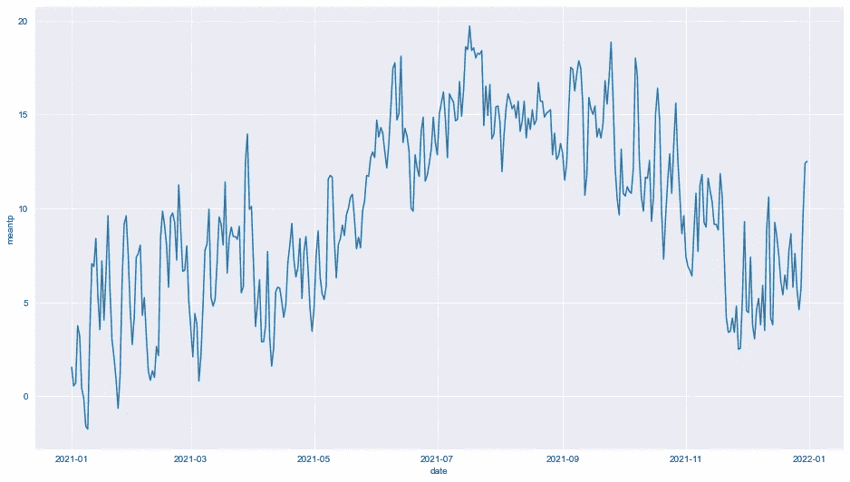

第一张图显示了 2021 年的每日气温数据。第二张图显示了 1990 年至 2021 年的每日气温数据。[都柏林机场每日数据](https://data.gov.ie/dataset/dublin-airport-daily-data?package_type=dataset)来自[气象局](https://www.met.ie/climate/available-data/historical-data)。作者图片。

虽然我们可以在第一个图表上看到细节，但可以注意到，第二个图表由于包含较长的时间序列数据而过于密集，难以阅读。这有一个主要的缺点，即一些有趣的数据点可能会被隐藏。

为了解决这个问题，本文将介绍六种简单的技术，帮助更有效地呈现长时间序列数据。

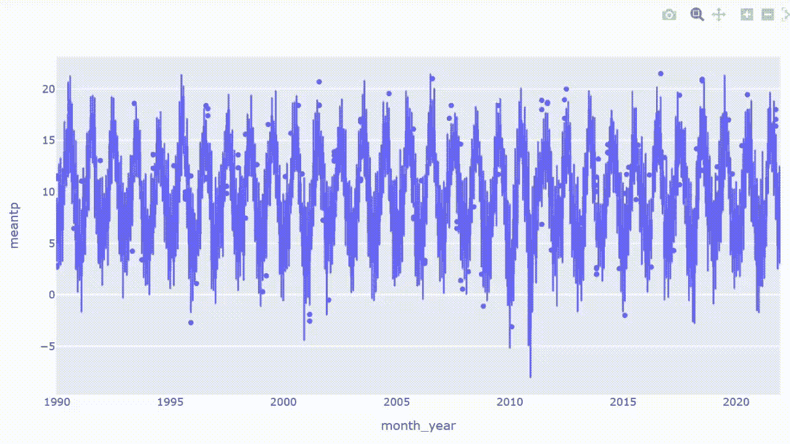

处理长时间序列数据的方法示例。图片由作者提供。

## 检索数据

例如，本文将使用[都柏林机场每日数据](https://data.gov.ie/dataset/dublin-airport-daily-data?package_type=dataset)，其中包含自 1942 年以来在[都柏林机场](https://en.wikipedia.org/wiki/Dublin_Airport)测得的气象数据。数据集由每日天气信息组成，如温度、风速、气压等。

有关都柏林机场每日数据的更多信息，请参见下面关于数据集的*部分。*

从导入库开始

```
import numpy as np
import pandas as pd
import matplotlib.pyplot as plt
import seaborn as snsimport plotly.express as px
import plotly.graph_objects as go
%matplotlib inline
```

阅读 CSV 文件

```
df = pd.read_csv('location/file name.csv')
df['date'] = pd.to_datetime(df['date'])
df.tail()
```

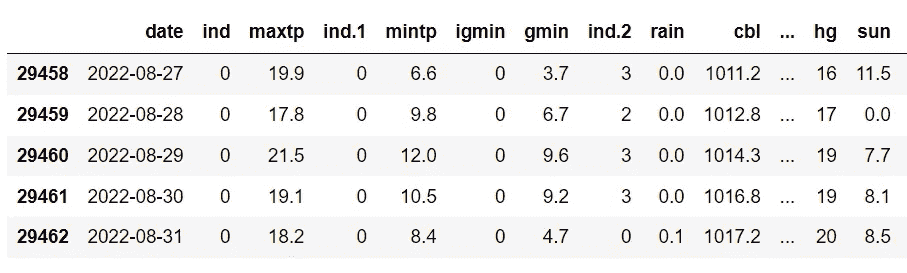

## **探索数据**

```
df.info()
```

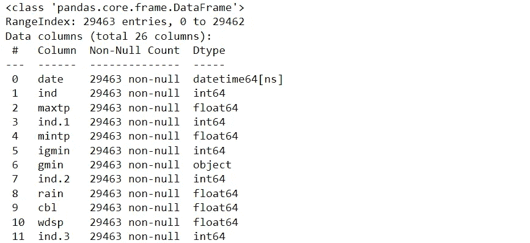

幸运的是，快速查看一下，数据集没有丢失值。

## 准备数据

我们将使用最高和最低温度数据。使用的时间段是从 1990 年到 2021 年，一共 32 年。如果您想选择其他变量或范围，请随意修改下面的代码。

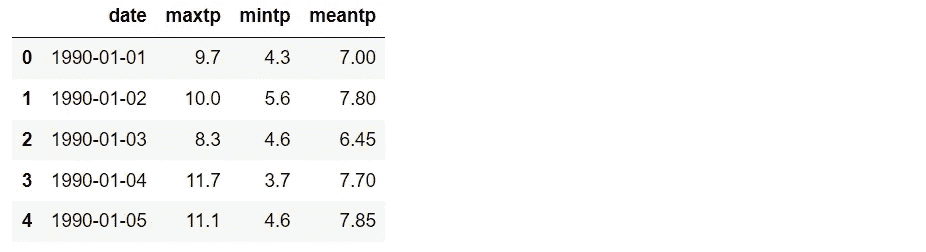

创建月、年和月-年列供以后使用。

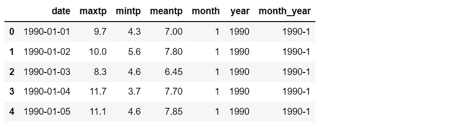

## 绘制时间序列图

从数据框中，下面的代码显示了如何绘制一个基本的时间序列图。稍后可以将结果与本文中的其他可视化结果进行比较。

```
plt.figure(figsize=(16,9))
sns.set_style('darkgrid')
sns.lineplot(data=df_temp, y='meantp', x ='date')
plt.show()
```

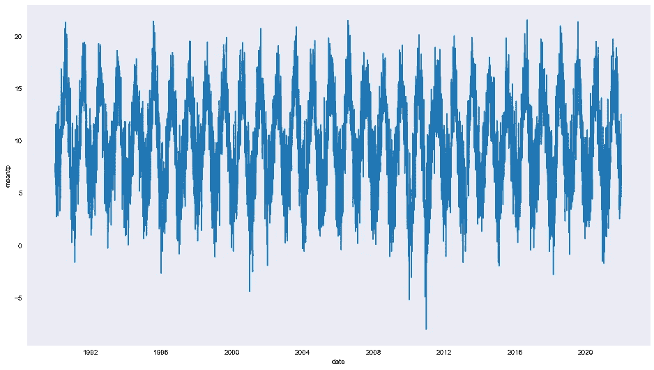

显示 32 年日平均气温的时间序列图。图片由作者提供。

如前所述，获得的图表过于密集。在下一节中，让我们看看如何处理这个问题。

# 处理超长时间序列数据的可视化

6 个简单的技巧可用于呈现长时间序列图:

*   **#1 放大和缩小**
*   **#2 关注重要的事情**
*   **#3 画线**
*   **#4 使用分配**
*   **#5 分组并应用色标**
*   **#6 圈出线**

## 技巧 1:放大和缩小

我们可以创建一个交互式图表，其中的结果可以放大或缩小，以查看更多的细节。这是扩展图表上密集区域的好主意。 [Plotly](https://plotly.com/python/line-charts/) 是一个有用的库，它将帮助我们创建一个交互式图表。

从我们拥有的数据框架中，我们可以直接用一行代码绘制一个简单的交互式时间序列图。

```
px.line(df_temp, x='date', y='meantp')
```

瞧啊。！

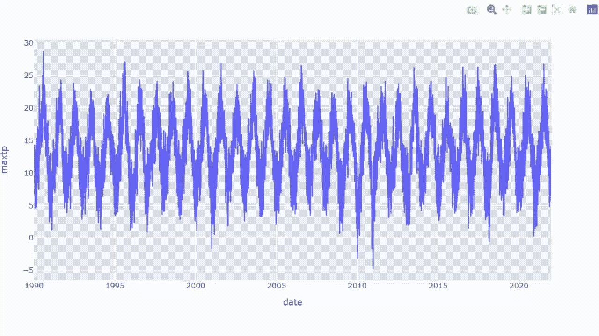

使用 Plotly 的带有放大功能的时间序列图。图片由作者提供。

从结果中，我们可以看到整体数据，同时能够放大我们想要扩展的区域。

## 诀窍 2:关注重要的事情

如果需要注意一些值，用标记突出显示数据点可能是一个很好的解决方案。向交互式绘图添加散点有利于标记有趣或关键的数据点，并放大以查看更多细节。

现在让我们在之前的互动情节中加入散点。例如，我们将分别关注高于和低于 20.5°C 和-5°C 的平均温度。

```
df_dot = df_temp[(df_temp['meantp']>=20.5)|(df_temp['meantp']<=-5)]fig = px.line(df_temp, x='date', y='meantp')
fig.add_trace(go.Scatter(x =df_dot.date, y=df_dot.meantp,
                         mode='markers',
                         marker=dict(color='red', size=6)))
fig.update_layout(showlegend=False)
```

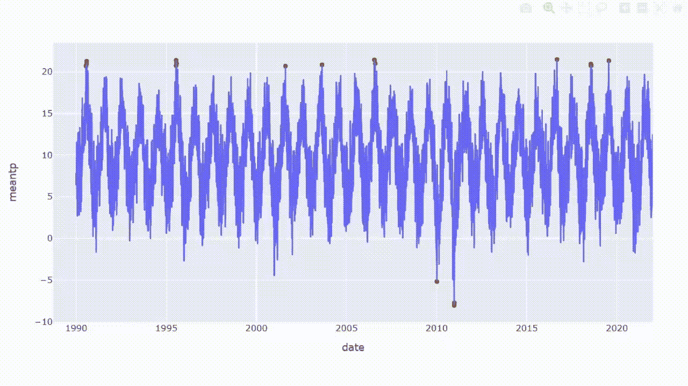

使用 Plotly 的带有标记和放大功能的时间序列图。图片由作者提供。

## 诀窍 3:画线

与前面的技术一样，如果需要关注某些区域，画线可以分隔特定的数据值。例如，我将添加两条线来分隔平均温度高于和低于 20.5°C 和-5°C 的一天。

```
fig = px.line(df_temp, x='date', y='meantp')fig.add_hline(y=20, line_width=1.5,
              line_dash='dash', line_color='red')
fig.add_hline(y=-5, line_width=1.5,
              line_dash='dash', line_color='red')
fig.update_layout(showlegend=False)
```

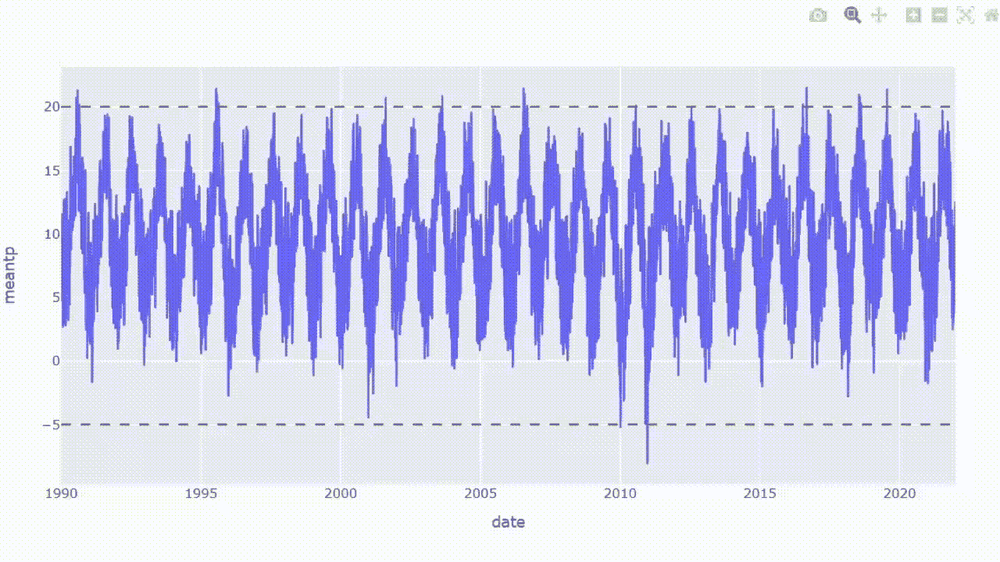

使用 Plotly 的带线条和放大功能的时间序列图。图片由作者提供。

从结果来看，我们可以把注意力集中在线上或线下的数据点上。

## 诀窍 4:使用分销

箱线图是一种展示数据通过其四分位数分布的方法。箱线图上的信息显示了局部性、分布和偏斜度。该图也有助于区分[异常值](https://en.wikipedia.org/wiki/Outlier)，即从其他观察中显著突出的数据点。

因为数据框架已经准备好了，我们可以只用一行代码直接绘制盒状图。

```
px.box(df_temp, x='month_year', y='meantp')
```


使用 Plotly 显示带有放大功能的数据分布的箱线图。图片由作者提供。

## 诀窍 5:分组并应用色阶

基本上，这种方法将时间序列图转换成[热图](https://en.wikipedia.org/wiki/Heat_map)。结果将显示月平均气温，我们可以使用色标来比较数据的大小。

为了方便绘图，需要将数据帧转换成二维。首先，让我们按年份和月份对数据框进行分组。

```
df_mean = df_temp.groupby(['year','month']).mean().reset_index()
df_mean.head()
```

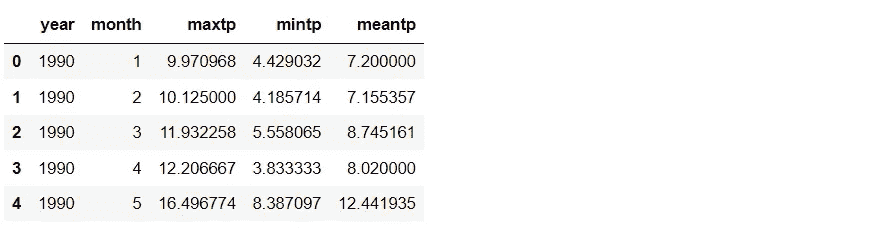

解散堆叠数据框

```
df_cross = df_mean.set_index(['year','month'])['meantp'].unstack()
df_cross
```

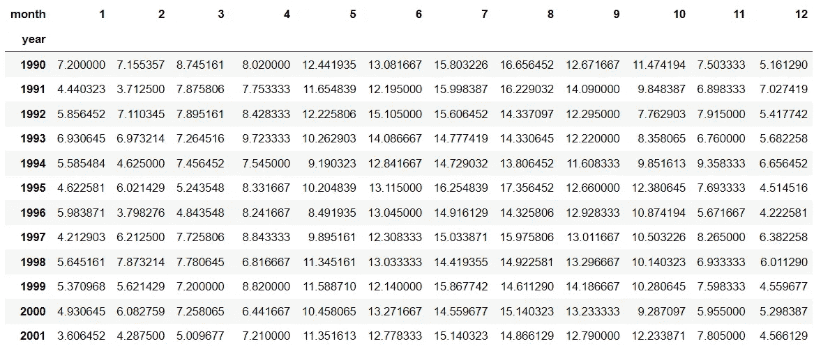

使用 Plotly 只需一行代码即可绘制热图。

```
px.imshow(df_cross, height=700, aspect='auto',
          color_continuous_scale='viridis')
```

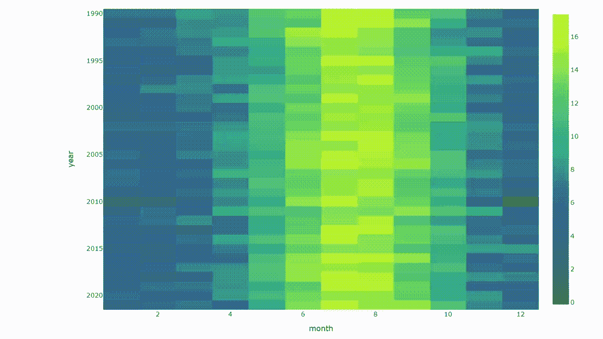

交互式热图显示了月平均气温。图片由作者提供。

## 诀窍 6:圈出这条线

当可视化时间序列数据时，通常会想到随着时间推移而移动的连续线条。对了，我们可以换个角度。这些线可以绘制成圆形图形，就像在时钟上移动它们一样。在这种情况下，[雷达图](https://en.wikipedia.org/wiki/Radar_chart)可能是一个不错的选择。

理论上，雷达图是一种用于比较相同类别数据的可视化工具。我们可以应用这个概念，在圆圈周围绘制月份，以比较一年中同一时间的数据值。

准备一份月份、年份和颜色的列表，用于下一步。

```
months = [str(i) for i in list(set(df_mean.month))] + ['1']
years = list(set(df_mean.year))pal = list(sns.color_palette(palette='viridis',
                             n_colors=len(years)).as_hex())
```

使用 for 循环函数在雷达图上绘制线条。

```
fig = go.Figure()
for i,c in zip(years,pal):
    df = df_mean[df_mean['year']==i]
    val = list(df.meantp)*2
    fig.add_trace(go.Scatterpolar(r=val, theta=months,
                                  name=i, marker=dict(color=c)))
fig.update_layout(height=800)
```

创建交互式雷达图可以过滤结果，将光标悬停在数据点上可以显示信息。

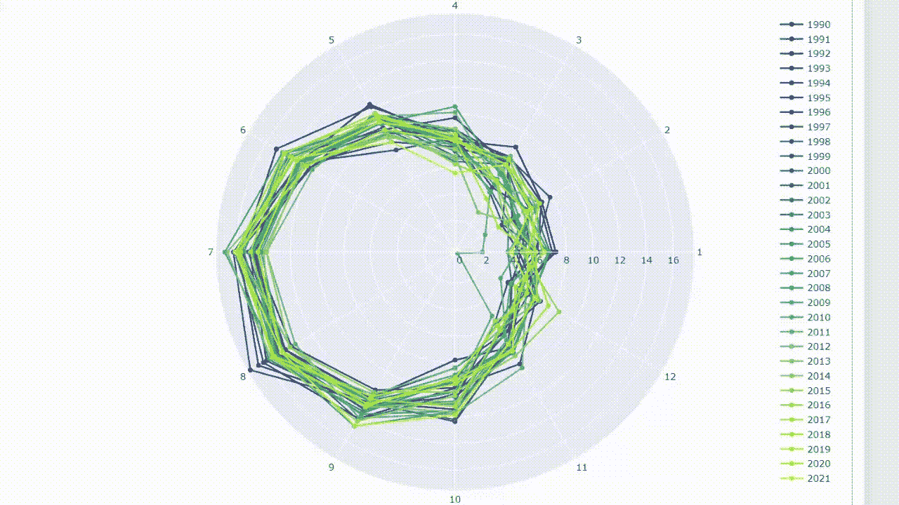

交互式雷达图显示了月平均气温。图片由作者提供。

## 摘要

时间序列图是一个有用的图表，可以提取有见地的信息，如趋势或季节影响。但是，用简单的时间序列图显示超长时间序列数据会由于重叠区域而导致图表混乱。

本文展示了绘制长时间序列数据的 6 种可视化思想。我们可以通过使用交互功能和改变视角来使结果对读者友好。此外，一些方法也有助于关注重要的数据点。

最后，这些方法只是一些想法。我确信还有其他的可视化方法可以用来解决这个问题。如果有什么建议，欢迎随时留下评论。

感谢阅读。

以下是您可能会感兴趣的其他数据可视化文章:

*   8 用 Python 处理多个时序数据的可视化([链接](/8-visualizations-with-python-to-handle-multiple-time-series-data-19b5b2e66dd0))
*   用 Python 实现的 9 种可视化比条形图更引人注目([链接](/9-visualizations-that-catch-more-attention-than-a-bar-chart-72d3aeb2e091)
*   9 用 Python 可视化显示比例，而不是饼状图([链接](https://medium.com/p/4e8d81617451/))
*   用 Python ( [链接](/19-examples-of-merging-plots-to-maximize-your-clustering-scatter-plot-87e8f1bb5fd2))最大化聚类散点图

## **关于数据集**

[都柏林机场每日数据](https://data.gov.ie/dataset/dublin-airport-daily-data?package_type=dataset)检索自 [www.met.ie](http://www.met.ie) ，版权[Metéireann](https://www.met.ie/climate/available-data/historical-data)。该数据集在知识共享署名 4.0 国际版下发布( [CC BY 4.0](https://creativecommons.org/licenses/by/4.0/) )。来源声明:Metéire ann 对数据中的任何错误或遗漏、其可用性或因其使用而产生的任何损失或损害不承担任何责任。

## 参考

维基媒体基金会。(2022 年 9 月 23 日)。*时间序列*。维基百科。于 2022 年 9 月 29 日从 https://en.wikipedia.org/wiki/Time_series 检索

*都柏林机场每日数据*。Data.Gov.IE。(未注明)。于 2022 年 9 月 29 日从 https://data.gov.ie/dataset/dublin-airport-daily-data?检索到 package_type=dataset