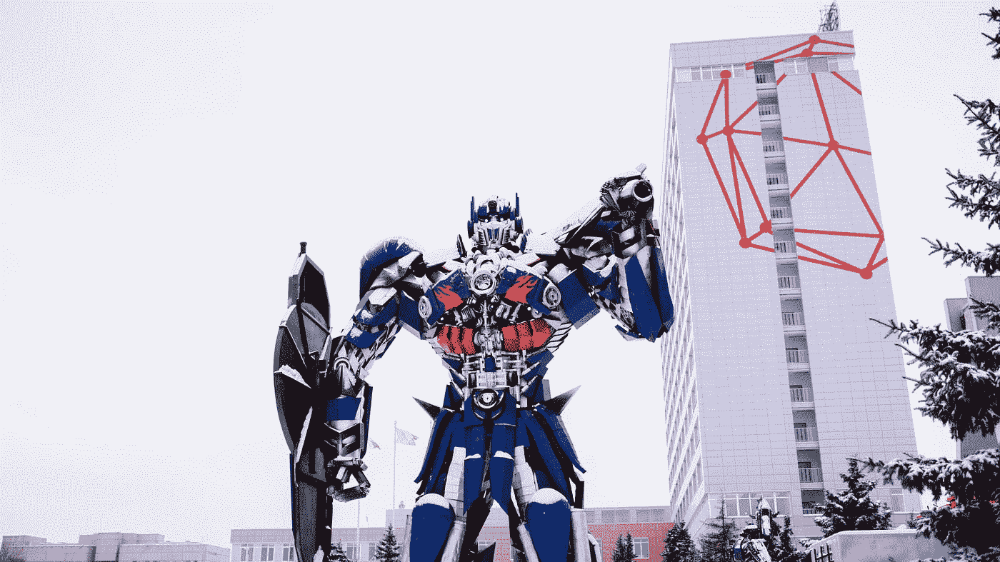

# 开始深度学习项目的 7 篇最佳研究论文

> 原文：<https://towardsdatascience.com/7-best-research-papers-to-read-to-get-started-with-deep-learning-projects-59e11f7b9c32>

## 七篇最好的研究论文经受住了时间的考验，将帮助你创造惊人的项目

照片由[UX](https://unsplash.com/@uxindo?utm_source=medium&utm_medium=referral)在 [Unsplash](https://unsplash.com?utm_source=medium&utm_medium=referral) 上拍摄

研究论文是了解人工智能(AI)世界中引入和发现的几种新方法的不可或缺的一部分。所有的数据科学家和研究人员聚集在一个公共平台上，分享他们细致的工作和知识，以帮助蓬勃发展的人工智能社区达到更高的高度。

每天都有大量由技术人员提出的研究和创新，了解最新技术的整体体验可能会让人不知所措。对于一个正试图全神贯注于深度学习世界的初学者来说尤其如此。可能很难找出哪些研究论文是开发新项目和获得对主题的直观理解的最佳起点。

在本文中，我们将看看开发人员和数据科学爱好者必读的七篇最佳研究论文和数据科学研究论文。这些研究论文经受住了时间的考验，并为许多已经实现或未来将要实现的实现提供了基准。

对于深度学习来说，拥有自己的设备或系统来计算复杂的问题总是最好的。在继续阅读本文之前，我建议从下面提供的文章链接中寻找一些在众多价格范围内用于深度学习的最佳 PC 版本。

 [## 在各种预算范围内，最适合深度学习的电脑

towardsdatascience.com](/best-pc-builds-for-deep-learning-in-every-budget-ranges-3e83d1351a8) 

# 深度学习研究论文入门:

照片由 [UX 印尼](https://unsplash.com/@uxindo?utm_source=medium&utm_medium=referral)在 [Unsplash](https://unsplash.com?utm_source=medium&utm_medium=referral)

深度学习的领域是巨大的。有几个研究论文可供选择，因为每个介绍的作品都介绍了一个对数据科学和人工智能社区有用的新概念或方法。在文章的这一部分，我们将探讨七篇最有益和最有趣的研究论文，它们经受住了时间的考验。

## 1.ResNet:

**研究论文:** [*用于图像识别的深度残差学习*](https://arxiv.org/pdf/1512.03385v1.pdf)

**作者:**何、、、任、

**总结:**

数据科学家使用几种迁移学习模型来实现特定任务的最佳结果。AlexNet 模型是第一个在 2012 年赢得图像处理挑战的模型，从那以后，像 VGG-16 这样的迁移学习模型一直是深度学习中最有影响力的部分。

在本文中，我们将把重点放在 ResNet 体系结构上，因为 ResNet 网络比它的同类网络实现了更小的改进。考虑 ResNet 网络的另一个重要原因是，根据您计划包括的残差块的类型和数量，它有许多变化。部分 ResNet 结构有 *ResNet-18* 、 *ResNet-34* 、 *ResNet-50* 、 *ResNet-101* 等。

ResNet 体系结构利用了残余块。这个概念是非常重要的，因为它解决了其他浅层网络的一些问题，这些浅层网络受到消失或爆炸梯度问题的困扰。剩余块通过计算模型中当前和更深层的前一个块的输出之和。

**意义(为什么要读这篇论文？):**

迁移学习是深度学习的一个主要部分。我们可以利用从一个模型中学习到的信息，并利用这些数据在它的基础上构建另一个定制模型来执行大量的任务。即使不构建定制架构，我们也可以使用原始迁移学习模型来执行特定任务。使用迁移学习模型可以避免每次都需要从头开始创建和构建自己的模型。

## 2.YOLO:

茱莉亚·佐洛托娃在 [Unsplash](https://unsplash.com?utm_source=medium&utm_medium=referral) 上的照片

**研究论文:** [*你只看一次:统一、实时的物体检测*](https://arxiv.org/pdf/1506.02640.pdf)

作者:约瑟夫·雷德蒙，桑托什·迪夫瓦拉，罗斯·吉斯克，阿里·法尔哈迪

**概要:**

物体检测(与人脸识别并列)一直是深度学习模型的一个抓手。自从引入 YOLO 模型以来，我们已经能够通过在模型试图确定的特定重要对象周围创建边界框来解决复杂的对象检测问题。YOLO 网络利用一系列卷积神经网络来学习如何在训练期间实时检测物体。

自 2015 年首次发布以来，YOLO 模型一直在不断改进和发展。我们在每个版本中都对这些方法进行了实质性的改进，比如 YOLO-v2 和 YOLO-v3。在撰写本文时，最新的 YOLO 版本是 YOLO-v6 机制。这些架构中的每一个都在不断改进，以提高目标检测任务的效率。

**意义(为什么要读这篇论文？):**

计算机视觉是人工智能最受欢迎的分支之一。一个可以解决这些复杂的计算机视觉问题的深度学习模型，例如实时物体检测和人脸识别，具有很高的价值。YOLO 是解决高精度目标检测问题的最佳方法之一。如果观众对掌握计算机视觉的基础感兴趣，我建议观众看看下面提供的指南。

  

## 3.U-Net:

**研究论文:** [*U-Net:卷积网络用于生物医学图像分割*](https://arxiv.org/pdf/1505.04597.pdf)

**作者:** *奥拉夫·龙内贝格、菲利普·费舍尔和托马斯·布罗克斯*

**总结:**

分割的任务包括将图像的相似部分分类到一个簇中。所有相同的类被分类并分割成一个特定的实体。通过分割图像，可以消除图像的大部分复杂性，从而允许用户对图像处理和分析进行进一步的计算。

一旦对图像进行分割，它就为更有效地解释数据提供了许多可能性。U-Net 网络就是有效执行这项任务的一种模式。包括编码器和解码器型网络的 U-Net 模型架构接受需要分割的输入图像。

根据类别的数量和特定的任务类型，通过网络传输的图像要经过卷积、下采样和最终上采样几个阶段，以满足特定的任务。该网络还利用跳跃连接来避免任何退化问题，并在每次下采样到上采样阶段中执行有用的信息。

**意义(为什么要读这篇论文？):**

U-Net 是一篇革命性的论文，用于分割不同类型的计算机视觉问题。大量的任务，尤其是在医学图像处理领域，利用了 U-Net 架构。从 U-Net 网络中衍生出了几种变体，对细分项目也很有用。一旦我们有了一个 U-Net 模型来分割特定类型的图像，我们就可以利用该图像进行进一步的分析和计算。

## 4.批量标准化:

**研究论文:** [*批量归一化:通过减少内部协变量移位加速深度网络训练*](https://arxiv.org/pdf/1502.03167.pdf)

作者:谢尔盖·约菲，克里斯蒂安·塞格迪

**概要:**

在深度学习中，将数据标准化通常是一个好主意。让我们考虑一下 MNIST 数据集。在 MNIST 数据集中，一旦我们以 numpy 数组的形式获得数字 0–9 的灰度图像的值，我们就有了从 0–255 的值范围。将这些数据元素标准化和规范化到 0。和 1。浮动变量。

批量归一化图层执行的操作有些类似，即计算小批量均值和小批量方差来相应地归一化数据。批量标准化层有助于加快训练过程，并降低权重初始化的重要性。这些层也有助于调整模型训练，并稍微克服过度拟合的问题。

**意义(为什么要读这篇论文？):**

批量规范化层是大多数现代深度学习架构的组成部分。在构建任何类型的复杂神经网络时，批处理规范化层可以被认为是一个高度实用的实体。这些层从其中一层获取输入，并通过标准化数据将其映射到另一层，从而通过减少内部协变量偏移来加速计算。这些批量标准化层对于卷积神经网络特别有用，它们允许每一层更加独立地工作。

## 5.变压器:

阿瑟尼·托古列夫在 [Unsplash](https://unsplash.com?utm_source=medium&utm_medium=referral) 上的照片

**研究论文:** [*关注是你所需要的*](https://arxiv.org/pdf/1706.03762.pdf)

**作者:**

**总结:**

利用简单的递归神经网络来解决复杂的任务通常会导致高度复杂任务的几个主要问题。两个主要的缺点是爆炸和消失梯度，在较长的数据传输序列中基本信息丢失。长短期记忆(LSTM)模型能够解决 RNNs 的大多数基本问题。通过在序列到序列模型中利用这些 LSTM 网络，我们能够在各种各样的自然语言处理任务上获得非常成功的结果。

变压器网络利用编码器和解码器型结构与注意机制的连接。注意层提供了解码器和编码器之间的互连，允许它访问隐藏状态。这个过程允许模型对特定的实体(例如跨句子的关键字)具有更高的权重。有不同类型的注意机制，如点注意、自我注意和多头注意等。

**意义(为什么要读这篇论文？):**

变形金刚是一些最好的深度学习工具，对于解决各种自然语言处理任务非常有用。这些转换器能够执行复杂的语言任务，包括从一种语言到另一种语言的机器翻译、问答系统、聊天机器人、文本分类问题等等。变形金刚的可能性是无限的，这篇研究论文为受其启发的所有其他研究论文提供了一个伟大的概念基础平台，例如*生成式预训练变形金刚* (GPT)和*变形金刚* (BERT)模型的双向编码器表示。

## 6.生成性对抗网络(GANs):

[ArtSpiley](https://unsplash.com/@artspiley?utm_source=medium&utm_medium=referral) 在 [Unsplash](https://unsplash.com?utm_source=medium&utm_medium=referral) 上拍摄的照片

**研究论文:**

*作者: *伊恩·古德菲勒、让·普盖-阿巴迪、迈赫迪·米尔扎、徐炳、大卫·沃德-法利、谢尔吉尔·奥泽尔、亚伦·库维尔、约舒阿·本吉奥**

***概要:***

*Ian Goodfellow 和他的团队在 2014 年首次推出的一篇更受欢迎的研究论文是生成敌对网络。这些架构深度学习框架在生成全新数据方面极具影响力。这些对立网络的功能利用了生成器和鉴别器网络，其中两种架构相互竞争以改善整体结果。*

*生成器尝试生成看起来像真实样本图像的独特数据。另一方面，鉴别器试图检测生成的样本，并将其分类为真或假。这两个网络在一个恒定的连续循环中同时被训练。一旦生成器能够绕过鉴别器检查系统并生成逼真的图像，我们就有了一个完全训练好的生成对抗网络。该模型可以为特定类型的数据从头开始生成唯一的数据。*

***意义(为什么要读这篇论文？):***

*生成性对抗网络有多种迭代和变化，如 DCGANs、Cycle GANs、SRGANs、W-GAN 等等。这些架构是当今深度学习领域中生成新数据时最常用的一些元素。随着生成网络现在比以前更受欢迎，等待这个分支的进步是巨大的。强烈建议从下面的研究论文开始，以跟上这些生成原型的持续发展。*

## *7.自动编码器:*

***研究论文:** [*自动编码器*](https://arxiv.org/pdf/2003.05991.pdf)*

***作者:***

***概要:***

*自动编码器是另一种类型的生成网络，可用于多种应用。自动编码器利用编码器和解码器类型的网络以及潜在的维度空间。自动编码器的编码器级接收输入，该输入可以被网络解释为包含向量的潜在维度空间。这些包含在潜在空间中的向量在本质上是压缩的。*

*因此，自动编码器对于将特定大小的原始图像压缩到潜在维度空间中的降维任务是有用的。利用这个压缩的潜在维度空间，解码器可以用更小的维度空间重建相同的图像。重建图像类似于原始图像，但是与原始图像相比具有较少的矢量。*

***意义(为什么要读这篇论文？):***

*自动编码器有许多应用程序，被数据科学家和深度学习研究人员使用。除了降维应用，正如我们之前讨论的，这些自动编码器对于图像去噪、特征提取和异常检测等任务也很有用。除了上面提到的应用之外，自动编码器的一种变体称为变分自动编码器，与 GANs 类似，对图像生成也很有用。因此，可以肯定地说，这些自动编码器在深度学习领域具有巨大的潜力。*

# *结论:*

**

*Firmbee.com 在 [Unsplash](https://unsplash.com?utm_source=medium&utm_medium=referral) 上[的照片](https://unsplash.com/@firmbee?utm_source=medium&utm_medium=referral)*

> *研究使好奇心正式化了。这是有目的的戳和撬。
> — ***佐拉·尼尔·赫斯顿****

*研究和创新是发展和学习不可或缺的支柱。现代研究的质量已经上升到更高的水平。它们中的每一个都包含了大量的知识，可供个人用来启发自己。高水平研究论文的质量对于深度学习来说尤其如此，深度学习涉及大量的研究和时间投入。*

*在这篇文章中，我们了解了经受住时间考验的七篇最佳研究论文的基本方面。因此，对于所有初学数据的科学家来说，它们是一笔资源丰富的资产，可以让他们了解更多，并进一步探索。我们也理解了这些研究论文的意义以及它们所涵盖的具体概念。在深入研究特定主题的研究论文的数百万个选项之前，我建议检查这些选项，以进一步了解深度学习的主题。*

*如果你想在我的文章发表后第一时间得到通知，请点击下面的[链接](https://bharath-k1297.medium.com/subscribe)订阅邮件推荐。如果你希望支持其他作者和我，请订阅下面的链接。*

*  

如果你对这篇文章中提到的各点有任何疑问，请在下面的评论中告诉我。我会尽快给你回复。

看看我的一些与本文主题相关的文章，你可能也会喜欢阅读！

      

谢谢你们坚持到最后。我希望你们都喜欢这篇文章。祝大家有美好的一天！*